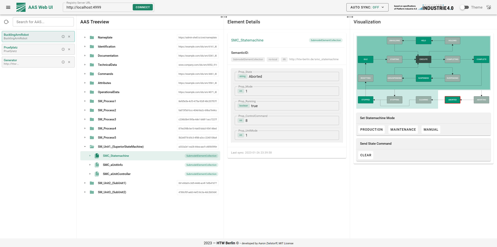
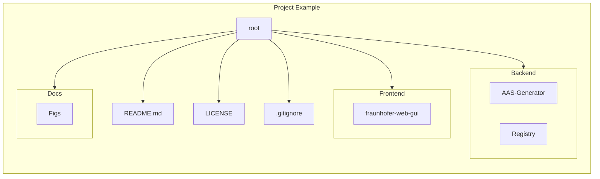
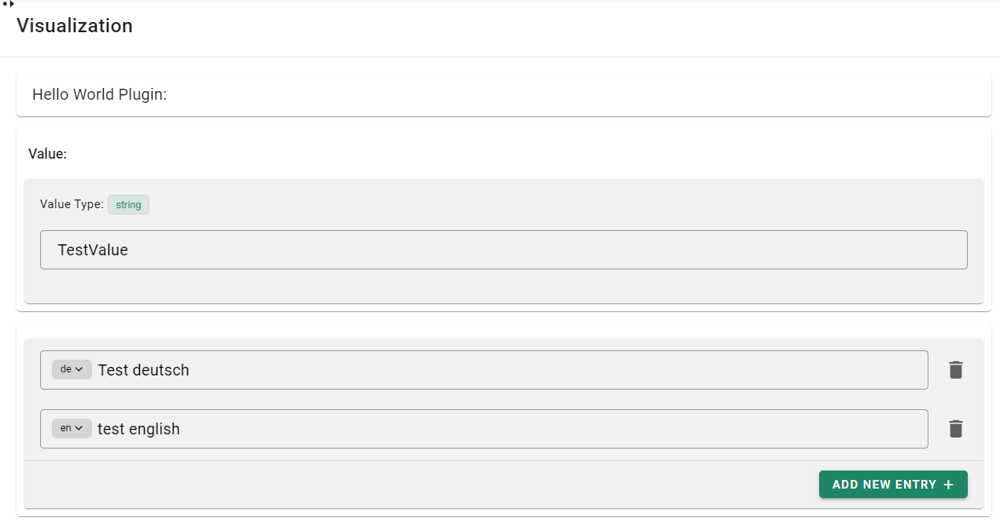

# Fraunhofer AAS GUI
Vue.js Webapplication to select and visualize Asset Administration Shells, Submodels and Properties.

## Project Structure

## Getting Started

### Quick Start:

Please follow this guide: [Introductory Examples](https://wiki.eclipse.org/BaSyx_/_Introductory_Examples)

### Plugin Development

The BaSyx-GUI includes a Feature to develop your own Plugins. They can be used to display and interact with a Submodel (and/or SubmodelElements).

Plugins will be displayed in the `Visualization`-Part of the UI. In order for Plugins to be shown, a Submodel has to have a SemanticID which matches with the configured SemanticID of the desired Plugin.

> new Plugins have to be registered at `Frontend/aas-web-gui/src/components/SubmodelPlugins/_SubmodelEntrypoint.vue`

> a Demo-Plugin can be found here: `Frontend/aas-web-gui/src/components/SubmodelPlugins/HelloWorldPlugin.vue`

The HelloWorld Plugin can visualize a Submodel containing any number of SubmodelElements aslong as they are of the modeltype `Property`, `MultiLanguageProperty`, `File`, `Operation`.
SubmodelElementCollections are not supported in this Plugin!
The SemanticID of the Submodel has to be `http://hello.world.de/plugin_submodel`.

### MacOS:

1. Install Node and NPM ([Node installation Tutorial for Mac](https://treehouse.github.io/installation-guides/mac/node-mac.html))
2. Install Vue CLI `npm install -g @vue/cli`
3. Clone Repository: `git clone https://github.com/eclipse-basyx/basyx-applications.git`
4. `cd basyx-applications/aas-gui`
5. `. bootstrap.sh`
6. On initial installation answer first question with **y** (Yes) otherwise **n** (No)
7. Answer second question with **n** (No)

### Linux:

1. Install Node and NPM ([Node installation Tutorial for Linux](https://nodejs.org/en/download/package-manager/))
2. Install Vue CLI `npm install -g @vue/cli`
3. Clone Repository: `git clone https://github.com/eclipse-basyx/basyx-applications.git`
4. `cd basyx-applications/aas-gui`
5. `. bootstrap.sh`
6. On initial installation answer first question with **y** (Yes) otherwise **n** (No)
7. Answer second question with **n** (No)

### Windows:

1. Install WSL 2 ([WSL installation Tutorial](https://docs.microsoft.com/en-us/windows/wsl/install))
2. Open IDE (e.g. VSCode: [WSL in VSCode](https://code.visualstudio.com/docs/remote/wsl))
3. Install Node and NPM ([Node installation Tutorial for Linux](https://nodejs.org/en/download/package-manager/))
4. Install Vue CLI `npm install -g @vue/cli`
5. Clone Repository: `git clone https://github.com/eclipse-basyx/basyx-applications.git`
6. `cd basyx-applications/aas-gui`
7. `. bootstrap.sh`
8. On initial installation answer first question with **y** (Yes) otherwise **n** (No)
9. Answer second question with **n** (No)

### Docker:

The latest version is available on [DockerHub](https://hub.docker.com/r/eclipsebasyx/aas-gui/tags).

1. Build the image by executing `docker build basyx-applications/aas-gui/Frontend/aas-web-gui -t eclipsebasyx/aas-gui`
2. Start a container by executing `docker run -p 3000:3000 eclipsebasyx/aas-gui`

To be able to access the BaSyx data from the GUI, you need to add a wildcard to Cross-origin resource sharing on the Registry- and AAS-Server. This can be done either in code by `contextConfig.setAccessControlAllowOrigin("*")` on the ContextConfiguration of the Registry- and AAS-Server, or in the `context.properties` files by adding the line `accessControlAllowOrigin=*`.

## Frontend

Start Dev Environment (e.g. VSCode):
1. Open Terminal/shell on the root directory of the project (`cd basyx-applications/aas-gui`)
2. `. bootstrap.sh`
3. On initial installation answer first question with **y** (Yes) otherwise **n** (No)
4. Answer second question with **n** (No)

Create deployable build:
1. Open Terminal/shell on the root directory of the project (`basyx-applications/aas-gui`)
2. `. bootstrap.sh`
3. On initial installation answer first question with **y** (Yes) otherwise **n** (No)
4. Answer second question with **y** (Yes)
5. Source Files are created here: `basyx-applications/aas-gui/Frontend/aas-web-gui/dist`

### Dependencies

- Node (+ npm)
- Yarn
- Vite
- Vue CLI
- Vuetify
- Vue Router
- Vuex

## Backend
The backend consists of two components. The Asset Administration Shell **Generator** and the **Registry**-Server. 

To run the backend, the following two steps are mandatory:
    
> Start the Registry-Server (`basyx-applications/aas-gui/Backend/Registry/`)

> Start the Generator (`basyx-applications/aas-gui/Backend/AAS-Generator/`)

The registry server is available under the port **4999**. The generator deploys 4 Asset Administration Shells, which are listening to the ports **5081-5084**. Each service comes with its own UI. The registry server can be found under this URL: http://localhost:4999. Each Web-UI has its own Swagger, which describes the API interface.
