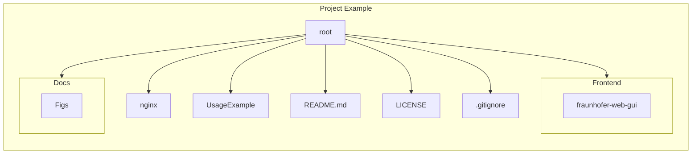

# Fraunhofer AAS GUI
Vue.js Webapplication to select and visualize Asset Administration Shells, Submodels and Concept Descriptions.


## Project Structure



## AAS Web UI Compatibility and Features

### Important Notice :warning:

The AAS Web UI is now **only compatible with the components of BaSyx V2 and the Asset Administration Shell V3**. 

If you still wish to use BaSyx V1, please use the following release of the UI:

```bash
docker pull eclipsebasyx/aas-gui:v230703
```

### Supported SubmodelElements

As of now, not all new SubmodelElements of the AAS V3 are supported. Additional elements will be added in future updates. The currently supported SubmodelElements are:

- SubmodelElementCollection
- SubmodelElementList
- Property
- MultiLanguageProperty
- File
- Blob
- Operation
- ReferenceElement
- Range
- Entity
- RelationshipElement
- AnnotatedRelationshipElement

## Getting Started

### Quick Start:

See examples in the [basyx-java-server-sdk](https://github.com/eclipse-basyx/basyx-java-server-sdk/tree/main/examples
) Repository.

### Plugin Development

The BaSyx-UI includes a Feature to develop your own Plugins. They can be used to display and interact with a Submodel (and/or SubmodelElements).

Plugins will be displayed in the `Visualization`-Part of the UI. In order for Plugins to be shown, a Submodel(Element) has to have a SemanticID which matches with the configured SemanticID of the desired Plugin.

This wiki has a short guide how to mount your own plugins:

[Plugin Mechanism Wiki](https://wiki.eclipse.org/BaSyx_/_Documentation_/_Components_/_AAS_Web_UI_/_Features_/_Plugin_Mechanism)

A Demo-Plugin can be found here:

[HelloWorldPlugin.vue](./Frontend/aas-web-gui/src/components/SubmodelPlugins/HelloWorldPlugin.vue)

The HelloWorld Plugin can visualize a Submodel containing any number of SubmodelElements aslong as they are of the modeltype `Property`, `MultiLanguageProperty`, `File`, `Blob`, `Operation`, `ReferenceElement`, `Range`, `RelationshipElement` or `AnnotatedRelationshipElement`.
SubmodelElementCollections are not supported in this Plugin!
The SemanticID of the Submodel is:

```bash
http://hello.world.de/plugin_submodel
```


### MacOS:

1. Install Node and NPM ([Node installation Tutorial for Mac](https://treehouse.github.io/installation-guides/mac/node-mac.html))
2. Install yarn
```bash
npm install --global yarn
```
3. Clone Repository:
```bash
git clone https://github.com/eclipse-basyx/basyx-applications.git
```
4. Go to the aas-ui folder:
```bash
cd basyx-applications/aas-gui
```
5. Bootstrap the application:
```bash
. bootstrap.sh
```
6. On initial installation answer first question with **y** (Yes) otherwise **n** (No)
7. Answer second question with **n** (No)

### Linux:

1. Install Node and NPM ([Node installation Tutorial for Linux](https://nodejs.org/en/download/package-manager/))
2. Install yarn
```bash
npm install --global yarn
```
3. Clone Repository:
```bash
git clone https://github.com/eclipse-basyx/basyx-applications.git
```
4. Go to the aas-ui folder:
```bash
cd basyx-applications/aas-gui
```
5. Bootstrap the application:
```bash
. bootstrap.sh
```
6. On initial installation answer first question with **y** (Yes) otherwise **n** (No)
7. Answer second question with **n** (No)

### Windows:

1. Install WSL 2 ([WSL installation Tutorial](https://docs.microsoft.com/en-us/windows/wsl/install))
2. Open IDE (e.g. VSCode: [WSL in VSCode](https://code.visualstudio.com/docs/remote/wsl))
3. Install Node and NPM ([Node installation Tutorial for Linux](https://nodejs.org/en/download/package-manager/))
4. Install yarn
```bash
npm install --global yarn
```
5. Clone Repository:
```bash
git clone https://github.com/eclipse-basyx/basyx-applications.git
```
6. Go to the aas-ui folder:
```bash
cd basyx-applications/aas-gui
```
7. Bootstrap the application:
```bash
. bootstrap.sh
```
8. On initial installation answer first question with **y** (Yes) otherwise **n** (No)
9. Answer second question with **n** (No)

### Docker:

The latest version is available on [DockerHub](https://hub.docker.com/r/eclipsebasyx/aas-gui/tags).

1. Build the image by executing
```bash
docker build basyx-applications/aas-gui/Frontend/aas-web-gui -t eclipsebasyx/aas-gui
```

2. Start a container by executing
```bash
docker run -p 3000:3000 eclipsebasyx/aas-gui
```

3. You can also predefine the AAS- and Submodel Registry Path, AAS-, Submodel- and Concept Description Repository Path, the Apllications primary color and the Base Path by adding the following arguments to the run command:

`-e VITE_AAS_REGISTRY_PATH=<aas_registry_path>`

`-e VITE_SUBMODEL_REGISTRY_PATH=<submodel_registry_path>`

`-e VITE_AAS_REPO_PATH: <aas_repo_path>`

`-e VITE_SUBMODEL_REPO_PATH: <submodel_repo_path>`

`-e VITE_CD_REPO_PATH: <concept_description_repo_path>`

`-e VITE_PRIMARY_COLOR=<primary_color>`

`-e VITE_BASE_PATH=<base_path>`

4. You can also mount a local folder for the Application Logo and a folder for the Submodel/SubmodelElement-Plugins by adding the following arguments to the run command:

`-v <local_path_to_logo>:/app/src/assets/Logo`

`-v <local_path_to_plugins>:/app/src/UserPlugins`

5. If you execute step 4, please also add the following arguments to the run command:

`-e CHOCKIDAR_USEPOLLING=true`

6. The GUI is now available at:

```bash
http://localhost:3000/<base_path>
```

#### Docker Compose:

If you want to use the AAS Web UI as part of a Docker Compose project you can use the following example in your `docker-compose.yml`

```
aas-web-gui:
    image: eclipsebasyx/aas-gui
    container_name: aas-web-gui
    ports:
        - "3000:3000"
    environment:
        CHOKIDAR_USEPOLLING: "true"
        VITE_AAS_REGISTRY_PATH: "<aas_registry_path>"
        VITE_SUBMODEL_REGISTRY_PATH: "<submodel_registry_path>"
        VITE_AAS_REPO_PATH: "aas_repo_path"
        VITE_SUBMODEL_REPO_PATH: "submodel_repo_path"
        VITE_CD_REPO_PATH: "concept_description_repo_path"
        VITE_PRIMARY_COLOR: "<primary_color>"
        VITE_BASE_PATH: "<base_path>"
    volumes:
        - <local_path_to_logo>:/app/src/assets/Logo
        - <local_path_to_plugins>:/app/src/UserPlugins
```

#### CORS configuration of the Registry and Repositories

To be able to access the BaSyx AAS data from the Web UI, you need to add a wildcard to cross-origin resource sharing on the Registry- and AAS-, Submodel- and Concept Description Repository (AAS Environment). An example on how to do this is shown in the examples folder in the [basyx-java-server-sdk](https://github.com/eclipse-basyx/basyx-java-server-sdk/tree/main/examples
) Repository.

#### Docker with nginx

The [basyx-java-server-sdk](https://github.com/eclipse-basyx/basyx-java-server-sdk/tree/main/examples/BaSyxNGINX) Repository includes an example Docker Compose project which shows how to use the UI with nginx and configure a base path so that the UI can be hosted under

```bash
http(s)://your-url/base-path
```

## How to contribute

### Start Dev Environment (e.g. VSCode):

1. Open terminal/shell on the root directory of the project
2. Go to the aas-gui folder:
```bash
cd basyx-applications/aas-gui
```
3. Bootstrap the project
```bash
. bootstrap.sh
```
4. On initial installation answer first question with **y** (Yes) otherwise **n** (No)
5. Answer second question with **n** (No)
6. Start coding :wink:

### Create deployable (optimized) build:
> :warning: does not support the plugin mechanism :warning:

1. Open terminal/shell on the root directory of the project 2. Go to the aas-gui folder:
```bash
cd basyx-applications/aas-gui
```
3. Bootstrap the project
```bash
. bootstrap.sh
```
4. On initial installation answer first question with **y** (Yes) otherwise **n** (No)
5. Answer second question with **y** (Yes)
6. Source Files are created here:

`basyx-applications/aas-gui/Frontend/aas-web-gui/dist`

### Contribute your code to this repo

As a prerequesite you need to sign the [Eclipse Contributor Agreement](https://www.eclipse.org/legal/ECA.php).

After you signed the ECA you can create Pull Requests to this Repository.

> All PRs will be checked for compliance and functionality!

### Dependencies

- Node (+ npm)
- Yarn
- Vite
- Vue CLI
- Vuetify
- Vue Router
- pinia
