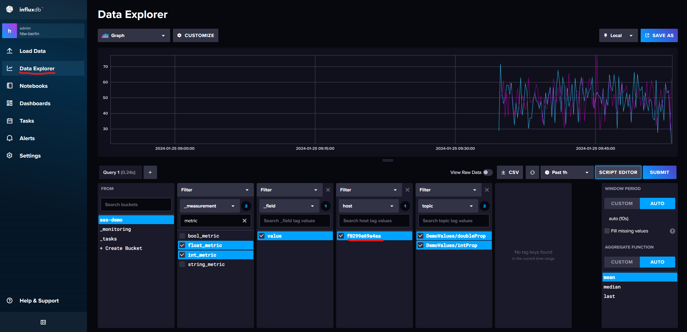
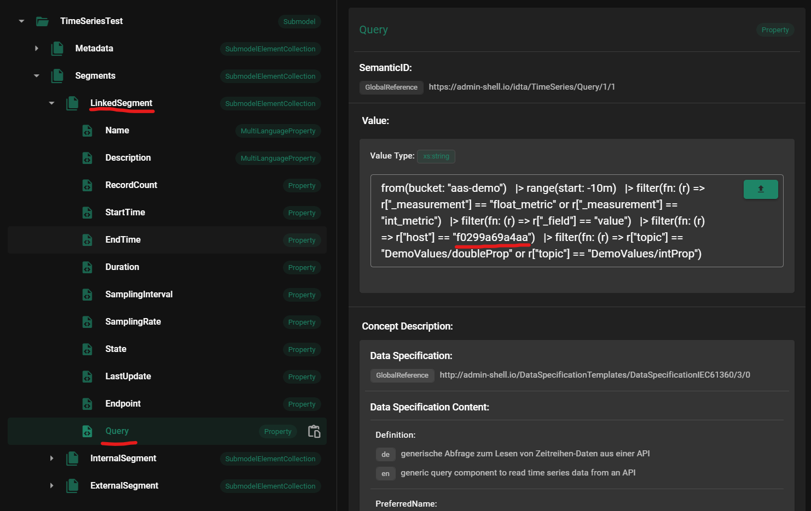

# AAS TimeSeries

This example includes a demo for the time series data plugin. It is designed to to be used with the time series data submodel template specified by the IDTA. The specification can be found [here](https://industrialdigitaltwin.org/wp-content/uploads/2023/03/IDTA-02008-1-1_Submodel_TimeSeriesData.pdf).

The plugin supports the following segment types:

- **InternalSegment**: This segment defines time series data within the AAS
- **ExternalSegment**: This segment defines time series data inside a file or blob SubmodelElement (the example includes a csv file as an example)
- **LinkedSegment**: This segment defines time series data inside a linked time series database (the example includes an InfluxDB together with telegraf for mqtt as an example)

## Getting Started

### Prerequisites

- Docker

### Installing

1. Clone the repository
2. Run `docker-compose up -d` in this directory

You can now access the AAS Web UI (http://localhost:3000) and InfluxDB UI (http://localhost:8086) in your browser.
The username and password for InfluxDB are `admin` and `testtest`.

## Usage

### Internal Segment

1. Open the AAS Web UI in your browser (http://localhost:3000)
2. Select the `TimeSeriesDemo` AAS and click on the `TimeSeriesTest` submodel in the treeview
3. In the `Visualization`-window select the `InternalSegment` in the Segment dropdown
4. Select `time` as time-value and `speed` as y-value
5. Click on `Fetch Data`
6. In the `Preview Chart`-window select a chart type
7. You should now see a chart with the time series data

### External Segment

1. Open the AAS Web UI in your browser (http://localhost:3000)
2. Select the `TimeSeriesDemo` AAS and click on the `TimeSeriesTest` submodel in the treeview
3. In the `Visualization`-window select the `ExternalSegment` in the Segment dropdown
4. Select `time` as time-value and `speed` and `temperature` as y-values
5. Click on `Fetch Data`
6. In the `Preview Chart`-window select a chart type
7. You should now see a chart with the time series data

### Linked Segment

Prerequisites:

Check if the query property of the `LinkedSegment` corrosponds to the data you want to fetch from the database. If not, change the query property to the desired query (see images below).

1. Open the AAS Web UI in your browser (http://localhost:3000)
2. Select the `TimeSeriesDemo` AAS and click on the `TimeSeriesTest` submodel in the treeview
3. In the `Visualization`-window select the `LinkedSegment` in the Segment dropdown
4. Select `time` as time-value and `speed` and `temperature` as y-values
5. Enter the following API-Token for the InfluxDB: `noyBokO69-nLzsjhnE4gx53TVkRc7QzFe6IUPkvkNIk9ynjl2zMcoO_wKkeMda8FBVaMElHBnIz7BcPLu5lL3g==`
6. Click on `Fetch Data`
7. In the `Preview Chart`-window select a chart type
8. You should now see a chart with the time series data

You can always press the `Fetch Data` button again to update the chart with the latest data from the database.

## Visualization Options

You can choose between the following chart types:

- Line Chart
- Area Chart
- Scatter Chart
- Histogram
- Gauge

For most of the chart types you can also alter some options. Those include:

- Time Range
- Interpolation Mode
- Number of Bins (for Histogram)
- If Bars should be stacked (for Histogram)

## Disclaimer

- The LinkedSegment was only tested with InfluxDB
- The ExternalSegment was only tested with csv files (RFC 4180 with header line) in a file SubmodelElement