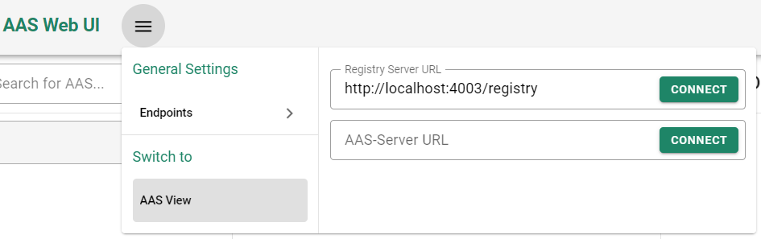

# DataIntegrator

This project is the implementation of master's thesis titled "Integrating legacy data systems with digital twins for Industry 4.0". This DataIntegrator project is developed to integrate data inside the legacy system into the AAS. The implementation is done using open-source projects: Eclipse BaSyx, Spring Batch, Spring Integration, and JSONata. It extracts the data from legacy systems, transforms it, and then loads it as AAS or AAS descriptors. It acts as a middleware between Industry 4.0 applications and legacy systems. It provides the AAS or AAS descriptors on demand synchronously.

## Prerequisites

Java is used as a programming language for the implementation of this project. The Maven build tool is used to manage and build the project. So, Java and Maven build tool should be installed, and the environment should be set.

Docker is used to build the docker images. Hence, Docker is another prerequisite. 

Eclipse IDE is used for the development, but any IDE could be used per choice.

## Project Structure

<p align="center">


</p>

* **Common** :
	The module dataintegrator.common defines the core business logic and interfaces for the Integrator units.
	
* **Integrator Unit** :
	dataintegrator.integratorunit defines the various Integrator units that make up the Integrator pipeline.
	
* **DI-AAS** :
	dataintegrator.aas module provides the DT on-demand as a response. The interface of this module is the same as the BaSyx AAS Server.
	
* **DI-Registry** :
	The module dataintegrator.registry provides the DT descriptors ondemand as a response. In contrast to dataintegrator.aas, the interface is the same as the BaSyx Registry Server.
	
* **Examples** :
	The module dataintegrator.examples contains various working data integration scenarios.

### Common

This core module specifies the interfaces for the Integrator units. Apart from interfaces, it defines core business logic such as creating an Integrator pipeline, specifying a pipeline launcher, and execution context.

### Integrator Unit

The module dataintegrator.integratorunit contains all the implementations of the Integrator units as submodules. The following are the currently supported Integrator unit implementations:

* **Data Reader Implementations** : SQL Data Reader and HTTP Data Reader

* **Data Processor Implementations** : Type Processor and JSONata Processor

* **Data Writer Implementations** : AAS Writer and  AAS Descriptor Writer

### DI-AAS

The module dataintegrator.aas is designed to provide the AAS. It includes all the Integrator unit implementations and the common module as a dependency. It has a server with the same interface as the BaSyx AAS Server and exposes the REST endpoint for serving the AAS request. It takes the Submodel configurations of individual Integrator units and one Integrator pipeline configuration Submodel that packages all these Integrator units as one pipeline. For recognizing the configurations for this component, all configurations Submodel has a semantic identifier with a prefix as urn:basyx-di:aas:config. The component-specific configurations are specified using application.properties file.

There are two ways to provide the configurations to this component: during the component’s start and at runtime. When the property integratorPipeline.config.scanForExistingSmConfig is set to true, this component scans the provided registry URL for existing configurations and adds them to the Configuration repository during component startup. If the registry events are set as MQTTV2 in the BaSyx Registry server, and the MQTT-related properties are specified in the application.properties of this component. In that case, configurations can be provided at the runtime.

### DI-Registry

The purpose of the module dataintegrator.registry is to provide descriptors for the AAS. It includes all the Integrator unit implementations and the core module as a dependency. It has a server with the same interface as the BaSyx Registry Server and exposes the REST endpoint for serving the AAS descriptors request. It takes the Submodel configurations of individual Integrator units and one Integrator pipeline configuration Submodel that packages all these Integrator units as one pipeline. Similar to the dataintegrator.aas component, for recognizing the configurations for this component, all configurations Submodel has a semantic identifier with a prefix as urn:basyxdi:registry:config. The two ways to provide the configurations are the same as those specified for dataintegrator.aas component.

The component-specific configurations are specified using the application.properties file, and configurations are the same as dataintegrator.aas component.

### Examples

There are various examples provided in the module dataintegrator.examples which covers various usages and scenarios.

### Mapper

Data mappers facilitate the process of harmonizing disparate data representations. When data is read from the legacy systems, it is in a different format. To convert it into a unified representation, a mapper is needed. The unified representation is designed as a Map; the key could be arbitrary or a specific data value based on the type of mapper used. 

This mapping is crucial to harmonize the input and output of each unit of the Integrator pipeline, i.e., the data reader, data processor, and the data writer. Also, it is necessary to make each unit independent of each other.

The mapper is only required at the data reader because this is the only unit where disparate data is read. Currently, there are three mappers designed for specific use cases. The three mappers are Simple Mapper, Multivalue Mapper, and the Custom Mapper. Following are the descriptions for these mappers:

* **Simple Mapper** : This mapper is used for storing the data as a key-value pair. The key is an arbitrary value decided by the end-user. The value corresponds to an attribute or field in the data source. Both SQL and HTTP Data Reader supports this mapper.

* **Multivalue Mapper** : A multi-value mapper enhances the capabilities of a Simple mapper discussed above by associating multiple values with a single key. This map is unlike conventional maps, where each key corresponds to a single attribute of legacy systems. Multi-value mappers are helpful in scenarios where data from multiple attributes of legacy systems are required to be stored for a single key. In this, the key is an arbitrary value the end-user decides. The values correspond to attributes or fields in the data source. Only HTTP Data Reader supports this currently.

* **Custom Mapper** : Custom mapper is designed on top of the Simple mapper as discussed above. In Custom mapper, an attribute of the data source is used instead of an arbitrary value for a key. The value is also an attribute of the data source. This mapper is different from the above two in representation as both key and value are attributes of the data source. Only SQL Data Reader currently supports this mapper.

## Basic executable example in detail

Data from SQL server database is integrated with the AAS in this example as shown in the below image.

<p align="center">


</p>

The executable example is kept inside **dataintegrator.examples** with module name **dataintegrator.examples.basic-executable**. This example contains a docker-compose.yml file which has the required services to execute this example.

> :warning: **Note**: The docker-compose.yml contains services for DataIntegrator AAS Component and DataIntegrator Registry Component. So, it is required to build an image of **dataintegrator.aas.component** and **dataintegrator.registry.component**. The Dockerfile is already present inside both components. Alternatively, the latest docker images can also be used as explained [here](#docker) :warning:

To achieve this integration goal, the DataIntegrator pipeline needs to be configured as illustrated below:

**Integrator Pipeline for DataIntegrator AAS Component**

<p align="center">


</p>

**Integrator Pipeline for DataIntegrator Regsitry Component**

<p align="center">


</p>

Each of the Integrator units i.e., SQL Reader, Type Processor, and AAS Writer requires their configurations in the form of Submodels. However, AAS Writer takes AAS Stencil apart from the Submodel-based cofiguration. The AAS Stencil is a Type 2 AAS which provides an initial structure for the required output of the integrated AAS. The AAS Stencil is only required by the AAS Writer and not by the AAS Descriptor Writer.

The Registry Integrator Pipeline has configurations for two SQL Data Reader with mapperType as SimpleMapper and CustomMapper respectively. This strategy using two readers packs Submodel ids inside AAS ids with aggregation of data using two different mappers, the Simple and Custom mapper. This mapping strategy eventually helps the AAS Descriptor writer to create AAS Descriptors.

### Submodel-based configurations for DataIntegrator AAS Component

### SQL Reader Configuration

<p align="center">


</p>

It has mainly three configurations, dataSource property defines configurations for connecting to the data source, in this case a SQL Server database. mapperType property defines which mapping strategy to be used. The third property, i.e., valueMap defines how the value from database would be mapped based on the already selected mapperType strategy.


### Type Processor Configuration

<p align="center">


</p>

Type processor is used to transform the data type of data read from the Data Reader into user configurable type. The Type Processor configuration has the targetType property which specifies the required data type of the  arbitrary key of the data point specified during mapping in the SQL Reader configuration. This configuration specifies the configurations to transform the data type of id and data_added attributes to String type.

### AAS Writer Configuration

<p align="center">


</p>

The AAS Writer configurations specifies how the read and transformed data be integrated with the AAS. There are mainly two top level properties required, the first is configurations property which specifies the configurations for all the information models of the AAS. The second property specifies the reference to the AAS Stencil. The highlighted "Arbitrary Key" is the unique arbitrary id specified by the user.

<p align="center">


</p>

The above image shows the data flow from the SQL Reader to the AAS Writer configurations. The idShortPath property specifies the IdShort path of the element inside the AAS Stencil. The valueIds specifies the unique arbitrary key defined during mapping in SQL Data Reader as highlighted in the above image. Please note that the valueIds configuration should be a single configuration for non-hierarchical SME's configuration, however it can be multiple for hierarchical SMCs. The properties expansionMode, suffix, and metadata is not required for the non-hierarchical SME's configuration but for the hierarchical SMCs.

<p align="center">


</p>

The ID, ProductName, AddedDate, and Quantity represents the configurations for the non-hierarchical SMEs (such as Property SME). The ProductGroup is the configuration for the hierarchical SMC. As stated above, the SMC's configurations can have multiple valueIds as per the number of elements it contains. The expansionMode provides two modes to put these submodel elements into the SMC efficiently. Inline mode directly puts all the merged submodel elements specified by valueIds into the current SMC as children. The Multi mode creates this SMC’s copy, takes each submodel element from each valueIds, and puts it inside this created SMC copy, as illustrated in below figure (the image is just for illustration and hence it is different from the current example).

<p align="center">


</p>

The suffix property is optional, and when specified, it is appended to the idShort of the newly created data element. The metadata SMC can contain multiple configurations for tailoring the different parts of the AAS. The SMC inside metadata is another SMC with idShort smcMetadata0, the first metadata configuration. The SMC smcMetadata0 further contains two properties, the expression, and the valueId. The expression contains the JsonPath expression [44] pointing to the exact point of the AAS stencil where metadata is to be written. The valueId is the id of the value map from the data reader configuration.  Currently, only tailoring the AAS inside the stencil is possible.


### Integrator Pipeline Configuration

Finally, the above defined configurations need to be packaged into an Integrator Pipeline. Integrator Pipeline configurations just packages all these configurations as illustrated in the below image:

<p align="center">


</p>

Like other Integrator unit configurations, the Integrator pipeline’s configuration is also Submodel-based, as shown in above figure. It has a Property jobName, that specifies the name of the pipeline. The SMCs readers and processors contain reference elements referencing the data reader and data processor configurations, respectively. The reference element writer references the data writer configuration. There could be multiple data reader and processor references, which is why the readers and processors are defined as SMCs. The design restricts multiple data writer usage. Hence, the writer is defined as a reference element. The readers are aggregated, and the processors are chained.

### Submodel-based configurations for DataIntegrator Registry Component

The SQL Data Readers configurations is same as defined for DataIntegrator AAS Component. The Processor is not used in this example, but as per use cases it can be added similar to DataIntegrator AAS Component.

### AAS Descriptor Writer Configuration

The AAS Descriptor writer takes Submodel configurations and no Stencil. It requires three configurations: the AAS API URL, the AAS Descriptor config, and the Submodel Descriptor config. 

<p align="center">


</p>

The Property aasAPIURL specifies the intended URL of the DataIntegrator AAS component. The SMC aasDescriptorConfig specifies further configuration for resultant AAS Descriptors. It includes the Properties aasIdValueId, aasIdentifierType, aasIdShortRegex, and the fixedIdShort. The aasIdValueId specifies the arbitrary id of the value map from the data reader configuration as illustrated in below image:

<p align="center">


</p>

The aasIdentifierType requires the identifier type of the AAS, i.e., CUSTOM, IRI, IRDI. The aasIdShortRegex is an optional attribute, and if specified, it creates the idShort of the AAS Descriptor after applying the regular expression to the data specified by the aasIdValueId. The fixedIdShort is also an optional attribute; if specified, it ignores the aasIdShortRegex attribute and uses the value provided in the fixedIdShort as an idShort of the AAS Descriptor.

The SMC smDescriptorConfig specifies configurations for Submodel Descriptors. It includes the Properties, smIdentifierType, and smIdShortRegex. These configurations are identical to aasIdentifierType and aasIdShortRegex, as mentioned above.

## Accessing the integrated AAS

As stated above the interface for DI-AAS and DI-Registry is same as the standard BaSyx AAS Server and BaSyx Registry Server respectively, hence the integrated AAS or AAS Descriptors can be accessed by any standard Industry 4.0 applications, such as AAS Web GUI.

### Using AAS Web GUI

We already added a service for AAS Web GUI in docker compose file, hence we can access the integrated AAS from the GUI by entering the endpoint of the DI-Registry service:

**AAS Web UI URL**

```
http://localhost:3000
```

**DI-Registry service URL**

```
http://localhost:4003/registry
```

<p align="center">



</p>

The integrated Product AAS will be like this:

<p align="center">


</p>

### Directly using endpoints

The integrated AAS Descriptors can be accessed using the DI-Registry endpoint (same as standard BaSyx Registry server):

```
http://localhost:4003/registry/api/v1/registry
```

Just like standard AAS server, the integrated AAS can be accessed using the direct endpoint:

```
http://localhost:4001/aasServer/shells/ProductAAS/aas
```

The Submodel can be accessed on below endpoint:

```
http://localhost:4001/aasServer/shells/ProductAAS/aas/submodels/Inventory/submodel
```

The Submodel Element can be accessed on below endpoint:

```
http://localhost:4001/aasServer/shells/ProductAAS/aas/submodels/Inventory/submodel/submodelElements/ProductCollection
```

## Docker

The latest version is available on Dockerhub for [DataIntegrator-AAS](https://hub.docker.com/r/eclipsebasyx/dataintegrator-aas/tags) and [DataIntegrator-Registry](https://hub.docker.com/r/eclipsebasyx/dataintegrator-aas/tags).

To run the container use below command:

```
docker run -p 4002:4002 eclipsebasyx/dataintegrator-aas:0.0.1-SNAPSHOT
```

```
docker run -p 4002:4002 eclipsebasyx/dataintegrator-registry:0.0.1-SNAPSHOT
```

To build the images use below command:

```
docker build basyx-applications/dataintegrator/dataintegrator.aas/dataintegrator.aas.component -t eclipsebasyx/dataintegrator-aas:<component-version>
```

```
docker build basyx-applications/dataintegrator/dataintegrator.aas/dataintegrator.registry.component -t eclipsebasyx/dataintegrator-registry:<component-version>
```


## Contribute your code to this repo

As a prerequesite you need to sign the [Eclipse Contributor Agreement](https://www.eclipse.org/legal/ECA.php).

After you signed the ECA you can create Pull Requests to this Repository.

> All PRs will be checked for compliance and functionality!