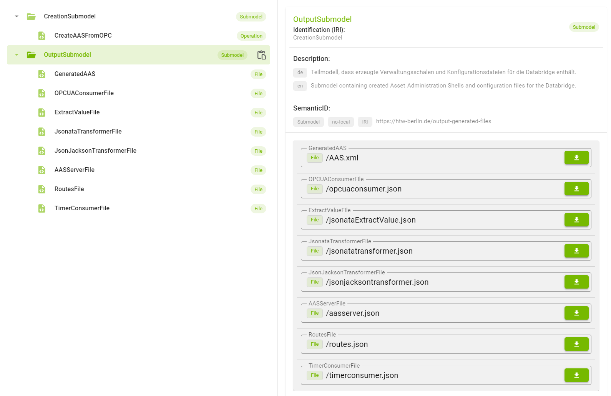

# OPC2AAS

This application is used to automatically create Asset Administration Shells from already existing datastructures on OPC UA servers. It also automates the creation of configuration files for the BaSyx Databridge.

## Installation:

1. Make sure Docker is installed and running
2. Open a terminal/console in the root of the project
3. execute the command `docker-compose up -d`
4. A userinterface should now be available at http://localhost:4088

## How to use the tool:

From within the UI, open the OPC2AAS Asset Administration Shell visible on the left side. There are two Submodels inside the AAS.

### CreationSubmodel

This Submodel is needed to enter

1. the name of the AAS which will be generated
2. the address of the OPC UA server which provides the datastructure which will be transfered to the to be generated AAS.

> When you enter *localhost:port* as address, **localhost** will be automatically changed to **host.docker.internal** in order for the tool to work inside a Docker container.

> OPC UA Servers have a *Server* object in the first layer right beneath the root node. The OPC2AAS tool filters this out. All other objects will be included in the generated AAS.

> For the successful generation of an AAS, the first (node-)layer beneath the root node should never have variables. Only objects are allowed here. This is necessary because only objects can be translated to Submodels (and SubmodelElementCollections). Each AAS needs atleast a Submodel on the first layer!

### OutputSubmodel

This Submodel includes all files which where generated by the OPC2AAS tool. The first file is the generated AAS. All following files are Databridge config files.

In order to use the generated AAS with the Databridge, you have to download all files.

## Databridge usage:

After you created the AAS and the config files, the following steps are needed to run the generated AAS and fill it's properties via the Databridge:

1. Download the generated AAS (AAS.xml) and convert it to an AASX file using the AASX Package Explorer ([Package Explorer](https://github.com/admin-shell-io/aasx-package-explorer/releases/)).
2. Place the AAS.aasx file here: `DatabridgeDemo/AASServerConfig`
3. Download all config files and put them here: `DatabridgeDemo/DatabridgeConfig`
4. Start/restart the **aasserverdb** and **databridge** Docker containers or the entire opc2aas compose project.
5. The AAS Web UI should now show your generated AAS. When you activate auto sync, you should see the properties being updated according to the changes from the OPC UA server.
