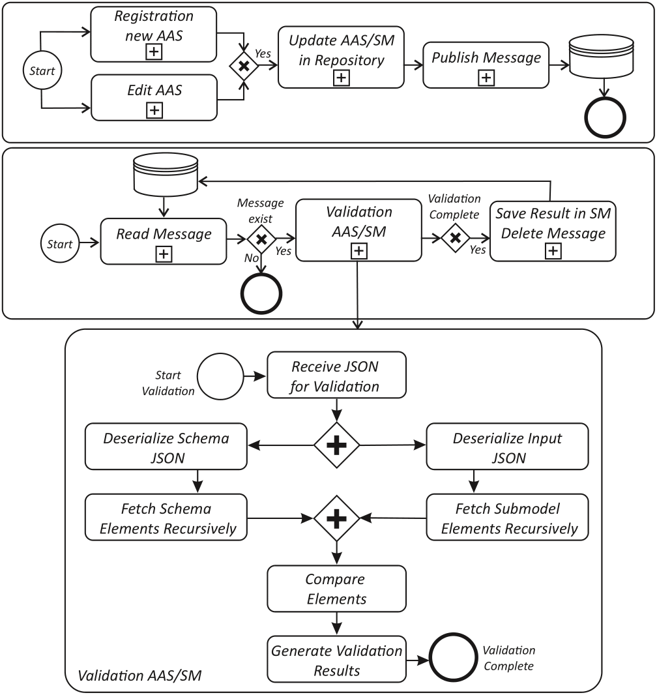

# Test Orchestrator

## Overview

The **Test Orchestrator** is a Java-based validation engine designed to automate testing of AAS (Asset Administration Shell) Submodels against reference schemas. It ensures structural integrity and semantic correctness in compliance with standardized definitions from IDTA . The orchestrator compares submodel elements recursively and highlights deviations for quality assurance in Digital Twin environments.

---

## ✨ Key Features

- **Automated Schema Validation**  
  Detects mismatches between uploaded Submodels and reference JSON schemas without any manual action required.

- **Real-Time Testing via MQTT**  
  Upon creation or update of a Submodel, the system automatically runs validation and publishes results.

- **Detailed Validation Output**  
  Reports unexpected elements, missing mandatory entries, and IDShort mismatches with percentage summaries.

- **Result Storage**  
  Validation outcomes are saved in two dedicated submodels: `TestResults` and `UnsuccessfulTestResults`.

- **Semantic Validation**
  Semantic validation can be conducted using ECLASS and Generative AI.   
---

## 🧠 System Architecture

The validation logic follows the workflow illustrated below:  


---


## 🔍 Tool Comparison

| Feature                                      | [aas-test-engines](https://github.com/admin-shell-io/aas-test-engines) | [Twinfix](https://twinfix.twinsphere.io/)    | [Basyx AAS Compliance Tool](https://github.com/eclipse-basyx/basyx-python-sdk/tree/main/compliance_tool) | Test Orchestrator (This Repository) |
|----------------------------------------------|-----------------|------------|-------------------------------|-------------------------------|
| **IDTA-compliant validation**                | ✅              | ✅      | 	✅   | ✅                           |
| **Validation against Submodel Templates**    | ⚠️ Only ContactInformation and Digital Nameplate | ❌       | ❌  | ✅ (standardized and custom Submodels)                     |
| **Meta model conformity check**              | ❌              | ✅    | ✅     | ❌                           |
| **API validation**                           | ✅              | ❌     |  ❌   | ❌                           |
| **Automatic triggering**                     | ❌              | ❌    |   ❌   | ✅  via MQTT                 |
| **Parallel/concurrent validation**           | ❌              | ✅    |  ❌   | ✅                           |
| **Result storage**                           | ❌ Console output only    | ❌    |   ❌ Console text output only   | ✅ Persisted in Submodel Repository   |
| **Auto-fix suggestions**                     | ❌               | 🧪 Experimental | ❌ |    ✅ Suggestions for fixing errors and warnings      |
| **Distribution of the tool**                 | local           | online   | local   | local and online             |
| **User interface**                           | CLI only        | Web Interface      |  CLI | Web UI, REST API   |
| **Supported formats**                         | AASX, JSON, XML | AASX   |  AASX, JSON, XML  | AASX, JSON, XML               |
| **Output format**                            | HTML view / console | Detailed web UI + downloadable JSON report    | Console log (CLI steps and errors) | Categorized results + Visualization in Web UI + downloadable JSON report |
| **Result classification**                    | Flat errors     | Flat errors grouped by occurence       | Steps with SUCCESS/FAILED  | Categorized - Errors, Warnings, Differences, Infos grouped by Submodel     |
| **Semantic Validation of Submodel Elements**                    | ❌     | ❌       | ❌  | ✅   |

---

✅ = Fully Supported
❌ = Not Supported
⚠️ = Limited Support
🧪 = Experimental Feature
 
---

## 🚀 Getting Started

You can find ready-to-use examples and configurations of Test Orchestrator in the [Examples folder](./example/).

---

## 🔧 Developer Setup

### Requirements

- Java 17
- Maven

### Clone the Project

```bash
git clone https://github.com/eclipse-basyx/basyx-applications.git
cd test-orchestrator
```

Please go through [Basyx Wiki](https://wiki.basyx.org/en/latest/content/user_documentation/basyx_components/testorchestrator/index.html) to know more details about the project.