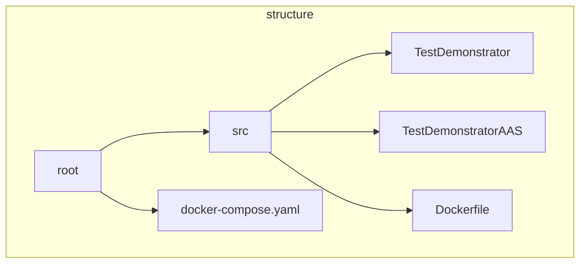
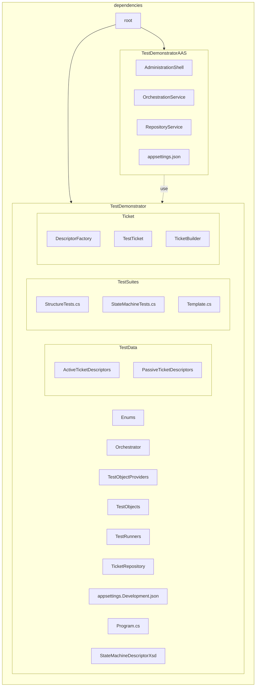
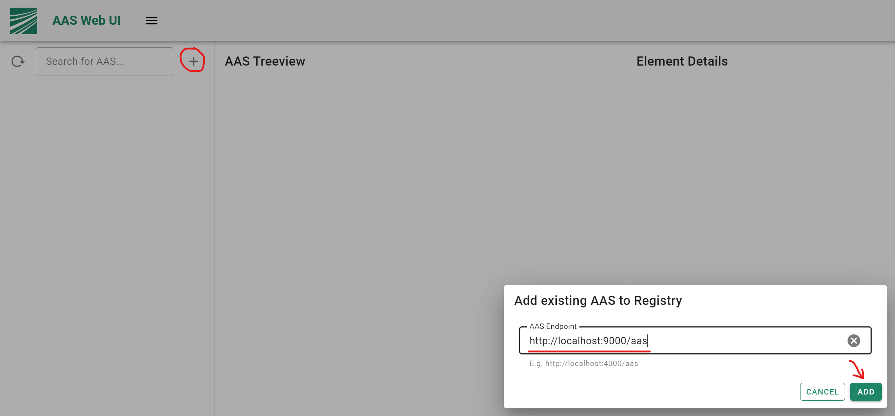

# Test Orchestrator

## Structural overview

The following flowchart provides an overview of the general structure of this repository.
The synthesised software architecture is composed of two projects - **TestDemonstrator** and **TestDemonstratorAAS**,
each of which was created as a result of a test-driven development process. The corresponding test projects are
**TestDemonstrator.Tests** and **TestDemonstratorAAS.Tests**, respectively. 



The **TestDemonstrator** implements the core components and a demo to show their usage. The **TestDemonstratorAAS**-project 
contains high-level modules and provides components that define the structure of the AAS.
A docker-compose and a docker file are provided to run the AAS in an isolated environment.
The container runtime starts an SQL database used as a ticket repository. This serves as a prerequisite for the usage of the ticket repository submodel.
The user can access the database through port 3306. The connection string is defined by the docker-compose file.
To start the AAS, the same connection string must be specified in the appsettings.json file of the **TestDemonstratorAAS**-Project.
The default <em>User Id</em> and server identification must be taken into consideration. See also [MS SQL Server 2019](https://hub.docker.com/_/microsoft-mssql-server).
The AAS is started on HTTP port 9000 and HTTPS port 9001. Changing the ports requires adaptations of the docker-compose file.

## Dependencies

The following diagram illustrates the dependencies between the four projects. As shown, the **TestDemonstratorAAS**-project 
cannot be compiled without the core components implemented by the **TestDemonstrator**. 


The local execution of each test project requires a connection string to a test database, which must be specified in the <em>appsettings.Development.json</em>-file.

## Setup
To run the application, the following command must be executed from the root directory of the Test Orchestrator Project.

> docker-compose up -d

The database will be created and the Test Orchestrator will be built.
*Potential warnings can be associated with the generated [TestDemonstratorAAS/StateMachineDescriptorXsd.Designer.cs](src/TestDemonstratorAAS/StateMachineDescriptorXsd.Designer.cs) file.*

The AAS of the Test Orchestrator can be accessed through the AAS Web UI. Currently, the Test Orchestrator is not registered and therefore not visible in the UI from the beginning.
To register the Test Orchestrator, the following steps must be performed:

1. Open the AAS Web UI (http://localhost:4277)

2. Click on the plus-icon in the top right corner of the AAS list on the left side.

3. Enter the following URL:
> http://localhost:9000/aas

4. The AAS should appear in the list.



## Handling
To perform a test pipeline, a ticket must be loaded through the **TicketManagement** submodel. 

**Because the application is deployed as a container, its access to the host system's resources is limited. Therefore, if you want to orchestrate active test pipelines running on your localhost,
replace the URL's hostname `localhost` to `host.docker.internal`, for example:**
```
http://localhost:5081 -> http://host.docker.internal:5081
```

A passive test pipeline consists only of structure tests. A passive ticket can be uploaded through the 
**UploadPassiveTicket** operation. First, an XML file must be provided that represents the current test object.
Second, the expected structure must be provided as an XML file as well. Both the AAS and the structure descriptor can be created
via the [AASX Package Explorer](https://github.com/admin-shell-io/aasx-package-explorer). 

The operation can be called by opening the TestManagementShell in the AAS Web UI.

1. Open the TestManagementShell from the AAS list.

2. Find the following Operation:

> TicketManagement/UploadPassiveTicket

3. Paste the XML content for the test object (AAS).

> Example AASs can be found here: [Demo AASs](https://admin-shell-io.com/samples/)

4. Paste the XML content for the structure descriptor.

> An always successfull test result can be archieved by using the same AAS for the structure descriptor.

5. After the ticket was successfully uploaded, we want to retrieve all registered ticket identificators. Execute
the **RetrieveTicketIdentificators** operation of the **TicketManagement** submodel.

Since there are many tickets in the repository, which would not be the case on the first run, the demonstrator responds with the following message.
The operation returns a string of comma separated ticket identificators.

6. Copy the identificator and clear the request body.

7. Execute the **ExetuteTestPipelineById** operation of the **TestExecution** submodel. Do not forget to specify the ID of the uploaded ticket.

The test protocol is stored in the ticket now. Clear the request body.

8. Execute the **RetrieveTicketById** operation of the **TicketManagement** submodel. Use the following request body.
Do not forget to specify the ID of the uploaded ticket.

The response body contains the whole ticket as well as the generated test protocol as an XML string. The XML element 
**output** contains the following information.

```         
      2022-10-18 12:42:22.350 Expected submodels count:  8
      2022-10-18 12:42:22.361 Actual submodels count:  8
      2022-10-18 12:42:22.370 Expected IdShort of submodel number 0: SM_Process1
      2022-10-18 12:42:22.380 Actual IdShort of submodel number 0:   SM_Process1
      2022-10-18 12:42:22.389 Expected submodel elements count: 3
      2022-10-18 12:42:22.399 Actual submodel elements count:   3
      2022-10-18 12:42:22.409 	Expected IdShort of submodel element 0: SMC_Statemachine
      2022-10-18 12:42:22.419 	Actual IdShort of submodel element 0:   SMC_Statemachine
      2022-10-18 12:42:22.428 	Submodel element SMC_Statemachine is an element collection
      2022-10-18 12:42:22.437 	SMC_Statemachine: Expected elements count: 2
      2022-10-18 12:42:22.447 	SMC_Statemachine: Actual submodel elements count: 2
      2022-10-18 12:42:22.456 		Expected IdShort of submodel element 0: Prop_State
      2022-10-18 12:42:22.466 		Actual IdShort of submodel element 0:   Prop_State
      2022-10-18 12:42:22.476 		Expected IdShort of submodel element 1: Prop_Mode
      2022-10-18 12:42:22.486 		Actual IdShort of submodel element 1:   Prop_Mode
      2022-10-18 12:42:22.495 	Expected IdShort of submodel element 1: SMC_ProcessInfo
      2022-10-18 12:42:22.504 	Actual IdShort of submodel element 1:   SMC_ProcessInfo
      2022-10-18 12:42:22.514 	Submodel element SMC_ProcessInfo is an element collection
      2022-10-18 12:42:22.523 	SMC_ProcessInfo: Expected elements count: 5
      2022-10-18 12:42:22.534 	SMC_ProcessInfo: Actual submodel elements count: 5
      2022-10-18 12:42:22.544 		Expected IdShort of submodel element 0: SMC_ElementOfProcessInfo1
      2022-10-18 12:42:22.555 		Actual IdShort of submodel element 0:   SMC_ElementOfProcessInfo1
      2022-10-18 12:42:22.565 		Submodel element SMC_ElementOfProcessInfo1 is an element collection
      2022-10-18 12:42:22.575 		SMC_ElementOfProcessInfo1: Expected elements count: 9
      2022-10-18 12:42:22.584 		SMC_ElementOfProcessInfo1: Actual submodel elements count: 9
      2022-10-18 12:42:22.594 			Expected IdShort of submodel element 0: ProcessVariables1
      2022-10-18 12:42:22.604 			Actual IdShort of submodel element 0:   ProcessVariables1
      2022-10-18 12:42:22.614 			Expected IdShort of submodel element 1: ProcessVariables2
      2022-10-18 12:42:22.623 			Actual IdShort of submodel element 1:   ProcessVariables2
      
      ...
      
      2022-10-18 12:42:38.609 Test passed!
```

To upload and execute a test pipeline for an active test object (Control Component) with a PackML state machine, start an AAS containing a Control Component containing a PackML state machine.
Then upload a ticket through the **UpdateActiveTicket** operation of the **TicketManagement**
submodel.
A state machine descriptor can be found in the TestDemonstrator [project](src/TestDemonstrator/TestData/ActiveTicketDescriptors/TicketDescriptors01/01_PackML_SMD.xml).
