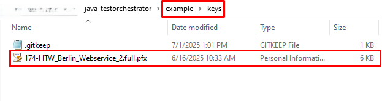

# Java Test Orchestrator Example

This project is a Java-based Test Orchestrator microservice packaged as a Docker image and orchestrated via Docker Compose. It integrates with BaSyx AAS components and an MQTT broker.

---

## 🔧 Prerequisites

- Docker
- Docker Compose
- Git (to clone the repo)

---

This folder contains an example setup for using the **Test Orchestrator**.

## Getting Started

### 1. **Clone the Repository**

```bash
git clone https://github.com/eclipse-basyx/basyx-applications.git
cd test-orchestrator/example
```


### 2. Run the Project

```bash
docker-compose up -d
```
### 3. Access the User Interface

After the application starts, open your browser and navigate to:
```bash
http://localhost:9080
```
The Test Orchestrator UI should now be accessible.

## Testing Options

You can test submodels in three different ways:

### 1. Test Using JSON Input

#### Standard Submodel Validation
To validate your submodel against an IDTA-registered standard, provide the JSON input of the AAS or standalone submodel in the `aasFile` field.

#### Custom Submodel Validation
To validate against a custom reference:
- Copy and paste your submodel in JSON format in the `aasFile` field.
- Copy and paste the reference submodel JSON in the `customAASFile` field.
- Click the `Execute` button.


Validation results will be displayed in [the Test Orchestrator Module section](#test-orchestrator-module).


---

### 2. Test Using API Links

#### Standard Submodel Validation
Provide the API endpoint of your AAS or standalone submodel in the `inputAASLink` field.

#### Custom Submodel Validation
- Provide the API URL of the submodel you want to test in the `inputAASLink` field.
- Provide the API URL of the reference submodel in the `customAASLink` field.
- Click the `Execute` button.


Validation results will be displayed in [the Test Orchestrator Module section](#test-orchestrator-module).

---

### 3. Test by Uploading Files

- Upload a valid AAS or submodel JSON file via the web interface.
- The system will automatically validate all submodels contained in the uploaded AAS.


Validation results will be displayed in [the Test Orchestrator Module section](#test-orchestrator-module).

---

## Test Orchestrator Module

Navigate to the **Test Orchestrator** module to:
- View all test results and statistics.
- Download validation results:
  - For individual submodels.
  - For all tested submodels as a single JSON file.


## Semantic Validation

Besides structural validation, Test Orchestrator can also perform semantic validation. The semantic validation includes:

- The unit of a Property SME
- ID Short matching with the semantic dictionary ECLASS
- Definition suggestion for a particular IRDI

### Validation using Generative AI

If there are Property Submodel Elements (SME) that have units, then the units for those SME can be queried to know if the unit used is correct for the given SME. 

You can use different models from [Together AI](https://api.together.ai/models) and then provide the `API key`, `Model name` in `llm_config.txt` file inside the `config` directory. 


>**Note:** This is an optional feature. If the API key and Model Name are not provided, then the rest of the validation is not hampered. 

### Validation using ECLASS

Using ECLASS Webservice, the ID Short and Definition of particular Property Submodel Elements can be validated. 

For validating the semantics of the Property Submodel Elements added in the submodels, the `.pfx` file should be kept inside the folder `keys`. 



>**Note:** This is an optional feature. If the key is not provided, then the rest of the validation is not hampered. Adding a key ensures the semantic validation of the elements.

Please go through [Basyx Wiki](https://wiki.basyx.org/en/latest/content/user_documentation/basyx_components/testorchestrator/index.html) to know more details about the project.

