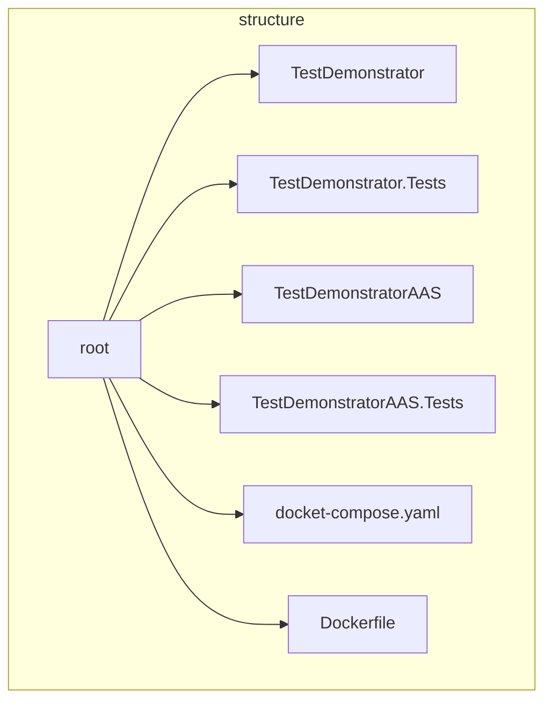
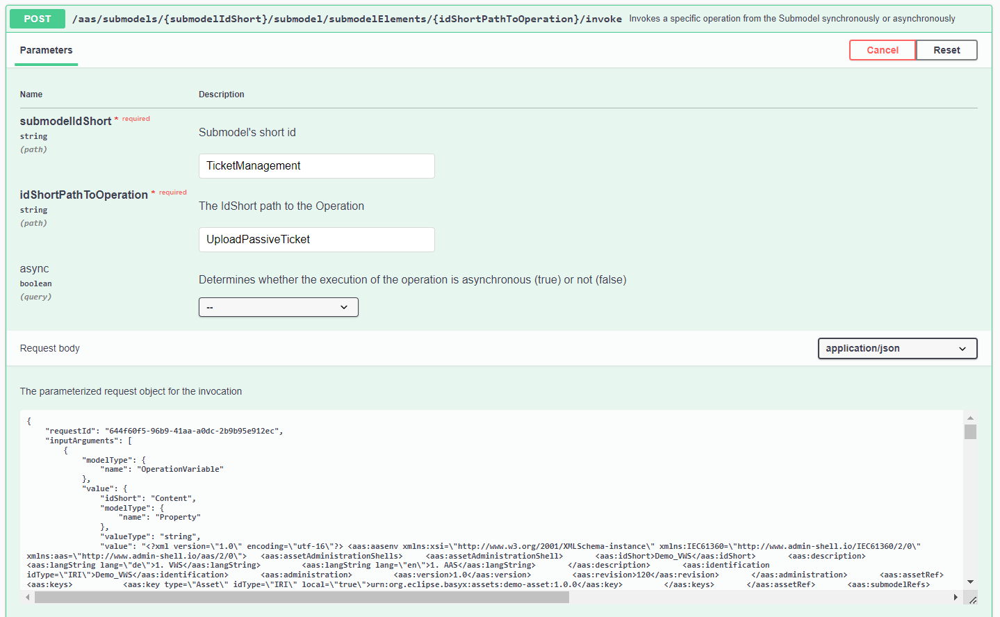
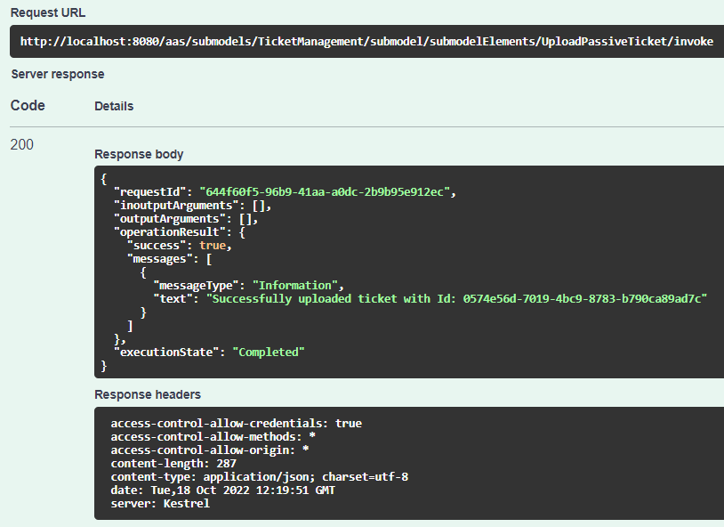
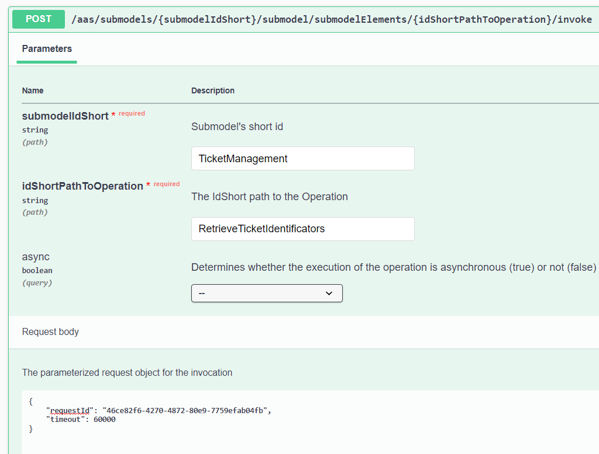
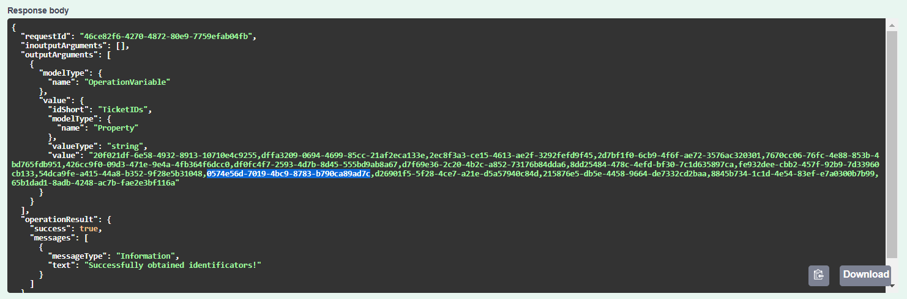
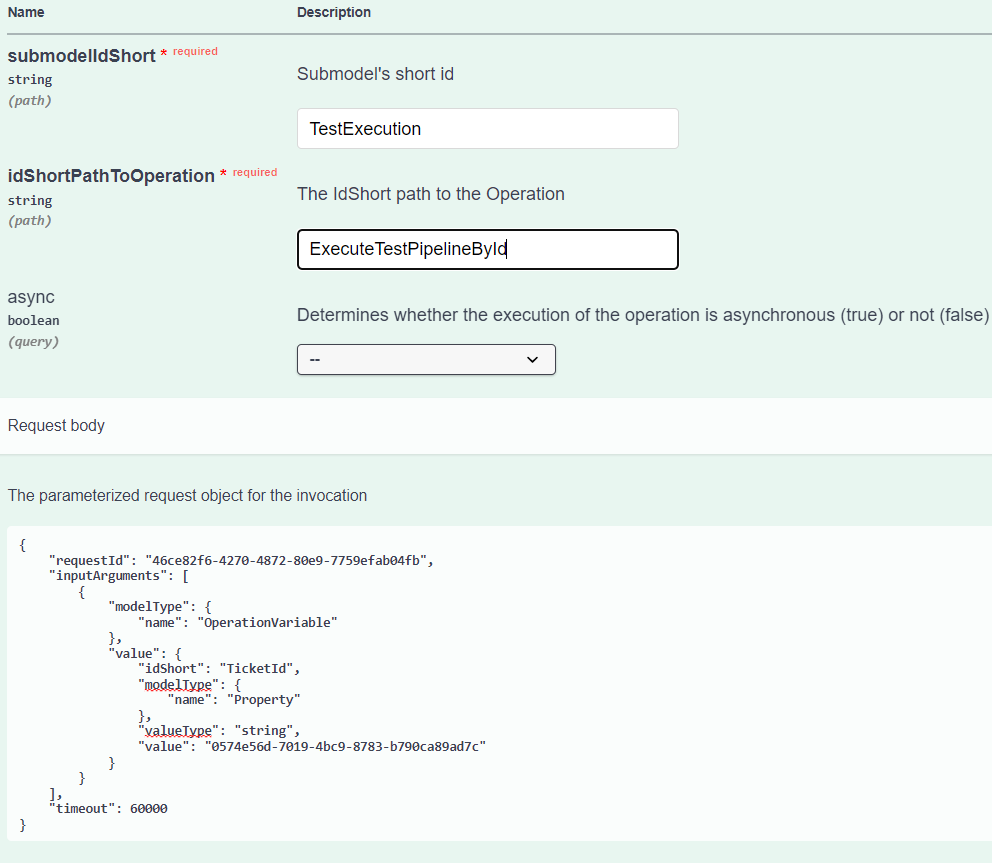
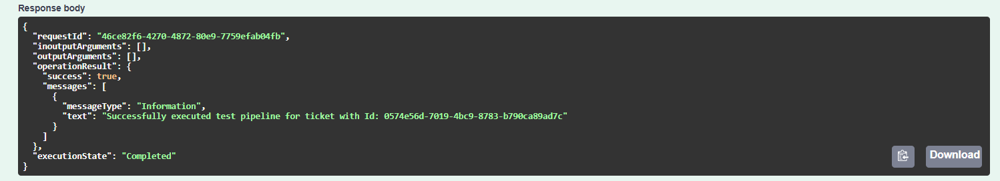

# Test Demonstrator

## Structural overview

The following flowchart provides an overview of the general structure of this repository.
The synthesised software architecture is composed of two projects - **TestDemonstrator** and **TestDemonstratorAAS**,
each of which was created as a result of a test driven development process. The corresponding test projects are
**TestDemonstrator.Tests** and **TestDemonstratorAAS.Tests**, respectively. 



The **TestDemonstrator** implements the core components and a demo to show their usage. The **TestDemonstratorAAS**-project 
contains high-level modules and provides components that define the structure of the AAS.
A docker-compose and a docker file are provided to run the administration shell in an isolated environment. The container runtime
starts an SQL database used as a ticket repository. This serves as a prerequisite for the usage of the ticket repository
submodel. The user can access the database through port 3306. The connection string is defined by the docker-compose file.
In order to start the AAS the same connection string must be specified in the appsettings.json file of the **TestDemonstratorAAS**-Project.
The default <em>User Id</em> and server identification must be taken into consideration. See also [MS SQL Server 2019](https://hub.docker.com/_/microsoft-mssql-server).
The AAS is started on HTTP port 8080 and HTTPS port 5000. Changing the ports requires adaptations of the docker-compose file.

## Dependencies

The following diagram illustrates the dependencies between the four projects. As shown, the **TestDemonstratorAAS**-project 
cannot be compiled without the core components implemented by the **TestDemonstrator**. 

```mermaid
flowchart TD
  subgraph dependencies
      root --> TestDemonstrator
      subgraph TestDemonstrator
        Enums
        Orchestrator
        subgraph TestData
            ActiveTicketDescriptors
            PassiveTicketDescriptors
        end
        TestObjectProviders
        TestObjects
        TestRunners
        subgraph TestSuites
            StructureTests.cs
            StateMachineTests.cs
            Template.cs
        end
        subgraph Ticket
            DescriptorFactory
            TestTicket
            TicketBuilder
        end
        TicketRepository
        appsettings.Development.json
        Program.cs
        StateMachineDescriptorXsd
      end
      root --> TestDemonstrator.Tests
        subgraph TestDemonstrator.Tests
            DescriptorFactoryTests
            TestObjectProviderTests
            TestObjectTests
            TestRunnerTests
            TicketBuilderTests
            TicketRepositoryTests
            TicketTests
            appsettings.Development.json
            StateMachineDescriptorXsd
            Usings.cs
        end
      root --> TestDemonstratorAAS
        subgraph TestDemonstratorAAS
            AdministrationShell
            OrchestrationService
            RepositoryService
            appsettings.Development.json
            appsettings.json
            Program.cs
            StateMachineDescriptorXsd
        end
      TestDemonstratorAAS -.->|use| TestDemonstrator
      TestDemonstrator.Tests -.->|use| TestDemonstrator
      TestDemonstratorAAS.Tests -.->|use| TestDemonstratorAAS
        subgraph TestDemonstrator.Tests
            DescriptorFactoryTests
            TestObjectProviderTests
            TestObjectTests
            TestRunnerTests
            TicketBuilderTests
            TicketRepositoryTests
            TicketTests
            appsettings.Development.json
            StateMachineDescriptorXsd
            Usings.cs
        end
      root --> TestDemonstratorAAS.Tests
        subgraph TestDemonstratorAAS.Tests
            OrchestrationServiceTests
            TicketRepositoryServiceTests
            appsettings.Development.json
            StateMachineDescriptorXsd
        end
end
```


The local execution of each test project requires a connection string to a test database, which must be specified in the 
<em>appsettings.Development.json</em>-file.

## Setup

In order to run the application, the following command must be executed from the root directory.

> docker-compose up -d

The database must be created and the demonstrator will be build. Potential warnings can be associated with the generated 
[TestDemonstratorAAS/StateMachineDescriptorXsd.Designer.cs](TestDemonstratorAAS/StateMachineDescriptorXsd.Designer.cs) file.
For more information read the thesis.

The AAS should be available under [http://localhost:8080](http://localhost:8080). 

## Handling

In order to perform a test pipeline, a ticket must be loaded through the **TicketManagement** submodel. 

**Because the application is deployed as a container, its access to the host system's resources is limited. Therefore, if you want to orchestrate active test pipelines running on your localhost,
replace the URL's hostname `localhost` to `host.docker.internal`, for example:**
```
http://localhost:5081 -> http://host.docker.internal:5081
```

A passive test pipeline consists only of structure tests. A passive ticket can be uploaded through the 
**UploadPassiveTicket** operation. First, an XML file must be provided that represents the current test object.
Second, the expected structure must be provided as an XML file as well. Both the AAS and the structure descriptor can be created
via the [AASX Package Explorer](https://github.com/admin-shell-io/aasx-package-explorer). 

The operation can be called through swagger in the following manner.

1. Go to [Swagger](http://localhost:8080/swagger/index.html).
2. Find the following POST service 

> /aas​/submodels​/{submodelIdShort}​/submodel​/submodelElements​/{idShortPathToOperation}​/invoke 

3. Type "**TicketManagement**" into the "**submodelIdShort**" field.
4. Type "**UploadPassiveTicket**" into the "**idShortPathToOperation**" field.
5. Give the following JSON object in the "**Request body"** field.

<details>
  <summary>
    Request body
  </summary>
{
    "requestId": "644f60f5-96b9-41aa-a0dc-2b9b95e912ec",
    "inputArguments": [
        {
            "modelType": {
                "name": "OperationVariable"
            },
            "value": {
                "idShort": "Content",
                "modelType": {
                    "name": "Property"
                },
                "valueType": "string",
                "value": "<?xml version=\"1.0\" encoding=\"utf-16\"?> <aas:aasenv xmlns:xsi=\"http://www.w3.org/2001/XMLSchema-instance\" xmlns:IEC61360=\"http://www.admin-shell.io/IEC61360/2/0\" xmlns:aas=\"http://www.admin-shell.io/aas/2/0\">   <aas:assetAdministrationShells>     <aas:assetAdministrationShell>       <aas:idShort>Demo_VWS</aas:idShort>       <aas:description>         <aas:langString lang=\"de\">1. VWS</aas:langString>         <aas:langString lang=\"en\">1. AAS</aas:langString>       </aas:description>       <aas:identification idType=\"IRI\">Demo_VWS</aas:identification>       <aas:administration>         <aas:version>1.0</aas:version>         <aas:revision>120</aas:revision>       </aas:administration>       <aas:assetRef>         <aas:keys>           <aas:key type=\"Asset\" idType=\"IRI\" local=\"true\">urn:org.eclipse.basyx:assets:demo-asset:1.0.0</aas:key>         </aas:keys>       </aas:assetRef>       <aas:submodelRefs>         <aas:submodelRef>           <aas:keys>             <aas:key type=\"Submodel\" idType=\"Custom\" local=\"true\">fafab1d6-2f98-43ac-9595-8166638c1f4b</aas:key>           </aas:keys>         </aas:submodelRef>         <aas:submodelRef>           <aas:keys>             <aas:key type=\"Submodel\" idType=\"Custom\" local=\"true\">dcfce5f5-bc7c-4940-b345-11cf3319de8b</aas:key>           </aas:keys>         </aas:submodelRef>         <aas:submodelRef>           <aas:keys>             <aas:key type=\"Submodel\" idType=\"Custom\" local=\"true\">8d25bdc0-ebf9-4509-aa97-ae0dc9a29505</aas:key>           </aas:keys>         </aas:submodelRef>         <aas:submodelRef>           <aas:keys>             <aas:key type=\"Submodel\" idType=\"Custom\" local=\"true\">844b3c91-a318-4f62-b173-4f6726acb482</aas:key>           </aas:keys>         </aas:submodelRef>         <aas:submodelRef>           <aas:keys>             <aas:key type=\"Submodel\" idType=\"Custom\" local=\"true\">77d4b0ac-e954-48c3-a6af-b63b6a6b8dff</aas:key>           </aas:keys>         </aas:submodelRef>         <aas:submodelRef>           <aas:keys>             <aas:key type=\"Submodel\" idType=\"Custom\" local=\"true\">60bb0443-f6bb-4332-8cc1-481bfc36e9eb</aas:key>           </aas:keys>         </aas:submodelRef>         <aas:submodelRef>           <aas:keys>             <aas:key type=\"Submodel\" idType=\"Custom\" local=\"true\">f9b67f98-7c08-42da-96f1-549b184a5ffa</aas:key>           </aas:keys>         </aas:submodelRef>         <aas:submodelRef>           <aas:keys>             <aas:key type=\"Submodel\" idType=\"Custom\" local=\"true\">591c2fd7-e082-4d3f-a625-291c0c156218</aas:key>           </aas:keys>         </aas:submodelRef>       </aas:submodelRefs>     </aas:assetAdministrationShell>   </aas:assetAdministrationShells>   <aas:assets>     <aas:asset>       <aas:idShort>demo-asset</aas:idShort>       <aas:description>         <aas:langString lang=\"de\">1. Asset</aas:langString>         <aas:langString lang=\"en\">1. Asset</aas:langString>       </aas:description>       <aas:identification idType=\"IRI\">urn:org.eclipse.basyx:assets:demo-asset:1.0.0</aas:identification>       <aas:kind>Instance</aas:kind>     </aas:asset>   </aas:assets>   <aas:submodels>     <aas:submodel>       <aas:idShort>SM_Process1</aas:idShort>       <aas:identification idType=\"Custom\">fafab1d6-2f98-43ac-9595-8166638c1f4b</aas:identification>       <aas:kind>Instance</aas:kind>       <aas:submodelElements>         <aas:submodelElement>           <aas:submodelElementCollection>             <aas:idShort>SMC_Statemachine</aas:idShort>             <aas:kind>Instance</aas:kind>             <aas:value>               <aas:submodelElement>                 <aas:property>                   <aas:idShort>Prop_State</aas:idShort>                   <aas:kind>Instance</aas:kind>                   <aas:valueType>string</aas:valueType>                   <aas:value>No</aas:value>                 </aas:property>               </aas:submodelElement>               <aas:submodelElement>                 <aas:property>                   <aas:idShort>Prop_Mode</aas:idShort>                   <aas:kind>Instance</aas:kind>                   <aas:valueType>int</aas:valueType>                   <aas:value>1</aas:value>                 </aas:property>               </aas:submodelElement>             </aas:value>             <aas:ordered>false</aas:ordered>             <aas:allowDuplicates>false</aas:allowDuplicates>           </aas:submodelElementCollection>         </aas:submodelElement>         <aas:submodelElement>           <aas:submodelElementCollection>             <aas:idShort>SMC_ProcessInfo</aas:idShort>             <aas:kind>Instance</aas:kind>             <aas:value>               <aas:submodelElement>                 <aas:submodelElementCollection>                   <aas:idShort>SMC_ElementOfProcessInfo1</aas:idShort>                   <aas:kind>Instance</aas:kind>                   <aas:value>                     <aas:submodelElement>                       <aas:property>                         <aas:idShort>ProcessVariables1</aas:idShort>                         <aas:kind>Instance</aas:kind>                         <aas:valueType>float</aas:valueType>                         <aas:value>0</aas:value>                       </aas:property>                     </aas:submodelElement>                     <aas:submodelElement>                       <aas:property>                         <aas:idShort>ProcessVariables2</aas:idShort>                         <aas:kind>Instance</aas:kind>                         <aas:valueType>float</aas:valueType>                         <aas:value>0</aas:value>                       </aas:property>                     </aas:submodelElement>                     <aas:submodelElement>                       <aas:property>                         <aas:idShort>ProcessVariables3</aas:idShort>                         <aas:kind>Instance</aas:kind>                         <aas:valueType>float</aas:valueType>                         <aas:value>0</aas:value>                       </aas:property>                     </aas:submodelElement>                     <aas:submodelElement>                       <aas:property>                         <aas:idShort>ProcessVariables4</aas:idShort>                         <aas:kind>Instance</aas:kind>                         <aas:valueType>float</aas:valueType>                         <aas:value>0</aas:value>                       </aas:property>                     </aas:submodelElement>                     <aas:submodelElement>                       <aas:property>                         <aas:idShort>ProcessVariables5</aas:idShort>                         <aas:kind>Instance</aas:kind>                         <aas:valueType>float</aas:valueType>                         <aas:value>0</aas:value>                       </aas:property>                     </aas:submodelElement>                     <aas:submodelElement>                       <aas:property>                         <aas:idShort>ProcessVariables6</aas:idShort>                         <aas:kind>Instance</aas:kind>                         <aas:valueType>float</aas:valueType>                         <aas:value>0</aas:value>                       </aas:property>                     </aas:submodelElement>                     <aas:submodelElement>                       <aas:property>                         <aas:idShort>ProcessVariables7</aas:idShort>                         <aas:kind>Instance</aas:kind>                         <aas:valueType>float</aas:valueType>                         <aas:value>0</aas:value>                       </aas:property>                     </aas:submodelElement>                     <aas:submodelElement>                       <aas:property>                         <aas:idShort>ProcessVariables8</aas:idShort>                         <aas:kind>Instance</aas:kind>                         <aas:valueType>float</aas:valueType>                         <aas:value>0</aas:value>                       </aas:property>                     </aas:submodelElement>                     <aas:submodelElement>                       <aas:property>                         <aas:idShort>ProcessVariables9</aas:idShort>                         <aas:kind>Instance</aas:kind>                         <aas:valueType>float</aas:valueType>                         <aas:value>0</aas:value>                       </aas:property>                     </aas:submodelElement>                   </aas:value>                   <aas:ordered>false</aas:ordered>                   <aas:allowDuplicates>false</aas:allowDuplicates>                 </aas:submodelElementCollection>               </aas:submodelElement>               <aas:submodelElement>                 <aas:submodelElementCollection>                   <aas:idShort>SMC_ElementOfProcessInfo2</aas:idShort>                   <aas:kind>Instance</aas:kind>                   <aas:value>                     <aas:submodelElement>                       <aas:property>                         <aas:idShort>ProcessVariables1</aas:idShort>                         <aas:kind>Instance</aas:kind>                         <aas:valueType>float</aas:valueType>                         <aas:value>0</aas:value>                       </aas:property>                     </aas:submodelElement>                     <aas:submodelElement>                       <aas:property>                         <aas:idShort>ProcessVariables2</aas:idShort>                         <aas:kind>Instance</aas:kind>                         <aas:valueType>float</aas:valueType>                         <aas:value>0</aas:value>                       </aas:property>                     </aas:submodelElement>                     <aas:submodelElement>                       <aas:property>                         <aas:idShort>ProcessVariables3</aas:idShort>                         <aas:kind>Instance</aas:kind>                         <aas:valueType>float</aas:valueType>                         <aas:value>0</aas:value>                       </aas:property>                     </aas:submodelElement>                     <aas:submodelElement>                       <aas:property>                         <aas:idShort>ProcessVariables4</aas:idShort>                         <aas:kind>Instance</aas:kind>                         <aas:valueType>float</aas:valueType>                         <aas:value>0</aas:value>                       </aas:property>                     </aas:submodelElement>                     <aas:submodelElement>                       <aas:property>                         <aas:idShort>ProcessVariables5</aas:idShort>                         <aas:kind>Instance</aas:kind>                         <aas:valueType>float</aas:valueType>                         <aas:value>0</aas:value>                       </aas:property>                     </aas:submodelElement>                     <aas:submodelElement>                       <aas:property>                         <aas:idShort>ProcessVariables6</aas:idShort>                         <aas:kind>Instance</aas:kind>                         <aas:valueType>float</aas:valueType>                         <aas:value>0</aas:value>                       </aas:property>                     </aas:submodelElement>                     <aas:submodelElement>                       <aas:property>                         <aas:idShort>ProcessVariables7</aas:idShort>                         <aas:kind>Instance</aas:kind>                         <aas:valueType>float</aas:valueType>                         <aas:value>0</aas:value>                       </aas:property>                     </aas:submodelElement>                     <aas:submodelElement>                       <aas:property>                         <aas:idShort>ProcessVariables8</aas:idShort>                         <aas:kind>Instance</aas:kind>                         <aas:valueType>float</aas:valueType>                         <aas:value>0</aas:value>                       </aas:property>                     </aas:submodelElement>                     <aas:submodelElement>                       <aas:property>                         <aas:idShort>ProcessVariables9</aas:idShort>                         <aas:kind>Instance</aas:kind>                         <aas:valueType>float</aas:valueType>                         <aas:value>0</aas:value>                       </aas:property>                     </aas:submodelElement>                   </aas:value>                   <aas:ordered>false</aas:ordered>                   <aas:allowDuplicates>false</aas:allowDuplicates>                 </aas:submodelElementCollection>               </aas:submodelElement>               <aas:submodelElement>                 <aas:submodelElementCollection>                   <aas:idShort>SMC_ElementOfProcessInfo3</aas:idShort>                   <aas:kind>Instance</aas:kind>                   <aas:value>                     <aas:submodelElement>                       <aas:property>                         <aas:idShort>ProcessVariables1</aas:idShort>                         <aas:kind>Instance</aas:kind>                         <aas:valueType>float</aas:valueType>                         <aas:value>0</aas:value>                       </aas:property>                     </aas:submodelElement>                     <aas:submodelElement>                       <aas:property>                         <aas:idShort>ProcessVariables2</aas:idShort>                         <aas:kind>Instance</aas:kind>                         <aas:valueType>float</aas:valueType>                         <aas:value>0</aas:value>                       </aas:property>                     </aas:submodelElement>                     <aas:submodelElement>                       <aas:property>                         <aas:idShort>ProcessVariables3</aas:idShort>                         <aas:kind>Instance</aas:kind>                         <aas:valueType>float</aas:valueType>                         <aas:value>0</aas:value>                       </aas:property>                     </aas:submodelElement>                     <aas:submodelElement>                       <aas:property>                         <aas:idShort>ProcessVariables4</aas:idShort>                         <aas:kind>Instance</aas:kind>                         <aas:valueType>float</aas:valueType>                         <aas:value>0</aas:value>                       </aas:property>                     </aas:submodelElement>                     <aas:submodelElement>                       <aas:property>                         <aas:idShort>ProcessVariables5</aas:idShort>                         <aas:kind>Instance</aas:kind>                         <aas:valueType>float</aas:valueType>                         <aas:value>0</aas:value>                       </aas:property>                     </aas:submodelElement>                     <aas:submodelElement>                       <aas:property>                         <aas:idShort>ProcessVariables6</aas:idShort>                         <aas:kind>Instance</aas:kind>                         <aas:valueType>float</aas:valueType>                         <aas:value>0</aas:value>                       </aas:property>                     </aas:submodelElement>                     <aas:submodelElement>                       <aas:property>                         <aas:idShort>ProcessVariables7</aas:idShort>                         <aas:kind>Instance</aas:kind>                         <aas:valueType>float</aas:valueType>                         <aas:value>0</aas:value>                       </aas:property>                     </aas:submodelElement>                     <aas:submodelElement>                       <aas:property>                         <aas:idShort>ProcessVariables8</aas:idShort>                         <aas:kind>Instance</aas:kind>                         <aas:valueType>float</aas:valueType>                         <aas:value>0</aas:value>                       </aas:property>                     </aas:submodelElement>                     <aas:submodelElement>                       <aas:property>                         <aas:idShort>ProcessVariables9</aas:idShort>                         <aas:kind>Instance</aas:kind>                         <aas:valueType>float</aas:valueType>                         <aas:value>0</aas:value>                       </aas:property>                     </aas:submodelElement>                   </aas:value>                   <aas:ordered>false</aas:ordered>                   <aas:allowDuplicates>false</aas:allowDuplicates>                 </aas:submodelElementCollection>               </aas:submodelElement>               <aas:submodelElement>                 <aas:submodelElementCollection>                   <aas:idShort>SMC_ElementOfProcessInfo4</aas:idShort>                   <aas:kind>Instance</aas:kind>                   <aas:value>                     <aas:submodelElement>                       <aas:property>                         <aas:idShort>ProcessVariables1</aas:idShort>                         <aas:kind>Instance</aas:kind>                         <aas:valueType>float</aas:valueType>                         <aas:value>0</aas:value>                       </aas:property>                     </aas:submodelElement>                     <aas:submodelElement>                       <aas:property>                         <aas:idShort>ProcessVariables2</aas:idShort>                         <aas:kind>Instance</aas:kind>                         <aas:valueType>float</aas:valueType>                         <aas:value>0</aas:value>                       </aas:property>                     </aas:submodelElement>                     <aas:submodelElement>                       <aas:property>                         <aas:idShort>ProcessVariables3</aas:idShort>                         <aas:kind>Instance</aas:kind>                         <aas:valueType>float</aas:valueType>                         <aas:value>0</aas:value>                       </aas:property>                     </aas:submodelElement>                     <aas:submodelElement>                       <aas:property>                         <aas:idShort>ProcessVariables4</aas:idShort>                         <aas:kind>Instance</aas:kind>                         <aas:valueType>float</aas:valueType>                         <aas:value>0</aas:value>                       </aas:property>                     </aas:submodelElement>                     <aas:submodelElement>                       <aas:property>                         <aas:idShort>ProcessVariables5</aas:idShort>                         <aas:kind>Instance</aas:kind>                         <aas:valueType>float</aas:valueType>                         <aas:value>0</aas:value>                       </aas:property>                     </aas:submodelElement>                     <aas:submodelElement>                       <aas:property>                         <aas:idShort>ProcessVariables6</aas:idShort>                         <aas:kind>Instance</aas:kind>                         <aas:valueType>float</aas:valueType>                         <aas:value>0</aas:value>                       </aas:property>                     </aas:submodelElement>                     <aas:submodelElement>                       <aas:property>                         <aas:idShort>ProcessVariables7</aas:idShort>                         <aas:kind>Instance</aas:kind>                         <aas:valueType>float</aas:valueType>                         <aas:value>0</aas:value>                       </aas:property>                     </aas:submodelElement>                     <aas:submodelElement>                       <aas:property>                         <aas:idShort>ProcessVariables8</aas:idShort>                         <aas:kind>Instance</aas:kind>                         <aas:valueType>float</aas:valueType>                         <aas:value>0</aas:value>                       </aas:property>                     </aas:submodelElement>                     <aas:submodelElement>                       <aas:property>                         <aas:idShort>ProcessVariables9</aas:idShort>                         <aas:kind>Instance</aas:kind>                         <aas:valueType>float</aas:valueType>                         <aas:value>0</aas:value>                       </aas:property>                     </aas:submodelElement>                   </aas:value>                   <aas:ordered>false</aas:ordered>                   <aas:allowDuplicates>false</aas:allowDuplicates>                 </aas:submodelElementCollection>               </aas:submodelElement>               <aas:submodelElement>                 <aas:submodelElementCollection>                   <aas:idShort>SMC_ElementOfProcessInfo5</aas:idShort>                   <aas:kind>Instance</aas:kind>                   <aas:value>                     <aas:submodelElement>                       <aas:property>                         <aas:idShort>ProcessVariables1</aas:idShort>                         <aas:kind>Instance</aas:kind>                         <aas:valueType>float</aas:valueType>                         <aas:value>0</aas:value>                       </aas:property>                     </aas:submodelElement>                     <aas:submodelElement>                       <aas:property>                         <aas:idShort>ProcessVariables2</aas:idShort>                         <aas:kind>Instance</aas:kind>                         <aas:valueType>float</aas:valueType>                         <aas:value>0</aas:value>                       </aas:property>                     </aas:submodelElement>                     <aas:submodelElement>                       <aas:property>                         <aas:idShort>ProcessVariables3</aas:idShort>                         <aas:kind>Instance</aas:kind>                         <aas:valueType>float</aas:valueType>                         <aas:value>0</aas:value>                       </aas:property>                     </aas:submodelElement>                     <aas:submodelElement>                       <aas:property>                         <aas:idShort>ProcessVariables4</aas:idShort>                         <aas:kind>Instance</aas:kind>                         <aas:valueType>float</aas:valueType>                         <aas:value>0</aas:value>                       </aas:property>                     </aas:submodelElement>                     <aas:submodelElement>                       <aas:property>                         <aas:idShort>ProcessVariables5</aas:idShort>                         <aas:kind>Instance</aas:kind>                         <aas:valueType>float</aas:valueType>                         <aas:value>0</aas:value>                       </aas:property>                     </aas:submodelElement>                     <aas:submodelElement>                       <aas:property>                         <aas:idShort>ProcessVariables6</aas:idShort>                         <aas:kind>Instance</aas:kind>                         <aas:valueType>float</aas:valueType>                         <aas:value>0</aas:value>                       </aas:property>                     </aas:submodelElement>                     <aas:submodelElement>                       <aas:property>                         <aas:idShort>ProcessVariables7</aas:idShort>                         <aas:kind>Instance</aas:kind>                         <aas:valueType>float</aas:valueType>                         <aas:value>0</aas:value>                       </aas:property>                     </aas:submodelElement>                     <aas:submodelElement>                       <aas:property>                         <aas:idShort>ProcessVariables8</aas:idShort>                         <aas:kind>Instance</aas:kind>                         <aas:valueType>float</aas:valueType>                         <aas:value>0</aas:value>                       </aas:property>                     </aas:submodelElement>                     <aas:submodelElement>                       <aas:property>                         <aas:idShort>ProcessVariables9</aas:idShort>                         <aas:kind>Instance</aas:kind>                         <aas:valueType>float</aas:valueType>                         <aas:value>0</aas:value>                       </aas:property>                     </aas:submodelElement>                   </aas:value>                   <aas:ordered>false</aas:ordered>                   <aas:allowDuplicates>false</aas:allowDuplicates>                 </aas:submodelElementCollection>               </aas:submodelElement>             </aas:value>             <aas:ordered>false</aas:ordered>             <aas:allowDuplicates>false</aas:allowDuplicates>           </aas:submodelElementCollection>         </aas:submodelElement>         <aas:submodelElement>           <aas:submodelElementCollection>             <aas:idShort>SMC_ProcessController</aas:idShort>             <aas:kind>Instance</aas:kind>             <aas:value>               <aas:submodelElement>                 <aas:submodelElementCollection>                   <aas:idShort>SMC_ElementOfProcessController1</aas:idShort>                   <aas:kind>Instance</aas:kind>                   <aas:value>                     <aas:submodelElement>                       <aas:property>                         <aas:idShort>Parameter1</aas:idShort>                         <aas:kind>Instance</aas:kind>                         <aas:valueType>float</aas:valueType>                         <aas:value>0</aas:value>                       </aas:property>                     </aas:submodelElement>                     <aas:submodelElement>                       <aas:property>                         <aas:idShort>Parameter2</aas:idShort>                         <aas:kind>Instance</aas:kind>                         <aas:valueType>float</aas:valueType>                         <aas:value>0</aas:value>                       </aas:property>                     </aas:submodelElement>                     <aas:submodelElement>                       <aas:property>                         <aas:idShort>Parameter3</aas:idShort>                         <aas:kind>Instance</aas:kind>                         <aas:valueType>float</aas:valueType>                         <aas:value>0</aas:value>                       </aas:property>                     </aas:submodelElement>                     <aas:submodelElement>                       <aas:property>                         <aas:idShort>Parameter4</aas:idShort>                         <aas:kind>Instance</aas:kind>                         <aas:valueType>float</aas:valueType>                         <aas:value>0</aas:value>                       </aas:property>                     </aas:submodelElement>                     <aas:submodelElement>                       <aas:property>                         <aas:idShort>Parameter5</aas:idShort>                         <aas:kind>Instance</aas:kind>                         <aas:valueType>float</aas:valueType>                         <aas:value>0</aas:value>                       </aas:property>                     </aas:submodelElement>                   </aas:value>                   <aas:ordered>false</aas:ordered>                   <aas:allowDuplicates>false</aas:allowDuplicates>                 </aas:submodelElementCollection>               </aas:submodelElement>               <aas:submodelElement>                 <aas:submodelElementCollection>                   <aas:idShort>SMC_ElementOfProcessController2</aas:idShort>                   <aas:kind>Instance</aas:kind>                   <aas:value>                     <aas:submodelElement>                       <aas:property>                         <aas:idShort>Parameter1</aas:idShort>                         <aas:kind>Instance</aas:kind>                         <aas:valueType>float</aas:valueType>                         <aas:value>0</aas:value>                       </aas:property>                     </aas:submodelElement>                     <aas:submodelElement>                       <aas:property>                         <aas:idShort>Parameter2</aas:idShort>                         <aas:kind>Instance</aas:kind>                         <aas:valueType>float</aas:valueType>                         <aas:value>0</aas:value>                       </aas:property>                     </aas:submodelElement>                     <aas:submodelElement>                       <aas:property>                         <aas:idShort>Parameter3</aas:idShort>                         <aas:kind>Instance</aas:kind>                         <aas:valueType>float</aas:valueType>                         <aas:value>0</aas:value>                       </aas:property>                     </aas:submodelElement>                     <aas:submodelElement>                       <aas:property>                         <aas:idShort>Parameter4</aas:idShort>                         <aas:kind>Instance</aas:kind>                         <aas:valueType>float</aas:valueType>                         <aas:value>0</aas:value>                       </aas:property>                     </aas:submodelElement>                     <aas:submodelElement>                       <aas:property>                         <aas:idShort>Parameter5</aas:idShort>                         <aas:kind>Instance</aas:kind>                         <aas:valueType>float</aas:valueType>                         <aas:value>0</aas:value>                       </aas:property>                     </aas:submodelElement>                   </aas:value>                   <aas:ordered>false</aas:ordered>                   <aas:allowDuplicates>false</aas:allowDuplicates>                 </aas:submodelElementCollection>               </aas:submodelElement>               <aas:submodelElement>                 <aas:submodelElementCollection>                   <aas:idShort>SMC_ElementOfProcessController3</aas:idShort>                   <aas:kind>Instance</aas:kind>                   <aas:value>                     <aas:submodelElement>                       <aas:property>                         <aas:idShort>Parameter1</aas:idShort>                         <aas:kind>Instance</aas:kind>                         <aas:valueType>float</aas:valueType>                         <aas:value>0</aas:value>                       </aas:property>                     </aas:submodelElement>                     <aas:submodelElement>                       <aas:property>                         <aas:idShort>Parameter2</aas:idShort>                         <aas:kind>Instance</aas:kind>                         <aas:valueType>float</aas:valueType>                         <aas:value>0</aas:value>                       </aas:property>                     </aas:submodelElement>                     <aas:submodelElement>                       <aas:property>                         <aas:idShort>Parameter3</aas:idShort>                         <aas:kind>Instance</aas:kind>                         <aas:valueType>float</aas:valueType>                         <aas:value>0</aas:value>                       </aas:property>                     </aas:submodelElement>                     <aas:submodelElement>                       <aas:property>                         <aas:idShort>Parameter4</aas:idShort>                         <aas:kind>Instance</aas:kind>                         <aas:valueType>float</aas:valueType>                         <aas:value>0</aas:value>                       </aas:property>                     </aas:submodelElement>                     <aas:submodelElement>                       <aas:property>                         <aas:idShort>Parameter5</aas:idShort>                         <aas:kind>Instance</aas:kind>                         <aas:valueType>float</aas:valueType>                         <aas:value>0</aas:value>                       </aas:property>                     </aas:submodelElement>                   </aas:value>                   <aas:ordered>false</aas:ordered>                   <aas:allowDuplicates>false</aas:allowDuplicates>                 </aas:submodelElementCollection>               </aas:submodelElement>               <aas:submodelElement>                 <aas:submodelElementCollection>                   <aas:idShort>SMC_ElementOfProcessController4</aas:idShort>                   <aas:kind>Instance</aas:kind>                   <aas:value>                     <aas:submodelElement>                       <aas:property>                         <aas:idShort>Parameter1</aas:idShort>                         <aas:kind>Instance</aas:kind>                         <aas:valueType>float</aas:valueType>                         <aas:value>0</aas:value>                       </aas:property>                     </aas:submodelElement>                     <aas:submodelElement>                       <aas:property>                         <aas:idShort>Parameter2</aas:idShort>                         <aas:kind>Instance</aas:kind>                         <aas:valueType>float</aas:valueType>                         <aas:value>0</aas:value>                       </aas:property>                     </aas:submodelElement>                     <aas:submodelElement>                       <aas:property>                         <aas:idShort>Parameter3</aas:idShort>                         <aas:kind>Instance</aas:kind>                         <aas:valueType>float</aas:valueType>                         <aas:value>0</aas:value>                       </aas:property>                     </aas:submodelElement>                     <aas:submodelElement>                       <aas:property>                         <aas:idShort>Parameter4</aas:idShort>                         <aas:kind>Instance</aas:kind>                         <aas:valueType>float</aas:valueType>                         <aas:value>0</aas:value>                       </aas:property>                     </aas:submodelElement>                     <aas:submodelElement>                       <aas:property>                         <aas:idShort>Parameter5</aas:idShort>                         <aas:kind>Instance</aas:kind>                         <aas:valueType>float</aas:valueType>                         <aas:value>0</aas:value>                       </aas:property>                     </aas:submodelElement>                   </aas:value>                   <aas:ordered>false</aas:ordered>                   <aas:allowDuplicates>false</aas:allowDuplicates>                 </aas:submodelElementCollection>               </aas:submodelElement>               <aas:submodelElement>                 <aas:submodelElementCollection>                   <aas:idShort>SMC_ElementOfProcessController5</aas:idShort>                   <aas:kind>Instance</aas:kind>                   <aas:value>                     <aas:submodelElement>                       <aas:property>                         <aas:idShort>Parameter1</aas:idShort>                         <aas:kind>Instance</aas:kind>                         <aas:valueType>float</aas:valueType>                         <aas:value>0</aas:value>                       </aas:property>                     </aas:submodelElement>                     <aas:submodelElement>                       <aas:property>                         <aas:idShort>Parameter2</aas:idShort>                         <aas:kind>Instance</aas:kind>                         <aas:valueType>float</aas:valueType>                         <aas:value>0</aas:value>                       </aas:property>                     </aas:submodelElement>                     <aas:submodelElement>                       <aas:property>                         <aas:idShort>Parameter3</aas:idShort>                         <aas:kind>Instance</aas:kind>                         <aas:valueType>float</aas:valueType>                         <aas:value>0</aas:value>                       </aas:property>                     </aas:submodelElement>                     <aas:submodelElement>                       <aas:property>                         <aas:idShort>Parameter4</aas:idShort>                         <aas:kind>Instance</aas:kind>                         <aas:valueType>float</aas:valueType>                         <aas:value>0</aas:value>                       </aas:property>                     </aas:submodelElement>                     <aas:submodelElement>                       <aas:property>                         <aas:idShort>Parameter5</aas:idShort>                         <aas:kind>Instance</aas:kind>                         <aas:valueType>float</aas:valueType>                         <aas:value>0</aas:value>                       </aas:property>                     </aas:submodelElement>                   </aas:value>                   <aas:ordered>false</aas:ordered>                   <aas:allowDuplicates>false</aas:allowDuplicates>                 </aas:submodelElementCollection>               </aas:submodelElement>             </aas:value>             <aas:ordered>false</aas:ordered>             <aas:allowDuplicates>false</aas:allowDuplicates>           </aas:submodelElementCollection>         </aas:submodelElement>       </aas:submodelElements>     </aas:submodel>     <aas:submodel>       <aas:idShort>SM_Process2</aas:idShort>       <aas:identification idType=\"Custom\">dcfce5f5-bc7c-4940-b345-11cf3319de8b</aas:identification>       <aas:kind>Instance</aas:kind>       <aas:submodelElements>         <aas:submodelElement>           <aas:submodelElementCollection>             <aas:idShort>SMC_Statemachine</aas:idShort>             <aas:kind>Instance</aas:kind>             <aas:value>               <aas:submodelElement>                 <aas:property>                   <aas:idShort>Prop_State</aas:idShort>                   <aas:kind>Instance</aas:kind>                   <aas:valueType>string</aas:valueType>                   <aas:value>No</aas:value>                 </aas:property>               </aas:submodelElement>               <aas:submodelElement>                 <aas:property>                   <aas:idShort>Prop_Mode</aas:idShort>                   <aas:kind>Instance</aas:kind>                   <aas:valueType>int</aas:valueType>                   <aas:value>1</aas:value>                 </aas:property>               </aas:submodelElement>             </aas:value>             <aas:ordered>false</aas:ordered>             <aas:allowDuplicates>false</aas:allowDuplicates>           </aas:submodelElementCollection>         </aas:submodelElement>         <aas:submodelElement>           <aas:submodelElementCollection>             <aas:idShort>SMC_ProcessInfo</aas:idShort>             <aas:kind>Instance</aas:kind>             <aas:value>               <aas:submodelElement>                 <aas:submodelElementCollection>                   <aas:idShort>SMC_ElementOfProcessInfo1</aas:idShort>                   <aas:kind>Instance</aas:kind>                   <aas:value>                     <aas:submodelElement>                       <aas:property>                         <aas:idShort>ProcessVariables1</aas:idShort>                         <aas:kind>Instance</aas:kind>                         <aas:valueType>float</aas:valueType>                         <aas:value>0</aas:value>                       </aas:property>                     </aas:submodelElement>                     <aas:submodelElement>                       <aas:property>                         <aas:idShort>ProcessVariables2</aas:idShort>                         <aas:kind>Instance</aas:kind>                         <aas:valueType>float</aas:valueType>                         <aas:value>0</aas:value>                       </aas:property>                     </aas:submodelElement>                     <aas:submodelElement>                       <aas:property>                         <aas:idShort>ProcessVariables3</aas:idShort>                         <aas:kind>Instance</aas:kind>                         <aas:valueType>float</aas:valueType>                         <aas:value>0</aas:value>                       </aas:property>                     </aas:submodelElement>                     <aas:submodelElement>                       <aas:property>                         <aas:idShort>ProcessVariables4</aas:idShort>                         <aas:kind>Instance</aas:kind>                         <aas:valueType>float</aas:valueType>                         <aas:value>0</aas:value>                       </aas:property>                     </aas:submodelElement>                     <aas:submodelElement>                       <aas:property>                         <aas:idShort>ProcessVariables5</aas:idShort>                         <aas:kind>Instance</aas:kind>                         <aas:valueType>float</aas:valueType>                         <aas:value>0</aas:value>                       </aas:property>                     </aas:submodelElement>                     <aas:submodelElement>                       <aas:property>                         <aas:idShort>ProcessVariables6</aas:idShort>                         <aas:kind>Instance</aas:kind>                         <aas:valueType>float</aas:valueType>                         <aas:value>0</aas:value>                       </aas:property>                     </aas:submodelElement>                     <aas:submodelElement>                       <aas:property>                         <aas:idShort>ProcessVariables7</aas:idShort>                         <aas:kind>Instance</aas:kind>                         <aas:valueType>float</aas:valueType>                         <aas:value>0</aas:value>                       </aas:property>                     </aas:submodelElement>                     <aas:submodelElement>                       <aas:property>                         <aas:idShort>ProcessVariables8</aas:idShort>                         <aas:kind>Instance</aas:kind>                         <aas:valueType>float</aas:valueType>                         <aas:value>0</aas:value>                       </aas:property>                     </aas:submodelElement>                     <aas:submodelElement>                       <aas:property>                         <aas:idShort>ProcessVariables9</aas:idShort>                         <aas:kind>Instance</aas:kind>                         <aas:valueType>float</aas:valueType>                         <aas:value>0</aas:value>                       </aas:property>                     </aas:submodelElement>                   </aas:value>                   <aas:ordered>false</aas:ordered>                   <aas:allowDuplicates>false</aas:allowDuplicates>                 </aas:submodelElementCollection>               </aas:submodelElement>               <aas:submodelElement>                 <aas:submodelElementCollection>                   <aas:idShort>SMC_ElementOfProcessInfo2</aas:idShort>                   <aas:kind>Instance</aas:kind>                   <aas:value>                     <aas:submodelElement>                       <aas:property>                         <aas:idShort>ProcessVariables1</aas:idShort>                         <aas:kind>Instance</aas:kind>                         <aas:valueType>float</aas:valueType>                         <aas:value>0</aas:value>                       </aas:property>                     </aas:submodelElement>                     <aas:submodelElement>                       <aas:property>                         <aas:idShort>ProcessVariables2</aas:idShort>                         <aas:kind>Instance</aas:kind>                         <aas:valueType>float</aas:valueType>                         <aas:value>0</aas:value>                       </aas:property>                     </aas:submodelElement>                     <aas:submodelElement>                       <aas:property>                         <aas:idShort>ProcessVariables3</aas:idShort>                         <aas:kind>Instance</aas:kind>                         <aas:valueType>float</aas:valueType>                         <aas:value>0</aas:value>                       </aas:property>                     </aas:submodelElement>                     <aas:submodelElement>                       <aas:property>                         <aas:idShort>ProcessVariables4</aas:idShort>                         <aas:kind>Instance</aas:kind>                         <aas:valueType>float</aas:valueType>                         <aas:value>0</aas:value>                       </aas:property>                     </aas:submodelElement>                     <aas:submodelElement>                       <aas:property>                         <aas:idShort>ProcessVariables5</aas:idShort>                         <aas:kind>Instance</aas:kind>                         <aas:valueType>float</aas:valueType>                         <aas:value>0</aas:value>                       </aas:property>                     </aas:submodelElement>                     <aas:submodelElement>                       <aas:property>                         <aas:idShort>ProcessVariables6</aas:idShort>                         <aas:kind>Instance</aas:kind>                         <aas:valueType>float</aas:valueType>                         <aas:value>0</aas:value>                       </aas:property>                     </aas:submodelElement>                     <aas:submodelElement>                       <aas:property>                         <aas:idShort>ProcessVariables7</aas:idShort>                         <aas:kind>Instance</aas:kind>                         <aas:valueType>float</aas:valueType>                         <aas:value>0</aas:value>                       </aas:property>                     </aas:submodelElement>                     <aas:submodelElement>                       <aas:property>                         <aas:idShort>ProcessVariables8</aas:idShort>                         <aas:kind>Instance</aas:kind>                         <aas:valueType>float</aas:valueType>                         <aas:value>0</aas:value>                       </aas:property>                     </aas:submodelElement>                     <aas:submodelElement>                       <aas:property>                         <aas:idShort>ProcessVariables9</aas:idShort>                         <aas:kind>Instance</aas:kind>                         <aas:valueType>float</aas:valueType>                         <aas:value>0</aas:value>                       </aas:property>                     </aas:submodelElement>                   </aas:value>                   <aas:ordered>false</aas:ordered>                   <aas:allowDuplicates>false</aas:allowDuplicates>                 </aas:submodelElementCollection>               </aas:submodelElement>               <aas:submodelElement>                 <aas:submodelElementCollection>                   <aas:idShort>SMC_ElementOfProcessInfo3</aas:idShort>                   <aas:kind>Instance</aas:kind>                   <aas:value>                     <aas:submodelElement>                       <aas:property>                         <aas:idShort>ProcessVariables1</aas:idShort>                         <aas:kind>Instance</aas:kind>                         <aas:valueType>float</aas:valueType>                         <aas:value>0</aas:value>                       </aas:property>                     </aas:submodelElement>                     <aas:submodelElement>                       <aas:property>                         <aas:idShort>ProcessVariables2</aas:idShort>                         <aas:kind>Instance</aas:kind>                         <aas:valueType>float</aas:valueType>                         <aas:value>0</aas:value>                       </aas:property>                     </aas:submodelElement>                     <aas:submodelElement>                       <aas:property>                         <aas:idShort>ProcessVariables3</aas:idShort>                         <aas:kind>Instance</aas:kind>                         <aas:valueType>float</aas:valueType>                         <aas:value>0</aas:value>                       </aas:property>                     </aas:submodelElement>                     <aas:submodelElement>                       <aas:property>                         <aas:idShort>ProcessVariables4</aas:idShort>                         <aas:kind>Instance</aas:kind>                         <aas:valueType>float</aas:valueType>                         <aas:value>0</aas:value>                       </aas:property>                     </aas:submodelElement>                     <aas:submodelElement>                       <aas:property>                         <aas:idShort>ProcessVariables5</aas:idShort>                         <aas:kind>Instance</aas:kind>                         <aas:valueType>float</aas:valueType>                         <aas:value>0</aas:value>                       </aas:property>                     </aas:submodelElement>                     <aas:submodelElement>                       <aas:property>                         <aas:idShort>ProcessVariables6</aas:idShort>                         <aas:kind>Instance</aas:kind>                         <aas:valueType>float</aas:valueType>                         <aas:value>0</aas:value>                       </aas:property>                     </aas:submodelElement>                     <aas:submodelElement>                       <aas:property>                         <aas:idShort>ProcessVariables7</aas:idShort>                         <aas:kind>Instance</aas:kind>                         <aas:valueType>float</aas:valueType>                         <aas:value>0</aas:value>                       </aas:property>                     </aas:submodelElement>                     <aas:submodelElement>                       <aas:property>                         <aas:idShort>ProcessVariables8</aas:idShort>                         <aas:kind>Instance</aas:kind>                         <aas:valueType>float</aas:valueType>                         <aas:value>0</aas:value>                       </aas:property>                     </aas:submodelElement>                     <aas:submodelElement>                       <aas:property>                         <aas:idShort>ProcessVariables9</aas:idShort>                         <aas:kind>Instance</aas:kind>                         <aas:valueType>float</aas:valueType>                         <aas:value>0</aas:value>                       </aas:property>                     </aas:submodelElement>                   </aas:value>                   <aas:ordered>false</aas:ordered>                   <aas:allowDuplicates>false</aas:allowDuplicates>                 </aas:submodelElementCollection>               </aas:submodelElement>               <aas:submodelElement>                 <aas:submodelElementCollection>                   <aas:idShort>SMC_ElementOfProcessInfo4</aas:idShort>                   <aas:kind>Instance</aas:kind>                   <aas:value>                     <aas:submodelElement>                       <aas:property>                         <aas:idShort>ProcessVariables1</aas:idShort>                         <aas:kind>Instance</aas:kind>                         <aas:valueType>float</aas:valueType>                         <aas:value>0</aas:value>                       </aas:property>                     </aas:submodelElement>                     <aas:submodelElement>                       <aas:property>                         <aas:idShort>ProcessVariables2</aas:idShort>                         <aas:kind>Instance</aas:kind>                         <aas:valueType>float</aas:valueType>                         <aas:value>0</aas:value>                       </aas:property>                     </aas:submodelElement>                     <aas:submodelElement>                       <aas:property>                         <aas:idShort>ProcessVariables3</aas:idShort>                         <aas:kind>Instance</aas:kind>                         <aas:valueType>float</aas:valueType>                         <aas:value>0</aas:value>                       </aas:property>                     </aas:submodelElement>                     <aas:submodelElement>                       <aas:property>                         <aas:idShort>ProcessVariables4</aas:idShort>                         <aas:kind>Instance</aas:kind>                         <aas:valueType>float</aas:valueType>                         <aas:value>0</aas:value>                       </aas:property>                     </aas:submodelElement>                     <aas:submodelElement>                       <aas:property>                         <aas:idShort>ProcessVariables5</aas:idShort>                         <aas:kind>Instance</aas:kind>                         <aas:valueType>float</aas:valueType>                         <aas:value>0</aas:value>                       </aas:property>                     </aas:submodelElement>                     <aas:submodelElement>                       <aas:property>                         <aas:idShort>ProcessVariables6</aas:idShort>                         <aas:kind>Instance</aas:kind>                         <aas:valueType>float</aas:valueType>                         <aas:value>0</aas:value>                       </aas:property>                     </aas:submodelElement>                     <aas:submodelElement>                       <aas:property>                         <aas:idShort>ProcessVariables7</aas:idShort>                         <aas:kind>Instance</aas:kind>                         <aas:valueType>float</aas:valueType>                         <aas:value>0</aas:value>                       </aas:property>                     </aas:submodelElement>                     <aas:submodelElement>                       <aas:property>                         <aas:idShort>ProcessVariables8</aas:idShort>                         <aas:kind>Instance</aas:kind>                         <aas:valueType>float</aas:valueType>                         <aas:value>0</aas:value>                       </aas:property>                     </aas:submodelElement>                     <aas:submodelElement>                       <aas:property>                         <aas:idShort>ProcessVariables9</aas:idShort>                         <aas:kind>Instance</aas:kind>                         <aas:valueType>float</aas:valueType>                         <aas:value>0</aas:value>                       </aas:property>                     </aas:submodelElement>                   </aas:value>                   <aas:ordered>false</aas:ordered>                   <aas:allowDuplicates>false</aas:allowDuplicates>                 </aas:submodelElementCollection>               </aas:submodelElement>               <aas:submodelElement>                 <aas:submodelElementCollection>                   <aas:idShort>SMC_ElementOfProcessInfo5</aas:idShort>                   <aas:kind>Instance</aas:kind>                   <aas:value>                     <aas:submodelElement>                       <aas:property>                         <aas:idShort>ProcessVariables1</aas:idShort>                         <aas:kind>Instance</aas:kind>                         <aas:valueType>float</aas:valueType>                         <aas:value>0</aas:value>                       </aas:property>                     </aas:submodelElement>                     <aas:submodelElement>                       <aas:property>                         <aas:idShort>ProcessVariables2</aas:idShort>                         <aas:kind>Instance</aas:kind>                         <aas:valueType>float</aas:valueType>                         <aas:value>0</aas:value>                       </aas:property>                     </aas:submodelElement>                     <aas:submodelElement>                       <aas:property>                         <aas:idShort>ProcessVariables3</aas:idShort>                         <aas:kind>Instance</aas:kind>                         <aas:valueType>float</aas:valueType>                         <aas:value>0</aas:value>                       </aas:property>                     </aas:submodelElement>                     <aas:submodelElement>                       <aas:property>                         <aas:idShort>ProcessVariables4</aas:idShort>                         <aas:kind>Instance</aas:kind>                         <aas:valueType>float</aas:valueType>                         <aas:value>0</aas:value>                       </aas:property>                     </aas:submodelElement>                     <aas:submodelElement>                       <aas:property>                         <aas:idShort>ProcessVariables5</aas:idShort>                         <aas:kind>Instance</aas:kind>                         <aas:valueType>float</aas:valueType>                         <aas:value>0</aas:value>                       </aas:property>                     </aas:submodelElement>                     <aas:submodelElement>                       <aas:property>                         <aas:idShort>ProcessVariables6</aas:idShort>                         <aas:kind>Instance</aas:kind>                         <aas:valueType>float</aas:valueType>                         <aas:value>0</aas:value>                       </aas:property>                     </aas:submodelElement>                     <aas:submodelElement>                       <aas:property>                         <aas:idShort>ProcessVariables7</aas:idShort>                         <aas:kind>Instance</aas:kind>                         <aas:valueType>float</aas:valueType>                         <aas:value>0</aas:value>                       </aas:property>                     </aas:submodelElement>                     <aas:submodelElement>                       <aas:property>                         <aas:idShort>ProcessVariables8</aas:idShort>                         <aas:kind>Instance</aas:kind>                         <aas:valueType>float</aas:valueType>                         <aas:value>0</aas:value>                       </aas:property>                     </aas:submodelElement>                     <aas:submodelElement>                       <aas:property>                         <aas:idShort>ProcessVariables9</aas:idShort>                         <aas:kind>Instance</aas:kind>                         <aas:valueType>float</aas:valueType>                         <aas:value>0</aas:value>                       </aas:property>                     </aas:submodelElement>                   </aas:value>                   <aas:ordered>false</aas:ordered>                   <aas:allowDuplicates>false</aas:allowDuplicates>                 </aas:submodelElementCollection>               </aas:submodelElement>             </aas:value>             <aas:ordered>false</aas:ordered>             <aas:allowDuplicates>false</aas:allowDuplicates>           </aas:submodelElementCollection>         </aas:submodelElement>         <aas:submodelElement>           <aas:submodelElementCollection>             <aas:idShort>SMC_ProcessController</aas:idShort>             <aas:kind>Instance</aas:kind>             <aas:value>               <aas:submodelElement>                 <aas:submodelElementCollection>                   <aas:idShort>SMC_ElementOfProcessController1</aas:idShort>                   <aas:kind>Instance</aas:kind>                   <aas:value>                     <aas:submodelElement>                       <aas:property>                         <aas:idShort>Parameter1</aas:idShort>                         <aas:kind>Instance</aas:kind>                         <aas:valueType>float</aas:valueType>                         <aas:value>0</aas:value>                       </aas:property>                     </aas:submodelElement>                     <aas:submodelElement>                       <aas:property>                         <aas:idShort>Parameter2</aas:idShort>                         <aas:kind>Instance</aas:kind>                         <aas:valueType>float</aas:valueType>                         <aas:value>0</aas:value>                       </aas:property>                     </aas:submodelElement>                     <aas:submodelElement>                       <aas:property>                         <aas:idShort>Parameter3</aas:idShort>                         <aas:kind>Instance</aas:kind>                         <aas:valueType>float</aas:valueType>                         <aas:value>0</aas:value>                       </aas:property>                     </aas:submodelElement>                     <aas:submodelElement>                       <aas:property>                         <aas:idShort>Parameter4</aas:idShort>                         <aas:kind>Instance</aas:kind>                         <aas:valueType>float</aas:valueType>                         <aas:value>0</aas:value>                       </aas:property>                     </aas:submodelElement>                     <aas:submodelElement>                       <aas:property>                         <aas:idShort>Parameter5</aas:idShort>                         <aas:kind>Instance</aas:kind>                         <aas:valueType>float</aas:valueType>                         <aas:value>0</aas:value>                       </aas:property>                     </aas:submodelElement>                   </aas:value>                   <aas:ordered>false</aas:ordered>                   <aas:allowDuplicates>false</aas:allowDuplicates>                 </aas:submodelElementCollection>               </aas:submodelElement>               <aas:submodelElement>                 <aas:submodelElementCollection>                   <aas:idShort>SMC_ElementOfProcessController2</aas:idShort>                   <aas:kind>Instance</aas:kind>                   <aas:value>                     <aas:submodelElement>                       <aas:property>                         <aas:idShort>Parameter1</aas:idShort>                         <aas:kind>Instance</aas:kind>                         <aas:valueType>float</aas:valueType>                         <aas:value>0</aas:value>                       </aas:property>                     </aas:submodelElement>                     <aas:submodelElement>                       <aas:property>                         <aas:idShort>Parameter2</aas:idShort>                         <aas:kind>Instance</aas:kind>                         <aas:valueType>float</aas:valueType>                         <aas:value>0</aas:value>                       </aas:property>                     </aas:submodelElement>                     <aas:submodelElement>                       <aas:property>                         <aas:idShort>Parameter3</aas:idShort>                         <aas:kind>Instance</aas:kind>                         <aas:valueType>float</aas:valueType>                         <aas:value>0</aas:value>                       </aas:property>                     </aas:submodelElement>                     <aas:submodelElement>                       <aas:property>                         <aas:idShort>Parameter4</aas:idShort>                         <aas:kind>Instance</aas:kind>                         <aas:valueType>float</aas:valueType>                         <aas:value>0</aas:value>                       </aas:property>                     </aas:submodelElement>                     <aas:submodelElement>                       <aas:property>                         <aas:idShort>Parameter5</aas:idShort>                         <aas:kind>Instance</aas:kind>                         <aas:valueType>float</aas:valueType>                         <aas:value>0</aas:value>                       </aas:property>                     </aas:submodelElement>                   </aas:value>                   <aas:ordered>false</aas:ordered>                   <aas:allowDuplicates>false</aas:allowDuplicates>                 </aas:submodelElementCollection>               </aas:submodelElement>               <aas:submodelElement>                 <aas:submodelElementCollection>                   <aas:idShort>SMC_ElementOfProcessController3</aas:idShort>                   <aas:kind>Instance</aas:kind>                   <aas:value>                     <aas:submodelElement>                       <aas:property>                         <aas:idShort>Parameter1</aas:idShort>                         <aas:kind>Instance</aas:kind>                         <aas:valueType>float</aas:valueType>                         <aas:value>0</aas:value>                       </aas:property>                     </aas:submodelElement>                     <aas:submodelElement>                       <aas:property>                         <aas:idShort>Parameter2</aas:idShort>                         <aas:kind>Instance</aas:kind>                         <aas:valueType>float</aas:valueType>                         <aas:value>0</aas:value>                       </aas:property>                     </aas:submodelElement>                     <aas:submodelElement>                       <aas:property>                         <aas:idShort>Parameter3</aas:idShort>                         <aas:kind>Instance</aas:kind>                         <aas:valueType>float</aas:valueType>                         <aas:value>0</aas:value>                       </aas:property>                     </aas:submodelElement>                     <aas:submodelElement>                       <aas:property>                         <aas:idShort>Parameter4</aas:idShort>                         <aas:kind>Instance</aas:kind>                         <aas:valueType>float</aas:valueType>                         <aas:value>0</aas:value>                       </aas:property>                     </aas:submodelElement>                     <aas:submodelElement>                       <aas:property>                         <aas:idShort>Parameter5</aas:idShort>                         <aas:kind>Instance</aas:kind>                         <aas:valueType>float</aas:valueType>                         <aas:value>0</aas:value>                       </aas:property>                     </aas:submodelElement>                   </aas:value>                   <aas:ordered>false</aas:ordered>                   <aas:allowDuplicates>false</aas:allowDuplicates>                 </aas:submodelElementCollection>               </aas:submodelElement>               <aas:submodelElement>                 <aas:submodelElementCollection>                   <aas:idShort>SMC_ElementOfProcessController4</aas:idShort>                   <aas:kind>Instance</aas:kind>                   <aas:value>                     <aas:submodelElement>                       <aas:property>                         <aas:idShort>Parameter1</aas:idShort>                         <aas:kind>Instance</aas:kind>                         <aas:valueType>float</aas:valueType>                         <aas:value>0</aas:value>                       </aas:property>                     </aas:submodelElement>                     <aas:submodelElement>                       <aas:property>                         <aas:idShort>Parameter2</aas:idShort>                         <aas:kind>Instance</aas:kind>                         <aas:valueType>float</aas:valueType>                         <aas:value>0</aas:value>                       </aas:property>                     </aas:submodelElement>                     <aas:submodelElement>                       <aas:property>                         <aas:idShort>Parameter3</aas:idShort>                         <aas:kind>Instance</aas:kind>                         <aas:valueType>float</aas:valueType>                         <aas:value>0</aas:value>                       </aas:property>                     </aas:submodelElement>                     <aas:submodelElement>                       <aas:property>                         <aas:idShort>Parameter4</aas:idShort>                         <aas:kind>Instance</aas:kind>                         <aas:valueType>float</aas:valueType>                         <aas:value>0</aas:value>                       </aas:property>                     </aas:submodelElement>                     <aas:submodelElement>                       <aas:property>                         <aas:idShort>Parameter5</aas:idShort>                         <aas:kind>Instance</aas:kind>                         <aas:valueType>float</aas:valueType>                         <aas:value>0</aas:value>                       </aas:property>                     </aas:submodelElement>                   </aas:value>                   <aas:ordered>false</aas:ordered>                   <aas:allowDuplicates>false</aas:allowDuplicates>                 </aas:submodelElementCollection>               </aas:submodelElement>               <aas:submodelElement>                 <aas:submodelElementCollection>                   <aas:idShort>SMC_ElementOfProcessController5</aas:idShort>                   <aas:kind>Instance</aas:kind>                   <aas:value>                     <aas:submodelElement>                       <aas:property>                         <aas:idShort>Parameter1</aas:idShort>                         <aas:kind>Instance</aas:kind>                         <aas:valueType>float</aas:valueType>                         <aas:value>0</aas:value>                       </aas:property>                     </aas:submodelElement>                     <aas:submodelElement>                       <aas:property>                         <aas:idShort>Parameter2</aas:idShort>                         <aas:kind>Instance</aas:kind>                         <aas:valueType>float</aas:valueType>                         <aas:value>0</aas:value>                       </aas:property>                     </aas:submodelElement>                     <aas:submodelElement>                       <aas:property>                         <aas:idShort>Parameter3</aas:idShort>                         <aas:kind>Instance</aas:kind>                         <aas:valueType>float</aas:valueType>                         <aas:value>0</aas:value>                       </aas:property>                     </aas:submodelElement>                     <aas:submodelElement>                       <aas:property>                         <aas:idShort>Parameter4</aas:idShort>                         <aas:kind>Instance</aas:kind>                         <aas:valueType>float</aas:valueType>                         <aas:value>0</aas:value>                       </aas:property>                     </aas:submodelElement>                     <aas:submodelElement>                       <aas:property>                         <aas:idShort>Parameter5</aas:idShort>                         <aas:kind>Instance</aas:kind>                         <aas:valueType>float</aas:valueType>                         <aas:value>0</aas:value>                       </aas:property>                     </aas:submodelElement>                   </aas:value>                   <aas:ordered>false</aas:ordered>                   <aas:allowDuplicates>false</aas:allowDuplicates>                 </aas:submodelElementCollection>               </aas:submodelElement>             </aas:value>             <aas:ordered>false</aas:ordered>             <aas:allowDuplicates>false</aas:allowDuplicates>           </aas:submodelElementCollection>         </aas:submodelElement>       </aas:submodelElements>     </aas:submodel>     <aas:submodel>       <aas:idShort>SM_Process3</aas:idShort>       <aas:identification idType=\"Custom\">8d25bdc0-ebf9-4509-aa97-ae0dc9a29505</aas:identification>       <aas:kind>Instance</aas:kind>       <aas:submodelElements>         <aas:submodelElement>           <aas:submodelElementCollection>             <aas:idShort>SMC_Statemachine</aas:idShort>             <aas:kind>Instance</aas:kind>             <aas:value>               <aas:submodelElement>                 <aas:property>                   <aas:idShort>Prop_State</aas:idShort>                   <aas:kind>Instance</aas:kind>                   <aas:valueType>string</aas:valueType>                   <aas:value>No</aas:value>                 </aas:property>               </aas:submodelElement>               <aas:submodelElement>                 <aas:property>                   <aas:idShort>Prop_Mode</aas:idShort>                   <aas:kind>Instance</aas:kind>                   <aas:valueType>int</aas:valueType>                   <aas:value>1</aas:value>                 </aas:property>               </aas:submodelElement>             </aas:value>             <aas:ordered>false</aas:ordered>             <aas:allowDuplicates>false</aas:allowDuplicates>           </aas:submodelElementCollection>         </aas:submodelElement>         <aas:submodelElement>           <aas:submodelElementCollection>             <aas:idShort>SMC_ProcessInfo</aas:idShort>             <aas:kind>Instance</aas:kind>             <aas:value>               <aas:submodelElement>                 <aas:submodelElementCollection>                   <aas:idShort>SMC_ElementOfProcessInfo1</aas:idShort>                   <aas:kind>Instance</aas:kind>                   <aas:value>                     <aas:submodelElement>                       <aas:property>                         <aas:idShort>ProcessVariables1</aas:idShort>                         <aas:kind>Instance</aas:kind>                         <aas:valueType>float</aas:valueType>                         <aas:value>0</aas:value>                       </aas:property>                     </aas:submodelElement>                     <aas:submodelElement>                       <aas:property>                         <aas:idShort>ProcessVariables2</aas:idShort>                         <aas:kind>Instance</aas:kind>                         <aas:valueType>float</aas:valueType>                         <aas:value>0</aas:value>                       </aas:property>                     </aas:submodelElement>                     <aas:submodelElement>                       <aas:property>                         <aas:idShort>ProcessVariables3</aas:idShort>                         <aas:kind>Instance</aas:kind>                         <aas:valueType>float</aas:valueType>                         <aas:value>0</aas:value>                       </aas:property>                     </aas:submodelElement>                     <aas:submodelElement>                       <aas:property>                         <aas:idShort>ProcessVariables4</aas:idShort>                         <aas:kind>Instance</aas:kind>                         <aas:valueType>float</aas:valueType>                         <aas:value>0</aas:value>                       </aas:property>                     </aas:submodelElement>                     <aas:submodelElement>                       <aas:property>                         <aas:idShort>ProcessVariables5</aas:idShort>                         <aas:kind>Instance</aas:kind>                         <aas:valueType>float</aas:valueType>                         <aas:value>0</aas:value>                       </aas:property>                     </aas:submodelElement>                     <aas:submodelElement>                       <aas:property>                         <aas:idShort>ProcessVariables6</aas:idShort>                         <aas:kind>Instance</aas:kind>                         <aas:valueType>float</aas:valueType>                         <aas:value>0</aas:value>                       </aas:property>                     </aas:submodelElement>                     <aas:submodelElement>                       <aas:property>                         <aas:idShort>ProcessVariables7</aas:idShort>                         <aas:kind>Instance</aas:kind>                         <aas:valueType>float</aas:valueType>                         <aas:value>0</aas:value>                       </aas:property>                     </aas:submodelElement>                     <aas:submodelElement>                       <aas:property>                         <aas:idShort>ProcessVariables8</aas:idShort>                         <aas:kind>Instance</aas:kind>                         <aas:valueType>float</aas:valueType>                         <aas:value>0</aas:value>                       </aas:property>                     </aas:submodelElement>                     <aas:submodelElement>                       <aas:property>                         <aas:idShort>ProcessVariables9</aas:idShort>                         <aas:kind>Instance</aas:kind>                         <aas:valueType>float</aas:valueType>                         <aas:value>0</aas:value>                       </aas:property>                     </aas:submodelElement>                   </aas:value>                   <aas:ordered>false</aas:ordered>                   <aas:allowDuplicates>false</aas:allowDuplicates>                 </aas:submodelElementCollection>               </aas:submodelElement>               <aas:submodelElement>                 <aas:submodelElementCollection>                   <aas:idShort>SMC_ElementOfProcessInfo2</aas:idShort>                   <aas:kind>Instance</aas:kind>                   <aas:value>                     <aas:submodelElement>                       <aas:property>                         <aas:idShort>ProcessVariables1</aas:idShort>                         <aas:kind>Instance</aas:kind>                         <aas:valueType>float</aas:valueType>                         <aas:value>0</aas:value>                       </aas:property>                     </aas:submodelElement>                     <aas:submodelElement>                       <aas:property>                         <aas:idShort>ProcessVariables2</aas:idShort>                         <aas:kind>Instance</aas:kind>                         <aas:valueType>float</aas:valueType>                         <aas:value>0</aas:value>                       </aas:property>                     </aas:submodelElement>                     <aas:submodelElement>                       <aas:property>                         <aas:idShort>ProcessVariables3</aas:idShort>                         <aas:kind>Instance</aas:kind>                         <aas:valueType>float</aas:valueType>                         <aas:value>0</aas:value>                       </aas:property>                     </aas:submodelElement>                     <aas:submodelElement>                       <aas:property>                         <aas:idShort>ProcessVariables4</aas:idShort>                         <aas:kind>Instance</aas:kind>                         <aas:valueType>float</aas:valueType>                         <aas:value>0</aas:value>                       </aas:property>                     </aas:submodelElement>                     <aas:submodelElement>                       <aas:property>                         <aas:idShort>ProcessVariables5</aas:idShort>                         <aas:kind>Instance</aas:kind>                         <aas:valueType>float</aas:valueType>                         <aas:value>0</aas:value>                       </aas:property>                     </aas:submodelElement>                     <aas:submodelElement>                       <aas:property>                         <aas:idShort>ProcessVariables6</aas:idShort>                         <aas:kind>Instance</aas:kind>                         <aas:valueType>float</aas:valueType>                         <aas:value>0</aas:value>                       </aas:property>                     </aas:submodelElement>                     <aas:submodelElement>                       <aas:property>                         <aas:idShort>ProcessVariables7</aas:idShort>                         <aas:kind>Instance</aas:kind>                         <aas:valueType>float</aas:valueType>                         <aas:value>0</aas:value>                       </aas:property>                     </aas:submodelElement>                     <aas:submodelElement>                       <aas:property>                         <aas:idShort>ProcessVariables8</aas:idShort>                         <aas:kind>Instance</aas:kind>                         <aas:valueType>float</aas:valueType>                         <aas:value>0</aas:value>                       </aas:property>                     </aas:submodelElement>                     <aas:submodelElement>                       <aas:property>                         <aas:idShort>ProcessVariables9</aas:idShort>                         <aas:kind>Instance</aas:kind>                         <aas:valueType>float</aas:valueType>                         <aas:value>0</aas:value>                       </aas:property>                     </aas:submodelElement>                   </aas:value>                   <aas:ordered>false</aas:ordered>                   <aas:allowDuplicates>false</aas:allowDuplicates>                 </aas:submodelElementCollection>               </aas:submodelElement>               <aas:submodelElement>                 <aas:submodelElementCollection>                   <aas:idShort>SMC_ElementOfProcessInfo3</aas:idShort>                   <aas:kind>Instance</aas:kind>                   <aas:value>                     <aas:submodelElement>                       <aas:property>                         <aas:idShort>ProcessVariables1</aas:idShort>                         <aas:kind>Instance</aas:kind>                         <aas:valueType>float</aas:valueType>                         <aas:value>0</aas:value>                       </aas:property>                     </aas:submodelElement>                     <aas:submodelElement>                       <aas:property>                         <aas:idShort>ProcessVariables2</aas:idShort>                         <aas:kind>Instance</aas:kind>                         <aas:valueType>float</aas:valueType>                         <aas:value>0</aas:value>                       </aas:property>                     </aas:submodelElement>                     <aas:submodelElement>                       <aas:property>                         <aas:idShort>ProcessVariables3</aas:idShort>                         <aas:kind>Instance</aas:kind>                         <aas:valueType>float</aas:valueType>                         <aas:value>0</aas:value>                       </aas:property>                     </aas:submodelElement>                     <aas:submodelElement>                       <aas:property>                         <aas:idShort>ProcessVariables4</aas:idShort>                         <aas:kind>Instance</aas:kind>                         <aas:valueType>float</aas:valueType>                         <aas:value>0</aas:value>                       </aas:property>                     </aas:submodelElement>                     <aas:submodelElement>                       <aas:property>                         <aas:idShort>ProcessVariables5</aas:idShort>                         <aas:kind>Instance</aas:kind>                         <aas:valueType>float</aas:valueType>                         <aas:value>0</aas:value>                       </aas:property>                     </aas:submodelElement>                     <aas:submodelElement>                       <aas:property>                         <aas:idShort>ProcessVariables6</aas:idShort>                         <aas:kind>Instance</aas:kind>                         <aas:valueType>float</aas:valueType>                         <aas:value>0</aas:value>                       </aas:property>                     </aas:submodelElement>                     <aas:submodelElement>                       <aas:property>                         <aas:idShort>ProcessVariables7</aas:idShort>                         <aas:kind>Instance</aas:kind>                         <aas:valueType>float</aas:valueType>                         <aas:value>0</aas:value>                       </aas:property>                     </aas:submodelElement>                     <aas:submodelElement>                       <aas:property>                         <aas:idShort>ProcessVariables8</aas:idShort>                         <aas:kind>Instance</aas:kind>                         <aas:valueType>float</aas:valueType>                         <aas:value>0</aas:value>                       </aas:property>                     </aas:submodelElement>                     <aas:submodelElement>                       <aas:property>                         <aas:idShort>ProcessVariables9</aas:idShort>                         <aas:kind>Instance</aas:kind>                         <aas:valueType>float</aas:valueType>                         <aas:value>0</aas:value>                       </aas:property>                     </aas:submodelElement>                   </aas:value>                   <aas:ordered>false</aas:ordered>                   <aas:allowDuplicates>false</aas:allowDuplicates>                 </aas:submodelElementCollection>               </aas:submodelElement>               <aas:submodelElement>                 <aas:submodelElementCollection>                   <aas:idShort>SMC_ElementOfProcessInfo4</aas:idShort>                   <aas:kind>Instance</aas:kind>                   <aas:value>                     <aas:submodelElement>                       <aas:property>                         <aas:idShort>ProcessVariables1</aas:idShort>                         <aas:kind>Instance</aas:kind>                         <aas:valueType>float</aas:valueType>                         <aas:value>0</aas:value>                       </aas:property>                     </aas:submodelElement>                     <aas:submodelElement>                       <aas:property>                         <aas:idShort>ProcessVariables2</aas:idShort>                         <aas:kind>Instance</aas:kind>                         <aas:valueType>float</aas:valueType>                         <aas:value>0</aas:value>                       </aas:property>                     </aas:submodelElement>                     <aas:submodelElement>                       <aas:property>                         <aas:idShort>ProcessVariables3</aas:idShort>                         <aas:kind>Instance</aas:kind>                         <aas:valueType>float</aas:valueType>                         <aas:value>0</aas:value>                       </aas:property>                     </aas:submodelElement>                     <aas:submodelElement>                       <aas:property>                         <aas:idShort>ProcessVariables4</aas:idShort>                         <aas:kind>Instance</aas:kind>                         <aas:valueType>float</aas:valueType>                         <aas:value>0</aas:value>                       </aas:property>                     </aas:submodelElement>                     <aas:submodelElement>                       <aas:property>                         <aas:idShort>ProcessVariables5</aas:idShort>                         <aas:kind>Instance</aas:kind>                         <aas:valueType>float</aas:valueType>                         <aas:value>0</aas:value>                       </aas:property>                     </aas:submodelElement>                     <aas:submodelElement>                       <aas:property>                         <aas:idShort>ProcessVariables6</aas:idShort>                         <aas:kind>Instance</aas:kind>                         <aas:valueType>float</aas:valueType>                         <aas:value>0</aas:value>                       </aas:property>                     </aas:submodelElement>                     <aas:submodelElement>                       <aas:property>                         <aas:idShort>ProcessVariables7</aas:idShort>                         <aas:kind>Instance</aas:kind>                         <aas:valueType>float</aas:valueType>                         <aas:value>0</aas:value>                       </aas:property>                     </aas:submodelElement>                     <aas:submodelElement>                       <aas:property>                         <aas:idShort>ProcessVariables8</aas:idShort>                         <aas:kind>Instance</aas:kind>                         <aas:valueType>float</aas:valueType>                         <aas:value>0</aas:value>                       </aas:property>                     </aas:submodelElement>                     <aas:submodelElement>                       <aas:property>                         <aas:idShort>ProcessVariables9</aas:idShort>                         <aas:kind>Instance</aas:kind>                         <aas:valueType>float</aas:valueType>                         <aas:value>0</aas:value>                       </aas:property>                     </aas:submodelElement>                   </aas:value>                   <aas:ordered>false</aas:ordered>                   <aas:allowDuplicates>false</aas:allowDuplicates>                 </aas:submodelElementCollection>               </aas:submodelElement>               <aas:submodelElement>                 <aas:submodelElementCollection>                   <aas:idShort>SMC_ElementOfProcessInfo5</aas:idShort>                   <aas:kind>Instance</aas:kind>                   <aas:value>                     <aas:submodelElement>                       <aas:property>                         <aas:idShort>ProcessVariables1</aas:idShort>                         <aas:kind>Instance</aas:kind>                         <aas:valueType>float</aas:valueType>                         <aas:value>0</aas:value>                       </aas:property>                     </aas:submodelElement>                     <aas:submodelElement>                       <aas:property>                         <aas:idShort>ProcessVariables2</aas:idShort>                         <aas:kind>Instance</aas:kind>                         <aas:valueType>float</aas:valueType>                         <aas:value>0</aas:value>                       </aas:property>                     </aas:submodelElement>                     <aas:submodelElement>                       <aas:property>                         <aas:idShort>ProcessVariables3</aas:idShort>                         <aas:kind>Instance</aas:kind>                         <aas:valueType>float</aas:valueType>                         <aas:value>0</aas:value>                       </aas:property>                     </aas:submodelElement>                     <aas:submodelElement>                       <aas:property>                         <aas:idShort>ProcessVariables4</aas:idShort>                         <aas:kind>Instance</aas:kind>                         <aas:valueType>float</aas:valueType>                         <aas:value>0</aas:value>                       </aas:property>                     </aas:submodelElement>                     <aas:submodelElement>                       <aas:property>                         <aas:idShort>ProcessVariables5</aas:idShort>                         <aas:kind>Instance</aas:kind>                         <aas:valueType>float</aas:valueType>                         <aas:value>0</aas:value>                       </aas:property>                     </aas:submodelElement>                     <aas:submodelElement>                       <aas:property>                         <aas:idShort>ProcessVariables6</aas:idShort>                         <aas:kind>Instance</aas:kind>                         <aas:valueType>float</aas:valueType>                         <aas:value>0</aas:value>                       </aas:property>                     </aas:submodelElement>                     <aas:submodelElement>                       <aas:property>                         <aas:idShort>ProcessVariables7</aas:idShort>                         <aas:kind>Instance</aas:kind>                         <aas:valueType>float</aas:valueType>                         <aas:value>0</aas:value>                       </aas:property>                     </aas:submodelElement>                     <aas:submodelElement>                       <aas:property>                         <aas:idShort>ProcessVariables8</aas:idShort>                         <aas:kind>Instance</aas:kind>                         <aas:valueType>float</aas:valueType>                         <aas:value>0</aas:value>                       </aas:property>                     </aas:submodelElement>                     <aas:submodelElement>                       <aas:property>                         <aas:idShort>ProcessVariables9</aas:idShort>                         <aas:kind>Instance</aas:kind>                         <aas:valueType>float</aas:valueType>                         <aas:value>0</aas:value>                       </aas:property>                     </aas:submodelElement>                   </aas:value>                   <aas:ordered>false</aas:ordered>                   <aas:allowDuplicates>false</aas:allowDuplicates>                 </aas:submodelElementCollection>               </aas:submodelElement>             </aas:value>             <aas:ordered>false</aas:ordered>             <aas:allowDuplicates>false</aas:allowDuplicates>           </aas:submodelElementCollection>         </aas:submodelElement>         <aas:submodelElement>           <aas:submodelElementCollection>             <aas:idShort>SMC_ProcessController</aas:idShort>             <aas:kind>Instance</aas:kind>             <aas:value>               <aas:submodelElement>                 <aas:submodelElementCollection>                   <aas:idShort>SMC_ElementOfProcessController1</aas:idShort>                   <aas:kind>Instance</aas:kind>                   <aas:value>                     <aas:submodelElement>                       <aas:property>                         <aas:idShort>Parameter1</aas:idShort>                         <aas:kind>Instance</aas:kind>                         <aas:valueType>float</aas:valueType>                         <aas:value>0</aas:value>                       </aas:property>                     </aas:submodelElement>                     <aas:submodelElement>                       <aas:property>                         <aas:idShort>Parameter2</aas:idShort>                         <aas:kind>Instance</aas:kind>                         <aas:valueType>float</aas:valueType>                         <aas:value>0</aas:value>                       </aas:property>                     </aas:submodelElement>                     <aas:submodelElement>                       <aas:property>                         <aas:idShort>Parameter3</aas:idShort>                         <aas:kind>Instance</aas:kind>                         <aas:valueType>float</aas:valueType>                         <aas:value>0</aas:value>                       </aas:property>                     </aas:submodelElement>                     <aas:submodelElement>                       <aas:property>                         <aas:idShort>Parameter4</aas:idShort>                         <aas:kind>Instance</aas:kind>                         <aas:valueType>float</aas:valueType>                         <aas:value>0</aas:value>                       </aas:property>                     </aas:submodelElement>                     <aas:submodelElement>                       <aas:property>                         <aas:idShort>Parameter5</aas:idShort>                         <aas:kind>Instance</aas:kind>                         <aas:valueType>float</aas:valueType>                         <aas:value>0</aas:value>                       </aas:property>                     </aas:submodelElement>                   </aas:value>                   <aas:ordered>false</aas:ordered>                   <aas:allowDuplicates>false</aas:allowDuplicates>                 </aas:submodelElementCollection>               </aas:submodelElement>               <aas:submodelElement>                 <aas:submodelElementCollection>                   <aas:idShort>SMC_ElementOfProcessController2</aas:idShort>                   <aas:kind>Instance</aas:kind>                   <aas:value>                     <aas:submodelElement>                       <aas:property>                         <aas:idShort>Parameter1</aas:idShort>                         <aas:kind>Instance</aas:kind>                         <aas:valueType>float</aas:valueType>                         <aas:value>0</aas:value>                       </aas:property>                     </aas:submodelElement>                     <aas:submodelElement>                       <aas:property>                         <aas:idShort>Parameter2</aas:idShort>                         <aas:kind>Instance</aas:kind>                         <aas:valueType>float</aas:valueType>                         <aas:value>0</aas:value>                       </aas:property>                     </aas:submodelElement>                     <aas:submodelElement>                       <aas:property>                         <aas:idShort>Parameter3</aas:idShort>                         <aas:kind>Instance</aas:kind>                         <aas:valueType>float</aas:valueType>                         <aas:value>0</aas:value>                       </aas:property>                     </aas:submodelElement>                     <aas:submodelElement>                       <aas:property>                         <aas:idShort>Parameter4</aas:idShort>                         <aas:kind>Instance</aas:kind>                         <aas:valueType>float</aas:valueType>                         <aas:value>0</aas:value>                       </aas:property>                     </aas:submodelElement>                     <aas:submodelElement>                       <aas:property>                         <aas:idShort>Parameter5</aas:idShort>                         <aas:kind>Instance</aas:kind>                         <aas:valueType>float</aas:valueType>                         <aas:value>0</aas:value>                       </aas:property>                     </aas:submodelElement>                   </aas:value>                   <aas:ordered>false</aas:ordered>                   <aas:allowDuplicates>false</aas:allowDuplicates>                 </aas:submodelElementCollection>               </aas:submodelElement>               <aas:submodelElement>                 <aas:submodelElementCollection>                   <aas:idShort>SMC_ElementOfProcessController3</aas:idShort>                   <aas:kind>Instance</aas:kind>                   <aas:value>                     <aas:submodelElement>                       <aas:property>                         <aas:idShort>Parameter1</aas:idShort>                         <aas:kind>Instance</aas:kind>                         <aas:valueType>float</aas:valueType>                         <aas:value>0</aas:value>                       </aas:property>                     </aas:submodelElement>                     <aas:submodelElement>                       <aas:property>                         <aas:idShort>Parameter2</aas:idShort>                         <aas:kind>Instance</aas:kind>                         <aas:valueType>float</aas:valueType>                         <aas:value>0</aas:value>                       </aas:property>                     </aas:submodelElement>                     <aas:submodelElement>                       <aas:property>                         <aas:idShort>Parameter3</aas:idShort>                         <aas:kind>Instance</aas:kind>                         <aas:valueType>float</aas:valueType>                         <aas:value>0</aas:value>                       </aas:property>                     </aas:submodelElement>                     <aas:submodelElement>                       <aas:property>                         <aas:idShort>Parameter4</aas:idShort>                         <aas:kind>Instance</aas:kind>                         <aas:valueType>float</aas:valueType>                         <aas:value>0</aas:value>                       </aas:property>                     </aas:submodelElement>                     <aas:submodelElement>                       <aas:property>                         <aas:idShort>Parameter5</aas:idShort>                         <aas:kind>Instance</aas:kind>                         <aas:valueType>float</aas:valueType>                         <aas:value>0</aas:value>                       </aas:property>                     </aas:submodelElement>                   </aas:value>                   <aas:ordered>false</aas:ordered>                   <aas:allowDuplicates>false</aas:allowDuplicates>                 </aas:submodelElementCollection>               </aas:submodelElement>               <aas:submodelElement>                 <aas:submodelElementCollection>                   <aas:idShort>SMC_ElementOfProcessController4</aas:idShort>                   <aas:kind>Instance</aas:kind>                   <aas:value>                     <aas:submodelElement>                       <aas:property>                         <aas:idShort>Parameter1</aas:idShort>                         <aas:kind>Instance</aas:kind>                         <aas:valueType>float</aas:valueType>                         <aas:value>0</aas:value>                       </aas:property>                     </aas:submodelElement>                     <aas:submodelElement>                       <aas:property>                         <aas:idShort>Parameter2</aas:idShort>                         <aas:kind>Instance</aas:kind>                         <aas:valueType>float</aas:valueType>                         <aas:value>0</aas:value>                       </aas:property>                     </aas:submodelElement>                     <aas:submodelElement>                       <aas:property>                         <aas:idShort>Parameter3</aas:idShort>                         <aas:kind>Instance</aas:kind>                         <aas:valueType>float</aas:valueType>                         <aas:value>0</aas:value>                       </aas:property>                     </aas:submodelElement>                     <aas:submodelElement>                       <aas:property>                         <aas:idShort>Parameter4</aas:idShort>                         <aas:kind>Instance</aas:kind>                         <aas:valueType>float</aas:valueType>                         <aas:value>0</aas:value>                       </aas:property>                     </aas:submodelElement>                     <aas:submodelElement>                       <aas:property>                         <aas:idShort>Parameter5</aas:idShort>                         <aas:kind>Instance</aas:kind>                         <aas:valueType>float</aas:valueType>                         <aas:value>0</aas:value>                       </aas:property>                     </aas:submodelElement>                   </aas:value>                   <aas:ordered>false</aas:ordered>                   <aas:allowDuplicates>false</aas:allowDuplicates>                 </aas:submodelElementCollection>               </aas:submodelElement>               <aas:submodelElement>                 <aas:submodelElementCollection>                   <aas:idShort>SMC_ElementOfProcessController5</aas:idShort>                   <aas:kind>Instance</aas:kind>                   <aas:value>                     <aas:submodelElement>                       <aas:property>                         <aas:idShort>Parameter1</aas:idShort>                         <aas:kind>Instance</aas:kind>                         <aas:valueType>float</aas:valueType>                         <aas:value>0</aas:value>                       </aas:property>                     </aas:submodelElement>                     <aas:submodelElement>                       <aas:property>                         <aas:idShort>Parameter2</aas:idShort>                         <aas:kind>Instance</aas:kind>                         <aas:valueType>float</aas:valueType>                         <aas:value>0</aas:value>                       </aas:property>                     </aas:submodelElement>                     <aas:submodelElement>                       <aas:property>                         <aas:idShort>Parameter3</aas:idShort>                         <aas:kind>Instance</aas:kind>                         <aas:valueType>float</aas:valueType>                         <aas:value>0</aas:value>                       </aas:property>                     </aas:submodelElement>                     <aas:submodelElement>                       <aas:property>                         <aas:idShort>Parameter4</aas:idShort>                         <aas:kind>Instance</aas:kind>                         <aas:valueType>float</aas:valueType>                         <aas:value>0</aas:value>                       </aas:property>                     </aas:submodelElement>                     <aas:submodelElement>                       <aas:property>                         <aas:idShort>Parameter5</aas:idShort>                         <aas:kind>Instance</aas:kind>                         <aas:valueType>float</aas:valueType>                         <aas:value>0</aas:value>                       </aas:property>                     </aas:submodelElement>                   </aas:value>                   <aas:ordered>false</aas:ordered>                   <aas:allowDuplicates>false</aas:allowDuplicates>                 </aas:submodelElementCollection>               </aas:submodelElement>             </aas:value>             <aas:ordered>false</aas:ordered>             <aas:allowDuplicates>false</aas:allowDuplicates>           </aas:submodelElementCollection>         </aas:submodelElement>       </aas:submodelElements>     </aas:submodel>     <aas:submodel>       <aas:idShort>SM_Process4</aas:idShort>       <aas:identification idType=\"Custom\">844b3c91-a318-4f62-b173-4f6726acb482</aas:identification>       <aas:kind>Instance</aas:kind>       <aas:submodelElements>         <aas:submodelElement>           <aas:submodelElementCollection>             <aas:idShort>SMC_Statemachine</aas:idShort>             <aas:kind>Instance</aas:kind>             <aas:value>               <aas:submodelElement>                 <aas:property>                   <aas:idShort>Prop_State</aas:idShort>                   <aas:kind>Instance</aas:kind>                   <aas:valueType>string</aas:valueType>                   <aas:value>No</aas:value>                 </aas:property>               </aas:submodelElement>               <aas:submodelElement>                 <aas:property>                   <aas:idShort>Prop_Mode</aas:idShort>                   <aas:kind>Instance</aas:kind>                   <aas:valueType>int</aas:valueType>                   <aas:value>1</aas:value>                 </aas:property>               </aas:submodelElement>             </aas:value>             <aas:ordered>false</aas:ordered>             <aas:allowDuplicates>false</aas:allowDuplicates>           </aas:submodelElementCollection>         </aas:submodelElement>         <aas:submodelElement>           <aas:submodelElementCollection>             <aas:idShort>SMC_ProcessInfo</aas:idShort>             <aas:kind>Instance</aas:kind>             <aas:value>               <aas:submodelElement>                 <aas:submodelElementCollection>                   <aas:idShort>SMC_ElementOfProcessInfo1</aas:idShort>                   <aas:kind>Instance</aas:kind>                   <aas:value>                     <aas:submodelElement>                       <aas:property>                         <aas:idShort>ProcessVariables1</aas:idShort>                         <aas:kind>Instance</aas:kind>                         <aas:valueType>float</aas:valueType>                         <aas:value>0</aas:value>                       </aas:property>                     </aas:submodelElement>                     <aas:submodelElement>                       <aas:property>                         <aas:idShort>ProcessVariables2</aas:idShort>                         <aas:kind>Instance</aas:kind>                         <aas:valueType>float</aas:valueType>                         <aas:value>0</aas:value>                       </aas:property>                     </aas:submodelElement>                     <aas:submodelElement>                       <aas:property>                         <aas:idShort>ProcessVariables3</aas:idShort>                         <aas:kind>Instance</aas:kind>                         <aas:valueType>float</aas:valueType>                         <aas:value>0</aas:value>                       </aas:property>                     </aas:submodelElement>                     <aas:submodelElement>                       <aas:property>                         <aas:idShort>ProcessVariables4</aas:idShort>                         <aas:kind>Instance</aas:kind>                         <aas:valueType>float</aas:valueType>                         <aas:value>0</aas:value>                       </aas:property>                     </aas:submodelElement>                     <aas:submodelElement>                       <aas:property>                         <aas:idShort>ProcessVariables5</aas:idShort>                         <aas:kind>Instance</aas:kind>                         <aas:valueType>float</aas:valueType>                         <aas:value>0</aas:value>                       </aas:property>                     </aas:submodelElement>                     <aas:submodelElement>                       <aas:property>                         <aas:idShort>ProcessVariables6</aas:idShort>                         <aas:kind>Instance</aas:kind>                         <aas:valueType>float</aas:valueType>                         <aas:value>0</aas:value>                       </aas:property>                     </aas:submodelElement>                     <aas:submodelElement>                       <aas:property>                         <aas:idShort>ProcessVariables7</aas:idShort>                         <aas:kind>Instance</aas:kind>                         <aas:valueType>float</aas:valueType>                         <aas:value>0</aas:value>                       </aas:property>                     </aas:submodelElement>                     <aas:submodelElement>                       <aas:property>                         <aas:idShort>ProcessVariables8</aas:idShort>                         <aas:kind>Instance</aas:kind>                         <aas:valueType>float</aas:valueType>                         <aas:value>0</aas:value>                       </aas:property>                     </aas:submodelElement>                     <aas:submodelElement>                       <aas:property>                         <aas:idShort>ProcessVariables9</aas:idShort>                         <aas:kind>Instance</aas:kind>                         <aas:valueType>float</aas:valueType>                         <aas:value>0</aas:value>                       </aas:property>                     </aas:submodelElement>                   </aas:value>                   <aas:ordered>false</aas:ordered>                   <aas:allowDuplicates>false</aas:allowDuplicates>                 </aas:submodelElementCollection>               </aas:submodelElement>               <aas:submodelElement>                 <aas:submodelElementCollection>                   <aas:idShort>SMC_ElementOfProcessInfo2</aas:idShort>                   <aas:kind>Instance</aas:kind>                   <aas:value>                     <aas:submodelElement>                       <aas:property>                         <aas:idShort>ProcessVariables1</aas:idShort>                         <aas:kind>Instance</aas:kind>                         <aas:valueType>float</aas:valueType>                         <aas:value>0</aas:value>                       </aas:property>                     </aas:submodelElement>                     <aas:submodelElement>                       <aas:property>                         <aas:idShort>ProcessVariables2</aas:idShort>                         <aas:kind>Instance</aas:kind>                         <aas:valueType>float</aas:valueType>                         <aas:value>0</aas:value>                       </aas:property>                     </aas:submodelElement>                     <aas:submodelElement>                       <aas:property>                         <aas:idShort>ProcessVariables3</aas:idShort>                         <aas:kind>Instance</aas:kind>                         <aas:valueType>float</aas:valueType>                         <aas:value>0</aas:value>                       </aas:property>                     </aas:submodelElement>                     <aas:submodelElement>                       <aas:property>                         <aas:idShort>ProcessVariables4</aas:idShort>                         <aas:kind>Instance</aas:kind>                         <aas:valueType>float</aas:valueType>                         <aas:value>0</aas:value>                       </aas:property>                     </aas:submodelElement>                     <aas:submodelElement>                       <aas:property>                         <aas:idShort>ProcessVariables5</aas:idShort>                         <aas:kind>Instance</aas:kind>                         <aas:valueType>float</aas:valueType>                         <aas:value>0</aas:value>                       </aas:property>                     </aas:submodelElement>                     <aas:submodelElement>                       <aas:property>                         <aas:idShort>ProcessVariables6</aas:idShort>                         <aas:kind>Instance</aas:kind>                         <aas:valueType>float</aas:valueType>                         <aas:value>0</aas:value>                       </aas:property>                     </aas:submodelElement>                     <aas:submodelElement>                       <aas:property>                         <aas:idShort>ProcessVariables7</aas:idShort>                         <aas:kind>Instance</aas:kind>                         <aas:valueType>float</aas:valueType>                         <aas:value>0</aas:value>                       </aas:property>                     </aas:submodelElement>                     <aas:submodelElement>                       <aas:property>                         <aas:idShort>ProcessVariables8</aas:idShort>                         <aas:kind>Instance</aas:kind>                         <aas:valueType>float</aas:valueType>                         <aas:value>0</aas:value>                       </aas:property>                     </aas:submodelElement>                     <aas:submodelElement>                       <aas:property>                         <aas:idShort>ProcessVariables9</aas:idShort>                         <aas:kind>Instance</aas:kind>                         <aas:valueType>float</aas:valueType>                         <aas:value>0</aas:value>                       </aas:property>                     </aas:submodelElement>                   </aas:value>                   <aas:ordered>false</aas:ordered>                   <aas:allowDuplicates>false</aas:allowDuplicates>                 </aas:submodelElementCollection>               </aas:submodelElement>               <aas:submodelElement>                 <aas:submodelElementCollection>                   <aas:idShort>SMC_ElementOfProcessInfo3</aas:idShort>                   <aas:kind>Instance</aas:kind>                   <aas:value>                     <aas:submodelElement>                       <aas:property>                         <aas:idShort>ProcessVariables1</aas:idShort>                         <aas:kind>Instance</aas:kind>                         <aas:valueType>float</aas:valueType>                         <aas:value>0</aas:value>                       </aas:property>                     </aas:submodelElement>                     <aas:submodelElement>                       <aas:property>                         <aas:idShort>ProcessVariables2</aas:idShort>                         <aas:kind>Instance</aas:kind>                         <aas:valueType>float</aas:valueType>                         <aas:value>0</aas:value>                       </aas:property>                     </aas:submodelElement>                     <aas:submodelElement>                       <aas:property>                         <aas:idShort>ProcessVariables3</aas:idShort>                         <aas:kind>Instance</aas:kind>                         <aas:valueType>float</aas:valueType>                         <aas:value>0</aas:value>                       </aas:property>                     </aas:submodelElement>                     <aas:submodelElement>                       <aas:property>                         <aas:idShort>ProcessVariables4</aas:idShort>                         <aas:kind>Instance</aas:kind>                         <aas:valueType>float</aas:valueType>                         <aas:value>0</aas:value>                       </aas:property>                     </aas:submodelElement>                     <aas:submodelElement>                       <aas:property>                         <aas:idShort>ProcessVariables5</aas:idShort>                         <aas:kind>Instance</aas:kind>                         <aas:valueType>float</aas:valueType>                         <aas:value>0</aas:value>                       </aas:property>                     </aas:submodelElement>                     <aas:submodelElement>                       <aas:property>                         <aas:idShort>ProcessVariables6</aas:idShort>                         <aas:kind>Instance</aas:kind>                         <aas:valueType>float</aas:valueType>                         <aas:value>0</aas:value>                       </aas:property>                     </aas:submodelElement>                     <aas:submodelElement>                       <aas:property>                         <aas:idShort>ProcessVariables7</aas:idShort>                         <aas:kind>Instance</aas:kind>                         <aas:valueType>float</aas:valueType>                         <aas:value>0</aas:value>                       </aas:property>                     </aas:submodelElement>                     <aas:submodelElement>                       <aas:property>                         <aas:idShort>ProcessVariables8</aas:idShort>                         <aas:kind>Instance</aas:kind>                         <aas:valueType>float</aas:valueType>                         <aas:value>0</aas:value>                       </aas:property>                     </aas:submodelElement>                     <aas:submodelElement>                       <aas:property>                         <aas:idShort>ProcessVariables9</aas:idShort>                         <aas:kind>Instance</aas:kind>                         <aas:valueType>float</aas:valueType>                         <aas:value>0</aas:value>                       </aas:property>                     </aas:submodelElement>                   </aas:value>                   <aas:ordered>false</aas:ordered>                   <aas:allowDuplicates>false</aas:allowDuplicates>                 </aas:submodelElementCollection>               </aas:submodelElement>               <aas:submodelElement>                 <aas:submodelElementCollection>                   <aas:idShort>SMC_ElementOfProcessInfo4</aas:idShort>                   <aas:kind>Instance</aas:kind>                   <aas:value>                     <aas:submodelElement>                       <aas:property>                         <aas:idShort>ProcessVariables1</aas:idShort>                         <aas:kind>Instance</aas:kind>                         <aas:valueType>float</aas:valueType>                         <aas:value>0</aas:value>                       </aas:property>                     </aas:submodelElement>                     <aas:submodelElement>                       <aas:property>                         <aas:idShort>ProcessVariables2</aas:idShort>                         <aas:kind>Instance</aas:kind>                         <aas:valueType>float</aas:valueType>                         <aas:value>0</aas:value>                       </aas:property>                     </aas:submodelElement>                     <aas:submodelElement>                       <aas:property>                         <aas:idShort>ProcessVariables3</aas:idShort>                         <aas:kind>Instance</aas:kind>                         <aas:valueType>float</aas:valueType>                         <aas:value>0</aas:value>                       </aas:property>                     </aas:submodelElement>                     <aas:submodelElement>                       <aas:property>                         <aas:idShort>ProcessVariables4</aas:idShort>                         <aas:kind>Instance</aas:kind>                         <aas:valueType>float</aas:valueType>                         <aas:value>0</aas:value>                       </aas:property>                     </aas:submodelElement>                     <aas:submodelElement>                       <aas:property>                         <aas:idShort>ProcessVariables5</aas:idShort>                         <aas:kind>Instance</aas:kind>                         <aas:valueType>float</aas:valueType>                         <aas:value>0</aas:value>                       </aas:property>                     </aas:submodelElement>                     <aas:submodelElement>                       <aas:property>                         <aas:idShort>ProcessVariables6</aas:idShort>                         <aas:kind>Instance</aas:kind>                         <aas:valueType>float</aas:valueType>                         <aas:value>0</aas:value>                       </aas:property>                     </aas:submodelElement>                     <aas:submodelElement>                       <aas:property>                         <aas:idShort>ProcessVariables7</aas:idShort>                         <aas:kind>Instance</aas:kind>                         <aas:valueType>float</aas:valueType>                         <aas:value>0</aas:value>                       </aas:property>                     </aas:submodelElement>                     <aas:submodelElement>                       <aas:property>                         <aas:idShort>ProcessVariables8</aas:idShort>                         <aas:kind>Instance</aas:kind>                         <aas:valueType>float</aas:valueType>                         <aas:value>0</aas:value>                       </aas:property>                     </aas:submodelElement>                     <aas:submodelElement>                       <aas:property>                         <aas:idShort>ProcessVariables9</aas:idShort>                         <aas:kind>Instance</aas:kind>                         <aas:valueType>float</aas:valueType>                         <aas:value>0</aas:value>                       </aas:property>                     </aas:submodelElement>                   </aas:value>                   <aas:ordered>false</aas:ordered>                   <aas:allowDuplicates>false</aas:allowDuplicates>                 </aas:submodelElementCollection>               </aas:submodelElement>               <aas:submodelElement>                 <aas:submodelElementCollection>                   <aas:idShort>SMC_ElementOfProcessInfo5</aas:idShort>                   <aas:kind>Instance</aas:kind>                   <aas:value>                     <aas:submodelElement>                       <aas:property>                         <aas:idShort>ProcessVariables1</aas:idShort>                         <aas:kind>Instance</aas:kind>                         <aas:valueType>float</aas:valueType>                         <aas:value>0</aas:value>                       </aas:property>                     </aas:submodelElement>                     <aas:submodelElement>                       <aas:property>                         <aas:idShort>ProcessVariables2</aas:idShort>                         <aas:kind>Instance</aas:kind>                         <aas:valueType>float</aas:valueType>                         <aas:value>0</aas:value>                       </aas:property>                     </aas:submodelElement>                     <aas:submodelElement>                       <aas:property>                         <aas:idShort>ProcessVariables3</aas:idShort>                         <aas:kind>Instance</aas:kind>                         <aas:valueType>float</aas:valueType>                         <aas:value>0</aas:value>                       </aas:property>                     </aas:submodelElement>                     <aas:submodelElement>                       <aas:property>                         <aas:idShort>ProcessVariables4</aas:idShort>                         <aas:kind>Instance</aas:kind>                         <aas:valueType>float</aas:valueType>                         <aas:value>0</aas:value>                       </aas:property>                     </aas:submodelElement>                     <aas:submodelElement>                       <aas:property>                         <aas:idShort>ProcessVariables5</aas:idShort>                         <aas:kind>Instance</aas:kind>                         <aas:valueType>float</aas:valueType>                         <aas:value>0</aas:value>                       </aas:property>                     </aas:submodelElement>                     <aas:submodelElement>                       <aas:property>                         <aas:idShort>ProcessVariables6</aas:idShort>                         <aas:kind>Instance</aas:kind>                         <aas:valueType>float</aas:valueType>                         <aas:value>0</aas:value>                       </aas:property>                     </aas:submodelElement>                     <aas:submodelElement>                       <aas:property>                         <aas:idShort>ProcessVariables7</aas:idShort>                         <aas:kind>Instance</aas:kind>                         <aas:valueType>float</aas:valueType>                         <aas:value>0</aas:value>                       </aas:property>                     </aas:submodelElement>                     <aas:submodelElement>                       <aas:property>                         <aas:idShort>ProcessVariables8</aas:idShort>                         <aas:kind>Instance</aas:kind>                         <aas:valueType>float</aas:valueType>                         <aas:value>0</aas:value>                       </aas:property>                     </aas:submodelElement>                     <aas:submodelElement>                       <aas:property>                         <aas:idShort>ProcessVariables9</aas:idShort>                         <aas:kind>Instance</aas:kind>                         <aas:valueType>float</aas:valueType>                         <aas:value>0</aas:value>                       </aas:property>                     </aas:submodelElement>                   </aas:value>                   <aas:ordered>false</aas:ordered>                   <aas:allowDuplicates>false</aas:allowDuplicates>                 </aas:submodelElementCollection>               </aas:submodelElement>             </aas:value>             <aas:ordered>false</aas:ordered>             <aas:allowDuplicates>false</aas:allowDuplicates>           </aas:submodelElementCollection>         </aas:submodelElement>         <aas:submodelElement>           <aas:submodelElementCollection>             <aas:idShort>SMC_ProcessController</aas:idShort>             <aas:kind>Instance</aas:kind>             <aas:value>               <aas:submodelElement>                 <aas:submodelElementCollection>                   <aas:idShort>SMC_ElementOfProcessController1</aas:idShort>                   <aas:kind>Instance</aas:kind>                   <aas:value>                     <aas:submodelElement>                       <aas:property>                         <aas:idShort>Parameter1</aas:idShort>                         <aas:kind>Instance</aas:kind>                         <aas:valueType>float</aas:valueType>                         <aas:value>0</aas:value>                       </aas:property>                     </aas:submodelElement>                     <aas:submodelElement>                       <aas:property>                         <aas:idShort>Parameter2</aas:idShort>                         <aas:kind>Instance</aas:kind>                         <aas:valueType>float</aas:valueType>                         <aas:value>0</aas:value>                       </aas:property>                     </aas:submodelElement>                     <aas:submodelElement>                       <aas:property>                         <aas:idShort>Parameter3</aas:idShort>                         <aas:kind>Instance</aas:kind>                         <aas:valueType>float</aas:valueType>                         <aas:value>0</aas:value>                       </aas:property>                     </aas:submodelElement>                     <aas:submodelElement>                       <aas:property>                         <aas:idShort>Parameter4</aas:idShort>                         <aas:kind>Instance</aas:kind>                         <aas:valueType>float</aas:valueType>                         <aas:value>0</aas:value>                       </aas:property>                     </aas:submodelElement>                     <aas:submodelElement>                       <aas:property>                         <aas:idShort>Parameter5</aas:idShort>                         <aas:kind>Instance</aas:kind>                         <aas:valueType>float</aas:valueType>                         <aas:value>0</aas:value>                       </aas:property>                     </aas:submodelElement>                   </aas:value>                   <aas:ordered>false</aas:ordered>                   <aas:allowDuplicates>false</aas:allowDuplicates>                 </aas:submodelElementCollection>               </aas:submodelElement>               <aas:submodelElement>                 <aas:submodelElementCollection>                   <aas:idShort>SMC_ElementOfProcessController2</aas:idShort>                   <aas:kind>Instance</aas:kind>                   <aas:value>                     <aas:submodelElement>                       <aas:property>                         <aas:idShort>Parameter1</aas:idShort>                         <aas:kind>Instance</aas:kind>                         <aas:valueType>float</aas:valueType>                         <aas:value>0</aas:value>                       </aas:property>                     </aas:submodelElement>                     <aas:submodelElement>                       <aas:property>                         <aas:idShort>Parameter2</aas:idShort>                         <aas:kind>Instance</aas:kind>                         <aas:valueType>float</aas:valueType>                         <aas:value>0</aas:value>                       </aas:property>                     </aas:submodelElement>                     <aas:submodelElement>                       <aas:property>                         <aas:idShort>Parameter3</aas:idShort>                         <aas:kind>Instance</aas:kind>                         <aas:valueType>float</aas:valueType>                         <aas:value>0</aas:value>                       </aas:property>                     </aas:submodelElement>                     <aas:submodelElement>                       <aas:property>                         <aas:idShort>Parameter4</aas:idShort>                         <aas:kind>Instance</aas:kind>                         <aas:valueType>float</aas:valueType>                         <aas:value>0</aas:value>                       </aas:property>                     </aas:submodelElement>                     <aas:submodelElement>                       <aas:property>                         <aas:idShort>Parameter5</aas:idShort>                         <aas:kind>Instance</aas:kind>                         <aas:valueType>float</aas:valueType>                         <aas:value>0</aas:value>                       </aas:property>                     </aas:submodelElement>                   </aas:value>                   <aas:ordered>false</aas:ordered>                   <aas:allowDuplicates>false</aas:allowDuplicates>                 </aas:submodelElementCollection>               </aas:submodelElement>               <aas:submodelElement>                 <aas:submodelElementCollection>                   <aas:idShort>SMC_ElementOfProcessController3</aas:idShort>                   <aas:kind>Instance</aas:kind>                   <aas:value>                     <aas:submodelElement>                       <aas:property>                         <aas:idShort>Parameter1</aas:idShort>                         <aas:kind>Instance</aas:kind>                         <aas:valueType>float</aas:valueType>                         <aas:value>0</aas:value>                       </aas:property>                     </aas:submodelElement>                     <aas:submodelElement>                       <aas:property>                         <aas:idShort>Parameter2</aas:idShort>                         <aas:kind>Instance</aas:kind>                         <aas:valueType>float</aas:valueType>                         <aas:value>0</aas:value>                       </aas:property>                     </aas:submodelElement>                     <aas:submodelElement>                       <aas:property>                         <aas:idShort>Parameter3</aas:idShort>                         <aas:kind>Instance</aas:kind>                         <aas:valueType>float</aas:valueType>                         <aas:value>0</aas:value>                       </aas:property>                     </aas:submodelElement>                     <aas:submodelElement>                       <aas:property>                         <aas:idShort>Parameter4</aas:idShort>                         <aas:kind>Instance</aas:kind>                         <aas:valueType>float</aas:valueType>                         <aas:value>0</aas:value>                       </aas:property>                     </aas:submodelElement>                     <aas:submodelElement>                       <aas:property>                         <aas:idShort>Parameter5</aas:idShort>                         <aas:kind>Instance</aas:kind>                         <aas:valueType>float</aas:valueType>                         <aas:value>0</aas:value>                       </aas:property>                     </aas:submodelElement>                   </aas:value>                   <aas:ordered>false</aas:ordered>                   <aas:allowDuplicates>false</aas:allowDuplicates>                 </aas:submodelElementCollection>               </aas:submodelElement>               <aas:submodelElement>                 <aas:submodelElementCollection>                   <aas:idShort>SMC_ElementOfProcessController4</aas:idShort>                   <aas:kind>Instance</aas:kind>                   <aas:value>                     <aas:submodelElement>                       <aas:property>                         <aas:idShort>Parameter1</aas:idShort>                         <aas:kind>Instance</aas:kind>                         <aas:valueType>float</aas:valueType>                         <aas:value>0</aas:value>                       </aas:property>                     </aas:submodelElement>                     <aas:submodelElement>                       <aas:property>                         <aas:idShort>Parameter2</aas:idShort>                         <aas:kind>Instance</aas:kind>                         <aas:valueType>float</aas:valueType>                         <aas:value>0</aas:value>                       </aas:property>                     </aas:submodelElement>                     <aas:submodelElement>                       <aas:property>                         <aas:idShort>Parameter3</aas:idShort>                         <aas:kind>Instance</aas:kind>                         <aas:valueType>float</aas:valueType>                         <aas:value>0</aas:value>                       </aas:property>                     </aas:submodelElement>                     <aas:submodelElement>                       <aas:property>                         <aas:idShort>Parameter4</aas:idShort>                         <aas:kind>Instance</aas:kind>                         <aas:valueType>float</aas:valueType>                         <aas:value>0</aas:value>                       </aas:property>                     </aas:submodelElement>                     <aas:submodelElement>                       <aas:property>                         <aas:idShort>Parameter5</aas:idShort>                         <aas:kind>Instance</aas:kind>                         <aas:valueType>float</aas:valueType>                         <aas:value>0</aas:value>                       </aas:property>                     </aas:submodelElement>                   </aas:value>                   <aas:ordered>false</aas:ordered>                   <aas:allowDuplicates>false</aas:allowDuplicates>                 </aas:submodelElementCollection>               </aas:submodelElement>               <aas:submodelElement>                 <aas:submodelElementCollection>                   <aas:idShort>SMC_ElementOfProcessController5</aas:idShort>                   <aas:kind>Instance</aas:kind>                   <aas:value>                     <aas:submodelElement>                       <aas:property>                         <aas:idShort>Parameter1</aas:idShort>                         <aas:kind>Instance</aas:kind>                         <aas:valueType>float</aas:valueType>                         <aas:value>0</aas:value>                       </aas:property>                     </aas:submodelElement>                     <aas:submodelElement>                       <aas:property>                         <aas:idShort>Parameter2</aas:idShort>                         <aas:kind>Instance</aas:kind>                         <aas:valueType>float</aas:valueType>                         <aas:value>0</aas:value>                       </aas:property>                     </aas:submodelElement>                     <aas:submodelElement>                       <aas:property>                         <aas:idShort>Parameter3</aas:idShort>                         <aas:kind>Instance</aas:kind>                         <aas:valueType>float</aas:valueType>                         <aas:value>0</aas:value>                       </aas:property>                     </aas:submodelElement>                     <aas:submodelElement>                       <aas:property>                         <aas:idShort>Parameter4</aas:idShort>                         <aas:kind>Instance</aas:kind>                         <aas:valueType>float</aas:valueType>                         <aas:value>0</aas:value>                       </aas:property>                     </aas:submodelElement>                     <aas:submodelElement>                       <aas:property>                         <aas:idShort>Parameter5</aas:idShort>                         <aas:kind>Instance</aas:kind>                         <aas:valueType>float</aas:valueType>                         <aas:value>0</aas:value>                       </aas:property>                     </aas:submodelElement>                   </aas:value>                   <aas:ordered>false</aas:ordered>                   <aas:allowDuplicates>false</aas:allowDuplicates>                 </aas:submodelElementCollection>               </aas:submodelElement>             </aas:value>             <aas:ordered>false</aas:ordered>             <aas:allowDuplicates>false</aas:allowDuplicates>           </aas:submodelElementCollection>         </aas:submodelElement>       </aas:submodelElements>     </aas:submodel>     <aas:submodel>       <aas:idShort>SM_Process5</aas:idShort>       <aas:identification idType=\"Custom\">77d4b0ac-e954-48c3-a6af-b63b6a6b8dff</aas:identification>       <aas:kind>Instance</aas:kind>       <aas:submodelElements>         <aas:submodelElement>           <aas:submodelElementCollection>             <aas:idShort>SMC_Statemachine</aas:idShort>             <aas:kind>Instance</aas:kind>             <aas:value>               <aas:submodelElement>                 <aas:property>                   <aas:idShort>Prop_State</aas:idShort>                   <aas:kind>Instance</aas:kind>                   <aas:valueType>string</aas:valueType>                   <aas:value>No</aas:value>                 </aas:property>               </aas:submodelElement>               <aas:submodelElement>                 <aas:property>                   <aas:idShort>Prop_Mode</aas:idShort>                   <aas:kind>Instance</aas:kind>                   <aas:valueType>int</aas:valueType>                   <aas:value>1</aas:value>                 </aas:property>               </aas:submodelElement>             </aas:value>             <aas:ordered>false</aas:ordered>             <aas:allowDuplicates>false</aas:allowDuplicates>           </aas:submodelElementCollection>         </aas:submodelElement>         <aas:submodelElement>           <aas:submodelElementCollection>             <aas:idShort>SMC_ProcessInfo</aas:idShort>             <aas:kind>Instance</aas:kind>             <aas:value>               <aas:submodelElement>                 <aas:submodelElementCollection>                   <aas:idShort>SMC_ElementOfProcessInfo1</aas:idShort>                   <aas:kind>Instance</aas:kind>                   <aas:value>                     <aas:submodelElement>                       <aas:property>                         <aas:idShort>ProcessVariables1</aas:idShort>                         <aas:kind>Instance</aas:kind>                         <aas:valueType>float</aas:valueType>                         <aas:value>0</aas:value>                       </aas:property>                     </aas:submodelElement>                     <aas:submodelElement>                       <aas:property>                         <aas:idShort>ProcessVariables2</aas:idShort>                         <aas:kind>Instance</aas:kind>                         <aas:valueType>float</aas:valueType>                         <aas:value>0</aas:value>                       </aas:property>                     </aas:submodelElement>                     <aas:submodelElement>                       <aas:property>                         <aas:idShort>ProcessVariables3</aas:idShort>                         <aas:kind>Instance</aas:kind>                         <aas:valueType>float</aas:valueType>                         <aas:value>0</aas:value>                       </aas:property>                     </aas:submodelElement>                     <aas:submodelElement>                       <aas:property>                         <aas:idShort>ProcessVariables4</aas:idShort>                         <aas:kind>Instance</aas:kind>                         <aas:valueType>float</aas:valueType>                         <aas:value>0</aas:value>                       </aas:property>                     </aas:submodelElement>                     <aas:submodelElement>                       <aas:property>                         <aas:idShort>ProcessVariables5</aas:idShort>                         <aas:kind>Instance</aas:kind>                         <aas:valueType>float</aas:valueType>                         <aas:value>0</aas:value>                       </aas:property>                     </aas:submodelElement>                     <aas:submodelElement>                       <aas:property>                         <aas:idShort>ProcessVariables6</aas:idShort>                         <aas:kind>Instance</aas:kind>                         <aas:valueType>float</aas:valueType>                         <aas:value>0</aas:value>                       </aas:property>                     </aas:submodelElement>                     <aas:submodelElement>                       <aas:property>                         <aas:idShort>ProcessVariables7</aas:idShort>                         <aas:kind>Instance</aas:kind>                         <aas:valueType>float</aas:valueType>                         <aas:value>0</aas:value>                       </aas:property>                     </aas:submodelElement>                     <aas:submodelElement>                       <aas:property>                         <aas:idShort>ProcessVariables8</aas:idShort>                         <aas:kind>Instance</aas:kind>                         <aas:valueType>float</aas:valueType>                         <aas:value>0</aas:value>                       </aas:property>                     </aas:submodelElement>                     <aas:submodelElement>                       <aas:property>                         <aas:idShort>ProcessVariables9</aas:idShort>                         <aas:kind>Instance</aas:kind>                         <aas:valueType>float</aas:valueType>                         <aas:value>0</aas:value>                       </aas:property>                     </aas:submodelElement>                   </aas:value>                   <aas:ordered>false</aas:ordered>                   <aas:allowDuplicates>false</aas:allowDuplicates>                 </aas:submodelElementCollection>               </aas:submodelElement>               <aas:submodelElement>                 <aas:submodelElementCollection>                   <aas:idShort>SMC_ElementOfProcessInfo2</aas:idShort>                   <aas:kind>Instance</aas:kind>                   <aas:value>                     <aas:submodelElement>                       <aas:property>                         <aas:idShort>ProcessVariables1</aas:idShort>                         <aas:kind>Instance</aas:kind>                         <aas:valueType>float</aas:valueType>                         <aas:value>0</aas:value>                       </aas:property>                     </aas:submodelElement>                     <aas:submodelElement>                       <aas:property>                         <aas:idShort>ProcessVariables2</aas:idShort>                         <aas:kind>Instance</aas:kind>                         <aas:valueType>float</aas:valueType>                         <aas:value>0</aas:value>                       </aas:property>                     </aas:submodelElement>                     <aas:submodelElement>                       <aas:property>                         <aas:idShort>ProcessVariables3</aas:idShort>                         <aas:kind>Instance</aas:kind>                         <aas:valueType>float</aas:valueType>                         <aas:value>0</aas:value>                       </aas:property>                     </aas:submodelElement>                     <aas:submodelElement>                       <aas:property>                         <aas:idShort>ProcessVariables4</aas:idShort>                         <aas:kind>Instance</aas:kind>                         <aas:valueType>float</aas:valueType>                         <aas:value>0</aas:value>                       </aas:property>                     </aas:submodelElement>                     <aas:submodelElement>                       <aas:property>                         <aas:idShort>ProcessVariables5</aas:idShort>                         <aas:kind>Instance</aas:kind>                         <aas:valueType>float</aas:valueType>                         <aas:value>0</aas:value>                       </aas:property>                     </aas:submodelElement>                     <aas:submodelElement>                       <aas:property>                         <aas:idShort>ProcessVariables6</aas:idShort>                         <aas:kind>Instance</aas:kind>                         <aas:valueType>float</aas:valueType>                         <aas:value>0</aas:value>                       </aas:property>                     </aas:submodelElement>                     <aas:submodelElement>                       <aas:property>                         <aas:idShort>ProcessVariables7</aas:idShort>                         <aas:kind>Instance</aas:kind>                         <aas:valueType>float</aas:valueType>                         <aas:value>0</aas:value>                       </aas:property>                     </aas:submodelElement>                     <aas:submodelElement>                       <aas:property>                         <aas:idShort>ProcessVariables8</aas:idShort>                         <aas:kind>Instance</aas:kind>                         <aas:valueType>float</aas:valueType>                         <aas:value>0</aas:value>                       </aas:property>                     </aas:submodelElement>                     <aas:submodelElement>                       <aas:property>                         <aas:idShort>ProcessVariables9</aas:idShort>                         <aas:kind>Instance</aas:kind>                         <aas:valueType>float</aas:valueType>                         <aas:value>0</aas:value>                       </aas:property>                     </aas:submodelElement>                   </aas:value>                   <aas:ordered>false</aas:ordered>                   <aas:allowDuplicates>false</aas:allowDuplicates>                 </aas:submodelElementCollection>               </aas:submodelElement>               <aas:submodelElement>                 <aas:submodelElementCollection>                   <aas:idShort>SMC_ElementOfProcessInfo3</aas:idShort>                   <aas:kind>Instance</aas:kind>                   <aas:value>                     <aas:submodelElement>                       <aas:property>                         <aas:idShort>ProcessVariables1</aas:idShort>                         <aas:kind>Instance</aas:kind>                         <aas:valueType>float</aas:valueType>                         <aas:value>0</aas:value>                       </aas:property>                     </aas:submodelElement>                     <aas:submodelElement>                       <aas:property>                         <aas:idShort>ProcessVariables2</aas:idShort>                         <aas:kind>Instance</aas:kind>                         <aas:valueType>float</aas:valueType>                         <aas:value>0</aas:value>                       </aas:property>                     </aas:submodelElement>                     <aas:submodelElement>                       <aas:property>                         <aas:idShort>ProcessVariables3</aas:idShort>                         <aas:kind>Instance</aas:kind>                         <aas:valueType>float</aas:valueType>                         <aas:value>0</aas:value>                       </aas:property>                     </aas:submodelElement>                     <aas:submodelElement>                       <aas:property>                         <aas:idShort>ProcessVariables4</aas:idShort>                         <aas:kind>Instance</aas:kind>                         <aas:valueType>float</aas:valueType>                         <aas:value>0</aas:value>                       </aas:property>                     </aas:submodelElement>                     <aas:submodelElement>                       <aas:property>                         <aas:idShort>ProcessVariables5</aas:idShort>                         <aas:kind>Instance</aas:kind>                         <aas:valueType>float</aas:valueType>                         <aas:value>0</aas:value>                       </aas:property>                     </aas:submodelElement>                     <aas:submodelElement>                       <aas:property>                         <aas:idShort>ProcessVariables6</aas:idShort>                         <aas:kind>Instance</aas:kind>                         <aas:valueType>float</aas:valueType>                         <aas:value>0</aas:value>                       </aas:property>                     </aas:submodelElement>                     <aas:submodelElement>                       <aas:property>                         <aas:idShort>ProcessVariables7</aas:idShort>                         <aas:kind>Instance</aas:kind>                         <aas:valueType>float</aas:valueType>                         <aas:value>0</aas:value>                       </aas:property>                     </aas:submodelElement>                     <aas:submodelElement>                       <aas:property>                         <aas:idShort>ProcessVariables8</aas:idShort>                         <aas:kind>Instance</aas:kind>                         <aas:valueType>float</aas:valueType>                         <aas:value>0</aas:value>                       </aas:property>                     </aas:submodelElement>                     <aas:submodelElement>                       <aas:property>                         <aas:idShort>ProcessVariables9</aas:idShort>                         <aas:kind>Instance</aas:kind>                         <aas:valueType>float</aas:valueType>                         <aas:value>0</aas:value>                       </aas:property>                     </aas:submodelElement>                   </aas:value>                   <aas:ordered>false</aas:ordered>                   <aas:allowDuplicates>false</aas:allowDuplicates>                 </aas:submodelElementCollection>               </aas:submodelElement>               <aas:submodelElement>                 <aas:submodelElementCollection>                   <aas:idShort>SMC_ElementOfProcessInfo4</aas:idShort>                   <aas:kind>Instance</aas:kind>                   <aas:value>                     <aas:submodelElement>                       <aas:property>                         <aas:idShort>ProcessVariables1</aas:idShort>                         <aas:kind>Instance</aas:kind>                         <aas:valueType>float</aas:valueType>                         <aas:value>0</aas:value>                       </aas:property>                     </aas:submodelElement>                     <aas:submodelElement>                       <aas:property>                         <aas:idShort>ProcessVariables2</aas:idShort>                         <aas:kind>Instance</aas:kind>                         <aas:valueType>float</aas:valueType>                         <aas:value>0</aas:value>                       </aas:property>                     </aas:submodelElement>                     <aas:submodelElement>                       <aas:property>                         <aas:idShort>ProcessVariables3</aas:idShort>                         <aas:kind>Instance</aas:kind>                         <aas:valueType>float</aas:valueType>                         <aas:value>0</aas:value>                       </aas:property>                     </aas:submodelElement>                     <aas:submodelElement>                       <aas:property>                         <aas:idShort>ProcessVariables4</aas:idShort>                         <aas:kind>Instance</aas:kind>                         <aas:valueType>float</aas:valueType>                         <aas:value>0</aas:value>                       </aas:property>                     </aas:submodelElement>                     <aas:submodelElement>                       <aas:property>                         <aas:idShort>ProcessVariables5</aas:idShort>                         <aas:kind>Instance</aas:kind>                         <aas:valueType>float</aas:valueType>                         <aas:value>0</aas:value>                       </aas:property>                     </aas:submodelElement>                     <aas:submodelElement>                       <aas:property>                         <aas:idShort>ProcessVariables6</aas:idShort>                         <aas:kind>Instance</aas:kind>                         <aas:valueType>float</aas:valueType>                         <aas:value>0</aas:value>                       </aas:property>                     </aas:submodelElement>                     <aas:submodelElement>                       <aas:property>                         <aas:idShort>ProcessVariables7</aas:idShort>                         <aas:kind>Instance</aas:kind>                         <aas:valueType>float</aas:valueType>                         <aas:value>0</aas:value>                       </aas:property>                     </aas:submodelElement>                     <aas:submodelElement>                       <aas:property>                         <aas:idShort>ProcessVariables8</aas:idShort>                         <aas:kind>Instance</aas:kind>                         <aas:valueType>float</aas:valueType>                         <aas:value>0</aas:value>                       </aas:property>                     </aas:submodelElement>                     <aas:submodelElement>                       <aas:property>                         <aas:idShort>ProcessVariables9</aas:idShort>                         <aas:kind>Instance</aas:kind>                         <aas:valueType>float</aas:valueType>                         <aas:value>0</aas:value>                       </aas:property>                     </aas:submodelElement>                   </aas:value>                   <aas:ordered>false</aas:ordered>                   <aas:allowDuplicates>false</aas:allowDuplicates>                 </aas:submodelElementCollection>               </aas:submodelElement>               <aas:submodelElement>                 <aas:submodelElementCollection>                   <aas:idShort>SMC_ElementOfProcessInfo5</aas:idShort>                   <aas:kind>Instance</aas:kind>                   <aas:value>                     <aas:submodelElement>                       <aas:property>                         <aas:idShort>ProcessVariables1</aas:idShort>                         <aas:kind>Instance</aas:kind>                         <aas:valueType>float</aas:valueType>                         <aas:value>0</aas:value>                       </aas:property>                     </aas:submodelElement>                     <aas:submodelElement>                       <aas:property>                         <aas:idShort>ProcessVariables2</aas:idShort>                         <aas:kind>Instance</aas:kind>                         <aas:valueType>float</aas:valueType>                         <aas:value>0</aas:value>                       </aas:property>                     </aas:submodelElement>                     <aas:submodelElement>                       <aas:property>                         <aas:idShort>ProcessVariables3</aas:idShort>                         <aas:kind>Instance</aas:kind>                         <aas:valueType>float</aas:valueType>                         <aas:value>0</aas:value>                       </aas:property>                     </aas:submodelElement>                     <aas:submodelElement>                       <aas:property>                         <aas:idShort>ProcessVariables4</aas:idShort>                         <aas:kind>Instance</aas:kind>                         <aas:valueType>float</aas:valueType>                         <aas:value>0</aas:value>                       </aas:property>                     </aas:submodelElement>                     <aas:submodelElement>                       <aas:property>                         <aas:idShort>ProcessVariables5</aas:idShort>                         <aas:kind>Instance</aas:kind>                         <aas:valueType>float</aas:valueType>                         <aas:value>0</aas:value>                       </aas:property>                     </aas:submodelElement>                     <aas:submodelElement>                       <aas:property>                         <aas:idShort>ProcessVariables6</aas:idShort>                         <aas:kind>Instance</aas:kind>                         <aas:valueType>float</aas:valueType>                         <aas:value>0</aas:value>                       </aas:property>                     </aas:submodelElement>                     <aas:submodelElement>                       <aas:property>                         <aas:idShort>ProcessVariables7</aas:idShort>                         <aas:kind>Instance</aas:kind>                         <aas:valueType>float</aas:valueType>                         <aas:value>0</aas:value>                       </aas:property>                     </aas:submodelElement>                     <aas:submodelElement>                       <aas:property>                         <aas:idShort>ProcessVariables8</aas:idShort>                         <aas:kind>Instance</aas:kind>                         <aas:valueType>float</aas:valueType>                         <aas:value>0</aas:value>                       </aas:property>                     </aas:submodelElement>                     <aas:submodelElement>                       <aas:property>                         <aas:idShort>ProcessVariables9</aas:idShort>                         <aas:kind>Instance</aas:kind>                         <aas:valueType>float</aas:valueType>                         <aas:value>0</aas:value>                       </aas:property>                     </aas:submodelElement>                   </aas:value>                   <aas:ordered>false</aas:ordered>                   <aas:allowDuplicates>false</aas:allowDuplicates>                 </aas:submodelElementCollection>               </aas:submodelElement>             </aas:value>             <aas:ordered>false</aas:ordered>             <aas:allowDuplicates>false</aas:allowDuplicates>           </aas:submodelElementCollection>         </aas:submodelElement>         <aas:submodelElement>           <aas:submodelElementCollection>             <aas:idShort>SMC_ProcessController</aas:idShort>             <aas:kind>Instance</aas:kind>             <aas:value>               <aas:submodelElement>                 <aas:submodelElementCollection>                   <aas:idShort>SMC_ElementOfProcessController1</aas:idShort>                   <aas:kind>Instance</aas:kind>                   <aas:value>                     <aas:submodelElement>                       <aas:property>                         <aas:idShort>Parameter1</aas:idShort>                         <aas:kind>Instance</aas:kind>                         <aas:valueType>float</aas:valueType>                         <aas:value>0</aas:value>                       </aas:property>                     </aas:submodelElement>                     <aas:submodelElement>                       <aas:property>                         <aas:idShort>Parameter2</aas:idShort>                         <aas:kind>Instance</aas:kind>                         <aas:valueType>float</aas:valueType>                         <aas:value>0</aas:value>                       </aas:property>                     </aas:submodelElement>                     <aas:submodelElement>                       <aas:property>                         <aas:idShort>Parameter3</aas:idShort>                         <aas:kind>Instance</aas:kind>                         <aas:valueType>float</aas:valueType>                         <aas:value>0</aas:value>                       </aas:property>                     </aas:submodelElement>                     <aas:submodelElement>                       <aas:property>                         <aas:idShort>Parameter4</aas:idShort>                         <aas:kind>Instance</aas:kind>                         <aas:valueType>float</aas:valueType>                         <aas:value>0</aas:value>                       </aas:property>                     </aas:submodelElement>                     <aas:submodelElement>                       <aas:property>                         <aas:idShort>Parameter5</aas:idShort>                         <aas:kind>Instance</aas:kind>                         <aas:valueType>float</aas:valueType>                         <aas:value>0</aas:value>                       </aas:property>                     </aas:submodelElement>                   </aas:value>                   <aas:ordered>false</aas:ordered>                   <aas:allowDuplicates>false</aas:allowDuplicates>                 </aas:submodelElementCollection>               </aas:submodelElement>               <aas:submodelElement>                 <aas:submodelElementCollection>                   <aas:idShort>SMC_ElementOfProcessController2</aas:idShort>                   <aas:kind>Instance</aas:kind>                   <aas:value>                     <aas:submodelElement>                       <aas:property>                         <aas:idShort>Parameter1</aas:idShort>                         <aas:kind>Instance</aas:kind>                         <aas:valueType>float</aas:valueType>                         <aas:value>0</aas:value>                       </aas:property>                     </aas:submodelElement>                     <aas:submodelElement>                       <aas:property>                         <aas:idShort>Parameter2</aas:idShort>                         <aas:kind>Instance</aas:kind>                         <aas:valueType>float</aas:valueType>                         <aas:value>0</aas:value>                       </aas:property>                     </aas:submodelElement>                     <aas:submodelElement>                       <aas:property>                         <aas:idShort>Parameter3</aas:idShort>                         <aas:kind>Instance</aas:kind>                         <aas:valueType>float</aas:valueType>                         <aas:value>0</aas:value>                       </aas:property>                     </aas:submodelElement>                     <aas:submodelElement>                       <aas:property>                         <aas:idShort>Parameter4</aas:idShort>                         <aas:kind>Instance</aas:kind>                         <aas:valueType>float</aas:valueType>                         <aas:value>0</aas:value>                       </aas:property>                     </aas:submodelElement>                     <aas:submodelElement>                       <aas:property>                         <aas:idShort>Parameter5</aas:idShort>                         <aas:kind>Instance</aas:kind>                         <aas:valueType>float</aas:valueType>                         <aas:value>0</aas:value>                       </aas:property>                     </aas:submodelElement>                   </aas:value>                   <aas:ordered>false</aas:ordered>                   <aas:allowDuplicates>false</aas:allowDuplicates>                 </aas:submodelElementCollection>               </aas:submodelElement>               <aas:submodelElement>                 <aas:submodelElementCollection>                   <aas:idShort>SMC_ElementOfProcessController3</aas:idShort>                   <aas:kind>Instance</aas:kind>                   <aas:value>                     <aas:submodelElement>                       <aas:property>                         <aas:idShort>Parameter1</aas:idShort>                         <aas:kind>Instance</aas:kind>                         <aas:valueType>float</aas:valueType>                         <aas:value>0</aas:value>                       </aas:property>                     </aas:submodelElement>                     <aas:submodelElement>                       <aas:property>                         <aas:idShort>Parameter2</aas:idShort>                         <aas:kind>Instance</aas:kind>                         <aas:valueType>float</aas:valueType>                         <aas:value>0</aas:value>                       </aas:property>                     </aas:submodelElement>                     <aas:submodelElement>                       <aas:property>                         <aas:idShort>Parameter3</aas:idShort>                         <aas:kind>Instance</aas:kind>                         <aas:valueType>float</aas:valueType>                         <aas:value>0</aas:value>                       </aas:property>                     </aas:submodelElement>                     <aas:submodelElement>                       <aas:property>                         <aas:idShort>Parameter4</aas:idShort>                         <aas:kind>Instance</aas:kind>                         <aas:valueType>float</aas:valueType>                         <aas:value>0</aas:value>                       </aas:property>                     </aas:submodelElement>                     <aas:submodelElement>                       <aas:property>                         <aas:idShort>Parameter5</aas:idShort>                         <aas:kind>Instance</aas:kind>                         <aas:valueType>float</aas:valueType>                         <aas:value>0</aas:value>                       </aas:property>                     </aas:submodelElement>                   </aas:value>                   <aas:ordered>false</aas:ordered>                   <aas:allowDuplicates>false</aas:allowDuplicates>                 </aas:submodelElementCollection>               </aas:submodelElement>               <aas:submodelElement>                 <aas:submodelElementCollection>                   <aas:idShort>SMC_ElementOfProcessController4</aas:idShort>                   <aas:kind>Instance</aas:kind>                   <aas:value>                     <aas:submodelElement>                       <aas:property>                         <aas:idShort>Parameter1</aas:idShort>                         <aas:kind>Instance</aas:kind>                         <aas:valueType>float</aas:valueType>                         <aas:value>0</aas:value>                       </aas:property>                     </aas:submodelElement>                     <aas:submodelElement>                       <aas:property>                         <aas:idShort>Parameter2</aas:idShort>                         <aas:kind>Instance</aas:kind>                         <aas:valueType>float</aas:valueType>                         <aas:value>0</aas:value>                       </aas:property>                     </aas:submodelElement>                     <aas:submodelElement>                       <aas:property>                         <aas:idShort>Parameter3</aas:idShort>                         <aas:kind>Instance</aas:kind>                         <aas:valueType>float</aas:valueType>                         <aas:value>0</aas:value>                       </aas:property>                     </aas:submodelElement>                     <aas:submodelElement>                       <aas:property>                         <aas:idShort>Parameter4</aas:idShort>                         <aas:kind>Instance</aas:kind>                         <aas:valueType>float</aas:valueType>                         <aas:value>0</aas:value>                       </aas:property>                     </aas:submodelElement>                     <aas:submodelElement>                       <aas:property>                         <aas:idShort>Parameter5</aas:idShort>                         <aas:kind>Instance</aas:kind>                         <aas:valueType>float</aas:valueType>                         <aas:value>0</aas:value>                       </aas:property>                     </aas:submodelElement>                   </aas:value>                   <aas:ordered>false</aas:ordered>                   <aas:allowDuplicates>false</aas:allowDuplicates>                 </aas:submodelElementCollection>               </aas:submodelElement>               <aas:submodelElement>                 <aas:submodelElementCollection>                   <aas:idShort>SMC_ElementOfProcessController5</aas:idShort>                   <aas:kind>Instance</aas:kind>                   <aas:value>                     <aas:submodelElement>                       <aas:property>                         <aas:idShort>Parameter1</aas:idShort>                         <aas:kind>Instance</aas:kind>                         <aas:valueType>float</aas:valueType>                         <aas:value>0</aas:value>                       </aas:property>                     </aas:submodelElement>                     <aas:submodelElement>                       <aas:property>                         <aas:idShort>Parameter2</aas:idShort>                         <aas:kind>Instance</aas:kind>                         <aas:valueType>float</aas:valueType>                         <aas:value>0</aas:value>                       </aas:property>                     </aas:submodelElement>                     <aas:submodelElement>                       <aas:property>                         <aas:idShort>Parameter3</aas:idShort>                         <aas:kind>Instance</aas:kind>                         <aas:valueType>float</aas:valueType>                         <aas:value>0</aas:value>                       </aas:property>                     </aas:submodelElement>                     <aas:submodelElement>                       <aas:property>                         <aas:idShort>Parameter4</aas:idShort>                         <aas:kind>Instance</aas:kind>                         <aas:valueType>float</aas:valueType>                         <aas:value>0</aas:value>                       </aas:property>                     </aas:submodelElement>                     <aas:submodelElement>                       <aas:property>                         <aas:idShort>Parameter5</aas:idShort>                         <aas:kind>Instance</aas:kind>                         <aas:valueType>float</aas:valueType>                         <aas:value>0</aas:value>                       </aas:property>                     </aas:submodelElement>                   </aas:value>                   <aas:ordered>false</aas:ordered>                   <aas:allowDuplicates>false</aas:allowDuplicates>                 </aas:submodelElementCollection>               </aas:submodelElement>             </aas:value>             <aas:ordered>false</aas:ordered>             <aas:allowDuplicates>false</aas:allowDuplicates>           </aas:submodelElementCollection>         </aas:submodelElement>       </aas:submodelElements>     </aas:submodel>     <aas:submodel>       <aas:idShort>SM_Unit1_(SuperiorStateMachine)</aas:idShort>       <aas:identification idType=\"Custom\">60bb0443-f6bb-4332-8cc1-481bfc36e9eb</aas:identification>       <aas:kind>Instance</aas:kind>       <aas:submodelElements>         <aas:submodelElement>           <aas:submodelElementCollection>             <aas:idShort>SMC_Statemachine</aas:idShort>             <aas:kind>Instance</aas:kind>             <aas:value>               <aas:submodelElement>                 <aas:property>                   <aas:idShort>Prop_State</aas:idShort>                   <aas:kind>Instance</aas:kind>                   <aas:valueType>string</aas:valueType>                   <aas:value>Aborted</aas:value>                 </aas:property>               </aas:submodelElement>               <aas:submodelElement>                 <aas:property>                   <aas:idShort>Prop_Mode</aas:idShort>                   <aas:kind>Instance</aas:kind>                   <aas:valueType>int</aas:valueType>                   <aas:value>1</aas:value>                 </aas:property>               </aas:submodelElement>               <aas:submodelElement>                 <aas:property>                   <aas:idShort>Prop_ControlCommand</aas:idShort>                   <aas:kind>Instance</aas:kind>                   <aas:valueType>int</aas:valueType>                   <aas:value>8</aas:value>                 </aas:property>               </aas:submodelElement>               <aas:submodelElement>                 <aas:property>                   <aas:idShort>Prop_UnitMode</aas:idShort>                   <aas:kind>Instance</aas:kind>                   <aas:valueType>int</aas:valueType>                   <aas:value>1</aas:value>                 </aas:property>               </aas:submodelElement>             </aas:value>             <aas:ordered>false</aas:ordered>             <aas:allowDuplicates>false</aas:allowDuplicates>           </aas:submodelElementCollection>         </aas:submodelElement>         <aas:submodelElement>           <aas:submodelElementCollection>             <aas:idShort>SMC_aUnitInfo</aas:idShort>             <aas:kind>Instance</aas:kind>             <aas:value>               <aas:submodelElement>                 <aas:submodelElementCollection>                   <aas:idShort>SMC_ElementOfUnitInfo1</aas:idShort>                   <aas:kind>Instance</aas:kind>                   <aas:value>                     <aas:submodelElement>                       <aas:property>                         <aas:idShort>ProcessVariables1</aas:idShort>                         <aas:kind>Instance</aas:kind>                         <aas:valueType>float</aas:valueType>                         <aas:value>0</aas:value>                       </aas:property>                     </aas:submodelElement>                     <aas:submodelElement>                       <aas:property>                         <aas:idShort>ProcessVariables2</aas:idShort>                         <aas:kind>Instance</aas:kind>                         <aas:valueType>float</aas:valueType>                         <aas:value>0</aas:value>                       </aas:property>                     </aas:submodelElement>                     <aas:submodelElement>                       <aas:property>                         <aas:idShort>ProcessVariables3</aas:idShort>                         <aas:kind>Instance</aas:kind>                         <aas:valueType>float</aas:valueType>                         <aas:value>0</aas:value>                       </aas:property>                     </aas:submodelElement>                     <aas:submodelElement>                       <aas:property>                         <aas:idShort>ProcessVariables4</aas:idShort>                         <aas:kind>Instance</aas:kind>                         <aas:valueType>float</aas:valueType>                         <aas:value>0</aas:value>                       </aas:property>                     </aas:submodelElement>                     <aas:submodelElement>                       <aas:property>                         <aas:idShort>ProcessVariables5</aas:idShort>                         <aas:kind>Instance</aas:kind>                         <aas:valueType>float</aas:valueType>                         <aas:value>0</aas:value>                       </aas:property>                     </aas:submodelElement>                   </aas:value>                   <aas:ordered>false</aas:ordered>                   <aas:allowDuplicates>false</aas:allowDuplicates>                 </aas:submodelElementCollection>               </aas:submodelElement>               <aas:submodelElement>                 <aas:submodelElementCollection>                   <aas:idShort>SMC_ElementOfUnitInfo2</aas:idShort>                   <aas:kind>Instance</aas:kind>                   <aas:value>                     <aas:submodelElement>                       <aas:property>                         <aas:idShort>ProcessVariables1</aas:idShort>                         <aas:kind>Instance</aas:kind>                         <aas:valueType>float</aas:valueType>                         <aas:value>0</aas:value>                       </aas:property>                     </aas:submodelElement>                     <aas:submodelElement>                       <aas:property>                         <aas:idShort>ProcessVariables2</aas:idShort>                         <aas:kind>Instance</aas:kind>                         <aas:valueType>float</aas:valueType>                         <aas:value>0</aas:value>                       </aas:property>                     </aas:submodelElement>                     <aas:submodelElement>                       <aas:property>                         <aas:idShort>ProcessVariables3</aas:idShort>                         <aas:kind>Instance</aas:kind>                         <aas:valueType>float</aas:valueType>                         <aas:value>0</aas:value>                       </aas:property>                     </aas:submodelElement>                     <aas:submodelElement>                       <aas:property>                         <aas:idShort>ProcessVariables4</aas:idShort>                         <aas:kind>Instance</aas:kind>                         <aas:valueType>float</aas:valueType>                         <aas:value>0</aas:value>                       </aas:property>                     </aas:submodelElement>                     <aas:submodelElement>                       <aas:property>                         <aas:idShort>ProcessVariables5</aas:idShort>                         <aas:kind>Instance</aas:kind>                         <aas:valueType>float</aas:valueType>                         <aas:value>0</aas:value>                       </aas:property>                     </aas:submodelElement>                   </aas:value>                   <aas:ordered>false</aas:ordered>                   <aas:allowDuplicates>false</aas:allowDuplicates>                 </aas:submodelElementCollection>               </aas:submodelElement>               <aas:submodelElement>                 <aas:submodelElementCollection>                   <aas:idShort>SMC_ElementOfUnitInfo3</aas:idShort>                   <aas:kind>Instance</aas:kind>                   <aas:value>                     <aas:submodelElement>                       <aas:property>                         <aas:idShort>ProcessVariables1</aas:idShort>                         <aas:kind>Instance</aas:kind>                         <aas:valueType>float</aas:valueType>                         <aas:value>0</aas:value>                       </aas:property>                     </aas:submodelElement>                     <aas:submodelElement>                       <aas:property>                         <aas:idShort>ProcessVariables2</aas:idShort>                         <aas:kind>Instance</aas:kind>                         <aas:valueType>float</aas:valueType>                         <aas:value>0</aas:value>                       </aas:property>                     </aas:submodelElement>                     <aas:submodelElement>                       <aas:property>                         <aas:idShort>ProcessVariables3</aas:idShort>                         <aas:kind>Instance</aas:kind>                         <aas:valueType>float</aas:valueType>                         <aas:value>0</aas:value>                       </aas:property>                     </aas:submodelElement>                     <aas:submodelElement>                       <aas:property>                         <aas:idShort>ProcessVariables4</aas:idShort>                         <aas:kind>Instance</aas:kind>                         <aas:valueType>float</aas:valueType>                         <aas:value>0</aas:value>                       </aas:property>                     </aas:submodelElement>                     <aas:submodelElement>                       <aas:property>                         <aas:idShort>ProcessVariables5</aas:idShort>                         <aas:kind>Instance</aas:kind>                         <aas:valueType>float</aas:valueType>                         <aas:value>0</aas:value>                       </aas:property>                     </aas:submodelElement>                   </aas:value>                   <aas:ordered>false</aas:ordered>                   <aas:allowDuplicates>false</aas:allowDuplicates>                 </aas:submodelElementCollection>               </aas:submodelElement>               <aas:submodelElement>                 <aas:submodelElementCollection>                   <aas:idShort>SMC_ElementOfUnitInfo4</aas:idShort>                   <aas:kind>Instance</aas:kind>                   <aas:value>                     <aas:submodelElement>                       <aas:property>                         <aas:idShort>ProcessVariables1</aas:idShort>                         <aas:kind>Instance</aas:kind>                         <aas:valueType>float</aas:valueType>                         <aas:value>0</aas:value>                       </aas:property>                     </aas:submodelElement>                     <aas:submodelElement>                       <aas:property>                         <aas:idShort>ProcessVariables2</aas:idShort>                         <aas:kind>Instance</aas:kind>                         <aas:valueType>float</aas:valueType>                         <aas:value>0</aas:value>                       </aas:property>                     </aas:submodelElement>                     <aas:submodelElement>                       <aas:property>                         <aas:idShort>ProcessVariables3</aas:idShort>                         <aas:kind>Instance</aas:kind>                         <aas:valueType>float</aas:valueType>                         <aas:value>0</aas:value>                       </aas:property>                     </aas:submodelElement>                     <aas:submodelElement>                       <aas:property>                         <aas:idShort>ProcessVariables4</aas:idShort>                         <aas:kind>Instance</aas:kind>                         <aas:valueType>float</aas:valueType>                         <aas:value>0</aas:value>                       </aas:property>                     </aas:submodelElement>                     <aas:submodelElement>                       <aas:property>                         <aas:idShort>ProcessVariables5</aas:idShort>                         <aas:kind>Instance</aas:kind>                         <aas:valueType>float</aas:valueType>                         <aas:value>0</aas:value>                       </aas:property>                     </aas:submodelElement>                   </aas:value>                   <aas:ordered>false</aas:ordered>                   <aas:allowDuplicates>false</aas:allowDuplicates>                 </aas:submodelElementCollection>               </aas:submodelElement>               <aas:submodelElement>                 <aas:submodelElementCollection>                   <aas:idShort>SMC_ElementOfUnitInfo5</aas:idShort>                   <aas:kind>Instance</aas:kind>                   <aas:value>                     <aas:submodelElement>                       <aas:property>                         <aas:idShort>ProcessVariables1</aas:idShort>                         <aas:kind>Instance</aas:kind>                         <aas:valueType>float</aas:valueType>                         <aas:value>0</aas:value>                       </aas:property>                     </aas:submodelElement>                     <aas:submodelElement>                       <aas:property>                         <aas:idShort>ProcessVariables2</aas:idShort>                         <aas:kind>Instance</aas:kind>                         <aas:valueType>float</aas:valueType>                         <aas:value>0</aas:value>                       </aas:property>                     </aas:submodelElement>                     <aas:submodelElement>                       <aas:property>                         <aas:idShort>ProcessVariables3</aas:idShort>                         <aas:kind>Instance</aas:kind>                         <aas:valueType>float</aas:valueType>                         <aas:value>0</aas:value>                       </aas:property>                     </aas:submodelElement>                     <aas:submodelElement>                       <aas:property>                         <aas:idShort>ProcessVariables4</aas:idShort>                         <aas:kind>Instance</aas:kind>                         <aas:valueType>float</aas:valueType>                         <aas:value>0</aas:value>                       </aas:property>                     </aas:submodelElement>                     <aas:submodelElement>                       <aas:property>                         <aas:idShort>ProcessVariables5</aas:idShort>                         <aas:kind>Instance</aas:kind>                         <aas:valueType>float</aas:valueType>                         <aas:value>0</aas:value>                       </aas:property>                     </aas:submodelElement>                   </aas:value>                   <aas:ordered>false</aas:ordered>                   <aas:allowDuplicates>false</aas:allowDuplicates>                 </aas:submodelElementCollection>               </aas:submodelElement>             </aas:value>             <aas:ordered>false</aas:ordered>             <aas:allowDuplicates>false</aas:allowDuplicates>           </aas:submodelElementCollection>         </aas:submodelElement>         <aas:submodelElement>           <aas:submodelElementCollection>             <aas:idShort>SMC_aUnitController</aas:idShort>             <aas:kind>Instance</aas:kind>             <aas:value>               <aas:submodelElement>                 <aas:submodelElementCollection>                   <aas:idShort>SMC_ElementOfUnitController1</aas:idShort>                   <aas:kind>Instance</aas:kind>                   <aas:value>                     <aas:submodelElement>                       <aas:property>                         <aas:idShort>Parameter1</aas:idShort>                         <aas:kind>Instance</aas:kind>                         <aas:valueType>float</aas:valueType>                         <aas:value>0</aas:value>                       </aas:property>                     </aas:submodelElement>                     <aas:submodelElement>                       <aas:property>                         <aas:idShort>Parameter2</aas:idShort>                         <aas:kind>Instance</aas:kind>                         <aas:valueType>float</aas:valueType>                         <aas:value>0</aas:value>                       </aas:property>                     </aas:submodelElement>                     <aas:submodelElement>                       <aas:property>                         <aas:idShort>Parameter3</aas:idShort>                         <aas:kind>Instance</aas:kind>                         <aas:valueType>float</aas:valueType>                         <aas:value>0</aas:value>                       </aas:property>                     </aas:submodelElement>                     <aas:submodelElement>                       <aas:property>                         <aas:idShort>Parameter4</aas:idShort>                         <aas:kind>Instance</aas:kind>                         <aas:valueType>float</aas:valueType>                         <aas:value>0</aas:value>                       </aas:property>                     </aas:submodelElement>                     <aas:submodelElement>                       <aas:property>                         <aas:idShort>Parameter5</aas:idShort>                         <aas:kind>Instance</aas:kind>                         <aas:valueType>float</aas:valueType>                         <aas:value>0</aas:value>                       </aas:property>                     </aas:submodelElement>                   </aas:value>                   <aas:ordered>false</aas:ordered>                   <aas:allowDuplicates>false</aas:allowDuplicates>                 </aas:submodelElementCollection>               </aas:submodelElement>               <aas:submodelElement>                 <aas:submodelElementCollection>                   <aas:idShort>SMC_ElementOfUnitController2</aas:idShort>                   <aas:kind>Instance</aas:kind>                   <aas:value>                     <aas:submodelElement>                       <aas:property>                         <aas:idShort>Parameter1</aas:idShort>                         <aas:kind>Instance</aas:kind>                         <aas:valueType>float</aas:valueType>                         <aas:value>0</aas:value>                       </aas:property>                     </aas:submodelElement>                     <aas:submodelElement>                       <aas:property>                         <aas:idShort>Parameter2</aas:idShort>                         <aas:kind>Instance</aas:kind>                         <aas:valueType>float</aas:valueType>                         <aas:value>0</aas:value>                       </aas:property>                     </aas:submodelElement>                     <aas:submodelElement>                       <aas:property>                         <aas:idShort>Parameter3</aas:idShort>                         <aas:kind>Instance</aas:kind>                         <aas:valueType>float</aas:valueType>                         <aas:value>0</aas:value>                       </aas:property>                     </aas:submodelElement>                     <aas:submodelElement>                       <aas:property>                         <aas:idShort>Parameter4</aas:idShort>                         <aas:kind>Instance</aas:kind>                         <aas:valueType>float</aas:valueType>                         <aas:value>0</aas:value>                       </aas:property>                     </aas:submodelElement>                     <aas:submodelElement>                       <aas:property>                         <aas:idShort>Parameter5</aas:idShort>                         <aas:kind>Instance</aas:kind>                         <aas:valueType>float</aas:valueType>                         <aas:value>0</aas:value>                       </aas:property>                     </aas:submodelElement>                   </aas:value>                   <aas:ordered>false</aas:ordered>                   <aas:allowDuplicates>false</aas:allowDuplicates>                 </aas:submodelElementCollection>               </aas:submodelElement>               <aas:submodelElement>                 <aas:submodelElementCollection>                   <aas:idShort>SMC_ElementOfUnitController3</aas:idShort>                   <aas:kind>Instance</aas:kind>                   <aas:value>                     <aas:submodelElement>                       <aas:property>                         <aas:idShort>Parameter1</aas:idShort>                         <aas:kind>Instance</aas:kind>                         <aas:valueType>float</aas:valueType>                         <aas:value>0</aas:value>                       </aas:property>                     </aas:submodelElement>                     <aas:submodelElement>                       <aas:property>                         <aas:idShort>Parameter2</aas:idShort>                         <aas:kind>Instance</aas:kind>                         <aas:valueType>float</aas:valueType>                         <aas:value>0</aas:value>                       </aas:property>                     </aas:submodelElement>                     <aas:submodelElement>                       <aas:property>                         <aas:idShort>Parameter3</aas:idShort>                         <aas:kind>Instance</aas:kind>                         <aas:valueType>float</aas:valueType>                         <aas:value>0</aas:value>                       </aas:property>                     </aas:submodelElement>                     <aas:submodelElement>                       <aas:property>                         <aas:idShort>Parameter4</aas:idShort>                         <aas:kind>Instance</aas:kind>                         <aas:valueType>float</aas:valueType>                         <aas:value>0</aas:value>                       </aas:property>                     </aas:submodelElement>                     <aas:submodelElement>                       <aas:property>                         <aas:idShort>Parameter5</aas:idShort>                         <aas:kind>Instance</aas:kind>                         <aas:valueType>float</aas:valueType>                         <aas:value>0</aas:value>                       </aas:property>                     </aas:submodelElement>                   </aas:value>                   <aas:ordered>false</aas:ordered>                   <aas:allowDuplicates>false</aas:allowDuplicates>                 </aas:submodelElementCollection>               </aas:submodelElement>               <aas:submodelElement>                 <aas:submodelElementCollection>                   <aas:idShort>SMC_ElementOfUnitController4</aas:idShort>                   <aas:kind>Instance</aas:kind>                   <aas:value>                     <aas:submodelElement>                       <aas:property>                         <aas:idShort>Parameter1</aas:idShort>                         <aas:kind>Instance</aas:kind>                         <aas:valueType>float</aas:valueType>                         <aas:value>0</aas:value>                       </aas:property>                     </aas:submodelElement>                     <aas:submodelElement>                       <aas:property>                         <aas:idShort>Parameter2</aas:idShort>                         <aas:kind>Instance</aas:kind>                         <aas:valueType>float</aas:valueType>                         <aas:value>0</aas:value>                       </aas:property>                     </aas:submodelElement>                     <aas:submodelElement>                       <aas:property>                         <aas:idShort>Parameter3</aas:idShort>                         <aas:kind>Instance</aas:kind>                         <aas:valueType>float</aas:valueType>                         <aas:value>0</aas:value>                       </aas:property>                     </aas:submodelElement>                     <aas:submodelElement>                       <aas:property>                         <aas:idShort>Parameter4</aas:idShort>                         <aas:kind>Instance</aas:kind>                         <aas:valueType>float</aas:valueType>                         <aas:value>0</aas:value>                       </aas:property>                     </aas:submodelElement>                     <aas:submodelElement>                       <aas:property>                         <aas:idShort>Parameter5</aas:idShort>                         <aas:kind>Instance</aas:kind>                         <aas:valueType>float</aas:valueType>                         <aas:value>0</aas:value>                       </aas:property>                     </aas:submodelElement>                   </aas:value>                   <aas:ordered>false</aas:ordered>                   <aas:allowDuplicates>false</aas:allowDuplicates>                 </aas:submodelElementCollection>               </aas:submodelElement>               <aas:submodelElement>                 <aas:submodelElementCollection>                   <aas:idShort>SMC_ElementOfUnitController5</aas:idShort>                   <aas:kind>Instance</aas:kind>                   <aas:value>                     <aas:submodelElement>                       <aas:property>                         <aas:idShort>Parameter1</aas:idShort>                         <aas:kind>Instance</aas:kind>                         <aas:valueType>float</aas:valueType>                         <aas:value>0</aas:value>                       </aas:property>                     </aas:submodelElement>                     <aas:submodelElement>                       <aas:property>                         <aas:idShort>Parameter2</aas:idShort>                         <aas:kind>Instance</aas:kind>                         <aas:valueType>float</aas:valueType>                         <aas:value>0</aas:value>                       </aas:property>                     </aas:submodelElement>                     <aas:submodelElement>                       <aas:property>                         <aas:idShort>Parameter3</aas:idShort>                         <aas:kind>Instance</aas:kind>                         <aas:valueType>float</aas:valueType>                         <aas:value>0</aas:value>                       </aas:property>                     </aas:submodelElement>                     <aas:submodelElement>                       <aas:property>                         <aas:idShort>Parameter4</aas:idShort>                         <aas:kind>Instance</aas:kind>                         <aas:valueType>float</aas:valueType>                         <aas:value>0</aas:value>                       </aas:property>                     </aas:submodelElement>                     <aas:submodelElement>                       <aas:property>                         <aas:idShort>Parameter5</aas:idShort>                         <aas:kind>Instance</aas:kind>                         <aas:valueType>float</aas:valueType>                         <aas:value>0</aas:value>                       </aas:property>                     </aas:submodelElement>                   </aas:value>                   <aas:ordered>false</aas:ordered>                   <aas:allowDuplicates>false</aas:allowDuplicates>                 </aas:submodelElementCollection>               </aas:submodelElement>             </aas:value>             <aas:ordered>false</aas:ordered>             <aas:allowDuplicates>false</aas:allowDuplicates>           </aas:submodelElementCollection>         </aas:submodelElement>       </aas:submodelElements>     </aas:submodel>     <aas:submodel>       <aas:idShort>SM_Unit2_(SubUnit1)</aas:idShort>       <aas:identification idType=\"Custom\">f9b67f98-7c08-42da-96f1-549b184a5ffa</aas:identification>       <aas:kind>Instance</aas:kind>       <aas:submodelElements>         <aas:submodelElement>           <aas:submodelElementCollection>             <aas:idShort>SMC_Statemachine</aas:idShort>             <aas:kind>Instance</aas:kind>             <aas:value>               <aas:submodelElement>                 <aas:property>                   <aas:idShort>Prop_State</aas:idShort>                   <aas:kind>Instance</aas:kind>                   <aas:valueType>string</aas:valueType>                   <aas:value>Aborted</aas:value>                 </aas:property>               </aas:submodelElement>               <aas:submodelElement>                 <aas:property>                   <aas:idShort>Prop_Mode</aas:idShort>                   <aas:kind>Instance</aas:kind>                   <aas:valueType>int</aas:valueType>                   <aas:value>1</aas:value>                 </aas:property>               </aas:submodelElement>             </aas:value>             <aas:ordered>false</aas:ordered>             <aas:allowDuplicates>false</aas:allowDuplicates>           </aas:submodelElementCollection>         </aas:submodelElement>         <aas:submodelElement>           <aas:submodelElementCollection>             <aas:idShort>SMC_aUnitInfo</aas:idShort>             <aas:kind>Instance</aas:kind>             <aas:value>               <aas:submodelElement>                 <aas:submodelElementCollection>                   <aas:idShort>SMC_ElementOfUnitInfo1</aas:idShort>                   <aas:kind>Instance</aas:kind>                   <aas:value>                     <aas:submodelElement>                       <aas:property>                         <aas:idShort>Axis_Velocity</aas:idShort>                         <aas:kind>Instance</aas:kind>                         <aas:valueType>float</aas:valueType>                         <aas:value>2</aas:value>                       </aas:property>                     </aas:submodelElement>                     <aas:submodelElement>                       <aas:property>                         <aas:idShort>Axis_Actual_Position</aas:idShort>                         <aas:kind>Instance</aas:kind>                         <aas:valueType>float</aas:valueType>                         <aas:value>4</aas:value>                       </aas:property>                     </aas:submodelElement>                     <aas:submodelElement>                       <aas:property>                         <aas:idShort>Axis_State</aas:idShort>                         <aas:kind>Instance</aas:kind>                         <aas:valueType>float</aas:valueType>                         <aas:value>6000</aas:value>                       </aas:property>                     </aas:submodelElement>                     <aas:submodelElement>                       <aas:property>                         <aas:idShort>Axis_Target_Position</aas:idShort>                         <aas:kind>Instance</aas:kind>                         <aas:valueType>float</aas:valueType>                         <aas:value>0</aas:value>                       </aas:property>                     </aas:submodelElement>                     <aas:submodelElement>                       <aas:property>                         <aas:idShort>Axis_Position_Start</aas:idShort>                         <aas:kind>Instance</aas:kind>                         <aas:valueType>float</aas:valueType>                         <aas:value>0</aas:value>                       </aas:property>                     </aas:submodelElement>                   </aas:value>                   <aas:ordered>false</aas:ordered>                   <aas:allowDuplicates>false</aas:allowDuplicates>                 </aas:submodelElementCollection>               </aas:submodelElement>               <aas:submodelElement>                 <aas:submodelElementCollection>                   <aas:idShort>SMC_ElementOfUnitInfo2</aas:idShort>                   <aas:kind>Instance</aas:kind>                   <aas:value>                     <aas:submodelElement>                       <aas:property>                         <aas:idShort>ProcessVariables1</aas:idShort>                         <aas:kind>Instance</aas:kind>                         <aas:valueType>float</aas:valueType>                         <aas:value>0</aas:value>                       </aas:property>                     </aas:submodelElement>                     <aas:submodelElement>                       <aas:property>                         <aas:idShort>ProcessVariables2</aas:idShort>                         <aas:kind>Instance</aas:kind>                         <aas:valueType>float</aas:valueType>                         <aas:value>0</aas:value>                       </aas:property>                     </aas:submodelElement>                     <aas:submodelElement>                       <aas:property>                         <aas:idShort>ProcessVariables3</aas:idShort>                         <aas:kind>Instance</aas:kind>                         <aas:valueType>float</aas:valueType>                         <aas:value>0</aas:value>                       </aas:property>                     </aas:submodelElement>                     <aas:submodelElement>                       <aas:property>                         <aas:idShort>ProcessVariables4</aas:idShort>                         <aas:kind>Instance</aas:kind>                         <aas:valueType>float</aas:valueType>                         <aas:value>0</aas:value>                       </aas:property>                     </aas:submodelElement>                     <aas:submodelElement>                       <aas:property>                         <aas:idShort>ProcessVariables5</aas:idShort>                         <aas:kind>Instance</aas:kind>                         <aas:valueType>float</aas:valueType>                         <aas:value>0</aas:value>                       </aas:property>                     </aas:submodelElement>                   </aas:value>                   <aas:ordered>false</aas:ordered>                   <aas:allowDuplicates>false</aas:allowDuplicates>                 </aas:submodelElementCollection>               </aas:submodelElement>               <aas:submodelElement>                 <aas:submodelElementCollection>                   <aas:idShort>SMC_ElementOfUnitInfo3</aas:idShort>                   <aas:kind>Instance</aas:kind>                   <aas:value>                     <aas:submodelElement>                       <aas:property>                         <aas:idShort>ProcessVariables1</aas:idShort>                         <aas:kind>Instance</aas:kind>                         <aas:valueType>float</aas:valueType>                         <aas:value>0</aas:value>                       </aas:property>                     </aas:submodelElement>                     <aas:submodelElement>                       <aas:property>                         <aas:idShort>ProcessVariables2</aas:idShort>                         <aas:kind>Instance</aas:kind>                         <aas:valueType>float</aas:valueType>                         <aas:value>0</aas:value>                       </aas:property>                     </aas:submodelElement>                     <aas:submodelElement>                       <aas:property>                         <aas:idShort>ProcessVariables3</aas:idShort>                         <aas:kind>Instance</aas:kind>                         <aas:valueType>float</aas:valueType>                         <aas:value>0</aas:value>                       </aas:property>                     </aas:submodelElement>                     <aas:submodelElement>                       <aas:property>                         <aas:idShort>ProcessVariables4</aas:idShort>                         <aas:kind>Instance</aas:kind>                         <aas:valueType>float</aas:valueType>                         <aas:value>0</aas:value>                       </aas:property>                     </aas:submodelElement>                     <aas:submodelElement>                       <aas:property>                         <aas:idShort>ProcessVariables5</aas:idShort>                         <aas:kind>Instance</aas:kind>                         <aas:valueType>float</aas:valueType>                         <aas:value>0</aas:value>                       </aas:property>                     </aas:submodelElement>                   </aas:value>                   <aas:ordered>false</aas:ordered>                   <aas:allowDuplicates>false</aas:allowDuplicates>                 </aas:submodelElementCollection>               </aas:submodelElement>               <aas:submodelElement>                 <aas:submodelElementCollection>                   <aas:idShort>SMC_ElementOfUnitInfo4</aas:idShort>                   <aas:kind>Instance</aas:kind>                   <aas:value>                     <aas:submodelElement>                       <aas:property>                         <aas:idShort>ProcessVariables1</aas:idShort>                         <aas:kind>Instance</aas:kind>                         <aas:valueType>float</aas:valueType>                         <aas:value>0</aas:value>                       </aas:property>                     </aas:submodelElement>                     <aas:submodelElement>                       <aas:property>                         <aas:idShort>ProcessVariables2</aas:idShort>                         <aas:kind>Instance</aas:kind>                         <aas:valueType>float</aas:valueType>                         <aas:value>0</aas:value>                       </aas:property>                     </aas:submodelElement>                     <aas:submodelElement>                       <aas:property>                         <aas:idShort>ProcessVariables3</aas:idShort>                         <aas:kind>Instance</aas:kind>                         <aas:valueType>float</aas:valueType>                         <aas:value>0</aas:value>                       </aas:property>                     </aas:submodelElement>                     <aas:submodelElement>                       <aas:property>                         <aas:idShort>ProcessVariables4</aas:idShort>                         <aas:kind>Instance</aas:kind>                         <aas:valueType>float</aas:valueType>                         <aas:value>0</aas:value>                       </aas:property>                     </aas:submodelElement>                     <aas:submodelElement>                       <aas:property>                         <aas:idShort>ProcessVariables5</aas:idShort>                         <aas:kind>Instance</aas:kind>                         <aas:valueType>float</aas:valueType>                         <aas:value>0</aas:value>                       </aas:property>                     </aas:submodelElement>                   </aas:value>                   <aas:ordered>false</aas:ordered>                   <aas:allowDuplicates>false</aas:allowDuplicates>                 </aas:submodelElementCollection>               </aas:submodelElement>               <aas:submodelElement>                 <aas:submodelElementCollection>                   <aas:idShort>SMC_ElementOfUnitInfo5</aas:idShort>                   <aas:kind>Instance</aas:kind>                   <aas:value>                     <aas:submodelElement>                       <aas:property>                         <aas:idShort>ProcessVariables1</aas:idShort>                         <aas:kind>Instance</aas:kind>                         <aas:valueType>float</aas:valueType>                         <aas:value>0</aas:value>                       </aas:property>                     </aas:submodelElement>                     <aas:submodelElement>                       <aas:property>                         <aas:idShort>ProcessVariables2</aas:idShort>                         <aas:kind>Instance</aas:kind>                         <aas:valueType>float</aas:valueType>                         <aas:value>0</aas:value>                       </aas:property>                     </aas:submodelElement>                     <aas:submodelElement>                       <aas:property>                         <aas:idShort>ProcessVariables3</aas:idShort>                         <aas:kind>Instance</aas:kind>                         <aas:valueType>float</aas:valueType>                         <aas:value>0</aas:value>                       </aas:property>                     </aas:submodelElement>                     <aas:submodelElement>                       <aas:property>                         <aas:idShort>ProcessVariables4</aas:idShort>                         <aas:kind>Instance</aas:kind>                         <aas:valueType>float</aas:valueType>                         <aas:value>0</aas:value>                       </aas:property>                     </aas:submodelElement>                     <aas:submodelElement>                       <aas:property>                         <aas:idShort>ProcessVariables5</aas:idShort>                         <aas:kind>Instance</aas:kind>                         <aas:valueType>float</aas:valueType>                         <aas:value>0</aas:value>                       </aas:property>                     </aas:submodelElement>                   </aas:value>                   <aas:ordered>false</aas:ordered>                   <aas:allowDuplicates>false</aas:allowDuplicates>                 </aas:submodelElementCollection>               </aas:submodelElement>             </aas:value>             <aas:ordered>false</aas:ordered>             <aas:allowDuplicates>false</aas:allowDuplicates>           </aas:submodelElementCollection>         </aas:submodelElement>         <aas:submodelElement>           <aas:submodelElementCollection>             <aas:idShort>SMC_aUnitController</aas:idShort>             <aas:kind>Instance</aas:kind>             <aas:value>               <aas:submodelElement>                 <aas:submodelElementCollection>                   <aas:idShort>SMC_ElementOfUnitController1</aas:idShort>                   <aas:kind>Instance</aas:kind>                   <aas:value>                     <aas:submodelElement>                       <aas:property>                         <aas:idShort>lenght</aas:idShort>                         <aas:kind>Instance</aas:kind>                         <aas:valueType>float</aas:valueType>                         <aas:value>6000</aas:value>                       </aas:property>                     </aas:submodelElement>                     <aas:submodelElement>                       <aas:property>                         <aas:idShort>Axis_Velocity</aas:idShort>                         <aas:kind>Instance</aas:kind>                         <aas:valueType>float</aas:valueType>                         <aas:value>0</aas:value>                       </aas:property>                     </aas:submodelElement>                     <aas:submodelElement>                       <aas:property>                         <aas:idShort>Axis_Acceleration</aas:idShort>                         <aas:kind>Instance</aas:kind>                         <aas:valueType>float</aas:valueType>                         <aas:value>0</aas:value>                       </aas:property>                     </aas:submodelElement>                     <aas:submodelElement>                       <aas:property>                         <aas:idShort>Axis_Deceleration</aas:idShort>                         <aas:kind>Instance</aas:kind>                         <aas:valueType>float</aas:valueType>                         <aas:value>0</aas:value>                       </aas:property>                     </aas:submodelElement>                     <aas:submodelElement>                       <aas:property>                         <aas:idShort>Axis_Target_Position</aas:idShort>                         <aas:kind>Instance</aas:kind>                         <aas:valueType>float</aas:valueType>                         <aas:value>0</aas:value>                       </aas:property>                     </aas:submodelElement>                   </aas:value>                   <aas:ordered>false</aas:ordered>                   <aas:allowDuplicates>false</aas:allowDuplicates>                 </aas:submodelElementCollection>               </aas:submodelElement>               <aas:submodelElement>                 <aas:submodelElementCollection>                   <aas:idShort>SMC_ElementOfUnitController2</aas:idShort>                   <aas:kind>Instance</aas:kind>                   <aas:value>                     <aas:submodelElement>                       <aas:property>                         <aas:idShort>lenght</aas:idShort>                         <aas:kind>Instance</aas:kind>                         <aas:valueType>float</aas:valueType>                         <aas:value>6000</aas:value>                       </aas:property>                     </aas:submodelElement>                     <aas:submodelElement>                       <aas:property>                         <aas:idShort>Axis_Velocity</aas:idShort>                         <aas:kind>Instance</aas:kind>                         <aas:valueType>float</aas:valueType>                         <aas:value>0</aas:value>                       </aas:property>                     </aas:submodelElement>                     <aas:submodelElement>                       <aas:property>                         <aas:idShort>Axis_Acceleration</aas:idShort>                         <aas:kind>Instance</aas:kind>                         <aas:valueType>float</aas:valueType>                         <aas:value>0</aas:value>                       </aas:property>                     </aas:submodelElement>                     <aas:submodelElement>                       <aas:property>                         <aas:idShort>Axis_Deceleration</aas:idShort>                         <aas:kind>Instance</aas:kind>                         <aas:valueType>float</aas:valueType>                         <aas:value>0</aas:value>                       </aas:property>                     </aas:submodelElement>                     <aas:submodelElement>                       <aas:property>                         <aas:idShort>Axis_Target_Position</aas:idShort>                         <aas:kind>Instance</aas:kind>                         <aas:valueType>float</aas:valueType>                         <aas:value>0</aas:value>                       </aas:property>                     </aas:submodelElement>                   </aas:value>                   <aas:ordered>false</aas:ordered>                   <aas:allowDuplicates>false</aas:allowDuplicates>                 </aas:submodelElementCollection>               </aas:submodelElement>               <aas:submodelElement>                 <aas:submodelElementCollection>                   <aas:idShort>SMC_ElementOfUnitController3</aas:idShort>                   <aas:kind>Instance</aas:kind>                   <aas:value>                     <aas:submodelElement>                       <aas:property>                         <aas:idShort>Parameter1</aas:idShort>                         <aas:kind>Instance</aas:kind>                         <aas:valueType>float</aas:valueType>                         <aas:value>0</aas:value>                       </aas:property>                     </aas:submodelElement>                     <aas:submodelElement>                       <aas:property>                         <aas:idShort>Parameter2</aas:idShort>                         <aas:kind>Instance</aas:kind>                         <aas:valueType>float</aas:valueType>                         <aas:value>0</aas:value>                       </aas:property>                     </aas:submodelElement>                     <aas:submodelElement>                       <aas:property>                         <aas:idShort>Parameter3</aas:idShort>                         <aas:kind>Instance</aas:kind>                         <aas:valueType>float</aas:valueType>                         <aas:value>0</aas:value>                       </aas:property>                     </aas:submodelElement>                     <aas:submodelElement>                       <aas:property>                         <aas:idShort>Parameter4</aas:idShort>                         <aas:kind>Instance</aas:kind>                         <aas:valueType>float</aas:valueType>                         <aas:value>0</aas:value>                       </aas:property>                     </aas:submodelElement>                     <aas:submodelElement>                       <aas:property>                         <aas:idShort>Parameter5</aas:idShort>                         <aas:kind>Instance</aas:kind>                         <aas:valueType>float</aas:valueType>                         <aas:value>0</aas:value>                       </aas:property>                     </aas:submodelElement>                   </aas:value>                   <aas:ordered>false</aas:ordered>                   <aas:allowDuplicates>false</aas:allowDuplicates>                 </aas:submodelElementCollection>               </aas:submodelElement>               <aas:submodelElement>                 <aas:submodelElementCollection>                   <aas:idShort>SMC_ElementOfUnitController4</aas:idShort>                   <aas:kind>Instance</aas:kind>                   <aas:value>                     <aas:submodelElement>                       <aas:property>                         <aas:idShort>lenght</aas:idShort>                         <aas:kind>Instance</aas:kind>                         <aas:valueType>float</aas:valueType>                         <aas:value>6000</aas:value>                       </aas:property>                     </aas:submodelElement>                     <aas:submodelElement>                       <aas:property>                         <aas:idShort>Axis_Velocity</aas:idShort>                         <aas:kind>Instance</aas:kind>                         <aas:valueType>float</aas:valueType>                         <aas:value>0</aas:value>                       </aas:property>                     </aas:submodelElement>                     <aas:submodelElement>                       <aas:property>                         <aas:idShort>Axis_Acceleration</aas:idShort>                         <aas:kind>Instance</aas:kind>                         <aas:valueType>float</aas:valueType>                         <aas:value>0</aas:value>                       </aas:property>                     </aas:submodelElement>                     <aas:submodelElement>                       <aas:property>                         <aas:idShort>Axis_Deceleration</aas:idShort>                         <aas:kind>Instance</aas:kind>                         <aas:valueType>float</aas:valueType>                         <aas:value>0</aas:value>                       </aas:property>                     </aas:submodelElement>                     <aas:submodelElement>                       <aas:property>                         <aas:idShort>Axis_Target_Position</aas:idShort>                         <aas:kind>Instance</aas:kind>                         <aas:valueType>float</aas:valueType>                         <aas:value>0</aas:value>                       </aas:property>                     </aas:submodelElement>                   </aas:value>                   <aas:ordered>false</aas:ordered>                   <aas:allowDuplicates>false</aas:allowDuplicates>                 </aas:submodelElementCollection>               </aas:submodelElement>               <aas:submodelElement>                 <aas:submodelElementCollection>                   <aas:idShort>SMC_ElementOfUnitController5</aas:idShort>                   <aas:kind>Instance</aas:kind>                   <aas:value>                     <aas:submodelElement>                       <aas:property>                         <aas:idShort>lenght</aas:idShort>                         <aas:kind>Instance</aas:kind>                         <aas:valueType>float</aas:valueType>                         <aas:value>6000</aas:value>                       </aas:property>                     </aas:submodelElement>                     <aas:submodelElement>                       <aas:property>                         <aas:idShort>Axis_Velocity</aas:idShort>                         <aas:kind>Instance</aas:kind>                         <aas:valueType>float</aas:valueType>                         <aas:value>0</aas:value>                       </aas:property>                     </aas:submodelElement>                     <aas:submodelElement>                       <aas:property>                         <aas:idShort>Axis_Acceleration</aas:idShort>                         <aas:kind>Instance</aas:kind>                         <aas:valueType>float</aas:valueType>                         <aas:value>0</aas:value>                       </aas:property>                     </aas:submodelElement>                     <aas:submodelElement>                       <aas:property>                         <aas:idShort>Axis_Deceleration</aas:idShort>                         <aas:kind>Instance</aas:kind>                         <aas:valueType>float</aas:valueType>                         <aas:value>0</aas:value>                       </aas:property>                     </aas:submodelElement>                     <aas:submodelElement>                       <aas:property>                         <aas:idShort>Axis_Target_Position</aas:idShort>                         <aas:kind>Instance</aas:kind>                         <aas:valueType>float</aas:valueType>                         <aas:value>0</aas:value>                       </aas:property>                     </aas:submodelElement>                   </aas:value>                   <aas:ordered>false</aas:ordered>                   <aas:allowDuplicates>false</aas:allowDuplicates>                 </aas:submodelElementCollection>               </aas:submodelElement>             </aas:value>             <aas:ordered>false</aas:ordered>             <aas:allowDuplicates>false</aas:allowDuplicates>           </aas:submodelElementCollection>         </aas:submodelElement>       </aas:submodelElements>     </aas:submodel>     <aas:submodel>       <aas:idShort>SM_Unit3_(SubUnit2)</aas:idShort>       <aas:identification idType=\"Custom\">591c2fd7-e082-4d3f-a625-291c0c156218</aas:identification>       <aas:kind>Instance</aas:kind>       <aas:submodelElements>         <aas:submodelElement>           <aas:submodelElementCollection>             <aas:idShort>SMC_Statemachine</aas:idShort>             <aas:kind>Instance</aas:kind>             <aas:value>               <aas:submodelElement>                 <aas:property>                   <aas:idShort>Prop_State</aas:idShort>                   <aas:kind>Instance</aas:kind>                   <aas:valueType>string</aas:valueType>                   <aas:value>Aborted</aas:value>                 </aas:property>               </aas:submodelElement>               <aas:submodelElement>                 <aas:property>                   <aas:idShort>Prop_Mode</aas:idShort>                   <aas:kind>Instance</aas:kind>                   <aas:valueType>int</aas:valueType>                   <aas:value>1</aas:value>                 </aas:property>               </aas:submodelElement>             </aas:value>             <aas:ordered>false</aas:ordered>             <aas:allowDuplicates>false</aas:allowDuplicates>           </aas:submodelElementCollection>         </aas:submodelElement>         <aas:submodelElement>           <aas:submodelElementCollection>             <aas:idShort>SMC_aUnitInfo</aas:idShort>             <aas:kind>Instance</aas:kind>             <aas:value>               <aas:submodelElement>                 <aas:submodelElementCollection>                   <aas:idShort>SMC_ElementOfUnitInfo1</aas:idShort>                   <aas:kind>Instance</aas:kind>                   <aas:value>                     <aas:submodelElement>                       <aas:property>                         <aas:idShort>Axis_Velocity</aas:idShort>                         <aas:kind>Instance</aas:kind>                         <aas:valueType>float</aas:valueType>                         <aas:value>2</aas:value>                       </aas:property>                     </aas:submodelElement>                     <aas:submodelElement>                       <aas:property>                         <aas:idShort>Axis_Actual_Position</aas:idShort>                         <aas:kind>Instance</aas:kind>                         <aas:valueType>float</aas:valueType>                         <aas:value>4</aas:value>                       </aas:property>                     </aas:submodelElement>                     <aas:submodelElement>                       <aas:property>                         <aas:idShort>Axis_State</aas:idShort>                         <aas:kind>Instance</aas:kind>                         <aas:valueType>float</aas:valueType>                         <aas:value>6000</aas:value>                       </aas:property>                     </aas:submodelElement>                     <aas:submodelElement>                       <aas:property>                         <aas:idShort>Axis_Target_Position</aas:idShort>                         <aas:kind>Instance</aas:kind>                         <aas:valueType>float</aas:valueType>                         <aas:value>0</aas:value>                       </aas:property>                     </aas:submodelElement>                     <aas:submodelElement>                       <aas:property>                         <aas:idShort>Axis_Position_Start</aas:idShort>                         <aas:kind>Instance</aas:kind>                         <aas:valueType>float</aas:valueType>                         <aas:value>0</aas:value>                       </aas:property>                     </aas:submodelElement>                   </aas:value>                   <aas:ordered>false</aas:ordered>                   <aas:allowDuplicates>false</aas:allowDuplicates>                 </aas:submodelElementCollection>               </aas:submodelElement>               <aas:submodelElement>                 <aas:submodelElementCollection>                   <aas:idShort>SMC_ElementOfUnitInfo2</aas:idShort>                   <aas:kind>Instance</aas:kind>                   <aas:value>                     <aas:submodelElement>                       <aas:property>                         <aas:idShort>ProcessVariables1</aas:idShort>                         <aas:kind>Instance</aas:kind>                         <aas:valueType>float</aas:valueType>                         <aas:value>0</aas:value>                       </aas:property>                     </aas:submodelElement>                     <aas:submodelElement>                       <aas:property>                         <aas:idShort>ProcessVariables2</aas:idShort>                         <aas:kind>Instance</aas:kind>                         <aas:valueType>float</aas:valueType>                         <aas:value>0</aas:value>                       </aas:property>                     </aas:submodelElement>                     <aas:submodelElement>                       <aas:property>                         <aas:idShort>ProcessVariables3</aas:idShort>                         <aas:kind>Instance</aas:kind>                         <aas:valueType>float</aas:valueType>                         <aas:value>0</aas:value>                       </aas:property>                     </aas:submodelElement>                     <aas:submodelElement>                       <aas:property>                         <aas:idShort>ProcessVariables4</aas:idShort>                         <aas:kind>Instance</aas:kind>                         <aas:valueType>float</aas:valueType>                         <aas:value>0</aas:value>                       </aas:property>                     </aas:submodelElement>                     <aas:submodelElement>                       <aas:property>                         <aas:idShort>ProcessVariables5</aas:idShort>                         <aas:kind>Instance</aas:kind>                         <aas:valueType>float</aas:valueType>                         <aas:value>0</aas:value>                       </aas:property>                     </aas:submodelElement>                   </aas:value>                   <aas:ordered>false</aas:ordered>                   <aas:allowDuplicates>false</aas:allowDuplicates>                 </aas:submodelElementCollection>               </aas:submodelElement>               <aas:submodelElement>                 <aas:submodelElementCollection>                   <aas:idShort>SMC_ElementOfUnitInfo3</aas:idShort>                   <aas:kind>Instance</aas:kind>                   <aas:value>                     <aas:submodelElement>                       <aas:property>                         <aas:idShort>ProcessVariables1</aas:idShort>                         <aas:kind>Instance</aas:kind>                         <aas:valueType>float</aas:valueType>                         <aas:value>0</aas:value>                       </aas:property>                     </aas:submodelElement>                     <aas:submodelElement>                       <aas:property>                         <aas:idShort>ProcessVariables2</aas:idShort>                         <aas:kind>Instance</aas:kind>                         <aas:valueType>float</aas:valueType>                         <aas:value>0</aas:value>                       </aas:property>                     </aas:submodelElement>                     <aas:submodelElement>                       <aas:property>                         <aas:idShort>ProcessVariables3</aas:idShort>                         <aas:kind>Instance</aas:kind>                         <aas:valueType>float</aas:valueType>                         <aas:value>0</aas:value>                       </aas:property>                     </aas:submodelElement>                     <aas:submodelElement>                       <aas:property>                         <aas:idShort>ProcessVariables4</aas:idShort>                         <aas:kind>Instance</aas:kind>                         <aas:valueType>float</aas:valueType>                         <aas:value>0</aas:value>                       </aas:property>                     </aas:submodelElement>                     <aas:submodelElement>                       <aas:property>                         <aas:idShort>ProcessVariables5</aas:idShort>                         <aas:kind>Instance</aas:kind>                         <aas:valueType>float</aas:valueType>                         <aas:value>0</aas:value>                       </aas:property>                     </aas:submodelElement>                   </aas:value>                   <aas:ordered>false</aas:ordered>                   <aas:allowDuplicates>false</aas:allowDuplicates>                 </aas:submodelElementCollection>               </aas:submodelElement>               <aas:submodelElement>                 <aas:submodelElementCollection>                   <aas:idShort>SMC_ElementOfUnitInfo4</aas:idShort>                   <aas:kind>Instance</aas:kind>                   <aas:value>                     <aas:submodelElement>                       <aas:property>                         <aas:idShort>ProcessVariables1</aas:idShort>                         <aas:kind>Instance</aas:kind>                         <aas:valueType>float</aas:valueType>                         <aas:value>0</aas:value>                       </aas:property>                     </aas:submodelElement>                     <aas:submodelElement>                       <aas:property>                         <aas:idShort>ProcessVariables2</aas:idShort>                         <aas:kind>Instance</aas:kind>                         <aas:valueType>float</aas:valueType>                         <aas:value>0</aas:value>                       </aas:property>                     </aas:submodelElement>                     <aas:submodelElement>                       <aas:property>                         <aas:idShort>ProcessVariables3</aas:idShort>                         <aas:kind>Instance</aas:kind>                         <aas:valueType>float</aas:valueType>                         <aas:value>0</aas:value>                       </aas:property>                     </aas:submodelElement>                     <aas:submodelElement>                       <aas:property>                         <aas:idShort>ProcessVariables4</aas:idShort>                         <aas:kind>Instance</aas:kind>                         <aas:valueType>float</aas:valueType>                         <aas:value>0</aas:value>                       </aas:property>                     </aas:submodelElement>                     <aas:submodelElement>                       <aas:property>                         <aas:idShort>ProcessVariables5</aas:idShort>                         <aas:kind>Instance</aas:kind>                         <aas:valueType>float</aas:valueType>                         <aas:value>0</aas:value>                       </aas:property>                     </aas:submodelElement>                   </aas:value>                   <aas:ordered>false</aas:ordered>                   <aas:allowDuplicates>false</aas:allowDuplicates>                 </aas:submodelElementCollection>               </aas:submodelElement>               <aas:submodelElement>                 <aas:submodelElementCollection>                   <aas:idShort>SMC_ElementOfUnitInfo5</aas:idShort>                   <aas:kind>Instance</aas:kind>                   <aas:value>                     <aas:submodelElement>                       <aas:property>                         <aas:idShort>ProcessVariables1</aas:idShort>                         <aas:kind>Instance</aas:kind>                         <aas:valueType>float</aas:valueType>                         <aas:value>0</aas:value>                       </aas:property>                     </aas:submodelElement>                     <aas:submodelElement>                       <aas:property>                         <aas:idShort>ProcessVariables2</aas:idShort>                         <aas:kind>Instance</aas:kind>                         <aas:valueType>float</aas:valueType>                         <aas:value>0</aas:value>                       </aas:property>                     </aas:submodelElement>                     <aas:submodelElement>                       <aas:property>                         <aas:idShort>ProcessVariables3</aas:idShort>                         <aas:kind>Instance</aas:kind>                         <aas:valueType>float</aas:valueType>                         <aas:value>0</aas:value>                       </aas:property>                     </aas:submodelElement>                     <aas:submodelElement>                       <aas:property>                         <aas:idShort>ProcessVariables4</aas:idShort>                         <aas:kind>Instance</aas:kind>                         <aas:valueType>float</aas:valueType>                         <aas:value>0</aas:value>                       </aas:property>                     </aas:submodelElement>                     <aas:submodelElement>                       <aas:property>                         <aas:idShort>ProcessVariables5</aas:idShort>                         <aas:kind>Instance</aas:kind>                         <aas:valueType>float</aas:valueType>                         <aas:value>0</aas:value>                       </aas:property>                     </aas:submodelElement>                   </aas:value>                   <aas:ordered>false</aas:ordered>                   <aas:allowDuplicates>false</aas:allowDuplicates>                 </aas:submodelElementCollection>               </aas:submodelElement>             </aas:value>             <aas:ordered>false</aas:ordered>             <aas:allowDuplicates>false</aas:allowDuplicates>           </aas:submodelElementCollection>         </aas:submodelElement>         <aas:submodelElement>           <aas:submodelElementCollection>             <aas:idShort>SMC_aUnitController</aas:idShort>             <aas:kind>Instance</aas:kind>             <aas:value>               <aas:submodelElement>                 <aas:submodelElementCollection>                   <aas:idShort>SMC_ElementOfUnitController1</aas:idShort>                   <aas:kind>Instance</aas:kind>                   <aas:value>                     <aas:submodelElement>                       <aas:property>                         <aas:idShort>lenght</aas:idShort>                         <aas:kind>Instance</aas:kind>                         <aas:valueType>float</aas:valueType>                         <aas:value>6000</aas:value>                       </aas:property>                     </aas:submodelElement>                     <aas:submodelElement>                       <aas:property>                         <aas:idShort>Axis_Velocity</aas:idShort>                         <aas:kind>Instance</aas:kind>                         <aas:valueType>float</aas:valueType>                         <aas:value>0</aas:value>                       </aas:property>                     </aas:submodelElement>                     <aas:submodelElement>                       <aas:property>                         <aas:idShort>Axis_Acceleration</aas:idShort>                         <aas:kind>Instance</aas:kind>                         <aas:valueType>float</aas:valueType>                         <aas:value>0</aas:value>                       </aas:property>                     </aas:submodelElement>                     <aas:submodelElement>                       <aas:property>                         <aas:idShort>Axis_Deceleration</aas:idShort>                         <aas:kind>Instance</aas:kind>                         <aas:valueType>float</aas:valueType>                         <aas:value>0</aas:value>                       </aas:property>                     </aas:submodelElement>                     <aas:submodelElement>                       <aas:property>                         <aas:idShort>Axis_Target_Position</aas:idShort>                         <aas:kind>Instance</aas:kind>                         <aas:valueType>float</aas:valueType>                         <aas:value>0</aas:value>                       </aas:property>                     </aas:submodelElement>                   </aas:value>                   <aas:ordered>false</aas:ordered>                   <aas:allowDuplicates>false</aas:allowDuplicates>                 </aas:submodelElementCollection>               </aas:submodelElement>               <aas:submodelElement>                 <aas:submodelElementCollection>                   <aas:idShort>SMC_ElementOfUnitController2</aas:idShort>                   <aas:kind>Instance</aas:kind>                   <aas:value>                     <aas:submodelElement>                       <aas:property>                         <aas:idShort>Parameter1</aas:idShort>                         <aas:kind>Instance</aas:kind>                         <aas:valueType>float</aas:valueType>                         <aas:value>0</aas:value>                       </aas:property>                     </aas:submodelElement>                     <aas:submodelElement>                       <aas:property>                         <aas:idShort>Parameter2</aas:idShort>                         <aas:kind>Instance</aas:kind>                         <aas:valueType>float</aas:valueType>                         <aas:value>0</aas:value>                       </aas:property>                     </aas:submodelElement>                     <aas:submodelElement>                       <aas:property>                         <aas:idShort>Parameter3</aas:idShort>                         <aas:kind>Instance</aas:kind>                         <aas:valueType>float</aas:valueType>                         <aas:value>0</aas:value>                       </aas:property>                     </aas:submodelElement>                     <aas:submodelElement>                       <aas:property>                         <aas:idShort>Parameter4</aas:idShort>                         <aas:kind>Instance</aas:kind>                         <aas:valueType>float</aas:valueType>                         <aas:value>0</aas:value>                       </aas:property>                     </aas:submodelElement>                     <aas:submodelElement>                       <aas:property>                         <aas:idShort>Parameter5</aas:idShort>                         <aas:kind>Instance</aas:kind>                         <aas:valueType>float</aas:valueType>                         <aas:value>0</aas:value>                       </aas:property>                     </aas:submodelElement>                   </aas:value>                   <aas:ordered>false</aas:ordered>                   <aas:allowDuplicates>false</aas:allowDuplicates>                 </aas:submodelElementCollection>               </aas:submodelElement>               <aas:submodelElement>                 <aas:submodelElementCollection>                   <aas:idShort>SMC_ElementOfUnitController3</aas:idShort>                   <aas:kind>Instance</aas:kind>                   <aas:value>                     <aas:submodelElement>                       <aas:property>                         <aas:idShort>Parameter1</aas:idShort>                         <aas:kind>Instance</aas:kind>                         <aas:valueType>float</aas:valueType>                         <aas:value>0</aas:value>                       </aas:property>                     </aas:submodelElement>                     <aas:submodelElement>                       <aas:property>                         <aas:idShort>Parameter2</aas:idShort>                         <aas:kind>Instance</aas:kind>                         <aas:valueType>float</aas:valueType>                         <aas:value>0</aas:value>                       </aas:property>                     </aas:submodelElement>                     <aas:submodelElement>                       <aas:property>                         <aas:idShort>Parameter3</aas:idShort>                         <aas:kind>Instance</aas:kind>                         <aas:valueType>float</aas:valueType>                         <aas:value>0</aas:value>                       </aas:property>                     </aas:submodelElement>                     <aas:submodelElement>                       <aas:property>                         <aas:idShort>Parameter4</aas:idShort>                         <aas:kind>Instance</aas:kind>                         <aas:valueType>float</aas:valueType>                         <aas:value>0</aas:value>                       </aas:property>                     </aas:submodelElement>                     <aas:submodelElement>                       <aas:property>                         <aas:idShort>Parameter5</aas:idShort>                         <aas:kind>Instance</aas:kind>                         <aas:valueType>float</aas:valueType>                         <aas:value>0</aas:value>                       </aas:property>                     </aas:submodelElement>                   </aas:value>                   <aas:ordered>false</aas:ordered>                   <aas:allowDuplicates>false</aas:allowDuplicates>                 </aas:submodelElementCollection>               </aas:submodelElement>               <aas:submodelElement>                 <aas:submodelElementCollection>                   <aas:idShort>SMC_ElementOfUnitController4</aas:idShort>                   <aas:kind>Instance</aas:kind>                   <aas:value>                     <aas:submodelElement>                       <aas:property>                         <aas:idShort>Parameter1</aas:idShort>                         <aas:kind>Instance</aas:kind>                         <aas:valueType>float</aas:valueType>                         <aas:value>0</aas:value>                       </aas:property>                     </aas:submodelElement>                     <aas:submodelElement>                       <aas:property>                         <aas:idShort>Parameter2</aas:idShort>                         <aas:kind>Instance</aas:kind>                         <aas:valueType>float</aas:valueType>                         <aas:value>0</aas:value>                       </aas:property>                     </aas:submodelElement>                     <aas:submodelElement>                       <aas:property>                         <aas:idShort>Parameter3</aas:idShort>                         <aas:kind>Instance</aas:kind>                         <aas:valueType>float</aas:valueType>                         <aas:value>0</aas:value>                       </aas:property>                     </aas:submodelElement>                     <aas:submodelElement>                       <aas:property>                         <aas:idShort>Parameter4</aas:idShort>                         <aas:kind>Instance</aas:kind>                         <aas:valueType>float</aas:valueType>                         <aas:value>0</aas:value>                       </aas:property>                     </aas:submodelElement>                     <aas:submodelElement>                       <aas:property>                         <aas:idShort>Parameter5</aas:idShort>                         <aas:kind>Instance</aas:kind>                         <aas:valueType>float</aas:valueType>                         <aas:value>0</aas:value>                       </aas:property>                     </aas:submodelElement>                   </aas:value>                   <aas:ordered>false</aas:ordered>                   <aas:allowDuplicates>false</aas:allowDuplicates>                 </aas:submodelElementCollection>               </aas:submodelElement>               <aas:submodelElement>                 <aas:submodelElementCollection>                   <aas:idShort>SMC_ElementOfUnitController5</aas:idShort>                   <aas:kind>Instance</aas:kind>                   <aas:value>                     <aas:submodelElement>                       <aas:property>                         <aas:idShort>Parameter1</aas:idShort>                         <aas:kind>Instance</aas:kind>                         <aas:valueType>float</aas:valueType>                         <aas:value>0</aas:value>                       </aas:property>                     </aas:submodelElement>                     <aas:submodelElement>                       <aas:property>                         <aas:idShort>Parameter2</aas:idShort>                         <aas:kind>Instance</aas:kind>                         <aas:valueType>float</aas:valueType>                         <aas:value>0</aas:value>                       </aas:property>                     </aas:submodelElement>                     <aas:submodelElement>                       <aas:property>                         <aas:idShort>Parameter3</aas:idShort>                         <aas:kind>Instance</aas:kind>                         <aas:valueType>float</aas:valueType>                         <aas:value>0</aas:value>                       </aas:property>                     </aas:submodelElement>                     <aas:submodelElement>                       <aas:property>                         <aas:idShort>Parameter4</aas:idShort>                         <aas:kind>Instance</aas:kind>                         <aas:valueType>float</aas:valueType>                         <aas:value>0</aas:value>                       </aas:property>                     </aas:submodelElement>                     <aas:submodelElement>                       <aas:property>                         <aas:idShort>Parameter5</aas:idShort>                         <aas:kind>Instance</aas:kind>                         <aas:valueType>float</aas:valueType>                         <aas:value>0</aas:value>                       </aas:property>                     </aas:submodelElement>                   </aas:value>                   <aas:ordered>false</aas:ordered>                   <aas:allowDuplicates>false</aas:allowDuplicates>                 </aas:submodelElementCollection>               </aas:submodelElement>             </aas:value>             <aas:ordered>false</aas:ordered>             <aas:allowDuplicates>false</aas:allowDuplicates>           </aas:submodelElementCollection>         </aas:submodelElement>       </aas:submodelElements>     </aas:submodel>   </aas:submodels>   <aas:conceptDescriptions /> </aas:aasenv>"
            }
        },
        {
            "modelType": {
                "name": "OperationVariable"
            },
            "value": {
                "idShort": "Structure",
                "modelType": {
                    "name": "Property"
                },
                "valueType": "string",
                "value": "<?xml version=\"1.0\" encoding=\"utf-16\"?> <aas:aasenv xmlns:xsi=\"http://www.w3.org/2001/XMLSchema-instance\" xmlns:IEC61360=\"http://www.admin-shell.io/IEC61360/2/0\" xmlns:aas=\"http://www.admin-shell.io/aas/2/0\">   <aas:assetAdministrationShells>     <aas:assetAdministrationShell>       <aas:idShort>Demo_VWS</aas:idShort>       <aas:description>         <aas:langString lang=\"de\">1. VWS</aas:langString>         <aas:langString lang=\"en\">1. AAS</aas:langString>       </aas:description>       <aas:identification idType=\"IRI\">Demo_VWS</aas:identification>       <aas:administration>         <aas:version>1.0</aas:version>         <aas:revision>120</aas:revision>       </aas:administration>       <aas:assetRef>         <aas:keys>           <aas:key type=\"Asset\" idType=\"IRI\" local=\"true\">urn:org.eclipse.basyx:assets:demo-asset:1.0.0</aas:key>         </aas:keys>       </aas:assetRef>       <aas:submodelRefs>         <aas:submodelRef>           <aas:keys>             <aas:key type=\"Submodel\" idType=\"Custom\" local=\"true\">fafab1d6-2f98-43ac-9595-8166638c1f4b</aas:key>           </aas:keys>         </aas:submodelRef>         <aas:submodelRef>           <aas:keys>             <aas:key type=\"Submodel\" idType=\"Custom\" local=\"true\">dcfce5f5-bc7c-4940-b345-11cf3319de8b</aas:key>           </aas:keys>         </aas:submodelRef>         <aas:submodelRef>           <aas:keys>             <aas:key type=\"Submodel\" idType=\"Custom\" local=\"true\">8d25bdc0-ebf9-4509-aa97-ae0dc9a29505</aas:key>           </aas:keys>         </aas:submodelRef>         <aas:submodelRef>           <aas:keys>             <aas:key type=\"Submodel\" idType=\"Custom\" local=\"true\">844b3c91-a318-4f62-b173-4f6726acb482</aas:key>           </aas:keys>         </aas:submodelRef>         <aas:submodelRef>           <aas:keys>             <aas:key type=\"Submodel\" idType=\"Custom\" local=\"true\">77d4b0ac-e954-48c3-a6af-b63b6a6b8dff</aas:key>           </aas:keys>         </aas:submodelRef>         <aas:submodelRef>           <aas:keys>             <aas:key type=\"Submodel\" idType=\"Custom\" local=\"true\">60bb0443-f6bb-4332-8cc1-481bfc36e9eb</aas:key>           </aas:keys>         </aas:submodelRef>         <aas:submodelRef>           <aas:keys>             <aas:key type=\"Submodel\" idType=\"Custom\" local=\"true\">f9b67f98-7c08-42da-96f1-549b184a5ffa</aas:key>           </aas:keys>         </aas:submodelRef>         <aas:submodelRef>           <aas:keys>             <aas:key type=\"Submodel\" idType=\"Custom\" local=\"true\">591c2fd7-e082-4d3f-a625-291c0c156218</aas:key>           </aas:keys>         </aas:submodelRef>       </aas:submodelRefs>     </aas:assetAdministrationShell>   </aas:assetAdministrationShells>   <aas:assets>     <aas:asset>       <aas:idShort>demo-asset</aas:idShort>       <aas:description>         <aas:langString lang=\"de\">1. Asset</aas:langString>         <aas:langString lang=\"en\">1. Asset</aas:langString>       </aas:description>       <aas:identification idType=\"IRI\">urn:org.eclipse.basyx:assets:demo-asset:1.0.0</aas:identification>       <aas:kind>Instance</aas:kind>     </aas:asset>   </aas:assets>   <aas:submodels>     <aas:submodel>       <aas:idShort>SM_Process1</aas:idShort>       <aas:identification idType=\"Custom\">fafab1d6-2f98-43ac-9595-8166638c1f4b</aas:identification>       <aas:kind>Instance</aas:kind>       <aas:submodelElements>         <aas:submodelElement>           <aas:submodelElementCollection>             <aas:idShort>SMC_Statemachine</aas:idShort>             <aas:kind>Instance</aas:kind>             <aas:value>               <aas:submodelElement>                 <aas:property>                   <aas:idShort>Prop_State</aas:idShort>                   <aas:kind>Instance</aas:kind>                   <aas:valueType>string</aas:valueType>                   <aas:value>No</aas:value>                 </aas:property>               </aas:submodelElement>               <aas:submodelElement>                 <aas:property>                   <aas:idShort>Prop_Mode</aas:idShort>                   <aas:kind>Instance</aas:kind>                   <aas:valueType>int</aas:valueType>                   <aas:value>1</aas:value>                 </aas:property>               </aas:submodelElement>             </aas:value>             <aas:ordered>false</aas:ordered>             <aas:allowDuplicates>false</aas:allowDuplicates>           </aas:submodelElementCollection>         </aas:submodelElement>         <aas:submodelElement>           <aas:submodelElementCollection>             <aas:idShort>SMC_ProcessInfo</aas:idShort>             <aas:kind>Instance</aas:kind>             <aas:value>               <aas:submodelElement>                 <aas:submodelElementCollection>                   <aas:idShort>SMC_ElementOfProcessInfo1</aas:idShort>                   <aas:kind>Instance</aas:kind>                   <aas:value>                     <aas:submodelElement>                       <aas:property>                         <aas:idShort>ProcessVariables1</aas:idShort>                         <aas:kind>Instance</aas:kind>                         <aas:valueType>float</aas:valueType>                         <aas:value>0</aas:value>                       </aas:property>                     </aas:submodelElement>                     <aas:submodelElement>                       <aas:property>                         <aas:idShort>ProcessVariables2</aas:idShort>                         <aas:kind>Instance</aas:kind>                         <aas:valueType>float</aas:valueType>                         <aas:value>0</aas:value>                       </aas:property>                     </aas:submodelElement>                     <aas:submodelElement>                       <aas:property>                         <aas:idShort>ProcessVariables3</aas:idShort>                         <aas:kind>Instance</aas:kind>                         <aas:valueType>float</aas:valueType>                         <aas:value>0</aas:value>                       </aas:property>                     </aas:submodelElement>                     <aas:submodelElement>                       <aas:property>                         <aas:idShort>ProcessVariables4</aas:idShort>                         <aas:kind>Instance</aas:kind>                         <aas:valueType>float</aas:valueType>                         <aas:value>0</aas:value>                       </aas:property>                     </aas:submodelElement>                     <aas:submodelElement>                       <aas:property>                         <aas:idShort>ProcessVariables5</aas:idShort>                         <aas:kind>Instance</aas:kind>                         <aas:valueType>float</aas:valueType>                         <aas:value>0</aas:value>                       </aas:property>                     </aas:submodelElement>                     <aas:submodelElement>                       <aas:property>                         <aas:idShort>ProcessVariables6</aas:idShort>                         <aas:kind>Instance</aas:kind>                         <aas:valueType>float</aas:valueType>                         <aas:value>0</aas:value>                       </aas:property>                     </aas:submodelElement>                     <aas:submodelElement>                       <aas:property>                         <aas:idShort>ProcessVariables7</aas:idShort>                         <aas:kind>Instance</aas:kind>                         <aas:valueType>float</aas:valueType>                         <aas:value>0</aas:value>                       </aas:property>                     </aas:submodelElement>                     <aas:submodelElement>                       <aas:property>                         <aas:idShort>ProcessVariables8</aas:idShort>                         <aas:kind>Instance</aas:kind>                         <aas:valueType>float</aas:valueType>                         <aas:value>0</aas:value>                       </aas:property>                     </aas:submodelElement>                     <aas:submodelElement>                       <aas:property>                         <aas:idShort>ProcessVariables9</aas:idShort>                         <aas:kind>Instance</aas:kind>                         <aas:valueType>float</aas:valueType>                         <aas:value>0</aas:value>                       </aas:property>                     </aas:submodelElement>                   </aas:value>                   <aas:ordered>false</aas:ordered>                   <aas:allowDuplicates>false</aas:allowDuplicates>                 </aas:submodelElementCollection>               </aas:submodelElement>               <aas:submodelElement>                 <aas:submodelElementCollection>                   <aas:idShort>SMC_ElementOfProcessInfo2</aas:idShort>                   <aas:kind>Instance</aas:kind>                   <aas:value>                     <aas:submodelElement>                       <aas:property>                         <aas:idShort>ProcessVariables1</aas:idShort>                         <aas:kind>Instance</aas:kind>                         <aas:valueType>float</aas:valueType>                         <aas:value>0</aas:value>                       </aas:property>                     </aas:submodelElement>                     <aas:submodelElement>                       <aas:property>                         <aas:idShort>ProcessVariables2</aas:idShort>                         <aas:kind>Instance</aas:kind>                         <aas:valueType>float</aas:valueType>                         <aas:value>0</aas:value>                       </aas:property>                     </aas:submodelElement>                     <aas:submodelElement>                       <aas:property>                         <aas:idShort>ProcessVariables3</aas:idShort>                         <aas:kind>Instance</aas:kind>                         <aas:valueType>float</aas:valueType>                         <aas:value>0</aas:value>                       </aas:property>                     </aas:submodelElement>                     <aas:submodelElement>                       <aas:property>                         <aas:idShort>ProcessVariables4</aas:idShort>                         <aas:kind>Instance</aas:kind>                         <aas:valueType>float</aas:valueType>                         <aas:value>0</aas:value>                       </aas:property>                     </aas:submodelElement>                     <aas:submodelElement>                       <aas:property>                         <aas:idShort>ProcessVariables5</aas:idShort>                         <aas:kind>Instance</aas:kind>                         <aas:valueType>float</aas:valueType>                         <aas:value>0</aas:value>                       </aas:property>                     </aas:submodelElement>                     <aas:submodelElement>                       <aas:property>                         <aas:idShort>ProcessVariables6</aas:idShort>                         <aas:kind>Instance</aas:kind>                         <aas:valueType>float</aas:valueType>                         <aas:value>0</aas:value>                       </aas:property>                     </aas:submodelElement>                     <aas:submodelElement>                       <aas:property>                         <aas:idShort>ProcessVariables7</aas:idShort>                         <aas:kind>Instance</aas:kind>                         <aas:valueType>float</aas:valueType>                         <aas:value>0</aas:value>                       </aas:property>                     </aas:submodelElement>                     <aas:submodelElement>                       <aas:property>                         <aas:idShort>ProcessVariables8</aas:idShort>                         <aas:kind>Instance</aas:kind>                         <aas:valueType>float</aas:valueType>                         <aas:value>0</aas:value>                       </aas:property>                     </aas:submodelElement>                     <aas:submodelElement>                       <aas:property>                         <aas:idShort>ProcessVariables9</aas:idShort>                         <aas:kind>Instance</aas:kind>                         <aas:valueType>float</aas:valueType>                         <aas:value>0</aas:value>                       </aas:property>                     </aas:submodelElement>                   </aas:value>                   <aas:ordered>false</aas:ordered>                   <aas:allowDuplicates>false</aas:allowDuplicates>                 </aas:submodelElementCollection>               </aas:submodelElement>               <aas:submodelElement>                 <aas:submodelElementCollection>                   <aas:idShort>SMC_ElementOfProcessInfo3</aas:idShort>                   <aas:kind>Instance</aas:kind>                   <aas:value>                     <aas:submodelElement>                       <aas:property>                         <aas:idShort>ProcessVariables1</aas:idShort>                         <aas:kind>Instance</aas:kind>                         <aas:valueType>float</aas:valueType>                         <aas:value>0</aas:value>                       </aas:property>                     </aas:submodelElement>                     <aas:submodelElement>                       <aas:property>                         <aas:idShort>ProcessVariables2</aas:idShort>                         <aas:kind>Instance</aas:kind>                         <aas:valueType>float</aas:valueType>                         <aas:value>0</aas:value>                       </aas:property>                     </aas:submodelElement>                     <aas:submodelElement>                       <aas:property>                         <aas:idShort>ProcessVariables3</aas:idShort>                         <aas:kind>Instance</aas:kind>                         <aas:valueType>float</aas:valueType>                         <aas:value>0</aas:value>                       </aas:property>                     </aas:submodelElement>                     <aas:submodelElement>                       <aas:property>                         <aas:idShort>ProcessVariables4</aas:idShort>                         <aas:kind>Instance</aas:kind>                         <aas:valueType>float</aas:valueType>                         <aas:value>0</aas:value>                       </aas:property>                     </aas:submodelElement>                     <aas:submodelElement>                       <aas:property>                         <aas:idShort>ProcessVariables5</aas:idShort>                         <aas:kind>Instance</aas:kind>                         <aas:valueType>float</aas:valueType>                         <aas:value>0</aas:value>                       </aas:property>                     </aas:submodelElement>                     <aas:submodelElement>                       <aas:property>                         <aas:idShort>ProcessVariables6</aas:idShort>                         <aas:kind>Instance</aas:kind>                         <aas:valueType>float</aas:valueType>                         <aas:value>0</aas:value>                       </aas:property>                     </aas:submodelElement>                     <aas:submodelElement>                       <aas:property>                         <aas:idShort>ProcessVariables7</aas:idShort>                         <aas:kind>Instance</aas:kind>                         <aas:valueType>float</aas:valueType>                         <aas:value>0</aas:value>                       </aas:property>                     </aas:submodelElement>                     <aas:submodelElement>                       <aas:property>                         <aas:idShort>ProcessVariables8</aas:idShort>                         <aas:kind>Instance</aas:kind>                         <aas:valueType>float</aas:valueType>                         <aas:value>0</aas:value>                       </aas:property>                     </aas:submodelElement>                     <aas:submodelElement>                       <aas:property>                         <aas:idShort>ProcessVariables9</aas:idShort>                         <aas:kind>Instance</aas:kind>                         <aas:valueType>float</aas:valueType>                         <aas:value>0</aas:value>                       </aas:property>                     </aas:submodelElement>                   </aas:value>                   <aas:ordered>false</aas:ordered>                   <aas:allowDuplicates>false</aas:allowDuplicates>                 </aas:submodelElementCollection>               </aas:submodelElement>               <aas:submodelElement>                 <aas:submodelElementCollection>                   <aas:idShort>SMC_ElementOfProcessInfo4</aas:idShort>                   <aas:kind>Instance</aas:kind>                   <aas:value>                     <aas:submodelElement>                       <aas:property>                         <aas:idShort>ProcessVariables1</aas:idShort>                         <aas:kind>Instance</aas:kind>                         <aas:valueType>float</aas:valueType>                         <aas:value>0</aas:value>                       </aas:property>                     </aas:submodelElement>                     <aas:submodelElement>                       <aas:property>                         <aas:idShort>ProcessVariables2</aas:idShort>                         <aas:kind>Instance</aas:kind>                         <aas:valueType>float</aas:valueType>                         <aas:value>0</aas:value>                       </aas:property>                     </aas:submodelElement>                     <aas:submodelElement>                       <aas:property>                         <aas:idShort>ProcessVariables3</aas:idShort>                         <aas:kind>Instance</aas:kind>                         <aas:valueType>float</aas:valueType>                         <aas:value>0</aas:value>                       </aas:property>                     </aas:submodelElement>                     <aas:submodelElement>                       <aas:property>                         <aas:idShort>ProcessVariables4</aas:idShort>                         <aas:kind>Instance</aas:kind>                         <aas:valueType>float</aas:valueType>                         <aas:value>0</aas:value>                       </aas:property>                     </aas:submodelElement>                     <aas:submodelElement>                       <aas:property>                         <aas:idShort>ProcessVariables5</aas:idShort>                         <aas:kind>Instance</aas:kind>                         <aas:valueType>float</aas:valueType>                         <aas:value>0</aas:value>                       </aas:property>                     </aas:submodelElement>                     <aas:submodelElement>                       <aas:property>                         <aas:idShort>ProcessVariables6</aas:idShort>                         <aas:kind>Instance</aas:kind>                         <aas:valueType>float</aas:valueType>                         <aas:value>0</aas:value>                       </aas:property>                     </aas:submodelElement>                     <aas:submodelElement>                       <aas:property>                         <aas:idShort>ProcessVariables7</aas:idShort>                         <aas:kind>Instance</aas:kind>                         <aas:valueType>float</aas:valueType>                         <aas:value>0</aas:value>                       </aas:property>                     </aas:submodelElement>                     <aas:submodelElement>                       <aas:property>                         <aas:idShort>ProcessVariables8</aas:idShort>                         <aas:kind>Instance</aas:kind>                         <aas:valueType>float</aas:valueType>                         <aas:value>0</aas:value>                       </aas:property>                     </aas:submodelElement>                     <aas:submodelElement>                       <aas:property>                         <aas:idShort>ProcessVariables9</aas:idShort>                         <aas:kind>Instance</aas:kind>                         <aas:valueType>float</aas:valueType>                         <aas:value>0</aas:value>                       </aas:property>                     </aas:submodelElement>                   </aas:value>                   <aas:ordered>false</aas:ordered>                   <aas:allowDuplicates>false</aas:allowDuplicates>                 </aas:submodelElementCollection>               </aas:submodelElement>               <aas:submodelElement>                 <aas:submodelElementCollection>                   <aas:idShort>SMC_ElementOfProcessInfo5</aas:idShort>                   <aas:kind>Instance</aas:kind>                   <aas:value>                     <aas:submodelElement>                       <aas:property>                         <aas:idShort>ProcessVariables1</aas:idShort>                         <aas:kind>Instance</aas:kind>                         <aas:valueType>float</aas:valueType>                         <aas:value>0</aas:value>                       </aas:property>                     </aas:submodelElement>                     <aas:submodelElement>                       <aas:property>                         <aas:idShort>ProcessVariables2</aas:idShort>                         <aas:kind>Instance</aas:kind>                         <aas:valueType>float</aas:valueType>                         <aas:value>0</aas:value>                       </aas:property>                     </aas:submodelElement>                     <aas:submodelElement>                       <aas:property>                         <aas:idShort>ProcessVariables3</aas:idShort>                         <aas:kind>Instance</aas:kind>                         <aas:valueType>float</aas:valueType>                         <aas:value>0</aas:value>                       </aas:property>                     </aas:submodelElement>                     <aas:submodelElement>                       <aas:property>                         <aas:idShort>ProcessVariables4</aas:idShort>                         <aas:kind>Instance</aas:kind>                         <aas:valueType>float</aas:valueType>                         <aas:value>0</aas:value>                       </aas:property>                     </aas:submodelElement>                     <aas:submodelElement>                       <aas:property>                         <aas:idShort>ProcessVariables5</aas:idShort>                         <aas:kind>Instance</aas:kind>                         <aas:valueType>float</aas:valueType>                         <aas:value>0</aas:value>                       </aas:property>                     </aas:submodelElement>                     <aas:submodelElement>                       <aas:property>                         <aas:idShort>ProcessVariables6</aas:idShort>                         <aas:kind>Instance</aas:kind>                         <aas:valueType>float</aas:valueType>                         <aas:value>0</aas:value>                       </aas:property>                     </aas:submodelElement>                     <aas:submodelElement>                       <aas:property>                         <aas:idShort>ProcessVariables7</aas:idShort>                         <aas:kind>Instance</aas:kind>                         <aas:valueType>float</aas:valueType>                         <aas:value>0</aas:value>                       </aas:property>                     </aas:submodelElement>                     <aas:submodelElement>                       <aas:property>                         <aas:idShort>ProcessVariables8</aas:idShort>                         <aas:kind>Instance</aas:kind>                         <aas:valueType>float</aas:valueType>                         <aas:value>0</aas:value>                       </aas:property>                     </aas:submodelElement>                     <aas:submodelElement>                       <aas:property>                         <aas:idShort>ProcessVariables9</aas:idShort>                         <aas:kind>Instance</aas:kind>                         <aas:valueType>float</aas:valueType>                         <aas:value>0</aas:value>                       </aas:property>                     </aas:submodelElement>                   </aas:value>                   <aas:ordered>false</aas:ordered>                   <aas:allowDuplicates>false</aas:allowDuplicates>                 </aas:submodelElementCollection>               </aas:submodelElement>             </aas:value>             <aas:ordered>false</aas:ordered>             <aas:allowDuplicates>false</aas:allowDuplicates>           </aas:submodelElementCollection>         </aas:submodelElement>         <aas:submodelElement>           <aas:submodelElementCollection>             <aas:idShort>SMC_ProcessController</aas:idShort>             <aas:kind>Instance</aas:kind>             <aas:value>               <aas:submodelElement>                 <aas:submodelElementCollection>                   <aas:idShort>SMC_ElementOfProcessController1</aas:idShort>                   <aas:kind>Instance</aas:kind>                   <aas:value>                     <aas:submodelElement>                       <aas:property>                         <aas:idShort>Parameter1</aas:idShort>                         <aas:kind>Instance</aas:kind>                         <aas:valueType>float</aas:valueType>                         <aas:value>0</aas:value>                       </aas:property>                     </aas:submodelElement>                     <aas:submodelElement>                       <aas:property>                         <aas:idShort>Parameter2</aas:idShort>                         <aas:kind>Instance</aas:kind>                         <aas:valueType>float</aas:valueType>                         <aas:value>0</aas:value>                       </aas:property>                     </aas:submodelElement>                     <aas:submodelElement>                       <aas:property>                         <aas:idShort>Parameter3</aas:idShort>                         <aas:kind>Instance</aas:kind>                         <aas:valueType>float</aas:valueType>                         <aas:value>0</aas:value>                       </aas:property>                     </aas:submodelElement>                     <aas:submodelElement>                       <aas:property>                         <aas:idShort>Parameter4</aas:idShort>                         <aas:kind>Instance</aas:kind>                         <aas:valueType>float</aas:valueType>                         <aas:value>0</aas:value>                       </aas:property>                     </aas:submodelElement>                     <aas:submodelElement>                       <aas:property>                         <aas:idShort>Parameter5</aas:idShort>                         <aas:kind>Instance</aas:kind>                         <aas:valueType>float</aas:valueType>                         <aas:value>0</aas:value>                       </aas:property>                     </aas:submodelElement>                   </aas:value>                   <aas:ordered>false</aas:ordered>                   <aas:allowDuplicates>false</aas:allowDuplicates>                 </aas:submodelElementCollection>               </aas:submodelElement>               <aas:submodelElement>                 <aas:submodelElementCollection>                   <aas:idShort>SMC_ElementOfProcessController2</aas:idShort>                   <aas:kind>Instance</aas:kind>                   <aas:value>                     <aas:submodelElement>                       <aas:property>                         <aas:idShort>Parameter1</aas:idShort>                         <aas:kind>Instance</aas:kind>                         <aas:valueType>float</aas:valueType>                         <aas:value>0</aas:value>                       </aas:property>                     </aas:submodelElement>                     <aas:submodelElement>                       <aas:property>                         <aas:idShort>Parameter2</aas:idShort>                         <aas:kind>Instance</aas:kind>                         <aas:valueType>float</aas:valueType>                         <aas:value>0</aas:value>                       </aas:property>                     </aas:submodelElement>                     <aas:submodelElement>                       <aas:property>                         <aas:idShort>Parameter3</aas:idShort>                         <aas:kind>Instance</aas:kind>                         <aas:valueType>float</aas:valueType>                         <aas:value>0</aas:value>                       </aas:property>                     </aas:submodelElement>                     <aas:submodelElement>                       <aas:property>                         <aas:idShort>Parameter4</aas:idShort>                         <aas:kind>Instance</aas:kind>                         <aas:valueType>float</aas:valueType>                         <aas:value>0</aas:value>                       </aas:property>                     </aas:submodelElement>                     <aas:submodelElement>                       <aas:property>                         <aas:idShort>Parameter5</aas:idShort>                         <aas:kind>Instance</aas:kind>                         <aas:valueType>float</aas:valueType>                         <aas:value>0</aas:value>                       </aas:property>                     </aas:submodelElement>                   </aas:value>                   <aas:ordered>false</aas:ordered>                   <aas:allowDuplicates>false</aas:allowDuplicates>                 </aas:submodelElementCollection>               </aas:submodelElement>               <aas:submodelElement>                 <aas:submodelElementCollection>                   <aas:idShort>SMC_ElementOfProcessController3</aas:idShort>                   <aas:kind>Instance</aas:kind>                   <aas:value>                     <aas:submodelElement>                       <aas:property>                         <aas:idShort>Parameter1</aas:idShort>                         <aas:kind>Instance</aas:kind>                         <aas:valueType>float</aas:valueType>                         <aas:value>0</aas:value>                       </aas:property>                     </aas:submodelElement>                     <aas:submodelElement>                       <aas:property>                         <aas:idShort>Parameter2</aas:idShort>                         <aas:kind>Instance</aas:kind>                         <aas:valueType>float</aas:valueType>                         <aas:value>0</aas:value>                       </aas:property>                     </aas:submodelElement>                     <aas:submodelElement>                       <aas:property>                         <aas:idShort>Parameter3</aas:idShort>                         <aas:kind>Instance</aas:kind>                         <aas:valueType>float</aas:valueType>                         <aas:value>0</aas:value>                       </aas:property>                     </aas:submodelElement>                     <aas:submodelElement>                       <aas:property>                         <aas:idShort>Parameter4</aas:idShort>                         <aas:kind>Instance</aas:kind>                         <aas:valueType>float</aas:valueType>                         <aas:value>0</aas:value>                       </aas:property>                     </aas:submodelElement>                     <aas:submodelElement>                       <aas:property>                         <aas:idShort>Parameter5</aas:idShort>                         <aas:kind>Instance</aas:kind>                         <aas:valueType>float</aas:valueType>                         <aas:value>0</aas:value>                       </aas:property>                     </aas:submodelElement>                   </aas:value>                   <aas:ordered>false</aas:ordered>                   <aas:allowDuplicates>false</aas:allowDuplicates>                 </aas:submodelElementCollection>               </aas:submodelElement>               <aas:submodelElement>                 <aas:submodelElementCollection>                   <aas:idShort>SMC_ElementOfProcessController4</aas:idShort>                   <aas:kind>Instance</aas:kind>                   <aas:value>                     <aas:submodelElement>                       <aas:property>                         <aas:idShort>Parameter1</aas:idShort>                         <aas:kind>Instance</aas:kind>                         <aas:valueType>float</aas:valueType>                         <aas:value>0</aas:value>                       </aas:property>                     </aas:submodelElement>                     <aas:submodelElement>                       <aas:property>                         <aas:idShort>Parameter2</aas:idShort>                         <aas:kind>Instance</aas:kind>                         <aas:valueType>float</aas:valueType>                         <aas:value>0</aas:value>                       </aas:property>                     </aas:submodelElement>                     <aas:submodelElement>                       <aas:property>                         <aas:idShort>Parameter3</aas:idShort>                         <aas:kind>Instance</aas:kind>                         <aas:valueType>float</aas:valueType>                         <aas:value>0</aas:value>                       </aas:property>                     </aas:submodelElement>                     <aas:submodelElement>                       <aas:property>                         <aas:idShort>Parameter4</aas:idShort>                         <aas:kind>Instance</aas:kind>                         <aas:valueType>float</aas:valueType>                         <aas:value>0</aas:value>                       </aas:property>                     </aas:submodelElement>                     <aas:submodelElement>                       <aas:property>                         <aas:idShort>Parameter5</aas:idShort>                         <aas:kind>Instance</aas:kind>                         <aas:valueType>float</aas:valueType>                         <aas:value>0</aas:value>                       </aas:property>                     </aas:submodelElement>                   </aas:value>                   <aas:ordered>false</aas:ordered>                   <aas:allowDuplicates>false</aas:allowDuplicates>                 </aas:submodelElementCollection>               </aas:submodelElement>               <aas:submodelElement>                 <aas:submodelElementCollection>                   <aas:idShort>SMC_ElementOfProcessController5</aas:idShort>                   <aas:kind>Instance</aas:kind>                   <aas:value>                     <aas:submodelElement>                       <aas:property>                         <aas:idShort>Parameter1</aas:idShort>                         <aas:kind>Instance</aas:kind>                         <aas:valueType>float</aas:valueType>                         <aas:value>0</aas:value>                       </aas:property>                     </aas:submodelElement>                     <aas:submodelElement>                       <aas:property>                         <aas:idShort>Parameter2</aas:idShort>                         <aas:kind>Instance</aas:kind>                         <aas:valueType>float</aas:valueType>                         <aas:value>0</aas:value>                       </aas:property>                     </aas:submodelElement>                     <aas:submodelElement>                       <aas:property>                         <aas:idShort>Parameter3</aas:idShort>                         <aas:kind>Instance</aas:kind>                         <aas:valueType>float</aas:valueType>                         <aas:value>0</aas:value>                       </aas:property>                     </aas:submodelElement>                     <aas:submodelElement>                       <aas:property>                         <aas:idShort>Parameter4</aas:idShort>                         <aas:kind>Instance</aas:kind>                         <aas:valueType>float</aas:valueType>                         <aas:value>0</aas:value>                       </aas:property>                     </aas:submodelElement>                     <aas:submodelElement>                       <aas:property>                         <aas:idShort>Parameter5</aas:idShort>                         <aas:kind>Instance</aas:kind>                         <aas:valueType>float</aas:valueType>                         <aas:value>0</aas:value>                       </aas:property>                     </aas:submodelElement>                   </aas:value>                   <aas:ordered>false</aas:ordered>                   <aas:allowDuplicates>false</aas:allowDuplicates>                 </aas:submodelElementCollection>               </aas:submodelElement>             </aas:value>             <aas:ordered>false</aas:ordered>             <aas:allowDuplicates>false</aas:allowDuplicates>           </aas:submodelElementCollection>         </aas:submodelElement>       </aas:submodelElements>     </aas:submodel>     <aas:submodel>       <aas:idShort>SM_Process2</aas:idShort>       <aas:identification idType=\"Custom\">dcfce5f5-bc7c-4940-b345-11cf3319de8b</aas:identification>       <aas:kind>Instance</aas:kind>       <aas:submodelElements>         <aas:submodelElement>           <aas:submodelElementCollection>             <aas:idShort>SMC_Statemachine</aas:idShort>             <aas:kind>Instance</aas:kind>             <aas:value>               <aas:submodelElement>                 <aas:property>                   <aas:idShort>Prop_State</aas:idShort>                   <aas:kind>Instance</aas:kind>                   <aas:valueType>string</aas:valueType>                   <aas:value>No</aas:value>                 </aas:property>               </aas:submodelElement>               <aas:submodelElement>                 <aas:property>                   <aas:idShort>Prop_Mode</aas:idShort>                   <aas:kind>Instance</aas:kind>                   <aas:valueType>int</aas:valueType>                   <aas:value>1</aas:value>                 </aas:property>               </aas:submodelElement>             </aas:value>             <aas:ordered>false</aas:ordered>             <aas:allowDuplicates>false</aas:allowDuplicates>           </aas:submodelElementCollection>         </aas:submodelElement>         <aas:submodelElement>           <aas:submodelElementCollection>             <aas:idShort>SMC_ProcessInfo</aas:idShort>             <aas:kind>Instance</aas:kind>             <aas:value>               <aas:submodelElement>                 <aas:submodelElementCollection>                   <aas:idShort>SMC_ElementOfProcessInfo1</aas:idShort>                   <aas:kind>Instance</aas:kind>                   <aas:value>                     <aas:submodelElement>                       <aas:property>                         <aas:idShort>ProcessVariables1</aas:idShort>                         <aas:kind>Instance</aas:kind>                         <aas:valueType>float</aas:valueType>                         <aas:value>0</aas:value>                       </aas:property>                     </aas:submodelElement>                     <aas:submodelElement>                       <aas:property>                         <aas:idShort>ProcessVariables2</aas:idShort>                         <aas:kind>Instance</aas:kind>                         <aas:valueType>float</aas:valueType>                         <aas:value>0</aas:value>                       </aas:property>                     </aas:submodelElement>                     <aas:submodelElement>                       <aas:property>                         <aas:idShort>ProcessVariables3</aas:idShort>                         <aas:kind>Instance</aas:kind>                         <aas:valueType>float</aas:valueType>                         <aas:value>0</aas:value>                       </aas:property>                     </aas:submodelElement>                     <aas:submodelElement>                       <aas:property>                         <aas:idShort>ProcessVariables4</aas:idShort>                         <aas:kind>Instance</aas:kind>                         <aas:valueType>float</aas:valueType>                         <aas:value>0</aas:value>                       </aas:property>                     </aas:submodelElement>                     <aas:submodelElement>                       <aas:property>                         <aas:idShort>ProcessVariables5</aas:idShort>                         <aas:kind>Instance</aas:kind>                         <aas:valueType>float</aas:valueType>                         <aas:value>0</aas:value>                       </aas:property>                     </aas:submodelElement>                     <aas:submodelElement>                       <aas:property>                         <aas:idShort>ProcessVariables6</aas:idShort>                         <aas:kind>Instance</aas:kind>                         <aas:valueType>float</aas:valueType>                         <aas:value>0</aas:value>                       </aas:property>                     </aas:submodelElement>                     <aas:submodelElement>                       <aas:property>                         <aas:idShort>ProcessVariables7</aas:idShort>                         <aas:kind>Instance</aas:kind>                         <aas:valueType>float</aas:valueType>                         <aas:value>0</aas:value>                       </aas:property>                     </aas:submodelElement>                     <aas:submodelElement>                       <aas:property>                         <aas:idShort>ProcessVariables8</aas:idShort>                         <aas:kind>Instance</aas:kind>                         <aas:valueType>float</aas:valueType>                         <aas:value>0</aas:value>                       </aas:property>                     </aas:submodelElement>                     <aas:submodelElement>                       <aas:property>                         <aas:idShort>ProcessVariables9</aas:idShort>                         <aas:kind>Instance</aas:kind>                         <aas:valueType>float</aas:valueType>                         <aas:value>0</aas:value>                       </aas:property>                     </aas:submodelElement>                   </aas:value>                   <aas:ordered>false</aas:ordered>                   <aas:allowDuplicates>false</aas:allowDuplicates>                 </aas:submodelElementCollection>               </aas:submodelElement>               <aas:submodelElement>                 <aas:submodelElementCollection>                   <aas:idShort>SMC_ElementOfProcessInfo2</aas:idShort>                   <aas:kind>Instance</aas:kind>                   <aas:value>                     <aas:submodelElement>                       <aas:property>                         <aas:idShort>ProcessVariables1</aas:idShort>                         <aas:kind>Instance</aas:kind>                         <aas:valueType>float</aas:valueType>                         <aas:value>0</aas:value>                       </aas:property>                     </aas:submodelElement>                     <aas:submodelElement>                       <aas:property>                         <aas:idShort>ProcessVariables2</aas:idShort>                         <aas:kind>Instance</aas:kind>                         <aas:valueType>float</aas:valueType>                         <aas:value>0</aas:value>                       </aas:property>                     </aas:submodelElement>                     <aas:submodelElement>                       <aas:property>                         <aas:idShort>ProcessVariables3</aas:idShort>                         <aas:kind>Instance</aas:kind>                         <aas:valueType>float</aas:valueType>                         <aas:value>0</aas:value>                       </aas:property>                     </aas:submodelElement>                     <aas:submodelElement>                       <aas:property>                         <aas:idShort>ProcessVariables4</aas:idShort>                         <aas:kind>Instance</aas:kind>                         <aas:valueType>float</aas:valueType>                         <aas:value>0</aas:value>                       </aas:property>                     </aas:submodelElement>                     <aas:submodelElement>                       <aas:property>                         <aas:idShort>ProcessVariables5</aas:idShort>                         <aas:kind>Instance</aas:kind>                         <aas:valueType>float</aas:valueType>                         <aas:value>0</aas:value>                       </aas:property>                     </aas:submodelElement>                     <aas:submodelElement>                       <aas:property>                         <aas:idShort>ProcessVariables6</aas:idShort>                         <aas:kind>Instance</aas:kind>                         <aas:valueType>float</aas:valueType>                         <aas:value>0</aas:value>                       </aas:property>                     </aas:submodelElement>                     <aas:submodelElement>                       <aas:property>                         <aas:idShort>ProcessVariables7</aas:idShort>                         <aas:kind>Instance</aas:kind>                         <aas:valueType>float</aas:valueType>                         <aas:value>0</aas:value>                       </aas:property>                     </aas:submodelElement>                     <aas:submodelElement>                       <aas:property>                         <aas:idShort>ProcessVariables8</aas:idShort>                         <aas:kind>Instance</aas:kind>                         <aas:valueType>float</aas:valueType>                         <aas:value>0</aas:value>                       </aas:property>                     </aas:submodelElement>                     <aas:submodelElement>                       <aas:property>                         <aas:idShort>ProcessVariables9</aas:idShort>                         <aas:kind>Instance</aas:kind>                         <aas:valueType>float</aas:valueType>                         <aas:value>0</aas:value>                       </aas:property>                     </aas:submodelElement>                   </aas:value>                   <aas:ordered>false</aas:ordered>                   <aas:allowDuplicates>false</aas:allowDuplicates>                 </aas:submodelElementCollection>               </aas:submodelElement>               <aas:submodelElement>                 <aas:submodelElementCollection>                   <aas:idShort>SMC_ElementOfProcessInfo3</aas:idShort>                   <aas:kind>Instance</aas:kind>                   <aas:value>                     <aas:submodelElement>                       <aas:property>                         <aas:idShort>ProcessVariables1</aas:idShort>                         <aas:kind>Instance</aas:kind>                         <aas:valueType>float</aas:valueType>                         <aas:value>0</aas:value>                       </aas:property>                     </aas:submodelElement>                     <aas:submodelElement>                       <aas:property>                         <aas:idShort>ProcessVariables2</aas:idShort>                         <aas:kind>Instance</aas:kind>                         <aas:valueType>float</aas:valueType>                         <aas:value>0</aas:value>                       </aas:property>                     </aas:submodelElement>                     <aas:submodelElement>                       <aas:property>                         <aas:idShort>ProcessVariables3</aas:idShort>                         <aas:kind>Instance</aas:kind>                         <aas:valueType>float</aas:valueType>                         <aas:value>0</aas:value>                       </aas:property>                     </aas:submodelElement>                     <aas:submodelElement>                       <aas:property>                         <aas:idShort>ProcessVariables4</aas:idShort>                         <aas:kind>Instance</aas:kind>                         <aas:valueType>float</aas:valueType>                         <aas:value>0</aas:value>                       </aas:property>                     </aas:submodelElement>                     <aas:submodelElement>                       <aas:property>                         <aas:idShort>ProcessVariables5</aas:idShort>                         <aas:kind>Instance</aas:kind>                         <aas:valueType>float</aas:valueType>                         <aas:value>0</aas:value>                       </aas:property>                     </aas:submodelElement>                     <aas:submodelElement>                       <aas:property>                         <aas:idShort>ProcessVariables6</aas:idShort>                         <aas:kind>Instance</aas:kind>                         <aas:valueType>float</aas:valueType>                         <aas:value>0</aas:value>                       </aas:property>                     </aas:submodelElement>                     <aas:submodelElement>                       <aas:property>                         <aas:idShort>ProcessVariables7</aas:idShort>                         <aas:kind>Instance</aas:kind>                         <aas:valueType>float</aas:valueType>                         <aas:value>0</aas:value>                       </aas:property>                     </aas:submodelElement>                     <aas:submodelElement>                       <aas:property>                         <aas:idShort>ProcessVariables8</aas:idShort>                         <aas:kind>Instance</aas:kind>                         <aas:valueType>float</aas:valueType>                         <aas:value>0</aas:value>                       </aas:property>                     </aas:submodelElement>                     <aas:submodelElement>                       <aas:property>                         <aas:idShort>ProcessVariables9</aas:idShort>                         <aas:kind>Instance</aas:kind>                         <aas:valueType>float</aas:valueType>                         <aas:value>0</aas:value>                       </aas:property>                     </aas:submodelElement>                   </aas:value>                   <aas:ordered>false</aas:ordered>                   <aas:allowDuplicates>false</aas:allowDuplicates>                 </aas:submodelElementCollection>               </aas:submodelElement>               <aas:submodelElement>                 <aas:submodelElementCollection>                   <aas:idShort>SMC_ElementOfProcessInfo4</aas:idShort>                   <aas:kind>Instance</aas:kind>                   <aas:value>                     <aas:submodelElement>                       <aas:property>                         <aas:idShort>ProcessVariables1</aas:idShort>                         <aas:kind>Instance</aas:kind>                         <aas:valueType>float</aas:valueType>                         <aas:value>0</aas:value>                       </aas:property>                     </aas:submodelElement>                     <aas:submodelElement>                       <aas:property>                         <aas:idShort>ProcessVariables2</aas:idShort>                         <aas:kind>Instance</aas:kind>                         <aas:valueType>float</aas:valueType>                         <aas:value>0</aas:value>                       </aas:property>                     </aas:submodelElement>                     <aas:submodelElement>                       <aas:property>                         <aas:idShort>ProcessVariables3</aas:idShort>                         <aas:kind>Instance</aas:kind>                         <aas:valueType>float</aas:valueType>                         <aas:value>0</aas:value>                       </aas:property>                     </aas:submodelElement>                     <aas:submodelElement>                       <aas:property>                         <aas:idShort>ProcessVariables4</aas:idShort>                         <aas:kind>Instance</aas:kind>                         <aas:valueType>float</aas:valueType>                         <aas:value>0</aas:value>                       </aas:property>                     </aas:submodelElement>                     <aas:submodelElement>                       <aas:property>                         <aas:idShort>ProcessVariables5</aas:idShort>                         <aas:kind>Instance</aas:kind>                         <aas:valueType>float</aas:valueType>                         <aas:value>0</aas:value>                       </aas:property>                     </aas:submodelElement>                     <aas:submodelElement>                       <aas:property>                         <aas:idShort>ProcessVariables6</aas:idShort>                         <aas:kind>Instance</aas:kind>                         <aas:valueType>float</aas:valueType>                         <aas:value>0</aas:value>                       </aas:property>                     </aas:submodelElement>                     <aas:submodelElement>                       <aas:property>                         <aas:idShort>ProcessVariables7</aas:idShort>                         <aas:kind>Instance</aas:kind>                         <aas:valueType>float</aas:valueType>                         <aas:value>0</aas:value>                       </aas:property>                     </aas:submodelElement>                     <aas:submodelElement>                       <aas:property>                         <aas:idShort>ProcessVariables8</aas:idShort>                         <aas:kind>Instance</aas:kind>                         <aas:valueType>float</aas:valueType>                         <aas:value>0</aas:value>                       </aas:property>                     </aas:submodelElement>                     <aas:submodelElement>                       <aas:property>                         <aas:idShort>ProcessVariables9</aas:idShort>                         <aas:kind>Instance</aas:kind>                         <aas:valueType>float</aas:valueType>                         <aas:value>0</aas:value>                       </aas:property>                     </aas:submodelElement>                   </aas:value>                   <aas:ordered>false</aas:ordered>                   <aas:allowDuplicates>false</aas:allowDuplicates>                 </aas:submodelElementCollection>               </aas:submodelElement>               <aas:submodelElement>                 <aas:submodelElementCollection>                   <aas:idShort>SMC_ElementOfProcessInfo5</aas:idShort>                   <aas:kind>Instance</aas:kind>                   <aas:value>                     <aas:submodelElement>                       <aas:property>                         <aas:idShort>ProcessVariables1</aas:idShort>                         <aas:kind>Instance</aas:kind>                         <aas:valueType>float</aas:valueType>                         <aas:value>0</aas:value>                       </aas:property>                     </aas:submodelElement>                     <aas:submodelElement>                       <aas:property>                         <aas:idShort>ProcessVariables2</aas:idShort>                         <aas:kind>Instance</aas:kind>                         <aas:valueType>float</aas:valueType>                         <aas:value>0</aas:value>                       </aas:property>                     </aas:submodelElement>                     <aas:submodelElement>                       <aas:property>                         <aas:idShort>ProcessVariables3</aas:idShort>                         <aas:kind>Instance</aas:kind>                         <aas:valueType>float</aas:valueType>                         <aas:value>0</aas:value>                       </aas:property>                     </aas:submodelElement>                     <aas:submodelElement>                       <aas:property>                         <aas:idShort>ProcessVariables4</aas:idShort>                         <aas:kind>Instance</aas:kind>                         <aas:valueType>float</aas:valueType>                         <aas:value>0</aas:value>                       </aas:property>                     </aas:submodelElement>                     <aas:submodelElement>                       <aas:property>                         <aas:idShort>ProcessVariables5</aas:idShort>                         <aas:kind>Instance</aas:kind>                         <aas:valueType>float</aas:valueType>                         <aas:value>0</aas:value>                       </aas:property>                     </aas:submodelElement>                     <aas:submodelElement>                       <aas:property>                         <aas:idShort>ProcessVariables6</aas:idShort>                         <aas:kind>Instance</aas:kind>                         <aas:valueType>float</aas:valueType>                         <aas:value>0</aas:value>                       </aas:property>                     </aas:submodelElement>                     <aas:submodelElement>                       <aas:property>                         <aas:idShort>ProcessVariables7</aas:idShort>                         <aas:kind>Instance</aas:kind>                         <aas:valueType>float</aas:valueType>                         <aas:value>0</aas:value>                       </aas:property>                     </aas:submodelElement>                     <aas:submodelElement>                       <aas:property>                         <aas:idShort>ProcessVariables8</aas:idShort>                         <aas:kind>Instance</aas:kind>                         <aas:valueType>float</aas:valueType>                         <aas:value>0</aas:value>                       </aas:property>                     </aas:submodelElement>                     <aas:submodelElement>                       <aas:property>                         <aas:idShort>ProcessVariables9</aas:idShort>                         <aas:kind>Instance</aas:kind>                         <aas:valueType>float</aas:valueType>                         <aas:value>0</aas:value>                       </aas:property>                     </aas:submodelElement>                   </aas:value>                   <aas:ordered>false</aas:ordered>                   <aas:allowDuplicates>false</aas:allowDuplicates>                 </aas:submodelElementCollection>               </aas:submodelElement>             </aas:value>             <aas:ordered>false</aas:ordered>             <aas:allowDuplicates>false</aas:allowDuplicates>           </aas:submodelElementCollection>         </aas:submodelElement>         <aas:submodelElement>           <aas:submodelElementCollection>             <aas:idShort>SMC_ProcessController</aas:idShort>             <aas:kind>Instance</aas:kind>             <aas:value>               <aas:submodelElement>                 <aas:submodelElementCollection>                   <aas:idShort>SMC_ElementOfProcessController1</aas:idShort>                   <aas:kind>Instance</aas:kind>                   <aas:value>                     <aas:submodelElement>                       <aas:property>                         <aas:idShort>Parameter1</aas:idShort>                         <aas:kind>Instance</aas:kind>                         <aas:valueType>float</aas:valueType>                         <aas:value>0</aas:value>                       </aas:property>                     </aas:submodelElement>                     <aas:submodelElement>                       <aas:property>                         <aas:idShort>Parameter2</aas:idShort>                         <aas:kind>Instance</aas:kind>                         <aas:valueType>float</aas:valueType>                         <aas:value>0</aas:value>                       </aas:property>                     </aas:submodelElement>                     <aas:submodelElement>                       <aas:property>                         <aas:idShort>Parameter3</aas:idShort>                         <aas:kind>Instance</aas:kind>                         <aas:valueType>float</aas:valueType>                         <aas:value>0</aas:value>                       </aas:property>                     </aas:submodelElement>                     <aas:submodelElement>                       <aas:property>                         <aas:idShort>Parameter4</aas:idShort>                         <aas:kind>Instance</aas:kind>                         <aas:valueType>float</aas:valueType>                         <aas:value>0</aas:value>                       </aas:property>                     </aas:submodelElement>                     <aas:submodelElement>                       <aas:property>                         <aas:idShort>Parameter5</aas:idShort>                         <aas:kind>Instance</aas:kind>                         <aas:valueType>float</aas:valueType>                         <aas:value>0</aas:value>                       </aas:property>                     </aas:submodelElement>                   </aas:value>                   <aas:ordered>false</aas:ordered>                   <aas:allowDuplicates>false</aas:allowDuplicates>                 </aas:submodelElementCollection>               </aas:submodelElement>               <aas:submodelElement>                 <aas:submodelElementCollection>                   <aas:idShort>SMC_ElementOfProcessController2</aas:idShort>                   <aas:kind>Instance</aas:kind>                   <aas:value>                     <aas:submodelElement>                       <aas:property>                         <aas:idShort>Parameter1</aas:idShort>                         <aas:kind>Instance</aas:kind>                         <aas:valueType>float</aas:valueType>                         <aas:value>0</aas:value>                       </aas:property>                     </aas:submodelElement>                     <aas:submodelElement>                       <aas:property>                         <aas:idShort>Parameter2</aas:idShort>                         <aas:kind>Instance</aas:kind>                         <aas:valueType>float</aas:valueType>                         <aas:value>0</aas:value>                       </aas:property>                     </aas:submodelElement>                     <aas:submodelElement>                       <aas:property>                         <aas:idShort>Parameter3</aas:idShort>                         <aas:kind>Instance</aas:kind>                         <aas:valueType>float</aas:valueType>                         <aas:value>0</aas:value>                       </aas:property>                     </aas:submodelElement>                     <aas:submodelElement>                       <aas:property>                         <aas:idShort>Parameter4</aas:idShort>                         <aas:kind>Instance</aas:kind>                         <aas:valueType>float</aas:valueType>                         <aas:value>0</aas:value>                       </aas:property>                     </aas:submodelElement>                     <aas:submodelElement>                       <aas:property>                         <aas:idShort>Parameter5</aas:idShort>                         <aas:kind>Instance</aas:kind>                         <aas:valueType>float</aas:valueType>                         <aas:value>0</aas:value>                       </aas:property>                     </aas:submodelElement>                   </aas:value>                   <aas:ordered>false</aas:ordered>                   <aas:allowDuplicates>false</aas:allowDuplicates>                 </aas:submodelElementCollection>               </aas:submodelElement>               <aas:submodelElement>                 <aas:submodelElementCollection>                   <aas:idShort>SMC_ElementOfProcessController3</aas:idShort>                   <aas:kind>Instance</aas:kind>                   <aas:value>                     <aas:submodelElement>                       <aas:property>                         <aas:idShort>Parameter1</aas:idShort>                         <aas:kind>Instance</aas:kind>                         <aas:valueType>float</aas:valueType>                         <aas:value>0</aas:value>                       </aas:property>                     </aas:submodelElement>                     <aas:submodelElement>                       <aas:property>                         <aas:idShort>Parameter2</aas:idShort>                         <aas:kind>Instance</aas:kind>                         <aas:valueType>float</aas:valueType>                         <aas:value>0</aas:value>                       </aas:property>                     </aas:submodelElement>                     <aas:submodelElement>                       <aas:property>                         <aas:idShort>Parameter3</aas:idShort>                         <aas:kind>Instance</aas:kind>                         <aas:valueType>float</aas:valueType>                         <aas:value>0</aas:value>                       </aas:property>                     </aas:submodelElement>                     <aas:submodelElement>                       <aas:property>                         <aas:idShort>Parameter4</aas:idShort>                         <aas:kind>Instance</aas:kind>                         <aas:valueType>float</aas:valueType>                         <aas:value>0</aas:value>                       </aas:property>                     </aas:submodelElement>                     <aas:submodelElement>                       <aas:property>                         <aas:idShort>Parameter5</aas:idShort>                         <aas:kind>Instance</aas:kind>                         <aas:valueType>float</aas:valueType>                         <aas:value>0</aas:value>                       </aas:property>                     </aas:submodelElement>                   </aas:value>                   <aas:ordered>false</aas:ordered>                   <aas:allowDuplicates>false</aas:allowDuplicates>                 </aas:submodelElementCollection>               </aas:submodelElement>               <aas:submodelElement>                 <aas:submodelElementCollection>                   <aas:idShort>SMC_ElementOfProcessController4</aas:idShort>                   <aas:kind>Instance</aas:kind>                   <aas:value>                     <aas:submodelElement>                       <aas:property>                         <aas:idShort>Parameter1</aas:idShort>                         <aas:kind>Instance</aas:kind>                         <aas:valueType>float</aas:valueType>                         <aas:value>0</aas:value>                       </aas:property>                     </aas:submodelElement>                     <aas:submodelElement>                       <aas:property>                         <aas:idShort>Parameter2</aas:idShort>                         <aas:kind>Instance</aas:kind>                         <aas:valueType>float</aas:valueType>                         <aas:value>0</aas:value>                       </aas:property>                     </aas:submodelElement>                     <aas:submodelElement>                       <aas:property>                         <aas:idShort>Parameter3</aas:idShort>                         <aas:kind>Instance</aas:kind>                         <aas:valueType>float</aas:valueType>                         <aas:value>0</aas:value>                       </aas:property>                     </aas:submodelElement>                     <aas:submodelElement>                       <aas:property>                         <aas:idShort>Parameter4</aas:idShort>                         <aas:kind>Instance</aas:kind>                         <aas:valueType>float</aas:valueType>                         <aas:value>0</aas:value>                       </aas:property>                     </aas:submodelElement>                     <aas:submodelElement>                       <aas:property>                         <aas:idShort>Parameter5</aas:idShort>                         <aas:kind>Instance</aas:kind>                         <aas:valueType>float</aas:valueType>                         <aas:value>0</aas:value>                       </aas:property>                     </aas:submodelElement>                   </aas:value>                   <aas:ordered>false</aas:ordered>                   <aas:allowDuplicates>false</aas:allowDuplicates>                 </aas:submodelElementCollection>               </aas:submodelElement>               <aas:submodelElement>                 <aas:submodelElementCollection>                   <aas:idShort>SMC_ElementOfProcessController5</aas:idShort>                   <aas:kind>Instance</aas:kind>                   <aas:value>                     <aas:submodelElement>                       <aas:property>                         <aas:idShort>Parameter1</aas:idShort>                         <aas:kind>Instance</aas:kind>                         <aas:valueType>float</aas:valueType>                         <aas:value>0</aas:value>                       </aas:property>                     </aas:submodelElement>                     <aas:submodelElement>                       <aas:property>                         <aas:idShort>Parameter2</aas:idShort>                         <aas:kind>Instance</aas:kind>                         <aas:valueType>float</aas:valueType>                         <aas:value>0</aas:value>                       </aas:property>                     </aas:submodelElement>                     <aas:submodelElement>                       <aas:property>                         <aas:idShort>Parameter3</aas:idShort>                         <aas:kind>Instance</aas:kind>                         <aas:valueType>float</aas:valueType>                         <aas:value>0</aas:value>                       </aas:property>                     </aas:submodelElement>                     <aas:submodelElement>                       <aas:property>                         <aas:idShort>Parameter4</aas:idShort>                         <aas:kind>Instance</aas:kind>                         <aas:valueType>float</aas:valueType>                         <aas:value>0</aas:value>                       </aas:property>                     </aas:submodelElement>                     <aas:submodelElement>                       <aas:property>                         <aas:idShort>Parameter5</aas:idShort>                         <aas:kind>Instance</aas:kind>                         <aas:valueType>float</aas:valueType>                         <aas:value>0</aas:value>                       </aas:property>                     </aas:submodelElement>                   </aas:value>                   <aas:ordered>false</aas:ordered>                   <aas:allowDuplicates>false</aas:allowDuplicates>                 </aas:submodelElementCollection>               </aas:submodelElement>             </aas:value>             <aas:ordered>false</aas:ordered>             <aas:allowDuplicates>false</aas:allowDuplicates>           </aas:submodelElementCollection>         </aas:submodelElement>       </aas:submodelElements>     </aas:submodel>     <aas:submodel>       <aas:idShort>SM_Process3</aas:idShort>       <aas:identification idType=\"Custom\">8d25bdc0-ebf9-4509-aa97-ae0dc9a29505</aas:identification>       <aas:kind>Instance</aas:kind>       <aas:submodelElements>         <aas:submodelElement>           <aas:submodelElementCollection>             <aas:idShort>SMC_Statemachine</aas:idShort>             <aas:kind>Instance</aas:kind>             <aas:value>               <aas:submodelElement>                 <aas:property>                   <aas:idShort>Prop_State</aas:idShort>                   <aas:kind>Instance</aas:kind>                   <aas:valueType>string</aas:valueType>                   <aas:value>No</aas:value>                 </aas:property>               </aas:submodelElement>               <aas:submodelElement>                 <aas:property>                   <aas:idShort>Prop_Mode</aas:idShort>                   <aas:kind>Instance</aas:kind>                   <aas:valueType>int</aas:valueType>                   <aas:value>1</aas:value>                 </aas:property>               </aas:submodelElement>             </aas:value>             <aas:ordered>false</aas:ordered>             <aas:allowDuplicates>false</aas:allowDuplicates>           </aas:submodelElementCollection>         </aas:submodelElement>         <aas:submodelElement>           <aas:submodelElementCollection>             <aas:idShort>SMC_ProcessInfo</aas:idShort>             <aas:kind>Instance</aas:kind>             <aas:value>               <aas:submodelElement>                 <aas:submodelElementCollection>                   <aas:idShort>SMC_ElementOfProcessInfo1</aas:idShort>                   <aas:kind>Instance</aas:kind>                   <aas:value>                     <aas:submodelElement>                       <aas:property>                         <aas:idShort>ProcessVariables1</aas:idShort>                         <aas:kind>Instance</aas:kind>                         <aas:valueType>float</aas:valueType>                         <aas:value>0</aas:value>                       </aas:property>                     </aas:submodelElement>                     <aas:submodelElement>                       <aas:property>                         <aas:idShort>ProcessVariables2</aas:idShort>                         <aas:kind>Instance</aas:kind>                         <aas:valueType>float</aas:valueType>                         <aas:value>0</aas:value>                       </aas:property>                     </aas:submodelElement>                     <aas:submodelElement>                       <aas:property>                         <aas:idShort>ProcessVariables3</aas:idShort>                         <aas:kind>Instance</aas:kind>                         <aas:valueType>float</aas:valueType>                         <aas:value>0</aas:value>                       </aas:property>                     </aas:submodelElement>                     <aas:submodelElement>                       <aas:property>                         <aas:idShort>ProcessVariables4</aas:idShort>                         <aas:kind>Instance</aas:kind>                         <aas:valueType>float</aas:valueType>                         <aas:value>0</aas:value>                       </aas:property>                     </aas:submodelElement>                     <aas:submodelElement>                       <aas:property>                         <aas:idShort>ProcessVariables5</aas:idShort>                         <aas:kind>Instance</aas:kind>                         <aas:valueType>float</aas:valueType>                         <aas:value>0</aas:value>                       </aas:property>                     </aas:submodelElement>                     <aas:submodelElement>                       <aas:property>                         <aas:idShort>ProcessVariables6</aas:idShort>                         <aas:kind>Instance</aas:kind>                         <aas:valueType>float</aas:valueType>                         <aas:value>0</aas:value>                       </aas:property>                     </aas:submodelElement>                     <aas:submodelElement>                       <aas:property>                         <aas:idShort>ProcessVariables7</aas:idShort>                         <aas:kind>Instance</aas:kind>                         <aas:valueType>float</aas:valueType>                         <aas:value>0</aas:value>                       </aas:property>                     </aas:submodelElement>                     <aas:submodelElement>                       <aas:property>                         <aas:idShort>ProcessVariables8</aas:idShort>                         <aas:kind>Instance</aas:kind>                         <aas:valueType>float</aas:valueType>                         <aas:value>0</aas:value>                       </aas:property>                     </aas:submodelElement>                     <aas:submodelElement>                       <aas:property>                         <aas:idShort>ProcessVariables9</aas:idShort>                         <aas:kind>Instance</aas:kind>                         <aas:valueType>float</aas:valueType>                         <aas:value>0</aas:value>                       </aas:property>                     </aas:submodelElement>                   </aas:value>                   <aas:ordered>false</aas:ordered>                   <aas:allowDuplicates>false</aas:allowDuplicates>                 </aas:submodelElementCollection>               </aas:submodelElement>               <aas:submodelElement>                 <aas:submodelElementCollection>                   <aas:idShort>SMC_ElementOfProcessInfo2</aas:idShort>                   <aas:kind>Instance</aas:kind>                   <aas:value>                     <aas:submodelElement>                       <aas:property>                         <aas:idShort>ProcessVariables1</aas:idShort>                         <aas:kind>Instance</aas:kind>                         <aas:valueType>float</aas:valueType>                         <aas:value>0</aas:value>                       </aas:property>                     </aas:submodelElement>                     <aas:submodelElement>                       <aas:property>                         <aas:idShort>ProcessVariables2</aas:idShort>                         <aas:kind>Instance</aas:kind>                         <aas:valueType>float</aas:valueType>                         <aas:value>0</aas:value>                       </aas:property>                     </aas:submodelElement>                     <aas:submodelElement>                       <aas:property>                         <aas:idShort>ProcessVariables3</aas:idShort>                         <aas:kind>Instance</aas:kind>                         <aas:valueType>float</aas:valueType>                         <aas:value>0</aas:value>                       </aas:property>                     </aas:submodelElement>                     <aas:submodelElement>                       <aas:property>                         <aas:idShort>ProcessVariables4</aas:idShort>                         <aas:kind>Instance</aas:kind>                         <aas:valueType>float</aas:valueType>                         <aas:value>0</aas:value>                       </aas:property>                     </aas:submodelElement>                     <aas:submodelElement>                       <aas:property>                         <aas:idShort>ProcessVariables5</aas:idShort>                         <aas:kind>Instance</aas:kind>                         <aas:valueType>float</aas:valueType>                         <aas:value>0</aas:value>                       </aas:property>                     </aas:submodelElement>                     <aas:submodelElement>                       <aas:property>                         <aas:idShort>ProcessVariables6</aas:idShort>                         <aas:kind>Instance</aas:kind>                         <aas:valueType>float</aas:valueType>                         <aas:value>0</aas:value>                       </aas:property>                     </aas:submodelElement>                     <aas:submodelElement>                       <aas:property>                         <aas:idShort>ProcessVariables7</aas:idShort>                         <aas:kind>Instance</aas:kind>                         <aas:valueType>float</aas:valueType>                         <aas:value>0</aas:value>                       </aas:property>                     </aas:submodelElement>                     <aas:submodelElement>                       <aas:property>                         <aas:idShort>ProcessVariables8</aas:idShort>                         <aas:kind>Instance</aas:kind>                         <aas:valueType>float</aas:valueType>                         <aas:value>0</aas:value>                       </aas:property>                     </aas:submodelElement>                     <aas:submodelElement>                       <aas:property>                         <aas:idShort>ProcessVariables9</aas:idShort>                         <aas:kind>Instance</aas:kind>                         <aas:valueType>float</aas:valueType>                         <aas:value>0</aas:value>                       </aas:property>                     </aas:submodelElement>                   </aas:value>                   <aas:ordered>false</aas:ordered>                   <aas:allowDuplicates>false</aas:allowDuplicates>                 </aas:submodelElementCollection>               </aas:submodelElement>               <aas:submodelElement>                 <aas:submodelElementCollection>                   <aas:idShort>SMC_ElementOfProcessInfo3</aas:idShort>                   <aas:kind>Instance</aas:kind>                   <aas:value>                     <aas:submodelElement>                       <aas:property>                         <aas:idShort>ProcessVariables1</aas:idShort>                         <aas:kind>Instance</aas:kind>                         <aas:valueType>float</aas:valueType>                         <aas:value>0</aas:value>                       </aas:property>                     </aas:submodelElement>                     <aas:submodelElement>                       <aas:property>                         <aas:idShort>ProcessVariables2</aas:idShort>                         <aas:kind>Instance</aas:kind>                         <aas:valueType>float</aas:valueType>                         <aas:value>0</aas:value>                       </aas:property>                     </aas:submodelElement>                     <aas:submodelElement>                       <aas:property>                         <aas:idShort>ProcessVariables3</aas:idShort>                         <aas:kind>Instance</aas:kind>                         <aas:valueType>float</aas:valueType>                         <aas:value>0</aas:value>                       </aas:property>                     </aas:submodelElement>                     <aas:submodelElement>                       <aas:property>                         <aas:idShort>ProcessVariables4</aas:idShort>                         <aas:kind>Instance</aas:kind>                         <aas:valueType>float</aas:valueType>                         <aas:value>0</aas:value>                       </aas:property>                     </aas:submodelElement>                     <aas:submodelElement>                       <aas:property>                         <aas:idShort>ProcessVariables5</aas:idShort>                         <aas:kind>Instance</aas:kind>                         <aas:valueType>float</aas:valueType>                         <aas:value>0</aas:value>                       </aas:property>                     </aas:submodelElement>                     <aas:submodelElement>                       <aas:property>                         <aas:idShort>ProcessVariables6</aas:idShort>                         <aas:kind>Instance</aas:kind>                         <aas:valueType>float</aas:valueType>                         <aas:value>0</aas:value>                       </aas:property>                     </aas:submodelElement>                     <aas:submodelElement>                       <aas:property>                         <aas:idShort>ProcessVariables7</aas:idShort>                         <aas:kind>Instance</aas:kind>                         <aas:valueType>float</aas:valueType>                         <aas:value>0</aas:value>                       </aas:property>                     </aas:submodelElement>                     <aas:submodelElement>                       <aas:property>                         <aas:idShort>ProcessVariables8</aas:idShort>                         <aas:kind>Instance</aas:kind>                         <aas:valueType>float</aas:valueType>                         <aas:value>0</aas:value>                       </aas:property>                     </aas:submodelElement>                     <aas:submodelElement>                       <aas:property>                         <aas:idShort>ProcessVariables9</aas:idShort>                         <aas:kind>Instance</aas:kind>                         <aas:valueType>float</aas:valueType>                         <aas:value>0</aas:value>                       </aas:property>                     </aas:submodelElement>                   </aas:value>                   <aas:ordered>false</aas:ordered>                   <aas:allowDuplicates>false</aas:allowDuplicates>                 </aas:submodelElementCollection>               </aas:submodelElement>               <aas:submodelElement>                 <aas:submodelElementCollection>                   <aas:idShort>SMC_ElementOfProcessInfo4</aas:idShort>                   <aas:kind>Instance</aas:kind>                   <aas:value>                     <aas:submodelElement>                       <aas:property>                         <aas:idShort>ProcessVariables1</aas:idShort>                         <aas:kind>Instance</aas:kind>                         <aas:valueType>float</aas:valueType>                         <aas:value>0</aas:value>                       </aas:property>                     </aas:submodelElement>                     <aas:submodelElement>                       <aas:property>                         <aas:idShort>ProcessVariables2</aas:idShort>                         <aas:kind>Instance</aas:kind>                         <aas:valueType>float</aas:valueType>                         <aas:value>0</aas:value>                       </aas:property>                     </aas:submodelElement>                     <aas:submodelElement>                       <aas:property>                         <aas:idShort>ProcessVariables3</aas:idShort>                         <aas:kind>Instance</aas:kind>                         <aas:valueType>float</aas:valueType>                         <aas:value>0</aas:value>                       </aas:property>                     </aas:submodelElement>                     <aas:submodelElement>                       <aas:property>                         <aas:idShort>ProcessVariables4</aas:idShort>                         <aas:kind>Instance</aas:kind>                         <aas:valueType>float</aas:valueType>                         <aas:value>0</aas:value>                       </aas:property>                     </aas:submodelElement>                     <aas:submodelElement>                       <aas:property>                         <aas:idShort>ProcessVariables5</aas:idShort>                         <aas:kind>Instance</aas:kind>                         <aas:valueType>float</aas:valueType>                         <aas:value>0</aas:value>                       </aas:property>                     </aas:submodelElement>                     <aas:submodelElement>                       <aas:property>                         <aas:idShort>ProcessVariables6</aas:idShort>                         <aas:kind>Instance</aas:kind>                         <aas:valueType>float</aas:valueType>                         <aas:value>0</aas:value>                       </aas:property>                     </aas:submodelElement>                     <aas:submodelElement>                       <aas:property>                         <aas:idShort>ProcessVariables7</aas:idShort>                         <aas:kind>Instance</aas:kind>                         <aas:valueType>float</aas:valueType>                         <aas:value>0</aas:value>                       </aas:property>                     </aas:submodelElement>                     <aas:submodelElement>                       <aas:property>                         <aas:idShort>ProcessVariables8</aas:idShort>                         <aas:kind>Instance</aas:kind>                         <aas:valueType>float</aas:valueType>                         <aas:value>0</aas:value>                       </aas:property>                     </aas:submodelElement>                     <aas:submodelElement>                       <aas:property>                         <aas:idShort>ProcessVariables9</aas:idShort>                         <aas:kind>Instance</aas:kind>                         <aas:valueType>float</aas:valueType>                         <aas:value>0</aas:value>                       </aas:property>                     </aas:submodelElement>                   </aas:value>                   <aas:ordered>false</aas:ordered>                   <aas:allowDuplicates>false</aas:allowDuplicates>                 </aas:submodelElementCollection>               </aas:submodelElement>               <aas:submodelElement>                 <aas:submodelElementCollection>                   <aas:idShort>SMC_ElementOfProcessInfo5</aas:idShort>                   <aas:kind>Instance</aas:kind>                   <aas:value>                     <aas:submodelElement>                       <aas:property>                         <aas:idShort>ProcessVariables1</aas:idShort>                         <aas:kind>Instance</aas:kind>                         <aas:valueType>float</aas:valueType>                         <aas:value>0</aas:value>                       </aas:property>                     </aas:submodelElement>                     <aas:submodelElement>                       <aas:property>                         <aas:idShort>ProcessVariables2</aas:idShort>                         <aas:kind>Instance</aas:kind>                         <aas:valueType>float</aas:valueType>                         <aas:value>0</aas:value>                       </aas:property>                     </aas:submodelElement>                     <aas:submodelElement>                       <aas:property>                         <aas:idShort>ProcessVariables3</aas:idShort>                         <aas:kind>Instance</aas:kind>                         <aas:valueType>float</aas:valueType>                         <aas:value>0</aas:value>                       </aas:property>                     </aas:submodelElement>                     <aas:submodelElement>                       <aas:property>                         <aas:idShort>ProcessVariables4</aas:idShort>                         <aas:kind>Instance</aas:kind>                         <aas:valueType>float</aas:valueType>                         <aas:value>0</aas:value>                       </aas:property>                     </aas:submodelElement>                     <aas:submodelElement>                       <aas:property>                         <aas:idShort>ProcessVariables5</aas:idShort>                         <aas:kind>Instance</aas:kind>                         <aas:valueType>float</aas:valueType>                         <aas:value>0</aas:value>                       </aas:property>                     </aas:submodelElement>                     <aas:submodelElement>                       <aas:property>                         <aas:idShort>ProcessVariables6</aas:idShort>                         <aas:kind>Instance</aas:kind>                         <aas:valueType>float</aas:valueType>                         <aas:value>0</aas:value>                       </aas:property>                     </aas:submodelElement>                     <aas:submodelElement>                       <aas:property>                         <aas:idShort>ProcessVariables7</aas:idShort>                         <aas:kind>Instance</aas:kind>                         <aas:valueType>float</aas:valueType>                         <aas:value>0</aas:value>                       </aas:property>                     </aas:submodelElement>                     <aas:submodelElement>                       <aas:property>                         <aas:idShort>ProcessVariables8</aas:idShort>                         <aas:kind>Instance</aas:kind>                         <aas:valueType>float</aas:valueType>                         <aas:value>0</aas:value>                       </aas:property>                     </aas:submodelElement>                     <aas:submodelElement>                       <aas:property>                         <aas:idShort>ProcessVariables9</aas:idShort>                         <aas:kind>Instance</aas:kind>                         <aas:valueType>float</aas:valueType>                         <aas:value>0</aas:value>                       </aas:property>                     </aas:submodelElement>                   </aas:value>                   <aas:ordered>false</aas:ordered>                   <aas:allowDuplicates>false</aas:allowDuplicates>                 </aas:submodelElementCollection>               </aas:submodelElement>             </aas:value>             <aas:ordered>false</aas:ordered>             <aas:allowDuplicates>false</aas:allowDuplicates>           </aas:submodelElementCollection>         </aas:submodelElement>         <aas:submodelElement>           <aas:submodelElementCollection>             <aas:idShort>SMC_ProcessController</aas:idShort>             <aas:kind>Instance</aas:kind>             <aas:value>               <aas:submodelElement>                 <aas:submodelElementCollection>                   <aas:idShort>SMC_ElementOfProcessController1</aas:idShort>                   <aas:kind>Instance</aas:kind>                   <aas:value>                     <aas:submodelElement>                       <aas:property>                         <aas:idShort>Parameter1</aas:idShort>                         <aas:kind>Instance</aas:kind>                         <aas:valueType>float</aas:valueType>                         <aas:value>0</aas:value>                       </aas:property>                     </aas:submodelElement>                     <aas:submodelElement>                       <aas:property>                         <aas:idShort>Parameter2</aas:idShort>                         <aas:kind>Instance</aas:kind>                         <aas:valueType>float</aas:valueType>                         <aas:value>0</aas:value>                       </aas:property>                     </aas:submodelElement>                     <aas:submodelElement>                       <aas:property>                         <aas:idShort>Parameter3</aas:idShort>                         <aas:kind>Instance</aas:kind>                         <aas:valueType>float</aas:valueType>                         <aas:value>0</aas:value>                       </aas:property>                     </aas:submodelElement>                     <aas:submodelElement>                       <aas:property>                         <aas:idShort>Parameter4</aas:idShort>                         <aas:kind>Instance</aas:kind>                         <aas:valueType>float</aas:valueType>                         <aas:value>0</aas:value>                       </aas:property>                     </aas:submodelElement>                     <aas:submodelElement>                       <aas:property>                         <aas:idShort>Parameter5</aas:idShort>                         <aas:kind>Instance</aas:kind>                         <aas:valueType>float</aas:valueType>                         <aas:value>0</aas:value>                       </aas:property>                     </aas:submodelElement>                   </aas:value>                   <aas:ordered>false</aas:ordered>                   <aas:allowDuplicates>false</aas:allowDuplicates>                 </aas:submodelElementCollection>               </aas:submodelElement>               <aas:submodelElement>                 <aas:submodelElementCollection>                   <aas:idShort>SMC_ElementOfProcessController2</aas:idShort>                   <aas:kind>Instance</aas:kind>                   <aas:value>                     <aas:submodelElement>                       <aas:property>                         <aas:idShort>Parameter1</aas:idShort>                         <aas:kind>Instance</aas:kind>                         <aas:valueType>float</aas:valueType>                         <aas:value>0</aas:value>                       </aas:property>                     </aas:submodelElement>                     <aas:submodelElement>                       <aas:property>                         <aas:idShort>Parameter2</aas:idShort>                         <aas:kind>Instance</aas:kind>                         <aas:valueType>float</aas:valueType>                         <aas:value>0</aas:value>                       </aas:property>                     </aas:submodelElement>                     <aas:submodelElement>                       <aas:property>                         <aas:idShort>Parameter3</aas:idShort>                         <aas:kind>Instance</aas:kind>                         <aas:valueType>float</aas:valueType>                         <aas:value>0</aas:value>                       </aas:property>                     </aas:submodelElement>                     <aas:submodelElement>                       <aas:property>                         <aas:idShort>Parameter4</aas:idShort>                         <aas:kind>Instance</aas:kind>                         <aas:valueType>float</aas:valueType>                         <aas:value>0</aas:value>                       </aas:property>                     </aas:submodelElement>                     <aas:submodelElement>                       <aas:property>                         <aas:idShort>Parameter5</aas:idShort>                         <aas:kind>Instance</aas:kind>                         <aas:valueType>float</aas:valueType>                         <aas:value>0</aas:value>                       </aas:property>                     </aas:submodelElement>                   </aas:value>                   <aas:ordered>false</aas:ordered>                   <aas:allowDuplicates>false</aas:allowDuplicates>                 </aas:submodelElementCollection>               </aas:submodelElement>               <aas:submodelElement>                 <aas:submodelElementCollection>                   <aas:idShort>SMC_ElementOfProcessController3</aas:idShort>                   <aas:kind>Instance</aas:kind>                   <aas:value>                     <aas:submodelElement>                       <aas:property>                         <aas:idShort>Parameter1</aas:idShort>                         <aas:kind>Instance</aas:kind>                         <aas:valueType>float</aas:valueType>                         <aas:value>0</aas:value>                       </aas:property>                     </aas:submodelElement>                     <aas:submodelElement>                       <aas:property>                         <aas:idShort>Parameter2</aas:idShort>                         <aas:kind>Instance</aas:kind>                         <aas:valueType>float</aas:valueType>                         <aas:value>0</aas:value>                       </aas:property>                     </aas:submodelElement>                     <aas:submodelElement>                       <aas:property>                         <aas:idShort>Parameter3</aas:idShort>                         <aas:kind>Instance</aas:kind>                         <aas:valueType>float</aas:valueType>                         <aas:value>0</aas:value>                       </aas:property>                     </aas:submodelElement>                     <aas:submodelElement>                       <aas:property>                         <aas:idShort>Parameter4</aas:idShort>                         <aas:kind>Instance</aas:kind>                         <aas:valueType>float</aas:valueType>                         <aas:value>0</aas:value>                       </aas:property>                     </aas:submodelElement>                     <aas:submodelElement>                       <aas:property>                         <aas:idShort>Parameter5</aas:idShort>                         <aas:kind>Instance</aas:kind>                         <aas:valueType>float</aas:valueType>                         <aas:value>0</aas:value>                       </aas:property>                     </aas:submodelElement>                   </aas:value>                   <aas:ordered>false</aas:ordered>                   <aas:allowDuplicates>false</aas:allowDuplicates>                 </aas:submodelElementCollection>               </aas:submodelElement>               <aas:submodelElement>                 <aas:submodelElementCollection>                   <aas:idShort>SMC_ElementOfProcessController4</aas:idShort>                   <aas:kind>Instance</aas:kind>                   <aas:value>                     <aas:submodelElement>                       <aas:property>                         <aas:idShort>Parameter1</aas:idShort>                         <aas:kind>Instance</aas:kind>                         <aas:valueType>float</aas:valueType>                         <aas:value>0</aas:value>                       </aas:property>                     </aas:submodelElement>                     <aas:submodelElement>                       <aas:property>                         <aas:idShort>Parameter2</aas:idShort>                         <aas:kind>Instance</aas:kind>                         <aas:valueType>float</aas:valueType>                         <aas:value>0</aas:value>                       </aas:property>                     </aas:submodelElement>                     <aas:submodelElement>                       <aas:property>                         <aas:idShort>Parameter3</aas:idShort>                         <aas:kind>Instance</aas:kind>                         <aas:valueType>float</aas:valueType>                         <aas:value>0</aas:value>                       </aas:property>                     </aas:submodelElement>                     <aas:submodelElement>                       <aas:property>                         <aas:idShort>Parameter4</aas:idShort>                         <aas:kind>Instance</aas:kind>                         <aas:valueType>float</aas:valueType>                         <aas:value>0</aas:value>                       </aas:property>                     </aas:submodelElement>                     <aas:submodelElement>                       <aas:property>                         <aas:idShort>Parameter5</aas:idShort>                         <aas:kind>Instance</aas:kind>                         <aas:valueType>float</aas:valueType>                         <aas:value>0</aas:value>                       </aas:property>                     </aas:submodelElement>                   </aas:value>                   <aas:ordered>false</aas:ordered>                   <aas:allowDuplicates>false</aas:allowDuplicates>                 </aas:submodelElementCollection>               </aas:submodelElement>               <aas:submodelElement>                 <aas:submodelElementCollection>                   <aas:idShort>SMC_ElementOfProcessController5</aas:idShort>                   <aas:kind>Instance</aas:kind>                   <aas:value>                     <aas:submodelElement>                       <aas:property>                         <aas:idShort>Parameter1</aas:idShort>                         <aas:kind>Instance</aas:kind>                         <aas:valueType>float</aas:valueType>                         <aas:value>0</aas:value>                       </aas:property>                     </aas:submodelElement>                     <aas:submodelElement>                       <aas:property>                         <aas:idShort>Parameter2</aas:idShort>                         <aas:kind>Instance</aas:kind>                         <aas:valueType>float</aas:valueType>                         <aas:value>0</aas:value>                       </aas:property>                     </aas:submodelElement>                     <aas:submodelElement>                       <aas:property>                         <aas:idShort>Parameter3</aas:idShort>                         <aas:kind>Instance</aas:kind>                         <aas:valueType>float</aas:valueType>                         <aas:value>0</aas:value>                       </aas:property>                     </aas:submodelElement>                     <aas:submodelElement>                       <aas:property>                         <aas:idShort>Parameter4</aas:idShort>                         <aas:kind>Instance</aas:kind>                         <aas:valueType>float</aas:valueType>                         <aas:value>0</aas:value>                       </aas:property>                     </aas:submodelElement>                     <aas:submodelElement>                       <aas:property>                         <aas:idShort>Parameter5</aas:idShort>                         <aas:kind>Instance</aas:kind>                         <aas:valueType>float</aas:valueType>                         <aas:value>0</aas:value>                       </aas:property>                     </aas:submodelElement>                   </aas:value>                   <aas:ordered>false</aas:ordered>                   <aas:allowDuplicates>false</aas:allowDuplicates>                 </aas:submodelElementCollection>               </aas:submodelElement>             </aas:value>             <aas:ordered>false</aas:ordered>             <aas:allowDuplicates>false</aas:allowDuplicates>           </aas:submodelElementCollection>         </aas:submodelElement>       </aas:submodelElements>     </aas:submodel>     <aas:submodel>       <aas:idShort>SM_Process4</aas:idShort>       <aas:identification idType=\"Custom\">844b3c91-a318-4f62-b173-4f6726acb482</aas:identification>       <aas:kind>Instance</aas:kind>       <aas:submodelElements>         <aas:submodelElement>           <aas:submodelElementCollection>             <aas:idShort>SMC_Statemachine</aas:idShort>             <aas:kind>Instance</aas:kind>             <aas:value>               <aas:submodelElement>                 <aas:property>                   <aas:idShort>Prop_State</aas:idShort>                   <aas:kind>Instance</aas:kind>                   <aas:valueType>string</aas:valueType>                   <aas:value>No</aas:value>                 </aas:property>               </aas:submodelElement>               <aas:submodelElement>                 <aas:property>                   <aas:idShort>Prop_Mode</aas:idShort>                   <aas:kind>Instance</aas:kind>                   <aas:valueType>int</aas:valueType>                   <aas:value>1</aas:value>                 </aas:property>               </aas:submodelElement>             </aas:value>             <aas:ordered>false</aas:ordered>             <aas:allowDuplicates>false</aas:allowDuplicates>           </aas:submodelElementCollection>         </aas:submodelElement>         <aas:submodelElement>           <aas:submodelElementCollection>             <aas:idShort>SMC_ProcessInfo</aas:idShort>             <aas:kind>Instance</aas:kind>             <aas:value>               <aas:submodelElement>                 <aas:submodelElementCollection>                   <aas:idShort>SMC_ElementOfProcessInfo1</aas:idShort>                   <aas:kind>Instance</aas:kind>                   <aas:value>                     <aas:submodelElement>                       <aas:property>                         <aas:idShort>ProcessVariables1</aas:idShort>                         <aas:kind>Instance</aas:kind>                         <aas:valueType>float</aas:valueType>                         <aas:value>0</aas:value>                       </aas:property>                     </aas:submodelElement>                     <aas:submodelElement>                       <aas:property>                         <aas:idShort>ProcessVariables2</aas:idShort>                         <aas:kind>Instance</aas:kind>                         <aas:valueType>float</aas:valueType>                         <aas:value>0</aas:value>                       </aas:property>                     </aas:submodelElement>                     <aas:submodelElement>                       <aas:property>                         <aas:idShort>ProcessVariables3</aas:idShort>                         <aas:kind>Instance</aas:kind>                         <aas:valueType>float</aas:valueType>                         <aas:value>0</aas:value>                       </aas:property>                     </aas:submodelElement>                     <aas:submodelElement>                       <aas:property>                         <aas:idShort>ProcessVariables4</aas:idShort>                         <aas:kind>Instance</aas:kind>                         <aas:valueType>float</aas:valueType>                         <aas:value>0</aas:value>                       </aas:property>                     </aas:submodelElement>                     <aas:submodelElement>                       <aas:property>                         <aas:idShort>ProcessVariables5</aas:idShort>                         <aas:kind>Instance</aas:kind>                         <aas:valueType>float</aas:valueType>                         <aas:value>0</aas:value>                       </aas:property>                     </aas:submodelElement>                     <aas:submodelElement>                       <aas:property>                         <aas:idShort>ProcessVariables6</aas:idShort>                         <aas:kind>Instance</aas:kind>                         <aas:valueType>float</aas:valueType>                         <aas:value>0</aas:value>                       </aas:property>                     </aas:submodelElement>                     <aas:submodelElement>                       <aas:property>                         <aas:idShort>ProcessVariables7</aas:idShort>                         <aas:kind>Instance</aas:kind>                         <aas:valueType>float</aas:valueType>                         <aas:value>0</aas:value>                       </aas:property>                     </aas:submodelElement>                     <aas:submodelElement>                       <aas:property>                         <aas:idShort>ProcessVariables8</aas:idShort>                         <aas:kind>Instance</aas:kind>                         <aas:valueType>float</aas:valueType>                         <aas:value>0</aas:value>                       </aas:property>                     </aas:submodelElement>                     <aas:submodelElement>                       <aas:property>                         <aas:idShort>ProcessVariables9</aas:idShort>                         <aas:kind>Instance</aas:kind>                         <aas:valueType>float</aas:valueType>                         <aas:value>0</aas:value>                       </aas:property>                     </aas:submodelElement>                   </aas:value>                   <aas:ordered>false</aas:ordered>                   <aas:allowDuplicates>false</aas:allowDuplicates>                 </aas:submodelElementCollection>               </aas:submodelElement>               <aas:submodelElement>                 <aas:submodelElementCollection>                   <aas:idShort>SMC_ElementOfProcessInfo2</aas:idShort>                   <aas:kind>Instance</aas:kind>                   <aas:value>                     <aas:submodelElement>                       <aas:property>                         <aas:idShort>ProcessVariables1</aas:idShort>                         <aas:kind>Instance</aas:kind>                         <aas:valueType>float</aas:valueType>                         <aas:value>0</aas:value>                       </aas:property>                     </aas:submodelElement>                     <aas:submodelElement>                       <aas:property>                         <aas:idShort>ProcessVariables2</aas:idShort>                         <aas:kind>Instance</aas:kind>                         <aas:valueType>float</aas:valueType>                         <aas:value>0</aas:value>                       </aas:property>                     </aas:submodelElement>                     <aas:submodelElement>                       <aas:property>                         <aas:idShort>ProcessVariables3</aas:idShort>                         <aas:kind>Instance</aas:kind>                         <aas:valueType>float</aas:valueType>                         <aas:value>0</aas:value>                       </aas:property>                     </aas:submodelElement>                     <aas:submodelElement>                       <aas:property>                         <aas:idShort>ProcessVariables4</aas:idShort>                         <aas:kind>Instance</aas:kind>                         <aas:valueType>float</aas:valueType>                         <aas:value>0</aas:value>                       </aas:property>                     </aas:submodelElement>                     <aas:submodelElement>                       <aas:property>                         <aas:idShort>ProcessVariables5</aas:idShort>                         <aas:kind>Instance</aas:kind>                         <aas:valueType>float</aas:valueType>                         <aas:value>0</aas:value>                       </aas:property>                     </aas:submodelElement>                     <aas:submodelElement>                       <aas:property>                         <aas:idShort>ProcessVariables6</aas:idShort>                         <aas:kind>Instance</aas:kind>                         <aas:valueType>float</aas:valueType>                         <aas:value>0</aas:value>                       </aas:property>                     </aas:submodelElement>                     <aas:submodelElement>                       <aas:property>                         <aas:idShort>ProcessVariables7</aas:idShort>                         <aas:kind>Instance</aas:kind>                         <aas:valueType>float</aas:valueType>                         <aas:value>0</aas:value>                       </aas:property>                     </aas:submodelElement>                     <aas:submodelElement>                       <aas:property>                         <aas:idShort>ProcessVariables8</aas:idShort>                         <aas:kind>Instance</aas:kind>                         <aas:valueType>float</aas:valueType>                         <aas:value>0</aas:value>                       </aas:property>                     </aas:submodelElement>                     <aas:submodelElement>                       <aas:property>                         <aas:idShort>ProcessVariables9</aas:idShort>                         <aas:kind>Instance</aas:kind>                         <aas:valueType>float</aas:valueType>                         <aas:value>0</aas:value>                       </aas:property>                     </aas:submodelElement>                   </aas:value>                   <aas:ordered>false</aas:ordered>                   <aas:allowDuplicates>false</aas:allowDuplicates>                 </aas:submodelElementCollection>               </aas:submodelElement>               <aas:submodelElement>                 <aas:submodelElementCollection>                   <aas:idShort>SMC_ElementOfProcessInfo3</aas:idShort>                   <aas:kind>Instance</aas:kind>                   <aas:value>                     <aas:submodelElement>                       <aas:property>                         <aas:idShort>ProcessVariables1</aas:idShort>                         <aas:kind>Instance</aas:kind>                         <aas:valueType>float</aas:valueType>                         <aas:value>0</aas:value>                       </aas:property>                     </aas:submodelElement>                     <aas:submodelElement>                       <aas:property>                         <aas:idShort>ProcessVariables2</aas:idShort>                         <aas:kind>Instance</aas:kind>                         <aas:valueType>float</aas:valueType>                         <aas:value>0</aas:value>                       </aas:property>                     </aas:submodelElement>                     <aas:submodelElement>                       <aas:property>                         <aas:idShort>ProcessVariables3</aas:idShort>                         <aas:kind>Instance</aas:kind>                         <aas:valueType>float</aas:valueType>                         <aas:value>0</aas:value>                       </aas:property>                     </aas:submodelElement>                     <aas:submodelElement>                       <aas:property>                         <aas:idShort>ProcessVariables4</aas:idShort>                         <aas:kind>Instance</aas:kind>                         <aas:valueType>float</aas:valueType>                         <aas:value>0</aas:value>                       </aas:property>                     </aas:submodelElement>                     <aas:submodelElement>                       <aas:property>                         <aas:idShort>ProcessVariables5</aas:idShort>                         <aas:kind>Instance</aas:kind>                         <aas:valueType>float</aas:valueType>                         <aas:value>0</aas:value>                       </aas:property>                     </aas:submodelElement>                     <aas:submodelElement>                       <aas:property>                         <aas:idShort>ProcessVariables6</aas:idShort>                         <aas:kind>Instance</aas:kind>                         <aas:valueType>float</aas:valueType>                         <aas:value>0</aas:value>                       </aas:property>                     </aas:submodelElement>                     <aas:submodelElement>                       <aas:property>                         <aas:idShort>ProcessVariables7</aas:idShort>                         <aas:kind>Instance</aas:kind>                         <aas:valueType>float</aas:valueType>                         <aas:value>0</aas:value>                       </aas:property>                     </aas:submodelElement>                     <aas:submodelElement>                       <aas:property>                         <aas:idShort>ProcessVariables8</aas:idShort>                         <aas:kind>Instance</aas:kind>                         <aas:valueType>float</aas:valueType>                         <aas:value>0</aas:value>                       </aas:property>                     </aas:submodelElement>                     <aas:submodelElement>                       <aas:property>                         <aas:idShort>ProcessVariables9</aas:idShort>                         <aas:kind>Instance</aas:kind>                         <aas:valueType>float</aas:valueType>                         <aas:value>0</aas:value>                       </aas:property>                     </aas:submodelElement>                   </aas:value>                   <aas:ordered>false</aas:ordered>                   <aas:allowDuplicates>false</aas:allowDuplicates>                 </aas:submodelElementCollection>               </aas:submodelElement>               <aas:submodelElement>                 <aas:submodelElementCollection>                   <aas:idShort>SMC_ElementOfProcessInfo4</aas:idShort>                   <aas:kind>Instance</aas:kind>                   <aas:value>                     <aas:submodelElement>                       <aas:property>                         <aas:idShort>ProcessVariables1</aas:idShort>                         <aas:kind>Instance</aas:kind>                         <aas:valueType>float</aas:valueType>                         <aas:value>0</aas:value>                       </aas:property>                     </aas:submodelElement>                     <aas:submodelElement>                       <aas:property>                         <aas:idShort>ProcessVariables2</aas:idShort>                         <aas:kind>Instance</aas:kind>                         <aas:valueType>float</aas:valueType>                         <aas:value>0</aas:value>                       </aas:property>                     </aas:submodelElement>                     <aas:submodelElement>                       <aas:property>                         <aas:idShort>ProcessVariables3</aas:idShort>                         <aas:kind>Instance</aas:kind>                         <aas:valueType>float</aas:valueType>                         <aas:value>0</aas:value>                       </aas:property>                     </aas:submodelElement>                     <aas:submodelElement>                       <aas:property>                         <aas:idShort>ProcessVariables4</aas:idShort>                         <aas:kind>Instance</aas:kind>                         <aas:valueType>float</aas:valueType>                         <aas:value>0</aas:value>                       </aas:property>                     </aas:submodelElement>                     <aas:submodelElement>                       <aas:property>                         <aas:idShort>ProcessVariables5</aas:idShort>                         <aas:kind>Instance</aas:kind>                         <aas:valueType>float</aas:valueType>                         <aas:value>0</aas:value>                       </aas:property>                     </aas:submodelElement>                     <aas:submodelElement>                       <aas:property>                         <aas:idShort>ProcessVariables6</aas:idShort>                         <aas:kind>Instance</aas:kind>                         <aas:valueType>float</aas:valueType>                         <aas:value>0</aas:value>                       </aas:property>                     </aas:submodelElement>                     <aas:submodelElement>                       <aas:property>                         <aas:idShort>ProcessVariables7</aas:idShort>                         <aas:kind>Instance</aas:kind>                         <aas:valueType>float</aas:valueType>                         <aas:value>0</aas:value>                       </aas:property>                     </aas:submodelElement>                     <aas:submodelElement>                       <aas:property>                         <aas:idShort>ProcessVariables8</aas:idShort>                         <aas:kind>Instance</aas:kind>                         <aas:valueType>float</aas:valueType>                         <aas:value>0</aas:value>                       </aas:property>                     </aas:submodelElement>                     <aas:submodelElement>                       <aas:property>                         <aas:idShort>ProcessVariables9</aas:idShort>                         <aas:kind>Instance</aas:kind>                         <aas:valueType>float</aas:valueType>                         <aas:value>0</aas:value>                       </aas:property>                     </aas:submodelElement>                   </aas:value>                   <aas:ordered>false</aas:ordered>                   <aas:allowDuplicates>false</aas:allowDuplicates>                 </aas:submodelElementCollection>               </aas:submodelElement>               <aas:submodelElement>                 <aas:submodelElementCollection>                   <aas:idShort>SMC_ElementOfProcessInfo5</aas:idShort>                   <aas:kind>Instance</aas:kind>                   <aas:value>                     <aas:submodelElement>                       <aas:property>                         <aas:idShort>ProcessVariables1</aas:idShort>                         <aas:kind>Instance</aas:kind>                         <aas:valueType>float</aas:valueType>                         <aas:value>0</aas:value>                       </aas:property>                     </aas:submodelElement>                     <aas:submodelElement>                       <aas:property>                         <aas:idShort>ProcessVariables2</aas:idShort>                         <aas:kind>Instance</aas:kind>                         <aas:valueType>float</aas:valueType>                         <aas:value>0</aas:value>                       </aas:property>                     </aas:submodelElement>                     <aas:submodelElement>                       <aas:property>                         <aas:idShort>ProcessVariables3</aas:idShort>                         <aas:kind>Instance</aas:kind>                         <aas:valueType>float</aas:valueType>                         <aas:value>0</aas:value>                       </aas:property>                     </aas:submodelElement>                     <aas:submodelElement>                       <aas:property>                         <aas:idShort>ProcessVariables4</aas:idShort>                         <aas:kind>Instance</aas:kind>                         <aas:valueType>float</aas:valueType>                         <aas:value>0</aas:value>                       </aas:property>                     </aas:submodelElement>                     <aas:submodelElement>                       <aas:property>                         <aas:idShort>ProcessVariables5</aas:idShort>                         <aas:kind>Instance</aas:kind>                         <aas:valueType>float</aas:valueType>                         <aas:value>0</aas:value>                       </aas:property>                     </aas:submodelElement>                     <aas:submodelElement>                       <aas:property>                         <aas:idShort>ProcessVariables6</aas:idShort>                         <aas:kind>Instance</aas:kind>                         <aas:valueType>float</aas:valueType>                         <aas:value>0</aas:value>                       </aas:property>                     </aas:submodelElement>                     <aas:submodelElement>                       <aas:property>                         <aas:idShort>ProcessVariables7</aas:idShort>                         <aas:kind>Instance</aas:kind>                         <aas:valueType>float</aas:valueType>                         <aas:value>0</aas:value>                       </aas:property>                     </aas:submodelElement>                     <aas:submodelElement>                       <aas:property>                         <aas:idShort>ProcessVariables8</aas:idShort>                         <aas:kind>Instance</aas:kind>                         <aas:valueType>float</aas:valueType>                         <aas:value>0</aas:value>                       </aas:property>                     </aas:submodelElement>                     <aas:submodelElement>                       <aas:property>                         <aas:idShort>ProcessVariables9</aas:idShort>                         <aas:kind>Instance</aas:kind>                         <aas:valueType>float</aas:valueType>                         <aas:value>0</aas:value>                       </aas:property>                     </aas:submodelElement>                   </aas:value>                   <aas:ordered>false</aas:ordered>                   <aas:allowDuplicates>false</aas:allowDuplicates>                 </aas:submodelElementCollection>               </aas:submodelElement>             </aas:value>             <aas:ordered>false</aas:ordered>             <aas:allowDuplicates>false</aas:allowDuplicates>           </aas:submodelElementCollection>         </aas:submodelElement>         <aas:submodelElement>           <aas:submodelElementCollection>             <aas:idShort>SMC_ProcessController</aas:idShort>             <aas:kind>Instance</aas:kind>             <aas:value>               <aas:submodelElement>                 <aas:submodelElementCollection>                   <aas:idShort>SMC_ElementOfProcessController1</aas:idShort>                   <aas:kind>Instance</aas:kind>                   <aas:value>                     <aas:submodelElement>                       <aas:property>                         <aas:idShort>Parameter1</aas:idShort>                         <aas:kind>Instance</aas:kind>                         <aas:valueType>float</aas:valueType>                         <aas:value>0</aas:value>                       </aas:property>                     </aas:submodelElement>                     <aas:submodelElement>                       <aas:property>                         <aas:idShort>Parameter2</aas:idShort>                         <aas:kind>Instance</aas:kind>                         <aas:valueType>float</aas:valueType>                         <aas:value>0</aas:value>                       </aas:property>                     </aas:submodelElement>                     <aas:submodelElement>                       <aas:property>                         <aas:idShort>Parameter3</aas:idShort>                         <aas:kind>Instance</aas:kind>                         <aas:valueType>float</aas:valueType>                         <aas:value>0</aas:value>                       </aas:property>                     </aas:submodelElement>                     <aas:submodelElement>                       <aas:property>                         <aas:idShort>Parameter4</aas:idShort>                         <aas:kind>Instance</aas:kind>                         <aas:valueType>float</aas:valueType>                         <aas:value>0</aas:value>                       </aas:property>                     </aas:submodelElement>                     <aas:submodelElement>                       <aas:property>                         <aas:idShort>Parameter5</aas:idShort>                         <aas:kind>Instance</aas:kind>                         <aas:valueType>float</aas:valueType>                         <aas:value>0</aas:value>                       </aas:property>                     </aas:submodelElement>                   </aas:value>                   <aas:ordered>false</aas:ordered>                   <aas:allowDuplicates>false</aas:allowDuplicates>                 </aas:submodelElementCollection>               </aas:submodelElement>               <aas:submodelElement>                 <aas:submodelElementCollection>                   <aas:idShort>SMC_ElementOfProcessController2</aas:idShort>                   <aas:kind>Instance</aas:kind>                   <aas:value>                     <aas:submodelElement>                       <aas:property>                         <aas:idShort>Parameter1</aas:idShort>                         <aas:kind>Instance</aas:kind>                         <aas:valueType>float</aas:valueType>                         <aas:value>0</aas:value>                       </aas:property>                     </aas:submodelElement>                     <aas:submodelElement>                       <aas:property>                         <aas:idShort>Parameter2</aas:idShort>                         <aas:kind>Instance</aas:kind>                         <aas:valueType>float</aas:valueType>                         <aas:value>0</aas:value>                       </aas:property>                     </aas:submodelElement>                     <aas:submodelElement>                       <aas:property>                         <aas:idShort>Parameter3</aas:idShort>                         <aas:kind>Instance</aas:kind>                         <aas:valueType>float</aas:valueType>                         <aas:value>0</aas:value>                       </aas:property>                     </aas:submodelElement>                     <aas:submodelElement>                       <aas:property>                         <aas:idShort>Parameter4</aas:idShort>                         <aas:kind>Instance</aas:kind>                         <aas:valueType>float</aas:valueType>                         <aas:value>0</aas:value>                       </aas:property>                     </aas:submodelElement>                     <aas:submodelElement>                       <aas:property>                         <aas:idShort>Parameter5</aas:idShort>                         <aas:kind>Instance</aas:kind>                         <aas:valueType>float</aas:valueType>                         <aas:value>0</aas:value>                       </aas:property>                     </aas:submodelElement>                   </aas:value>                   <aas:ordered>false</aas:ordered>                   <aas:allowDuplicates>false</aas:allowDuplicates>                 </aas:submodelElementCollection>               </aas:submodelElement>               <aas:submodelElement>                 <aas:submodelElementCollection>                   <aas:idShort>SMC_ElementOfProcessController3</aas:idShort>                   <aas:kind>Instance</aas:kind>                   <aas:value>                     <aas:submodelElement>                       <aas:property>                         <aas:idShort>Parameter1</aas:idShort>                         <aas:kind>Instance</aas:kind>                         <aas:valueType>float</aas:valueType>                         <aas:value>0</aas:value>                       </aas:property>                     </aas:submodelElement>                     <aas:submodelElement>                       <aas:property>                         <aas:idShort>Parameter2</aas:idShort>                         <aas:kind>Instance</aas:kind>                         <aas:valueType>float</aas:valueType>                         <aas:value>0</aas:value>                       </aas:property>                     </aas:submodelElement>                     <aas:submodelElement>                       <aas:property>                         <aas:idShort>Parameter3</aas:idShort>                         <aas:kind>Instance</aas:kind>                         <aas:valueType>float</aas:valueType>                         <aas:value>0</aas:value>                       </aas:property>                     </aas:submodelElement>                     <aas:submodelElement>                       <aas:property>                         <aas:idShort>Parameter4</aas:idShort>                         <aas:kind>Instance</aas:kind>                         <aas:valueType>float</aas:valueType>                         <aas:value>0</aas:value>                       </aas:property>                     </aas:submodelElement>                     <aas:submodelElement>                       <aas:property>                         <aas:idShort>Parameter5</aas:idShort>                         <aas:kind>Instance</aas:kind>                         <aas:valueType>float</aas:valueType>                         <aas:value>0</aas:value>                       </aas:property>                     </aas:submodelElement>                   </aas:value>                   <aas:ordered>false</aas:ordered>                   <aas:allowDuplicates>false</aas:allowDuplicates>                 </aas:submodelElementCollection>               </aas:submodelElement>               <aas:submodelElement>                 <aas:submodelElementCollection>                   <aas:idShort>SMC_ElementOfProcessController4</aas:idShort>                   <aas:kind>Instance</aas:kind>                   <aas:value>                     <aas:submodelElement>                       <aas:property>                         <aas:idShort>Parameter1</aas:idShort>                         <aas:kind>Instance</aas:kind>                         <aas:valueType>float</aas:valueType>                         <aas:value>0</aas:value>                       </aas:property>                     </aas:submodelElement>                     <aas:submodelElement>                       <aas:property>                         <aas:idShort>Parameter2</aas:idShort>                         <aas:kind>Instance</aas:kind>                         <aas:valueType>float</aas:valueType>                         <aas:value>0</aas:value>                       </aas:property>                     </aas:submodelElement>                     <aas:submodelElement>                       <aas:property>                         <aas:idShort>Parameter3</aas:idShort>                         <aas:kind>Instance</aas:kind>                         <aas:valueType>float</aas:valueType>                         <aas:value>0</aas:value>                       </aas:property>                     </aas:submodelElement>                     <aas:submodelElement>                       <aas:property>                         <aas:idShort>Parameter4</aas:idShort>                         <aas:kind>Instance</aas:kind>                         <aas:valueType>float</aas:valueType>                         <aas:value>0</aas:value>                       </aas:property>                     </aas:submodelElement>                     <aas:submodelElement>                       <aas:property>                         <aas:idShort>Parameter5</aas:idShort>                         <aas:kind>Instance</aas:kind>                         <aas:valueType>float</aas:valueType>                         <aas:value>0</aas:value>                       </aas:property>                     </aas:submodelElement>                   </aas:value>                   <aas:ordered>false</aas:ordered>                   <aas:allowDuplicates>false</aas:allowDuplicates>                 </aas:submodelElementCollection>               </aas:submodelElement>               <aas:submodelElement>                 <aas:submodelElementCollection>                   <aas:idShort>SMC_ElementOfProcessController5</aas:idShort>                   <aas:kind>Instance</aas:kind>                   <aas:value>                     <aas:submodelElement>                       <aas:property>                         <aas:idShort>Parameter1</aas:idShort>                         <aas:kind>Instance</aas:kind>                         <aas:valueType>float</aas:valueType>                         <aas:value>0</aas:value>                       </aas:property>                     </aas:submodelElement>                     <aas:submodelElement>                       <aas:property>                         <aas:idShort>Parameter2</aas:idShort>                         <aas:kind>Instance</aas:kind>                         <aas:valueType>float</aas:valueType>                         <aas:value>0</aas:value>                       </aas:property>                     </aas:submodelElement>                     <aas:submodelElement>                       <aas:property>                         <aas:idShort>Parameter3</aas:idShort>                         <aas:kind>Instance</aas:kind>                         <aas:valueType>float</aas:valueType>                         <aas:value>0</aas:value>                       </aas:property>                     </aas:submodelElement>                     <aas:submodelElement>                       <aas:property>                         <aas:idShort>Parameter4</aas:idShort>                         <aas:kind>Instance</aas:kind>                         <aas:valueType>float</aas:valueType>                         <aas:value>0</aas:value>                       </aas:property>                     </aas:submodelElement>                     <aas:submodelElement>                       <aas:property>                         <aas:idShort>Parameter5</aas:idShort>                         <aas:kind>Instance</aas:kind>                         <aas:valueType>float</aas:valueType>                         <aas:value>0</aas:value>                       </aas:property>                     </aas:submodelElement>                   </aas:value>                   <aas:ordered>false</aas:ordered>                   <aas:allowDuplicates>false</aas:allowDuplicates>                 </aas:submodelElementCollection>               </aas:submodelElement>             </aas:value>             <aas:ordered>false</aas:ordered>             <aas:allowDuplicates>false</aas:allowDuplicates>           </aas:submodelElementCollection>         </aas:submodelElement>       </aas:submodelElements>     </aas:submodel>     <aas:submodel>       <aas:idShort>SM_Process5</aas:idShort>       <aas:identification idType=\"Custom\">77d4b0ac-e954-48c3-a6af-b63b6a6b8dff</aas:identification>       <aas:kind>Instance</aas:kind>       <aas:submodelElements>         <aas:submodelElement>           <aas:submodelElementCollection>             <aas:idShort>SMC_Statemachine</aas:idShort>             <aas:kind>Instance</aas:kind>             <aas:value>               <aas:submodelElement>                 <aas:property>                   <aas:idShort>Prop_State</aas:idShort>                   <aas:kind>Instance</aas:kind>                   <aas:valueType>string</aas:valueType>                   <aas:value>No</aas:value>                 </aas:property>               </aas:submodelElement>               <aas:submodelElement>                 <aas:property>                   <aas:idShort>Prop_Mode</aas:idShort>                   <aas:kind>Instance</aas:kind>                   <aas:valueType>int</aas:valueType>                   <aas:value>1</aas:value>                 </aas:property>               </aas:submodelElement>             </aas:value>             <aas:ordered>false</aas:ordered>             <aas:allowDuplicates>false</aas:allowDuplicates>           </aas:submodelElementCollection>         </aas:submodelElement>         <aas:submodelElement>           <aas:submodelElementCollection>             <aas:idShort>SMC_ProcessInfo</aas:idShort>             <aas:kind>Instance</aas:kind>             <aas:value>               <aas:submodelElement>                 <aas:submodelElementCollection>                   <aas:idShort>SMC_ElementOfProcessInfo1</aas:idShort>                   <aas:kind>Instance</aas:kind>                   <aas:value>                     <aas:submodelElement>                       <aas:property>                         <aas:idShort>ProcessVariables1</aas:idShort>                         <aas:kind>Instance</aas:kind>                         <aas:valueType>float</aas:valueType>                         <aas:value>0</aas:value>                       </aas:property>                     </aas:submodelElement>                     <aas:submodelElement>                       <aas:property>                         <aas:idShort>ProcessVariables2</aas:idShort>                         <aas:kind>Instance</aas:kind>                         <aas:valueType>float</aas:valueType>                         <aas:value>0</aas:value>                       </aas:property>                     </aas:submodelElement>                     <aas:submodelElement>                       <aas:property>                         <aas:idShort>ProcessVariables3</aas:idShort>                         <aas:kind>Instance</aas:kind>                         <aas:valueType>float</aas:valueType>                         <aas:value>0</aas:value>                       </aas:property>                     </aas:submodelElement>                     <aas:submodelElement>                       <aas:property>                         <aas:idShort>ProcessVariables4</aas:idShort>                         <aas:kind>Instance</aas:kind>                         <aas:valueType>float</aas:valueType>                         <aas:value>0</aas:value>                       </aas:property>                     </aas:submodelElement>                     <aas:submodelElement>                       <aas:property>                         <aas:idShort>ProcessVariables5</aas:idShort>                         <aas:kind>Instance</aas:kind>                         <aas:valueType>float</aas:valueType>                         <aas:value>0</aas:value>                       </aas:property>                     </aas:submodelElement>                     <aas:submodelElement>                       <aas:property>                         <aas:idShort>ProcessVariables6</aas:idShort>                         <aas:kind>Instance</aas:kind>                         <aas:valueType>float</aas:valueType>                         <aas:value>0</aas:value>                       </aas:property>                     </aas:submodelElement>                     <aas:submodelElement>                       <aas:property>                         <aas:idShort>ProcessVariables7</aas:idShort>                         <aas:kind>Instance</aas:kind>                         <aas:valueType>float</aas:valueType>                         <aas:value>0</aas:value>                       </aas:property>                     </aas:submodelElement>                     <aas:submodelElement>                       <aas:property>                         <aas:idShort>ProcessVariables8</aas:idShort>                         <aas:kind>Instance</aas:kind>                         <aas:valueType>float</aas:valueType>                         <aas:value>0</aas:value>                       </aas:property>                     </aas:submodelElement>                     <aas:submodelElement>                       <aas:property>                         <aas:idShort>ProcessVariables9</aas:idShort>                         <aas:kind>Instance</aas:kind>                         <aas:valueType>float</aas:valueType>                         <aas:value>0</aas:value>                       </aas:property>                     </aas:submodelElement>                   </aas:value>                   <aas:ordered>false</aas:ordered>                   <aas:allowDuplicates>false</aas:allowDuplicates>                 </aas:submodelElementCollection>               </aas:submodelElement>               <aas:submodelElement>                 <aas:submodelElementCollection>                   <aas:idShort>SMC_ElementOfProcessInfo2</aas:idShort>                   <aas:kind>Instance</aas:kind>                   <aas:value>                     <aas:submodelElement>                       <aas:property>                         <aas:idShort>ProcessVariables1</aas:idShort>                         <aas:kind>Instance</aas:kind>                         <aas:valueType>float</aas:valueType>                         <aas:value>0</aas:value>                       </aas:property>                     </aas:submodelElement>                     <aas:submodelElement>                       <aas:property>                         <aas:idShort>ProcessVariables2</aas:idShort>                         <aas:kind>Instance</aas:kind>                         <aas:valueType>float</aas:valueType>                         <aas:value>0</aas:value>                       </aas:property>                     </aas:submodelElement>                     <aas:submodelElement>                       <aas:property>                         <aas:idShort>ProcessVariables3</aas:idShort>                         <aas:kind>Instance</aas:kind>                         <aas:valueType>float</aas:valueType>                         <aas:value>0</aas:value>                       </aas:property>                     </aas:submodelElement>                     <aas:submodelElement>                       <aas:property>                         <aas:idShort>ProcessVariables4</aas:idShort>                         <aas:kind>Instance</aas:kind>                         <aas:valueType>float</aas:valueType>                         <aas:value>0</aas:value>                       </aas:property>                     </aas:submodelElement>                     <aas:submodelElement>                       <aas:property>                         <aas:idShort>ProcessVariables5</aas:idShort>                         <aas:kind>Instance</aas:kind>                         <aas:valueType>float</aas:valueType>                         <aas:value>0</aas:value>                       </aas:property>                     </aas:submodelElement>                     <aas:submodelElement>                       <aas:property>                         <aas:idShort>ProcessVariables6</aas:idShort>                         <aas:kind>Instance</aas:kind>                         <aas:valueType>float</aas:valueType>                         <aas:value>0</aas:value>                       </aas:property>                     </aas:submodelElement>                     <aas:submodelElement>                       <aas:property>                         <aas:idShort>ProcessVariables7</aas:idShort>                         <aas:kind>Instance</aas:kind>                         <aas:valueType>float</aas:valueType>                         <aas:value>0</aas:value>                       </aas:property>                     </aas:submodelElement>                     <aas:submodelElement>                       <aas:property>                         <aas:idShort>ProcessVariables8</aas:idShort>                         <aas:kind>Instance</aas:kind>                         <aas:valueType>float</aas:valueType>                         <aas:value>0</aas:value>                       </aas:property>                     </aas:submodelElement>                     <aas:submodelElement>                       <aas:property>                         <aas:idShort>ProcessVariables9</aas:idShort>                         <aas:kind>Instance</aas:kind>                         <aas:valueType>float</aas:valueType>                         <aas:value>0</aas:value>                       </aas:property>                     </aas:submodelElement>                   </aas:value>                   <aas:ordered>false</aas:ordered>                   <aas:allowDuplicates>false</aas:allowDuplicates>                 </aas:submodelElementCollection>               </aas:submodelElement>               <aas:submodelElement>                 <aas:submodelElementCollection>                   <aas:idShort>SMC_ElementOfProcessInfo3</aas:idShort>                   <aas:kind>Instance</aas:kind>                   <aas:value>                     <aas:submodelElement>                       <aas:property>                         <aas:idShort>ProcessVariables1</aas:idShort>                         <aas:kind>Instance</aas:kind>                         <aas:valueType>float</aas:valueType>                         <aas:value>0</aas:value>                       </aas:property>                     </aas:submodelElement>                     <aas:submodelElement>                       <aas:property>                         <aas:idShort>ProcessVariables2</aas:idShort>                         <aas:kind>Instance</aas:kind>                         <aas:valueType>float</aas:valueType>                         <aas:value>0</aas:value>                       </aas:property>                     </aas:submodelElement>                     <aas:submodelElement>                       <aas:property>                         <aas:idShort>ProcessVariables3</aas:idShort>                         <aas:kind>Instance</aas:kind>                         <aas:valueType>float</aas:valueType>                         <aas:value>0</aas:value>                       </aas:property>                     </aas:submodelElement>                     <aas:submodelElement>                       <aas:property>                         <aas:idShort>ProcessVariables4</aas:idShort>                         <aas:kind>Instance</aas:kind>                         <aas:valueType>float</aas:valueType>                         <aas:value>0</aas:value>                       </aas:property>                     </aas:submodelElement>                     <aas:submodelElement>                       <aas:property>                         <aas:idShort>ProcessVariables5</aas:idShort>                         <aas:kind>Instance</aas:kind>                         <aas:valueType>float</aas:valueType>                         <aas:value>0</aas:value>                       </aas:property>                     </aas:submodelElement>                     <aas:submodelElement>                       <aas:property>                         <aas:idShort>ProcessVariables6</aas:idShort>                         <aas:kind>Instance</aas:kind>                         <aas:valueType>float</aas:valueType>                         <aas:value>0</aas:value>                       </aas:property>                     </aas:submodelElement>                     <aas:submodelElement>                       <aas:property>                         <aas:idShort>ProcessVariables7</aas:idShort>                         <aas:kind>Instance</aas:kind>                         <aas:valueType>float</aas:valueType>                         <aas:value>0</aas:value>                       </aas:property>                     </aas:submodelElement>                     <aas:submodelElement>                       <aas:property>                         <aas:idShort>ProcessVariables8</aas:idShort>                         <aas:kind>Instance</aas:kind>                         <aas:valueType>float</aas:valueType>                         <aas:value>0</aas:value>                       </aas:property>                     </aas:submodelElement>                     <aas:submodelElement>                       <aas:property>                         <aas:idShort>ProcessVariables9</aas:idShort>                         <aas:kind>Instance</aas:kind>                         <aas:valueType>float</aas:valueType>                         <aas:value>0</aas:value>                       </aas:property>                     </aas:submodelElement>                   </aas:value>                   <aas:ordered>false</aas:ordered>                   <aas:allowDuplicates>false</aas:allowDuplicates>                 </aas:submodelElementCollection>               </aas:submodelElement>               <aas:submodelElement>                 <aas:submodelElementCollection>                   <aas:idShort>SMC_ElementOfProcessInfo4</aas:idShort>                   <aas:kind>Instance</aas:kind>                   <aas:value>                     <aas:submodelElement>                       <aas:property>                         <aas:idShort>ProcessVariables1</aas:idShort>                         <aas:kind>Instance</aas:kind>                         <aas:valueType>float</aas:valueType>                         <aas:value>0</aas:value>                       </aas:property>                     </aas:submodelElement>                     <aas:submodelElement>                       <aas:property>                         <aas:idShort>ProcessVariables2</aas:idShort>                         <aas:kind>Instance</aas:kind>                         <aas:valueType>float</aas:valueType>                         <aas:value>0</aas:value>                       </aas:property>                     </aas:submodelElement>                     <aas:submodelElement>                       <aas:property>                         <aas:idShort>ProcessVariables3</aas:idShort>                         <aas:kind>Instance</aas:kind>                         <aas:valueType>float</aas:valueType>                         <aas:value>0</aas:value>                       </aas:property>                     </aas:submodelElement>                     <aas:submodelElement>                       <aas:property>                         <aas:idShort>ProcessVariables4</aas:idShort>                         <aas:kind>Instance</aas:kind>                         <aas:valueType>float</aas:valueType>                         <aas:value>0</aas:value>                       </aas:property>                     </aas:submodelElement>                     <aas:submodelElement>                       <aas:property>                         <aas:idShort>ProcessVariables5</aas:idShort>                         <aas:kind>Instance</aas:kind>                         <aas:valueType>float</aas:valueType>                         <aas:value>0</aas:value>                       </aas:property>                     </aas:submodelElement>                     <aas:submodelElement>                       <aas:property>                         <aas:idShort>ProcessVariables6</aas:idShort>                         <aas:kind>Instance</aas:kind>                         <aas:valueType>float</aas:valueType>                         <aas:value>0</aas:value>                       </aas:property>                     </aas:submodelElement>                     <aas:submodelElement>                       <aas:property>                         <aas:idShort>ProcessVariables7</aas:idShort>                         <aas:kind>Instance</aas:kind>                         <aas:valueType>float</aas:valueType>                         <aas:value>0</aas:value>                       </aas:property>                     </aas:submodelElement>                     <aas:submodelElement>                       <aas:property>                         <aas:idShort>ProcessVariables8</aas:idShort>                         <aas:kind>Instance</aas:kind>                         <aas:valueType>float</aas:valueType>                         <aas:value>0</aas:value>                       </aas:property>                     </aas:submodelElement>                     <aas:submodelElement>                       <aas:property>                         <aas:idShort>ProcessVariables9</aas:idShort>                         <aas:kind>Instance</aas:kind>                         <aas:valueType>float</aas:valueType>                         <aas:value>0</aas:value>                       </aas:property>                     </aas:submodelElement>                   </aas:value>                   <aas:ordered>false</aas:ordered>                   <aas:allowDuplicates>false</aas:allowDuplicates>                 </aas:submodelElementCollection>               </aas:submodelElement>               <aas:submodelElement>                 <aas:submodelElementCollection>                   <aas:idShort>SMC_ElementOfProcessInfo5</aas:idShort>                   <aas:kind>Instance</aas:kind>                   <aas:value>                     <aas:submodelElement>                       <aas:property>                         <aas:idShort>ProcessVariables1</aas:idShort>                         <aas:kind>Instance</aas:kind>                         <aas:valueType>float</aas:valueType>                         <aas:value>0</aas:value>                       </aas:property>                     </aas:submodelElement>                     <aas:submodelElement>                       <aas:property>                         <aas:idShort>ProcessVariables2</aas:idShort>                         <aas:kind>Instance</aas:kind>                         <aas:valueType>float</aas:valueType>                         <aas:value>0</aas:value>                       </aas:property>                     </aas:submodelElement>                     <aas:submodelElement>                       <aas:property>                         <aas:idShort>ProcessVariables3</aas:idShort>                         <aas:kind>Instance</aas:kind>                         <aas:valueType>float</aas:valueType>                         <aas:value>0</aas:value>                       </aas:property>                     </aas:submodelElement>                     <aas:submodelElement>                       <aas:property>                         <aas:idShort>ProcessVariables4</aas:idShort>                         <aas:kind>Instance</aas:kind>                         <aas:valueType>float</aas:valueType>                         <aas:value>0</aas:value>                       </aas:property>                     </aas:submodelElement>                     <aas:submodelElement>                       <aas:property>                         <aas:idShort>ProcessVariables5</aas:idShort>                         <aas:kind>Instance</aas:kind>                         <aas:valueType>float</aas:valueType>                         <aas:value>0</aas:value>                       </aas:property>                     </aas:submodelElement>                     <aas:submodelElement>                       <aas:property>                         <aas:idShort>ProcessVariables6</aas:idShort>                         <aas:kind>Instance</aas:kind>                         <aas:valueType>float</aas:valueType>                         <aas:value>0</aas:value>                       </aas:property>                     </aas:submodelElement>                     <aas:submodelElement>                       <aas:property>                         <aas:idShort>ProcessVariables7</aas:idShort>                         <aas:kind>Instance</aas:kind>                         <aas:valueType>float</aas:valueType>                         <aas:value>0</aas:value>                       </aas:property>                     </aas:submodelElement>                     <aas:submodelElement>                       <aas:property>                         <aas:idShort>ProcessVariables8</aas:idShort>                         <aas:kind>Instance</aas:kind>                         <aas:valueType>float</aas:valueType>                         <aas:value>0</aas:value>                       </aas:property>                     </aas:submodelElement>                     <aas:submodelElement>                       <aas:property>                         <aas:idShort>ProcessVariables9</aas:idShort>                         <aas:kind>Instance</aas:kind>                         <aas:valueType>float</aas:valueType>                         <aas:value>0</aas:value>                       </aas:property>                     </aas:submodelElement>                   </aas:value>                   <aas:ordered>false</aas:ordered>                   <aas:allowDuplicates>false</aas:allowDuplicates>                 </aas:submodelElementCollection>               </aas:submodelElement>             </aas:value>             <aas:ordered>false</aas:ordered>             <aas:allowDuplicates>false</aas:allowDuplicates>           </aas:submodelElementCollection>         </aas:submodelElement>         <aas:submodelElement>           <aas:submodelElementCollection>             <aas:idShort>SMC_ProcessController</aas:idShort>             <aas:kind>Instance</aas:kind>             <aas:value>               <aas:submodelElement>                 <aas:submodelElementCollection>                   <aas:idShort>SMC_ElementOfProcessController1</aas:idShort>                   <aas:kind>Instance</aas:kind>                   <aas:value>                     <aas:submodelElement>                       <aas:property>                         <aas:idShort>Parameter1</aas:idShort>                         <aas:kind>Instance</aas:kind>                         <aas:valueType>float</aas:valueType>                         <aas:value>0</aas:value>                       </aas:property>                     </aas:submodelElement>                     <aas:submodelElement>                       <aas:property>                         <aas:idShort>Parameter2</aas:idShort>                         <aas:kind>Instance</aas:kind>                         <aas:valueType>float</aas:valueType>                         <aas:value>0</aas:value>                       </aas:property>                     </aas:submodelElement>                     <aas:submodelElement>                       <aas:property>                         <aas:idShort>Parameter3</aas:idShort>                         <aas:kind>Instance</aas:kind>                         <aas:valueType>float</aas:valueType>                         <aas:value>0</aas:value>                       </aas:property>                     </aas:submodelElement>                     <aas:submodelElement>                       <aas:property>                         <aas:idShort>Parameter4</aas:idShort>                         <aas:kind>Instance</aas:kind>                         <aas:valueType>float</aas:valueType>                         <aas:value>0</aas:value>                       </aas:property>                     </aas:submodelElement>                     <aas:submodelElement>                       <aas:property>                         <aas:idShort>Parameter5</aas:idShort>                         <aas:kind>Instance</aas:kind>                         <aas:valueType>float</aas:valueType>                         <aas:value>0</aas:value>                       </aas:property>                     </aas:submodelElement>                   </aas:value>                   <aas:ordered>false</aas:ordered>                   <aas:allowDuplicates>false</aas:allowDuplicates>                 </aas:submodelElementCollection>               </aas:submodelElement>               <aas:submodelElement>                 <aas:submodelElementCollection>                   <aas:idShort>SMC_ElementOfProcessController2</aas:idShort>                   <aas:kind>Instance</aas:kind>                   <aas:value>                     <aas:submodelElement>                       <aas:property>                         <aas:idShort>Parameter1</aas:idShort>                         <aas:kind>Instance</aas:kind>                         <aas:valueType>float</aas:valueType>                         <aas:value>0</aas:value>                       </aas:property>                     </aas:submodelElement>                     <aas:submodelElement>                       <aas:property>                         <aas:idShort>Parameter2</aas:idShort>                         <aas:kind>Instance</aas:kind>                         <aas:valueType>float</aas:valueType>                         <aas:value>0</aas:value>                       </aas:property>                     </aas:submodelElement>                     <aas:submodelElement>                       <aas:property>                         <aas:idShort>Parameter3</aas:idShort>                         <aas:kind>Instance</aas:kind>                         <aas:valueType>float</aas:valueType>                         <aas:value>0</aas:value>                       </aas:property>                     </aas:submodelElement>                     <aas:submodelElement>                       <aas:property>                         <aas:idShort>Parameter4</aas:idShort>                         <aas:kind>Instance</aas:kind>                         <aas:valueType>float</aas:valueType>                         <aas:value>0</aas:value>                       </aas:property>                     </aas:submodelElement>                     <aas:submodelElement>                       <aas:property>                         <aas:idShort>Parameter5</aas:idShort>                         <aas:kind>Instance</aas:kind>                         <aas:valueType>float</aas:valueType>                         <aas:value>0</aas:value>                       </aas:property>                     </aas:submodelElement>                   </aas:value>                   <aas:ordered>false</aas:ordered>                   <aas:allowDuplicates>false</aas:allowDuplicates>                 </aas:submodelElementCollection>               </aas:submodelElement>               <aas:submodelElement>                 <aas:submodelElementCollection>                   <aas:idShort>SMC_ElementOfProcessController3</aas:idShort>                   <aas:kind>Instance</aas:kind>                   <aas:value>                     <aas:submodelElement>                       <aas:property>                         <aas:idShort>Parameter1</aas:idShort>                         <aas:kind>Instance</aas:kind>                         <aas:valueType>float</aas:valueType>                         <aas:value>0</aas:value>                       </aas:property>                     </aas:submodelElement>                     <aas:submodelElement>                       <aas:property>                         <aas:idShort>Parameter2</aas:idShort>                         <aas:kind>Instance</aas:kind>                         <aas:valueType>float</aas:valueType>                         <aas:value>0</aas:value>                       </aas:property>                     </aas:submodelElement>                     <aas:submodelElement>                       <aas:property>                         <aas:idShort>Parameter3</aas:idShort>                         <aas:kind>Instance</aas:kind>                         <aas:valueType>float</aas:valueType>                         <aas:value>0</aas:value>                       </aas:property>                     </aas:submodelElement>                     <aas:submodelElement>                       <aas:property>                         <aas:idShort>Parameter4</aas:idShort>                         <aas:kind>Instance</aas:kind>                         <aas:valueType>float</aas:valueType>                         <aas:value>0</aas:value>                       </aas:property>                     </aas:submodelElement>                     <aas:submodelElement>                       <aas:property>                         <aas:idShort>Parameter5</aas:idShort>                         <aas:kind>Instance</aas:kind>                         <aas:valueType>float</aas:valueType>                         <aas:value>0</aas:value>                       </aas:property>                     </aas:submodelElement>                   </aas:value>                   <aas:ordered>false</aas:ordered>                   <aas:allowDuplicates>false</aas:allowDuplicates>                 </aas:submodelElementCollection>               </aas:submodelElement>               <aas:submodelElement>                 <aas:submodelElementCollection>                   <aas:idShort>SMC_ElementOfProcessController4</aas:idShort>                   <aas:kind>Instance</aas:kind>                   <aas:value>                     <aas:submodelElement>                       <aas:property>                         <aas:idShort>Parameter1</aas:idShort>                         <aas:kind>Instance</aas:kind>                         <aas:valueType>float</aas:valueType>                         <aas:value>0</aas:value>                       </aas:property>                     </aas:submodelElement>                     <aas:submodelElement>                       <aas:property>                         <aas:idShort>Parameter2</aas:idShort>                         <aas:kind>Instance</aas:kind>                         <aas:valueType>float</aas:valueType>                         <aas:value>0</aas:value>                       </aas:property>                     </aas:submodelElement>                     <aas:submodelElement>                       <aas:property>                         <aas:idShort>Parameter3</aas:idShort>                         <aas:kind>Instance</aas:kind>                         <aas:valueType>float</aas:valueType>                         <aas:value>0</aas:value>                       </aas:property>                     </aas:submodelElement>                     <aas:submodelElement>                       <aas:property>                         <aas:idShort>Parameter4</aas:idShort>                         <aas:kind>Instance</aas:kind>                         <aas:valueType>float</aas:valueType>                         <aas:value>0</aas:value>                       </aas:property>                     </aas:submodelElement>                     <aas:submodelElement>                       <aas:property>                         <aas:idShort>Parameter5</aas:idShort>                         <aas:kind>Instance</aas:kind>                         <aas:valueType>float</aas:valueType>                         <aas:value>0</aas:value>                       </aas:property>                     </aas:submodelElement>                   </aas:value>                   <aas:ordered>false</aas:ordered>                   <aas:allowDuplicates>false</aas:allowDuplicates>                 </aas:submodelElementCollection>               </aas:submodelElement>               <aas:submodelElement>                 <aas:submodelElementCollection>                   <aas:idShort>SMC_ElementOfProcessController5</aas:idShort>                   <aas:kind>Instance</aas:kind>                   <aas:value>                     <aas:submodelElement>                       <aas:property>                         <aas:idShort>Parameter1</aas:idShort>                         <aas:kind>Instance</aas:kind>                         <aas:valueType>float</aas:valueType>                         <aas:value>0</aas:value>                       </aas:property>                     </aas:submodelElement>                     <aas:submodelElement>                       <aas:property>                         <aas:idShort>Parameter2</aas:idShort>                         <aas:kind>Instance</aas:kind>                         <aas:valueType>float</aas:valueType>                         <aas:value>0</aas:value>                       </aas:property>                     </aas:submodelElement>                     <aas:submodelElement>                       <aas:property>                         <aas:idShort>Parameter3</aas:idShort>                         <aas:kind>Instance</aas:kind>                         <aas:valueType>float</aas:valueType>                         <aas:value>0</aas:value>                       </aas:property>                     </aas:submodelElement>                     <aas:submodelElement>                       <aas:property>                         <aas:idShort>Parameter4</aas:idShort>                         <aas:kind>Instance</aas:kind>                         <aas:valueType>float</aas:valueType>                         <aas:value>0</aas:value>                       </aas:property>                     </aas:submodelElement>                     <aas:submodelElement>                       <aas:property>                         <aas:idShort>Parameter5</aas:idShort>                         <aas:kind>Instance</aas:kind>                         <aas:valueType>float</aas:valueType>                         <aas:value>0</aas:value>                       </aas:property>                     </aas:submodelElement>                   </aas:value>                   <aas:ordered>false</aas:ordered>                   <aas:allowDuplicates>false</aas:allowDuplicates>                 </aas:submodelElementCollection>               </aas:submodelElement>             </aas:value>             <aas:ordered>false</aas:ordered>             <aas:allowDuplicates>false</aas:allowDuplicates>           </aas:submodelElementCollection>         </aas:submodelElement>       </aas:submodelElements>     </aas:submodel>     <aas:submodel>       <aas:idShort>SM_Unit1_(SuperiorStateMachine)</aas:idShort>       <aas:identification idType=\"Custom\">60bb0443-f6bb-4332-8cc1-481bfc36e9eb</aas:identification>       <aas:kind>Instance</aas:kind>       <aas:submodelElements>         <aas:submodelElement>           <aas:submodelElementCollection>             <aas:idShort>SMC_Statemachine</aas:idShort>             <aas:kind>Instance</aas:kind>             <aas:value>               <aas:submodelElement>                 <aas:property>                   <aas:idShort>Prop_State</aas:idShort>                   <aas:kind>Instance</aas:kind>                   <aas:valueType>string</aas:valueType>                   <aas:value>Aborted</aas:value>                 </aas:property>               </aas:submodelElement>               <aas:submodelElement>                 <aas:property>                   <aas:idShort>Prop_Mode</aas:idShort>                   <aas:kind>Instance</aas:kind>                   <aas:valueType>int</aas:valueType>                   <aas:value>1</aas:value>                 </aas:property>               </aas:submodelElement>               <aas:submodelElement>                 <aas:property>                   <aas:idShort>Prop_ControlCommand</aas:idShort>                   <aas:kind>Instance</aas:kind>                   <aas:valueType>int</aas:valueType>                   <aas:value>8</aas:value>                 </aas:property>               </aas:submodelElement>               <aas:submodelElement>                 <aas:property>                   <aas:idShort>Prop_UnitMode</aas:idShort>                   <aas:kind>Instance</aas:kind>                   <aas:valueType>int</aas:valueType>                   <aas:value>1</aas:value>                 </aas:property>               </aas:submodelElement>             </aas:value>             <aas:ordered>false</aas:ordered>             <aas:allowDuplicates>false</aas:allowDuplicates>           </aas:submodelElementCollection>         </aas:submodelElement>         <aas:submodelElement>           <aas:submodelElementCollection>             <aas:idShort>SMC_aUnitInfo</aas:idShort>             <aas:kind>Instance</aas:kind>             <aas:value>               <aas:submodelElement>                 <aas:submodelElementCollection>                   <aas:idShort>SMC_ElementOfUnitInfo1</aas:idShort>                   <aas:kind>Instance</aas:kind>                   <aas:value>                     <aas:submodelElement>                       <aas:property>                         <aas:idShort>ProcessVariables1</aas:idShort>                         <aas:kind>Instance</aas:kind>                         <aas:valueType>float</aas:valueType>                         <aas:value>0</aas:value>                       </aas:property>                     </aas:submodelElement>                     <aas:submodelElement>                       <aas:property>                         <aas:idShort>ProcessVariables2</aas:idShort>                         <aas:kind>Instance</aas:kind>                         <aas:valueType>float</aas:valueType>                         <aas:value>0</aas:value>                       </aas:property>                     </aas:submodelElement>                     <aas:submodelElement>                       <aas:property>                         <aas:idShort>ProcessVariables3</aas:idShort>                         <aas:kind>Instance</aas:kind>                         <aas:valueType>float</aas:valueType>                         <aas:value>0</aas:value>                       </aas:property>                     </aas:submodelElement>                     <aas:submodelElement>                       <aas:property>                         <aas:idShort>ProcessVariables4</aas:idShort>                         <aas:kind>Instance</aas:kind>                         <aas:valueType>float</aas:valueType>                         <aas:value>0</aas:value>                       </aas:property>                     </aas:submodelElement>                     <aas:submodelElement>                       <aas:property>                         <aas:idShort>ProcessVariables5</aas:idShort>                         <aas:kind>Instance</aas:kind>                         <aas:valueType>float</aas:valueType>                         <aas:value>0</aas:value>                       </aas:property>                     </aas:submodelElement>                   </aas:value>                   <aas:ordered>false</aas:ordered>                   <aas:allowDuplicates>false</aas:allowDuplicates>                 </aas:submodelElementCollection>               </aas:submodelElement>               <aas:submodelElement>                 <aas:submodelElementCollection>                   <aas:idShort>SMC_ElementOfUnitInfo2</aas:idShort>                   <aas:kind>Instance</aas:kind>                   <aas:value>                     <aas:submodelElement>                       <aas:property>                         <aas:idShort>ProcessVariables1</aas:idShort>                         <aas:kind>Instance</aas:kind>                         <aas:valueType>float</aas:valueType>                         <aas:value>0</aas:value>                       </aas:property>                     </aas:submodelElement>                     <aas:submodelElement>                       <aas:property>                         <aas:idShort>ProcessVariables2</aas:idShort>                         <aas:kind>Instance</aas:kind>                         <aas:valueType>float</aas:valueType>                         <aas:value>0</aas:value>                       </aas:property>                     </aas:submodelElement>                     <aas:submodelElement>                       <aas:property>                         <aas:idShort>ProcessVariables3</aas:idShort>                         <aas:kind>Instance</aas:kind>                         <aas:valueType>float</aas:valueType>                         <aas:value>0</aas:value>                       </aas:property>                     </aas:submodelElement>                     <aas:submodelElement>                       <aas:property>                         <aas:idShort>ProcessVariables4</aas:idShort>                         <aas:kind>Instance</aas:kind>                         <aas:valueType>float</aas:valueType>                         <aas:value>0</aas:value>                       </aas:property>                     </aas:submodelElement>                     <aas:submodelElement>                       <aas:property>                         <aas:idShort>ProcessVariables5</aas:idShort>                         <aas:kind>Instance</aas:kind>                         <aas:valueType>float</aas:valueType>                         <aas:value>0</aas:value>                       </aas:property>                     </aas:submodelElement>                   </aas:value>                   <aas:ordered>false</aas:ordered>                   <aas:allowDuplicates>false</aas:allowDuplicates>                 </aas:submodelElementCollection>               </aas:submodelElement>               <aas:submodelElement>                 <aas:submodelElementCollection>                   <aas:idShort>SMC_ElementOfUnitInfo3</aas:idShort>                   <aas:kind>Instance</aas:kind>                   <aas:value>                     <aas:submodelElement>                       <aas:property>                         <aas:idShort>ProcessVariables1</aas:idShort>                         <aas:kind>Instance</aas:kind>                         <aas:valueType>float</aas:valueType>                         <aas:value>0</aas:value>                       </aas:property>                     </aas:submodelElement>                     <aas:submodelElement>                       <aas:property>                         <aas:idShort>ProcessVariables2</aas:idShort>                         <aas:kind>Instance</aas:kind>                         <aas:valueType>float</aas:valueType>                         <aas:value>0</aas:value>                       </aas:property>                     </aas:submodelElement>                     <aas:submodelElement>                       <aas:property>                         <aas:idShort>ProcessVariables3</aas:idShort>                         <aas:kind>Instance</aas:kind>                         <aas:valueType>float</aas:valueType>                         <aas:value>0</aas:value>                       </aas:property>                     </aas:submodelElement>                     <aas:submodelElement>                       <aas:property>                         <aas:idShort>ProcessVariables4</aas:idShort>                         <aas:kind>Instance</aas:kind>                         <aas:valueType>float</aas:valueType>                         <aas:value>0</aas:value>                       </aas:property>                     </aas:submodelElement>                     <aas:submodelElement>                       <aas:property>                         <aas:idShort>ProcessVariables5</aas:idShort>                         <aas:kind>Instance</aas:kind>                         <aas:valueType>float</aas:valueType>                         <aas:value>0</aas:value>                       </aas:property>                     </aas:submodelElement>                   </aas:value>                   <aas:ordered>false</aas:ordered>                   <aas:allowDuplicates>false</aas:allowDuplicates>                 </aas:submodelElementCollection>               </aas:submodelElement>               <aas:submodelElement>                 <aas:submodelElementCollection>                   <aas:idShort>SMC_ElementOfUnitInfo4</aas:idShort>                   <aas:kind>Instance</aas:kind>                   <aas:value>                     <aas:submodelElement>                       <aas:property>                         <aas:idShort>ProcessVariables1</aas:idShort>                         <aas:kind>Instance</aas:kind>                         <aas:valueType>float</aas:valueType>                         <aas:value>0</aas:value>                       </aas:property>                     </aas:submodelElement>                     <aas:submodelElement>                       <aas:property>                         <aas:idShort>ProcessVariables2</aas:idShort>                         <aas:kind>Instance</aas:kind>                         <aas:valueType>float</aas:valueType>                         <aas:value>0</aas:value>                       </aas:property>                     </aas:submodelElement>                     <aas:submodelElement>                       <aas:property>                         <aas:idShort>ProcessVariables3</aas:idShort>                         <aas:kind>Instance</aas:kind>                         <aas:valueType>float</aas:valueType>                         <aas:value>0</aas:value>                       </aas:property>                     </aas:submodelElement>                     <aas:submodelElement>                       <aas:property>                         <aas:idShort>ProcessVariables4</aas:idShort>                         <aas:kind>Instance</aas:kind>                         <aas:valueType>float</aas:valueType>                         <aas:value>0</aas:value>                       </aas:property>                     </aas:submodelElement>                     <aas:submodelElement>                       <aas:property>                         <aas:idShort>ProcessVariables5</aas:idShort>                         <aas:kind>Instance</aas:kind>                         <aas:valueType>float</aas:valueType>                         <aas:value>0</aas:value>                       </aas:property>                     </aas:submodelElement>                   </aas:value>                   <aas:ordered>false</aas:ordered>                   <aas:allowDuplicates>false</aas:allowDuplicates>                 </aas:submodelElementCollection>               </aas:submodelElement>               <aas:submodelElement>                 <aas:submodelElementCollection>                   <aas:idShort>SMC_ElementOfUnitInfo5</aas:idShort>                   <aas:kind>Instance</aas:kind>                   <aas:value>                     <aas:submodelElement>                       <aas:property>                         <aas:idShort>ProcessVariables1</aas:idShort>                         <aas:kind>Instance</aas:kind>                         <aas:valueType>float</aas:valueType>                         <aas:value>0</aas:value>                       </aas:property>                     </aas:submodelElement>                     <aas:submodelElement>                       <aas:property>                         <aas:idShort>ProcessVariables2</aas:idShort>                         <aas:kind>Instance</aas:kind>                         <aas:valueType>float</aas:valueType>                         <aas:value>0</aas:value>                       </aas:property>                     </aas:submodelElement>                     <aas:submodelElement>                       <aas:property>                         <aas:idShort>ProcessVariables3</aas:idShort>                         <aas:kind>Instance</aas:kind>                         <aas:valueType>float</aas:valueType>                         <aas:value>0</aas:value>                       </aas:property>                     </aas:submodelElement>                     <aas:submodelElement>                       <aas:property>                         <aas:idShort>ProcessVariables4</aas:idShort>                         <aas:kind>Instance</aas:kind>                         <aas:valueType>float</aas:valueType>                         <aas:value>0</aas:value>                       </aas:property>                     </aas:submodelElement>                     <aas:submodelElement>                       <aas:property>                         <aas:idShort>ProcessVariables5</aas:idShort>                         <aas:kind>Instance</aas:kind>                         <aas:valueType>float</aas:valueType>                         <aas:value>0</aas:value>                       </aas:property>                     </aas:submodelElement>                   </aas:value>                   <aas:ordered>false</aas:ordered>                   <aas:allowDuplicates>false</aas:allowDuplicates>                 </aas:submodelElementCollection>               </aas:submodelElement>             </aas:value>             <aas:ordered>false</aas:ordered>             <aas:allowDuplicates>false</aas:allowDuplicates>           </aas:submodelElementCollection>         </aas:submodelElement>         <aas:submodelElement>           <aas:submodelElementCollection>             <aas:idShort>SMC_aUnitController</aas:idShort>             <aas:kind>Instance</aas:kind>             <aas:value>               <aas:submodelElement>                 <aas:submodelElementCollection>                   <aas:idShort>SMC_ElementOfUnitController1</aas:idShort>                   <aas:kind>Instance</aas:kind>                   <aas:value>                     <aas:submodelElement>                       <aas:property>                         <aas:idShort>Parameter1</aas:idShort>                         <aas:kind>Instance</aas:kind>                         <aas:valueType>float</aas:valueType>                         <aas:value>0</aas:value>                       </aas:property>                     </aas:submodelElement>                     <aas:submodelElement>                       <aas:property>                         <aas:idShort>Parameter2</aas:idShort>                         <aas:kind>Instance</aas:kind>                         <aas:valueType>float</aas:valueType>                         <aas:value>0</aas:value>                       </aas:property>                     </aas:submodelElement>                     <aas:submodelElement>                       <aas:property>                         <aas:idShort>Parameter3</aas:idShort>                         <aas:kind>Instance</aas:kind>                         <aas:valueType>float</aas:valueType>                         <aas:value>0</aas:value>                       </aas:property>                     </aas:submodelElement>                     <aas:submodelElement>                       <aas:property>                         <aas:idShort>Parameter4</aas:idShort>                         <aas:kind>Instance</aas:kind>                         <aas:valueType>float</aas:valueType>                         <aas:value>0</aas:value>                       </aas:property>                     </aas:submodelElement>                     <aas:submodelElement>                       <aas:property>                         <aas:idShort>Parameter5</aas:idShort>                         <aas:kind>Instance</aas:kind>                         <aas:valueType>float</aas:valueType>                         <aas:value>0</aas:value>                       </aas:property>                     </aas:submodelElement>                   </aas:value>                   <aas:ordered>false</aas:ordered>                   <aas:allowDuplicates>false</aas:allowDuplicates>                 </aas:submodelElementCollection>               </aas:submodelElement>               <aas:submodelElement>                 <aas:submodelElementCollection>                   <aas:idShort>SMC_ElementOfUnitController2</aas:idShort>                   <aas:kind>Instance</aas:kind>                   <aas:value>                     <aas:submodelElement>                       <aas:property>                         <aas:idShort>Parameter1</aas:idShort>                         <aas:kind>Instance</aas:kind>                         <aas:valueType>float</aas:valueType>                         <aas:value>0</aas:value>                       </aas:property>                     </aas:submodelElement>                     <aas:submodelElement>                       <aas:property>                         <aas:idShort>Parameter2</aas:idShort>                         <aas:kind>Instance</aas:kind>                         <aas:valueType>float</aas:valueType>                         <aas:value>0</aas:value>                       </aas:property>                     </aas:submodelElement>                     <aas:submodelElement>                       <aas:property>                         <aas:idShort>Parameter3</aas:idShort>                         <aas:kind>Instance</aas:kind>                         <aas:valueType>float</aas:valueType>                         <aas:value>0</aas:value>                       </aas:property>                     </aas:submodelElement>                     <aas:submodelElement>                       <aas:property>                         <aas:idShort>Parameter4</aas:idShort>                         <aas:kind>Instance</aas:kind>                         <aas:valueType>float</aas:valueType>                         <aas:value>0</aas:value>                       </aas:property>                     </aas:submodelElement>                     <aas:submodelElement>                       <aas:property>                         <aas:idShort>Parameter5</aas:idShort>                         <aas:kind>Instance</aas:kind>                         <aas:valueType>float</aas:valueType>                         <aas:value>0</aas:value>                       </aas:property>                     </aas:submodelElement>                   </aas:value>                   <aas:ordered>false</aas:ordered>                   <aas:allowDuplicates>false</aas:allowDuplicates>                 </aas:submodelElementCollection>               </aas:submodelElement>               <aas:submodelElement>                 <aas:submodelElementCollection>                   <aas:idShort>SMC_ElementOfUnitController3</aas:idShort>                   <aas:kind>Instance</aas:kind>                   <aas:value>                     <aas:submodelElement>                       <aas:property>                         <aas:idShort>Parameter1</aas:idShort>                         <aas:kind>Instance</aas:kind>                         <aas:valueType>float</aas:valueType>                         <aas:value>0</aas:value>                       </aas:property>                     </aas:submodelElement>                     <aas:submodelElement>                       <aas:property>                         <aas:idShort>Parameter2</aas:idShort>                         <aas:kind>Instance</aas:kind>                         <aas:valueType>float</aas:valueType>                         <aas:value>0</aas:value>                       </aas:property>                     </aas:submodelElement>                     <aas:submodelElement>                       <aas:property>                         <aas:idShort>Parameter3</aas:idShort>                         <aas:kind>Instance</aas:kind>                         <aas:valueType>float</aas:valueType>                         <aas:value>0</aas:value>                       </aas:property>                     </aas:submodelElement>                     <aas:submodelElement>                       <aas:property>                         <aas:idShort>Parameter4</aas:idShort>                         <aas:kind>Instance</aas:kind>                         <aas:valueType>float</aas:valueType>                         <aas:value>0</aas:value>                       </aas:property>                     </aas:submodelElement>                     <aas:submodelElement>                       <aas:property>                         <aas:idShort>Parameter5</aas:idShort>                         <aas:kind>Instance</aas:kind>                         <aas:valueType>float</aas:valueType>                         <aas:value>0</aas:value>                       </aas:property>                     </aas:submodelElement>                   </aas:value>                   <aas:ordered>false</aas:ordered>                   <aas:allowDuplicates>false</aas:allowDuplicates>                 </aas:submodelElementCollection>               </aas:submodelElement>               <aas:submodelElement>                 <aas:submodelElementCollection>                   <aas:idShort>SMC_ElementOfUnitController4</aas:idShort>                   <aas:kind>Instance</aas:kind>                   <aas:value>                     <aas:submodelElement>                       <aas:property>                         <aas:idShort>Parameter1</aas:idShort>                         <aas:kind>Instance</aas:kind>                         <aas:valueType>float</aas:valueType>                         <aas:value>0</aas:value>                       </aas:property>                     </aas:submodelElement>                     <aas:submodelElement>                       <aas:property>                         <aas:idShort>Parameter2</aas:idShort>                         <aas:kind>Instance</aas:kind>                         <aas:valueType>float</aas:valueType>                         <aas:value>0</aas:value>                       </aas:property>                     </aas:submodelElement>                     <aas:submodelElement>                       <aas:property>                         <aas:idShort>Parameter3</aas:idShort>                         <aas:kind>Instance</aas:kind>                         <aas:valueType>float</aas:valueType>                         <aas:value>0</aas:value>                       </aas:property>                     </aas:submodelElement>                     <aas:submodelElement>                       <aas:property>                         <aas:idShort>Parameter4</aas:idShort>                         <aas:kind>Instance</aas:kind>                         <aas:valueType>float</aas:valueType>                         <aas:value>0</aas:value>                       </aas:property>                     </aas:submodelElement>                     <aas:submodelElement>                       <aas:property>                         <aas:idShort>Parameter5</aas:idShort>                         <aas:kind>Instance</aas:kind>                         <aas:valueType>float</aas:valueType>                         <aas:value>0</aas:value>                       </aas:property>                     </aas:submodelElement>                   </aas:value>                   <aas:ordered>false</aas:ordered>                   <aas:allowDuplicates>false</aas:allowDuplicates>                 </aas:submodelElementCollection>               </aas:submodelElement>               <aas:submodelElement>                 <aas:submodelElementCollection>                   <aas:idShort>SMC_ElementOfUnitController5</aas:idShort>                   <aas:kind>Instance</aas:kind>                   <aas:value>                     <aas:submodelElement>                       <aas:property>                         <aas:idShort>Parameter1</aas:idShort>                         <aas:kind>Instance</aas:kind>                         <aas:valueType>float</aas:valueType>                         <aas:value>0</aas:value>                       </aas:property>                     </aas:submodelElement>                     <aas:submodelElement>                       <aas:property>                         <aas:idShort>Parameter2</aas:idShort>                         <aas:kind>Instance</aas:kind>                         <aas:valueType>float</aas:valueType>                         <aas:value>0</aas:value>                       </aas:property>                     </aas:submodelElement>                     <aas:submodelElement>                       <aas:property>                         <aas:idShort>Parameter3</aas:idShort>                         <aas:kind>Instance</aas:kind>                         <aas:valueType>float</aas:valueType>                         <aas:value>0</aas:value>                       </aas:property>                     </aas:submodelElement>                     <aas:submodelElement>                       <aas:property>                         <aas:idShort>Parameter4</aas:idShort>                         <aas:kind>Instance</aas:kind>                         <aas:valueType>float</aas:valueType>                         <aas:value>0</aas:value>                       </aas:property>                     </aas:submodelElement>                     <aas:submodelElement>                       <aas:property>                         <aas:idShort>Parameter5</aas:idShort>                         <aas:kind>Instance</aas:kind>                         <aas:valueType>float</aas:valueType>                         <aas:value>0</aas:value>                       </aas:property>                     </aas:submodelElement>                   </aas:value>                   <aas:ordered>false</aas:ordered>                   <aas:allowDuplicates>false</aas:allowDuplicates>                 </aas:submodelElementCollection>               </aas:submodelElement>             </aas:value>             <aas:ordered>false</aas:ordered>             <aas:allowDuplicates>false</aas:allowDuplicates>           </aas:submodelElementCollection>         </aas:submodelElement>       </aas:submodelElements>     </aas:submodel>     <aas:submodel>       <aas:idShort>SM_Unit2_(SubUnit1)</aas:idShort>       <aas:identification idType=\"Custom\">f9b67f98-7c08-42da-96f1-549b184a5ffa</aas:identification>       <aas:kind>Instance</aas:kind>       <aas:submodelElements>         <aas:submodelElement>           <aas:submodelElementCollection>             <aas:idShort>SMC_Statemachine</aas:idShort>             <aas:kind>Instance</aas:kind>             <aas:value>               <aas:submodelElement>                 <aas:property>                   <aas:idShort>Prop_State</aas:idShort>                   <aas:kind>Instance</aas:kind>                   <aas:valueType>string</aas:valueType>                   <aas:value>Aborted</aas:value>                 </aas:property>               </aas:submodelElement>               <aas:submodelElement>                 <aas:property>                   <aas:idShort>Prop_Mode</aas:idShort>                   <aas:kind>Instance</aas:kind>                   <aas:valueType>int</aas:valueType>                   <aas:value>1</aas:value>                 </aas:property>               </aas:submodelElement>             </aas:value>             <aas:ordered>false</aas:ordered>             <aas:allowDuplicates>false</aas:allowDuplicates>           </aas:submodelElementCollection>         </aas:submodelElement>         <aas:submodelElement>           <aas:submodelElementCollection>             <aas:idShort>SMC_aUnitInfo</aas:idShort>             <aas:kind>Instance</aas:kind>             <aas:value>               <aas:submodelElement>                 <aas:submodelElementCollection>                   <aas:idShort>SMC_ElementOfUnitInfo1</aas:idShort>                   <aas:kind>Instance</aas:kind>                   <aas:value>                     <aas:submodelElement>                       <aas:property>                         <aas:idShort>Axis_Velocity</aas:idShort>                         <aas:kind>Instance</aas:kind>                         <aas:valueType>float</aas:valueType>                         <aas:value>2</aas:value>                       </aas:property>                     </aas:submodelElement>                     <aas:submodelElement>                       <aas:property>                         <aas:idShort>Axis_Actual_Position</aas:idShort>                         <aas:kind>Instance</aas:kind>                         <aas:valueType>float</aas:valueType>                         <aas:value>4</aas:value>                       </aas:property>                     </aas:submodelElement>                     <aas:submodelElement>                       <aas:property>                         <aas:idShort>Axis_State</aas:idShort>                         <aas:kind>Instance</aas:kind>                         <aas:valueType>float</aas:valueType>                         <aas:value>6000</aas:value>                       </aas:property>                     </aas:submodelElement>                     <aas:submodelElement>                       <aas:property>                         <aas:idShort>Axis_Target_Position</aas:idShort>                         <aas:kind>Instance</aas:kind>                         <aas:valueType>float</aas:valueType>                         <aas:value>0</aas:value>                       </aas:property>                     </aas:submodelElement>                     <aas:submodelElement>                       <aas:property>                         <aas:idShort>Axis_Position_Start</aas:idShort>                         <aas:kind>Instance</aas:kind>                         <aas:valueType>float</aas:valueType>                         <aas:value>0</aas:value>                       </aas:property>                     </aas:submodelElement>                   </aas:value>                   <aas:ordered>false</aas:ordered>                   <aas:allowDuplicates>false</aas:allowDuplicates>                 </aas:submodelElementCollection>               </aas:submodelElement>               <aas:submodelElement>                 <aas:submodelElementCollection>                   <aas:idShort>SMC_ElementOfUnitInfo2</aas:idShort>                   <aas:kind>Instance</aas:kind>                   <aas:value>                     <aas:submodelElement>                       <aas:property>                         <aas:idShort>ProcessVariables1</aas:idShort>                         <aas:kind>Instance</aas:kind>                         <aas:valueType>float</aas:valueType>                         <aas:value>0</aas:value>                       </aas:property>                     </aas:submodelElement>                     <aas:submodelElement>                       <aas:property>                         <aas:idShort>ProcessVariables2</aas:idShort>                         <aas:kind>Instance</aas:kind>                         <aas:valueType>float</aas:valueType>                         <aas:value>0</aas:value>                       </aas:property>                     </aas:submodelElement>                     <aas:submodelElement>                       <aas:property>                         <aas:idShort>ProcessVariables3</aas:idShort>                         <aas:kind>Instance</aas:kind>                         <aas:valueType>float</aas:valueType>                         <aas:value>0</aas:value>                       </aas:property>                     </aas:submodelElement>                     <aas:submodelElement>                       <aas:property>                         <aas:idShort>ProcessVariables4</aas:idShort>                         <aas:kind>Instance</aas:kind>                         <aas:valueType>float</aas:valueType>                         <aas:value>0</aas:value>                       </aas:property>                     </aas:submodelElement>                     <aas:submodelElement>                       <aas:property>                         <aas:idShort>ProcessVariables5</aas:idShort>                         <aas:kind>Instance</aas:kind>                         <aas:valueType>float</aas:valueType>                         <aas:value>0</aas:value>                       </aas:property>                     </aas:submodelElement>                   </aas:value>                   <aas:ordered>false</aas:ordered>                   <aas:allowDuplicates>false</aas:allowDuplicates>                 </aas:submodelElementCollection>               </aas:submodelElement>               <aas:submodelElement>                 <aas:submodelElementCollection>                   <aas:idShort>SMC_ElementOfUnitInfo3</aas:idShort>                   <aas:kind>Instance</aas:kind>                   <aas:value>                     <aas:submodelElement>                       <aas:property>                         <aas:idShort>ProcessVariables1</aas:idShort>                         <aas:kind>Instance</aas:kind>                         <aas:valueType>float</aas:valueType>                         <aas:value>0</aas:value>                       </aas:property>                     </aas:submodelElement>                     <aas:submodelElement>                       <aas:property>                         <aas:idShort>ProcessVariables2</aas:idShort>                         <aas:kind>Instance</aas:kind>                         <aas:valueType>float</aas:valueType>                         <aas:value>0</aas:value>                       </aas:property>                     </aas:submodelElement>                     <aas:submodelElement>                       <aas:property>                         <aas:idShort>ProcessVariables3</aas:idShort>                         <aas:kind>Instance</aas:kind>                         <aas:valueType>float</aas:valueType>                         <aas:value>0</aas:value>                       </aas:property>                     </aas:submodelElement>                     <aas:submodelElement>                       <aas:property>                         <aas:idShort>ProcessVariables4</aas:idShort>                         <aas:kind>Instance</aas:kind>                         <aas:valueType>float</aas:valueType>                         <aas:value>0</aas:value>                       </aas:property>                     </aas:submodelElement>                     <aas:submodelElement>                       <aas:property>                         <aas:idShort>ProcessVariables5</aas:idShort>                         <aas:kind>Instance</aas:kind>                         <aas:valueType>float</aas:valueType>                         <aas:value>0</aas:value>                       </aas:property>                     </aas:submodelElement>                   </aas:value>                   <aas:ordered>false</aas:ordered>                   <aas:allowDuplicates>false</aas:allowDuplicates>                 </aas:submodelElementCollection>               </aas:submodelElement>               <aas:submodelElement>                 <aas:submodelElementCollection>                   <aas:idShort>SMC_ElementOfUnitInfo4</aas:idShort>                   <aas:kind>Instance</aas:kind>                   <aas:value>                     <aas:submodelElement>                       <aas:property>                         <aas:idShort>ProcessVariables1</aas:idShort>                         <aas:kind>Instance</aas:kind>                         <aas:valueType>float</aas:valueType>                         <aas:value>0</aas:value>                       </aas:property>                     </aas:submodelElement>                     <aas:submodelElement>                       <aas:property>                         <aas:idShort>ProcessVariables2</aas:idShort>                         <aas:kind>Instance</aas:kind>                         <aas:valueType>float</aas:valueType>                         <aas:value>0</aas:value>                       </aas:property>                     </aas:submodelElement>                     <aas:submodelElement>                       <aas:property>                         <aas:idShort>ProcessVariables3</aas:idShort>                         <aas:kind>Instance</aas:kind>                         <aas:valueType>float</aas:valueType>                         <aas:value>0</aas:value>                       </aas:property>                     </aas:submodelElement>                     <aas:submodelElement>                       <aas:property>                         <aas:idShort>ProcessVariables4</aas:idShort>                         <aas:kind>Instance</aas:kind>                         <aas:valueType>float</aas:valueType>                         <aas:value>0</aas:value>                       </aas:property>                     </aas:submodelElement>                     <aas:submodelElement>                       <aas:property>                         <aas:idShort>ProcessVariables5</aas:idShort>                         <aas:kind>Instance</aas:kind>                         <aas:valueType>float</aas:valueType>                         <aas:value>0</aas:value>                       </aas:property>                     </aas:submodelElement>                   </aas:value>                   <aas:ordered>false</aas:ordered>                   <aas:allowDuplicates>false</aas:allowDuplicates>                 </aas:submodelElementCollection>               </aas:submodelElement>               <aas:submodelElement>                 <aas:submodelElementCollection>                   <aas:idShort>SMC_ElementOfUnitInfo5</aas:idShort>                   <aas:kind>Instance</aas:kind>                   <aas:value>                     <aas:submodelElement>                       <aas:property>                         <aas:idShort>ProcessVariables1</aas:idShort>                         <aas:kind>Instance</aas:kind>                         <aas:valueType>float</aas:valueType>                         <aas:value>0</aas:value>                       </aas:property>                     </aas:submodelElement>                     <aas:submodelElement>                       <aas:property>                         <aas:idShort>ProcessVariables2</aas:idShort>                         <aas:kind>Instance</aas:kind>                         <aas:valueType>float</aas:valueType>                         <aas:value>0</aas:value>                       </aas:property>                     </aas:submodelElement>                     <aas:submodelElement>                       <aas:property>                         <aas:idShort>ProcessVariables3</aas:idShort>                         <aas:kind>Instance</aas:kind>                         <aas:valueType>float</aas:valueType>                         <aas:value>0</aas:value>                       </aas:property>                     </aas:submodelElement>                     <aas:submodelElement>                       <aas:property>                         <aas:idShort>ProcessVariables4</aas:idShort>                         <aas:kind>Instance</aas:kind>                         <aas:valueType>float</aas:valueType>                         <aas:value>0</aas:value>                       </aas:property>                     </aas:submodelElement>                     <aas:submodelElement>                       <aas:property>                         <aas:idShort>ProcessVariables5</aas:idShort>                         <aas:kind>Instance</aas:kind>                         <aas:valueType>float</aas:valueType>                         <aas:value>0</aas:value>                       </aas:property>                     </aas:submodelElement>                   </aas:value>                   <aas:ordered>false</aas:ordered>                   <aas:allowDuplicates>false</aas:allowDuplicates>                 </aas:submodelElementCollection>               </aas:submodelElement>             </aas:value>             <aas:ordered>false</aas:ordered>             <aas:allowDuplicates>false</aas:allowDuplicates>           </aas:submodelElementCollection>         </aas:submodelElement>         <aas:submodelElement>           <aas:submodelElementCollection>             <aas:idShort>SMC_aUnitController</aas:idShort>             <aas:kind>Instance</aas:kind>             <aas:value>               <aas:submodelElement>                 <aas:submodelElementCollection>                   <aas:idShort>SMC_ElementOfUnitController1</aas:idShort>                   <aas:kind>Instance</aas:kind>                   <aas:value>                     <aas:submodelElement>                       <aas:property>                         <aas:idShort>lenght</aas:idShort>                         <aas:kind>Instance</aas:kind>                         <aas:valueType>float</aas:valueType>                         <aas:value>6000</aas:value>                       </aas:property>                     </aas:submodelElement>                     <aas:submodelElement>                       <aas:property>                         <aas:idShort>Axis_Velocity</aas:idShort>                         <aas:kind>Instance</aas:kind>                         <aas:valueType>float</aas:valueType>                         <aas:value>0</aas:value>                       </aas:property>                     </aas:submodelElement>                     <aas:submodelElement>                       <aas:property>                         <aas:idShort>Axis_Acceleration</aas:idShort>                         <aas:kind>Instance</aas:kind>                         <aas:valueType>float</aas:valueType>                         <aas:value>0</aas:value>                       </aas:property>                     </aas:submodelElement>                     <aas:submodelElement>                       <aas:property>                         <aas:idShort>Axis_Deceleration</aas:idShort>                         <aas:kind>Instance</aas:kind>                         <aas:valueType>float</aas:valueType>                         <aas:value>0</aas:value>                       </aas:property>                     </aas:submodelElement>                     <aas:submodelElement>                       <aas:property>                         <aas:idShort>Axis_Target_Position</aas:idShort>                         <aas:kind>Instance</aas:kind>                         <aas:valueType>float</aas:valueType>                         <aas:value>0</aas:value>                       </aas:property>                     </aas:submodelElement>                   </aas:value>                   <aas:ordered>false</aas:ordered>                   <aas:allowDuplicates>false</aas:allowDuplicates>                 </aas:submodelElementCollection>               </aas:submodelElement>               <aas:submodelElement>                 <aas:submodelElementCollection>                   <aas:idShort>SMC_ElementOfUnitController2</aas:idShort>                   <aas:kind>Instance</aas:kind>                   <aas:value>                     <aas:submodelElement>                       <aas:property>                         <aas:idShort>lenght</aas:idShort>                         <aas:kind>Instance</aas:kind>                         <aas:valueType>float</aas:valueType>                         <aas:value>6000</aas:value>                       </aas:property>                     </aas:submodelElement>                     <aas:submodelElement>                       <aas:property>                         <aas:idShort>Axis_Velocity</aas:idShort>                         <aas:kind>Instance</aas:kind>                         <aas:valueType>float</aas:valueType>                         <aas:value>0</aas:value>                       </aas:property>                     </aas:submodelElement>                     <aas:submodelElement>                       <aas:property>                         <aas:idShort>Axis_Acceleration</aas:idShort>                         <aas:kind>Instance</aas:kind>                         <aas:valueType>float</aas:valueType>                         <aas:value>0</aas:value>                       </aas:property>                     </aas:submodelElement>                     <aas:submodelElement>                       <aas:property>                         <aas:idShort>Axis_Deceleration</aas:idShort>                         <aas:kind>Instance</aas:kind>                         <aas:valueType>float</aas:valueType>                         <aas:value>0</aas:value>                       </aas:property>                     </aas:submodelElement>                     <aas:submodelElement>                       <aas:property>                         <aas:idShort>Axis_Target_Position</aas:idShort>                         <aas:kind>Instance</aas:kind>                         <aas:valueType>float</aas:valueType>                         <aas:value>0</aas:value>                       </aas:property>                     </aas:submodelElement>                   </aas:value>                   <aas:ordered>false</aas:ordered>                   <aas:allowDuplicates>false</aas:allowDuplicates>                 </aas:submodelElementCollection>               </aas:submodelElement>               <aas:submodelElement>                 <aas:submodelElementCollection>                   <aas:idShort>SMC_ElementOfUnitController3</aas:idShort>                   <aas:kind>Instance</aas:kind>                   <aas:value>                     <aas:submodelElement>                       <aas:property>                         <aas:idShort>Parameter1</aas:idShort>                         <aas:kind>Instance</aas:kind>                         <aas:valueType>float</aas:valueType>                         <aas:value>0</aas:value>                       </aas:property>                     </aas:submodelElement>                     <aas:submodelElement>                       <aas:property>                         <aas:idShort>Parameter2</aas:idShort>                         <aas:kind>Instance</aas:kind>                         <aas:valueType>float</aas:valueType>                         <aas:value>0</aas:value>                       </aas:property>                     </aas:submodelElement>                     <aas:submodelElement>                       <aas:property>                         <aas:idShort>Parameter3</aas:idShort>                         <aas:kind>Instance</aas:kind>                         <aas:valueType>float</aas:valueType>                         <aas:value>0</aas:value>                       </aas:property>                     </aas:submodelElement>                     <aas:submodelElement>                       <aas:property>                         <aas:idShort>Parameter4</aas:idShort>                         <aas:kind>Instance</aas:kind>                         <aas:valueType>float</aas:valueType>                         <aas:value>0</aas:value>                       </aas:property>                     </aas:submodelElement>                     <aas:submodelElement>                       <aas:property>                         <aas:idShort>Parameter5</aas:idShort>                         <aas:kind>Instance</aas:kind>                         <aas:valueType>float</aas:valueType>                         <aas:value>0</aas:value>                       </aas:property>                     </aas:submodelElement>                   </aas:value>                   <aas:ordered>false</aas:ordered>                   <aas:allowDuplicates>false</aas:allowDuplicates>                 </aas:submodelElementCollection>               </aas:submodelElement>               <aas:submodelElement>                 <aas:submodelElementCollection>                   <aas:idShort>SMC_ElementOfUnitController4</aas:idShort>                   <aas:kind>Instance</aas:kind>                   <aas:value>                     <aas:submodelElement>                       <aas:property>                         <aas:idShort>lenght</aas:idShort>                         <aas:kind>Instance</aas:kind>                         <aas:valueType>float</aas:valueType>                         <aas:value>6000</aas:value>                       </aas:property>                     </aas:submodelElement>                     <aas:submodelElement>                       <aas:property>                         <aas:idShort>Axis_Velocity</aas:idShort>                         <aas:kind>Instance</aas:kind>                         <aas:valueType>float</aas:valueType>                         <aas:value>0</aas:value>                       </aas:property>                     </aas:submodelElement>                     <aas:submodelElement>                       <aas:property>                         <aas:idShort>Axis_Acceleration</aas:idShort>                         <aas:kind>Instance</aas:kind>                         <aas:valueType>float</aas:valueType>                         <aas:value>0</aas:value>                       </aas:property>                     </aas:submodelElement>                     <aas:submodelElement>                       <aas:property>                         <aas:idShort>Axis_Deceleration</aas:idShort>                         <aas:kind>Instance</aas:kind>                         <aas:valueType>float</aas:valueType>                         <aas:value>0</aas:value>                       </aas:property>                     </aas:submodelElement>                     <aas:submodelElement>                       <aas:property>                         <aas:idShort>Axis_Target_Position</aas:idShort>                         <aas:kind>Instance</aas:kind>                         <aas:valueType>float</aas:valueType>                         <aas:value>0</aas:value>                       </aas:property>                     </aas:submodelElement>                   </aas:value>                   <aas:ordered>false</aas:ordered>                   <aas:allowDuplicates>false</aas:allowDuplicates>                 </aas:submodelElementCollection>               </aas:submodelElement>               <aas:submodelElement>                 <aas:submodelElementCollection>                   <aas:idShort>SMC_ElementOfUnitController5</aas:idShort>                   <aas:kind>Instance</aas:kind>                   <aas:value>                     <aas:submodelElement>                       <aas:property>                         <aas:idShort>lenght</aas:idShort>                         <aas:kind>Instance</aas:kind>                         <aas:valueType>float</aas:valueType>                         <aas:value>6000</aas:value>                       </aas:property>                     </aas:submodelElement>                     <aas:submodelElement>                       <aas:property>                         <aas:idShort>Axis_Velocity</aas:idShort>                         <aas:kind>Instance</aas:kind>                         <aas:valueType>float</aas:valueType>                         <aas:value>0</aas:value>                       </aas:property>                     </aas:submodelElement>                     <aas:submodelElement>                       <aas:property>                         <aas:idShort>Axis_Acceleration</aas:idShort>                         <aas:kind>Instance</aas:kind>                         <aas:valueType>float</aas:valueType>                         <aas:value>0</aas:value>                       </aas:property>                     </aas:submodelElement>                     <aas:submodelElement>                       <aas:property>                         <aas:idShort>Axis_Deceleration</aas:idShort>                         <aas:kind>Instance</aas:kind>                         <aas:valueType>float</aas:valueType>                         <aas:value>0</aas:value>                       </aas:property>                     </aas:submodelElement>                     <aas:submodelElement>                       <aas:property>                         <aas:idShort>Axis_Target_Position</aas:idShort>                         <aas:kind>Instance</aas:kind>                         <aas:valueType>float</aas:valueType>                         <aas:value>0</aas:value>                       </aas:property>                     </aas:submodelElement>                   </aas:value>                   <aas:ordered>false</aas:ordered>                   <aas:allowDuplicates>false</aas:allowDuplicates>                 </aas:submodelElementCollection>               </aas:submodelElement>             </aas:value>             <aas:ordered>false</aas:ordered>             <aas:allowDuplicates>false</aas:allowDuplicates>           </aas:submodelElementCollection>         </aas:submodelElement>       </aas:submodelElements>     </aas:submodel>     <aas:submodel>       <aas:idShort>SM_Unit3_(SubUnit2)</aas:idShort>       <aas:identification idType=\"Custom\">591c2fd7-e082-4d3f-a625-291c0c156218</aas:identification>       <aas:kind>Instance</aas:kind>       <aas:submodelElements>         <aas:submodelElement>           <aas:submodelElementCollection>             <aas:idShort>SMC_Statemachine</aas:idShort>             <aas:kind>Instance</aas:kind>             <aas:value>               <aas:submodelElement>                 <aas:property>                   <aas:idShort>Prop_State</aas:idShort>                   <aas:kind>Instance</aas:kind>                   <aas:valueType>string</aas:valueType>                   <aas:value>Aborted</aas:value>                 </aas:property>               </aas:submodelElement>               <aas:submodelElement>                 <aas:property>                   <aas:idShort>Prop_Mode</aas:idShort>                   <aas:kind>Instance</aas:kind>                   <aas:valueType>int</aas:valueType>                   <aas:value>1</aas:value>                 </aas:property>               </aas:submodelElement>             </aas:value>             <aas:ordered>false</aas:ordered>             <aas:allowDuplicates>false</aas:allowDuplicates>           </aas:submodelElementCollection>         </aas:submodelElement>         <aas:submodelElement>           <aas:submodelElementCollection>             <aas:idShort>SMC_aUnitInfo</aas:idShort>             <aas:kind>Instance</aas:kind>             <aas:value>               <aas:submodelElement>                 <aas:submodelElementCollection>                   <aas:idShort>SMC_ElementOfUnitInfo1</aas:idShort>                   <aas:kind>Instance</aas:kind>                   <aas:value>                     <aas:submodelElement>                       <aas:property>                         <aas:idShort>Axis_Velocity</aas:idShort>                         <aas:kind>Instance</aas:kind>                         <aas:valueType>float</aas:valueType>                         <aas:value>2</aas:value>                       </aas:property>                     </aas:submodelElement>                     <aas:submodelElement>                       <aas:property>                         <aas:idShort>Axis_Actual_Position</aas:idShort>                         <aas:kind>Instance</aas:kind>                         <aas:valueType>float</aas:valueType>                         <aas:value>4</aas:value>                       </aas:property>                     </aas:submodelElement>                     <aas:submodelElement>                       <aas:property>                         <aas:idShort>Axis_State</aas:idShort>                         <aas:kind>Instance</aas:kind>                         <aas:valueType>float</aas:valueType>                         <aas:value>6000</aas:value>                       </aas:property>                     </aas:submodelElement>                     <aas:submodelElement>                       <aas:property>                         <aas:idShort>Axis_Target_Position</aas:idShort>                         <aas:kind>Instance</aas:kind>                         <aas:valueType>float</aas:valueType>                         <aas:value>0</aas:value>                       </aas:property>                     </aas:submodelElement>                     <aas:submodelElement>                       <aas:property>                         <aas:idShort>Axis_Position_Start</aas:idShort>                         <aas:kind>Instance</aas:kind>                         <aas:valueType>float</aas:valueType>                         <aas:value>0</aas:value>                       </aas:property>                     </aas:submodelElement>                   </aas:value>                   <aas:ordered>false</aas:ordered>                   <aas:allowDuplicates>false</aas:allowDuplicates>                 </aas:submodelElementCollection>               </aas:submodelElement>               <aas:submodelElement>                 <aas:submodelElementCollection>                   <aas:idShort>SMC_ElementOfUnitInfo2</aas:idShort>                   <aas:kind>Instance</aas:kind>                   <aas:value>                     <aas:submodelElement>                       <aas:property>                         <aas:idShort>ProcessVariables1</aas:idShort>                         <aas:kind>Instance</aas:kind>                         <aas:valueType>float</aas:valueType>                         <aas:value>0</aas:value>                       </aas:property>                     </aas:submodelElement>                     <aas:submodelElement>                       <aas:property>                         <aas:idShort>ProcessVariables2</aas:idShort>                         <aas:kind>Instance</aas:kind>                         <aas:valueType>float</aas:valueType>                         <aas:value>0</aas:value>                       </aas:property>                     </aas:submodelElement>                     <aas:submodelElement>                       <aas:property>                         <aas:idShort>ProcessVariables3</aas:idShort>                         <aas:kind>Instance</aas:kind>                         <aas:valueType>float</aas:valueType>                         <aas:value>0</aas:value>                       </aas:property>                     </aas:submodelElement>                     <aas:submodelElement>                       <aas:property>                         <aas:idShort>ProcessVariables4</aas:idShort>                         <aas:kind>Instance</aas:kind>                         <aas:valueType>float</aas:valueType>                         <aas:value>0</aas:value>                       </aas:property>                     </aas:submodelElement>                     <aas:submodelElement>                       <aas:property>                         <aas:idShort>ProcessVariables5</aas:idShort>                         <aas:kind>Instance</aas:kind>                         <aas:valueType>float</aas:valueType>                         <aas:value>0</aas:value>                       </aas:property>                     </aas:submodelElement>                   </aas:value>                   <aas:ordered>false</aas:ordered>                   <aas:allowDuplicates>false</aas:allowDuplicates>                 </aas:submodelElementCollection>               </aas:submodelElement>               <aas:submodelElement>                 <aas:submodelElementCollection>                   <aas:idShort>SMC_ElementOfUnitInfo3</aas:idShort>                   <aas:kind>Instance</aas:kind>                   <aas:value>                     <aas:submodelElement>                       <aas:property>                         <aas:idShort>ProcessVariables1</aas:idShort>                         <aas:kind>Instance</aas:kind>                         <aas:valueType>float</aas:valueType>                         <aas:value>0</aas:value>                       </aas:property>                     </aas:submodelElement>                     <aas:submodelElement>                       <aas:property>                         <aas:idShort>ProcessVariables2</aas:idShort>                         <aas:kind>Instance</aas:kind>                         <aas:valueType>float</aas:valueType>                         <aas:value>0</aas:value>                       </aas:property>                     </aas:submodelElement>                     <aas:submodelElement>                       <aas:property>                         <aas:idShort>ProcessVariables3</aas:idShort>                         <aas:kind>Instance</aas:kind>                         <aas:valueType>float</aas:valueType>                         <aas:value>0</aas:value>                       </aas:property>                     </aas:submodelElement>                     <aas:submodelElement>                       <aas:property>                         <aas:idShort>ProcessVariables4</aas:idShort>                         <aas:kind>Instance</aas:kind>                         <aas:valueType>float</aas:valueType>                         <aas:value>0</aas:value>                       </aas:property>                     </aas:submodelElement>                     <aas:submodelElement>                       <aas:property>                         <aas:idShort>ProcessVariables5</aas:idShort>                         <aas:kind>Instance</aas:kind>                         <aas:valueType>float</aas:valueType>                         <aas:value>0</aas:value>                       </aas:property>                     </aas:submodelElement>                   </aas:value>                   <aas:ordered>false</aas:ordered>                   <aas:allowDuplicates>false</aas:allowDuplicates>                 </aas:submodelElementCollection>               </aas:submodelElement>               <aas:submodelElement>                 <aas:submodelElementCollection>                   <aas:idShort>SMC_ElementOfUnitInfo4</aas:idShort>                   <aas:kind>Instance</aas:kind>                   <aas:value>                     <aas:submodelElement>                       <aas:property>                         <aas:idShort>ProcessVariables1</aas:idShort>                         <aas:kind>Instance</aas:kind>                         <aas:valueType>float</aas:valueType>                         <aas:value>0</aas:value>                       </aas:property>                     </aas:submodelElement>                     <aas:submodelElement>                       <aas:property>                         <aas:idShort>ProcessVariables2</aas:idShort>                         <aas:kind>Instance</aas:kind>                         <aas:valueType>float</aas:valueType>                         <aas:value>0</aas:value>                       </aas:property>                     </aas:submodelElement>                     <aas:submodelElement>                       <aas:property>                         <aas:idShort>ProcessVariables3</aas:idShort>                         <aas:kind>Instance</aas:kind>                         <aas:valueType>float</aas:valueType>                         <aas:value>0</aas:value>                       </aas:property>                     </aas:submodelElement>                     <aas:submodelElement>                       <aas:property>                         <aas:idShort>ProcessVariables4</aas:idShort>                         <aas:kind>Instance</aas:kind>                         <aas:valueType>float</aas:valueType>                         <aas:value>0</aas:value>                       </aas:property>                     </aas:submodelElement>                     <aas:submodelElement>                       <aas:property>                         <aas:idShort>ProcessVariables5</aas:idShort>                         <aas:kind>Instance</aas:kind>                         <aas:valueType>float</aas:valueType>                         <aas:value>0</aas:value>                       </aas:property>                     </aas:submodelElement>                   </aas:value>                   <aas:ordered>false</aas:ordered>                   <aas:allowDuplicates>false</aas:allowDuplicates>                 </aas:submodelElementCollection>               </aas:submodelElement>               <aas:submodelElement>                 <aas:submodelElementCollection>                   <aas:idShort>SMC_ElementOfUnitInfo5</aas:idShort>                   <aas:kind>Instance</aas:kind>                   <aas:value>                     <aas:submodelElement>                       <aas:property>                         <aas:idShort>ProcessVariables1</aas:idShort>                         <aas:kind>Instance</aas:kind>                         <aas:valueType>float</aas:valueType>                         <aas:value>0</aas:value>                       </aas:property>                     </aas:submodelElement>                     <aas:submodelElement>                       <aas:property>                         <aas:idShort>ProcessVariables2</aas:idShort>                         <aas:kind>Instance</aas:kind>                         <aas:valueType>float</aas:valueType>                         <aas:value>0</aas:value>                       </aas:property>                     </aas:submodelElement>                     <aas:submodelElement>                       <aas:property>                         <aas:idShort>ProcessVariables3</aas:idShort>                         <aas:kind>Instance</aas:kind>                         <aas:valueType>float</aas:valueType>                         <aas:value>0</aas:value>                       </aas:property>                     </aas:submodelElement>                     <aas:submodelElement>                       <aas:property>                         <aas:idShort>ProcessVariables4</aas:idShort>                         <aas:kind>Instance</aas:kind>                         <aas:valueType>float</aas:valueType>                         <aas:value>0</aas:value>                       </aas:property>                     </aas:submodelElement>                     <aas:submodelElement>                       <aas:property>                         <aas:idShort>ProcessVariables5</aas:idShort>                         <aas:kind>Instance</aas:kind>                         <aas:valueType>float</aas:valueType>                         <aas:value>0</aas:value>                       </aas:property>                     </aas:submodelElement>                   </aas:value>                   <aas:ordered>false</aas:ordered>                   <aas:allowDuplicates>false</aas:allowDuplicates>                 </aas:submodelElementCollection>               </aas:submodelElement>             </aas:value>             <aas:ordered>false</aas:ordered>             <aas:allowDuplicates>false</aas:allowDuplicates>           </aas:submodelElementCollection>         </aas:submodelElement>         <aas:submodelElement>           <aas:submodelElementCollection>             <aas:idShort>SMC_aUnitController</aas:idShort>             <aas:kind>Instance</aas:kind>             <aas:value>               <aas:submodelElement>                 <aas:submodelElementCollection>                   <aas:idShort>SMC_ElementOfUnitController1</aas:idShort>                   <aas:kind>Instance</aas:kind>                   <aas:value>                     <aas:submodelElement>                       <aas:property>                         <aas:idShort>lenght</aas:idShort>                         <aas:kind>Instance</aas:kind>                         <aas:valueType>float</aas:valueType>                         <aas:value>6000</aas:value>                       </aas:property>                     </aas:submodelElement>                     <aas:submodelElement>                       <aas:property>                         <aas:idShort>Axis_Velocity</aas:idShort>                         <aas:kind>Instance</aas:kind>                         <aas:valueType>float</aas:valueType>                         <aas:value>0</aas:value>                       </aas:property>                     </aas:submodelElement>                     <aas:submodelElement>                       <aas:property>                         <aas:idShort>Axis_Acceleration</aas:idShort>                         <aas:kind>Instance</aas:kind>                         <aas:valueType>float</aas:valueType>                         <aas:value>0</aas:value>                       </aas:property>                     </aas:submodelElement>                     <aas:submodelElement>                       <aas:property>                         <aas:idShort>Axis_Deceleration</aas:idShort>                         <aas:kind>Instance</aas:kind>                         <aas:valueType>float</aas:valueType>                         <aas:value>0</aas:value>                       </aas:property>                     </aas:submodelElement>                     <aas:submodelElement>                       <aas:property>                         <aas:idShort>Axis_Target_Position</aas:idShort>                         <aas:kind>Instance</aas:kind>                         <aas:valueType>float</aas:valueType>                         <aas:value>0</aas:value>                       </aas:property>                     </aas:submodelElement>                   </aas:value>                   <aas:ordered>false</aas:ordered>                   <aas:allowDuplicates>false</aas:allowDuplicates>                 </aas:submodelElementCollection>               </aas:submodelElement>               <aas:submodelElement>                 <aas:submodelElementCollection>                   <aas:idShort>SMC_ElementOfUnitController2</aas:idShort>                   <aas:kind>Instance</aas:kind>                   <aas:value>                     <aas:submodelElement>                       <aas:property>                         <aas:idShort>Parameter1</aas:idShort>                         <aas:kind>Instance</aas:kind>                         <aas:valueType>float</aas:valueType>                         <aas:value>0</aas:value>                       </aas:property>                     </aas:submodelElement>                     <aas:submodelElement>                       <aas:property>                         <aas:idShort>Parameter2</aas:idShort>                         <aas:kind>Instance</aas:kind>                         <aas:valueType>float</aas:valueType>                         <aas:value>0</aas:value>                       </aas:property>                     </aas:submodelElement>                     <aas:submodelElement>                       <aas:property>                         <aas:idShort>Parameter3</aas:idShort>                         <aas:kind>Instance</aas:kind>                         <aas:valueType>float</aas:valueType>                         <aas:value>0</aas:value>                       </aas:property>                     </aas:submodelElement>                     <aas:submodelElement>                       <aas:property>                         <aas:idShort>Parameter4</aas:idShort>                         <aas:kind>Instance</aas:kind>                         <aas:valueType>float</aas:valueType>                         <aas:value>0</aas:value>                       </aas:property>                     </aas:submodelElement>                     <aas:submodelElement>                       <aas:property>                         <aas:idShort>Parameter5</aas:idShort>                         <aas:kind>Instance</aas:kind>                         <aas:valueType>float</aas:valueType>                         <aas:value>0</aas:value>                       </aas:property>                     </aas:submodelElement>                   </aas:value>                   <aas:ordered>false</aas:ordered>                   <aas:allowDuplicates>false</aas:allowDuplicates>                 </aas:submodelElementCollection>               </aas:submodelElement>               <aas:submodelElement>                 <aas:submodelElementCollection>                   <aas:idShort>SMC_ElementOfUnitController3</aas:idShort>                   <aas:kind>Instance</aas:kind>                   <aas:value>                     <aas:submodelElement>                       <aas:property>                         <aas:idShort>Parameter1</aas:idShort>                         <aas:kind>Instance</aas:kind>                         <aas:valueType>float</aas:valueType>                         <aas:value>0</aas:value>                       </aas:property>                     </aas:submodelElement>                     <aas:submodelElement>                       <aas:property>                         <aas:idShort>Parameter2</aas:idShort>                         <aas:kind>Instance</aas:kind>                         <aas:valueType>float</aas:valueType>                         <aas:value>0</aas:value>                       </aas:property>                     </aas:submodelElement>                     <aas:submodelElement>                       <aas:property>                         <aas:idShort>Parameter3</aas:idShort>                         <aas:kind>Instance</aas:kind>                         <aas:valueType>float</aas:valueType>                         <aas:value>0</aas:value>                       </aas:property>                     </aas:submodelElement>                     <aas:submodelElement>                       <aas:property>                         <aas:idShort>Parameter4</aas:idShort>                         <aas:kind>Instance</aas:kind>                         <aas:valueType>float</aas:valueType>                         <aas:value>0</aas:value>                       </aas:property>                     </aas:submodelElement>                     <aas:submodelElement>                       <aas:property>                         <aas:idShort>Parameter5</aas:idShort>                         <aas:kind>Instance</aas:kind>                         <aas:valueType>float</aas:valueType>                         <aas:value>0</aas:value>                       </aas:property>                     </aas:submodelElement>                   </aas:value>                   <aas:ordered>false</aas:ordered>                   <aas:allowDuplicates>false</aas:allowDuplicates>                 </aas:submodelElementCollection>               </aas:submodelElement>               <aas:submodelElement>                 <aas:submodelElementCollection>                   <aas:idShort>SMC_ElementOfUnitController4</aas:idShort>                   <aas:kind>Instance</aas:kind>                   <aas:value>                     <aas:submodelElement>                       <aas:property>                         <aas:idShort>Parameter1</aas:idShort>                         <aas:kind>Instance</aas:kind>                         <aas:valueType>float</aas:valueType>                         <aas:value>0</aas:value>                       </aas:property>                     </aas:submodelElement>                     <aas:submodelElement>                       <aas:property>                         <aas:idShort>Parameter2</aas:idShort>                         <aas:kind>Instance</aas:kind>                         <aas:valueType>float</aas:valueType>                         <aas:value>0</aas:value>                       </aas:property>                     </aas:submodelElement>                     <aas:submodelElement>                       <aas:property>                         <aas:idShort>Parameter3</aas:idShort>                         <aas:kind>Instance</aas:kind>                         <aas:valueType>float</aas:valueType>                         <aas:value>0</aas:value>                       </aas:property>                     </aas:submodelElement>                     <aas:submodelElement>                       <aas:property>                         <aas:idShort>Parameter4</aas:idShort>                         <aas:kind>Instance</aas:kind>                         <aas:valueType>float</aas:valueType>                         <aas:value>0</aas:value>                       </aas:property>                     </aas:submodelElement>                     <aas:submodelElement>                       <aas:property>                         <aas:idShort>Parameter5</aas:idShort>                         <aas:kind>Instance</aas:kind>                         <aas:valueType>float</aas:valueType>                         <aas:value>0</aas:value>                       </aas:property>                     </aas:submodelElement>                   </aas:value>                   <aas:ordered>false</aas:ordered>                   <aas:allowDuplicates>false</aas:allowDuplicates>                 </aas:submodelElementCollection>               </aas:submodelElement>               <aas:submodelElement>                 <aas:submodelElementCollection>                   <aas:idShort>SMC_ElementOfUnitController5</aas:idShort>                   <aas:kind>Instance</aas:kind>                   <aas:value>                     <aas:submodelElement>                       <aas:property>                         <aas:idShort>Parameter1</aas:idShort>                         <aas:kind>Instance</aas:kind>                         <aas:valueType>float</aas:valueType>                         <aas:value>0</aas:value>                       </aas:property>                     </aas:submodelElement>                     <aas:submodelElement>                       <aas:property>                         <aas:idShort>Parameter2</aas:idShort>                         <aas:kind>Instance</aas:kind>                         <aas:valueType>float</aas:valueType>                         <aas:value>0</aas:value>                       </aas:property>                     </aas:submodelElement>                     <aas:submodelElement>                       <aas:property>                         <aas:idShort>Parameter3</aas:idShort>                         <aas:kind>Instance</aas:kind>                         <aas:valueType>float</aas:valueType>                         <aas:value>0</aas:value>                       </aas:property>                     </aas:submodelElement>                     <aas:submodelElement>                       <aas:property>                         <aas:idShort>Parameter4</aas:idShort>                         <aas:kind>Instance</aas:kind>                         <aas:valueType>float</aas:valueType>                         <aas:value>0</aas:value>                       </aas:property>                     </aas:submodelElement>                     <aas:submodelElement>                       <aas:property>                         <aas:idShort>Parameter5</aas:idShort>                         <aas:kind>Instance</aas:kind>                         <aas:valueType>float</aas:valueType>                         <aas:value>0</aas:value>                       </aas:property>                     </aas:submodelElement>                   </aas:value>                   <aas:ordered>false</aas:ordered>                   <aas:allowDuplicates>false</aas:allowDuplicates>                 </aas:submodelElementCollection>               </aas:submodelElement>             </aas:value>             <aas:ordered>false</aas:ordered>             <aas:allowDuplicates>false</aas:allowDuplicates>           </aas:submodelElementCollection>         </aas:submodelElement>       </aas:submodelElements>     </aas:submodel>   </aas:submodels>   <aas:conceptDescriptions /> </aas:aasenv>"
            }
        }
    ],
    "timeout": 60000
}
</details>

The request must look like this:



<!---->

The response body contains the following message (if the shell content and the structure descriptor were valid):



7. After the ticket was successfully uploaded, we want to retrieve all registered ticket identificators. Execute
the **RetrieveTicketIdentificators** operation of the **TicketManagement** submodel as showed in the following image.
Use the following request body.

<details>
  <summary>
    Request body
  </summary>
  {
    "requestId": "46ce82f6-4270-4872-80e9-7759efab04fb",
    "timeout": 60000
  } 
</details>



Since there are many tickets in the repository, which would not be the case on the first run, the demonstrator responds with the following message.
The operation returns a string of comma separated ticket identificators. 



8. Copy the identificator and clear the request body.

9. Execute the **ExetuteTestPipelineById** operation of the **TestExecution** submodel. Use the following request body.
Do not forget to specify the ID of the uploaded ticket.

<details>
  <summary>
    Request body
  </summary>
{
    "requestId": "46ce82f6-4270-4872-80e9-7759efab04fb",
    "inputArguments": [
        {
            "modelType": {
                "name": "OperationVariable"
            },
            "value": {
                "idShort": "TicketId",
                "modelType": {
                    "name": "Property"
                },
                "valueType": "string",
                "value": "YOUR-TICKET-ID"
            }
        }
    ],
    "timeout": 60000
}
</details>



After a while, the following response body is returned:



The test protocol is stored in the ticket now. Clear the request body.

10. Execute the **RetrieveTicketById** operation of the **TicketManagement** submodel. Use the following request body.
Do not forget to specify the ID of the uploaded ticket.

<details>
  <summary>
    Request body
  </summary>
{
    "requestId": "46ce82f6-4270-4872-80e9-7759efab04fb",
    "inputArguments": [
        {
            "modelType": {
                "name": "OperationVariable"
            },
            "value": {
                "idShort": "TicketId",
                "modelType": {
                    "name": "Property"
                },
                "valueType": "string",
                "value": "YOUR-TICKET-ID"
            }
        }
    ],
    "timeout": 60000
}
</details>

The response body contains the whole ticket as well as the generated test protocol as an XML string. The XML element 
**output** contains the following information.

```          
      2022-10-18 12:42:22.350 Expected submodels count:  8
      2022-10-18 12:42:22.361 Actual submodels count:  8
      2022-10-18 12:42:22.370 Expected IdShort of submodel number 0: SM_Process1
      2022-10-18 12:42:22.380 Actual IdShort of submodel number 0:   SM_Process1
      2022-10-18 12:42:22.389 Expected submodel elements count: 3
      2022-10-18 12:42:22.399 Actual submodel elements count:   3
      2022-10-18 12:42:22.409 	Expected IdShort of submodel element 0: SMC_Statemachine
      2022-10-18 12:42:22.419 	Actual IdShort of submodel element 0:   SMC_Statemachine
      2022-10-18 12:42:22.428 	Submodel element SMC_Statemachine is an element collection
      2022-10-18 12:42:22.437 	SMC_Statemachine: Expected elements count: 2
      2022-10-18 12:42:22.447 	SMC_Statemachine: Actual submodel elements count: 2
      2022-10-18 12:42:22.456 		Expected IdShort of submodel element 0: Prop_State
      2022-10-18 12:42:22.466 		Actual IdShort of submodel element 0:   Prop_State
      2022-10-18 12:42:22.476 		Expected IdShort of submodel element 1: Prop_Mode
      2022-10-18 12:42:22.486 		Actual IdShort of submodel element 1:   Prop_Mode
      2022-10-18 12:42:22.495 	Expected IdShort of submodel element 1: SMC_ProcessInfo
      2022-10-18 12:42:22.504 	Actual IdShort of submodel element 1:   SMC_ProcessInfo
      2022-10-18 12:42:22.514 	Submodel element SMC_ProcessInfo is an element collection
      2022-10-18 12:42:22.523 	SMC_ProcessInfo: Expected elements count: 5
      2022-10-18 12:42:22.534 	SMC_ProcessInfo: Actual submodel elements count: 5
      2022-10-18 12:42:22.544 		Expected IdShort of submodel element 0: SMC_ElementOfProcessInfo1
      2022-10-18 12:42:22.555 		Actual IdShort of submodel element 0:   SMC_ElementOfProcessInfo1
      2022-10-18 12:42:22.565 		Submodel element SMC_ElementOfProcessInfo1 is an element collection
      2022-10-18 12:42:22.575 		SMC_ElementOfProcessInfo1: Expected elements count: 9
      2022-10-18 12:42:22.584 		SMC_ElementOfProcessInfo1: Actual submodel elements count: 9
      2022-10-18 12:42:22.594 			Expected IdShort of submodel element 0: ProcessVariables1
      2022-10-18 12:42:22.604 			Actual IdShort of submodel element 0:   ProcessVariables1
      2022-10-18 12:42:22.614 			Expected IdShort of submodel element 1: ProcessVariables2
      2022-10-18 12:42:22.623 			Actual IdShort of submodel element 1:   ProcessVariables2
      
      ...
      
      2022-10-18 12:42:38.609 Test passed!
```
In order to upload and execute a test pipeline for an active test object with a PackML state machine, such as the one provided by 
the [PackML example](https://gitlab.rz.htw-berlin.de/OpenBasys/demonstator-rebuild/-/tree/main/src/PLC_Progs/Codesys) 
and the [AAS generator](https://gitlab.rz.htw-berlin.de/OpenBasys/demonstator-rebuild/-/tree/main/src/Generator_Rebuild),
follow the steps described in the following [README](https://gitlab.rz.htw-berlin.de/OpenBasys/demonstator-rebuild) to generate
an active AAS with PackML interface. Then upload a ticket through the **UpdateActiveTicket** operation of the **TicketManagement**
submodel. A state machine descriptor can be found in the TestDemonstrator [project](TestDemonstrator/TestData/ActiveTicketDescriptors/TicketDescriptors01/01_PackML_SMD.xml).
